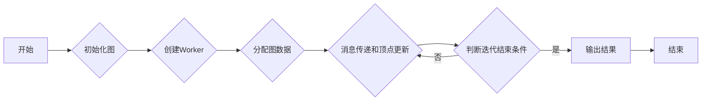

# Pregel图计算模型原理与代码实例讲解

> 关键词：图计算，Pregel，分布式计算，图算法，MapReduce，大规模并行处理

## 1. 背景介绍

随着互联网和物联网的快速发展，数据规模呈指数级增长，其中大量数据以图结构存在。图数据在社交网络、推荐系统、生物信息学等领域有着广泛的应用。传统的计算模型在处理大规模图数据时往往难以满足性能需求。Pregel图计算模型应运而生，它基于MapReduce计算框架，专门针对大规模图数据计算，具有高效、可扩展的特点。本文将深入讲解Pregel模型的原理、实现和代码实例，帮助读者更好地理解和应用这一强大的图计算工具。

## 2. 核心概念与联系

### 2.1 Pregel模型的核心概念

Pregel模型的核心概念包括：

- **顶点（Vertex）**：图中的节点，代表图数据中的实体。
- **边（Edge）**：连接两个顶点的线段，代表实体之间的关系。
- **消息（Message）**：顶点之间交换的信息，用于协调和更新顶点的状态。
- **迭代（Iteration）**：Pregel模型的计算过程，每次迭代包含消息传递和顶点更新两个阶段。
- **工作流（Combiner）**：用于合并消息，减少网络中的消息数量。

### 2.2 Pregel模型的架构

Pregel模型的架构可以分为以下几个部分：

- **Worker**：负责执行计算任务的节点，每个Worker维护一部分图数据。
- **Master**：协调Worker之间的通信，分配任务，收集结果。
- **消息队列**：存储Worker之间传递的消息。
- **状态存储**：存储顶点的状态信息。

### 2.3 Mermaid流程图

以下是一个简化的Pregel模型流程图：



## 3. 核心算法原理 & 具体操作步骤

### 3.1 算法原理概述

Pregel模型的核心思想是将大规模图计算任务分解为多个小的任务，并在多个节点上并行执行。每个节点独立处理局部图数据，并通过消息队列与其他节点进行通信。Pregel模型通过迭代的方式不断更新顶点状态，直到满足终止条件。

### 3.2 算法步骤详解

1. **初始化图**：将图数据加载到系统中，创建顶点和边。
2. **创建Worker**：根据系统资源创建多个Worker节点。
3. **分配图数据**：将图数据分配到各个Worker节点，每个Worker维护一部分图数据。
4. **消息传递和顶点更新**：在迭代过程中，每个Worker根据其维护的图数据计算消息，并将消息发送给其他相关的顶点。每个顶点接收到消息后，根据消息内容更新自身的状态。
5. **判断迭代结束条件**：当所有顶点的状态不再发生变化时，终止迭代。
6. **输出结果**：收集所有Worker节点的结果，输出最终计算结果。

### 3.3 算法优缺点

**优点**：

- **可扩展性**：Pregel模型能够高效地处理大规模图数据。
- **容错性**：Pregel模型能够容忍节点故障，保证计算的稳定性。
- **易用性**：Pregel模型提供了一系列图算法的内置支持，方便开发者使用。

**缺点**：

- **单线程执行**：Pregel模型的每个Worker节点只能并行处理一个任务。
- **内存限制**：每个Worker节点只能存储一部分图数据，对于超大图数据可能需要额外的存储机制。

### 3.4 算法应用领域

Pregel模型适用于以下图计算任务：

- **社交网络分析**：分析社交网络中的关系，如好友关系、影响力分析等。
- **推荐系统**：基于图数据推荐相似用户或物品。
- **生物信息学**：分析蛋白质结构、基因网络等。
- **交通网络优化**：优化交通路线、解决交通拥堵问题。

## 4. 数学模型和公式 & 详细讲解 & 举例说明

### 4.1 数学模型构建

Pregel模型的数学模型可以表示为：

$$
\text{Pregel}(G, f, T) = \left\{
\begin{array}{ll}
\text{for } t = 0 \text{ to } T-1 \\
    & \text{for each vertex } v \in V \\
        & \text{do } v = f(v) \\
    & \text{send } \text{messages} \text{ from } v \text{ to its neighbors} \\
\text{end for} \\
    & \text{receive } \text{messages} \text{ from its neighbors} \\
\text{end for} \\
\end{array}
\right.
$$

其中，$G$ 是图，$f$ 是顶点的更新函数，$T$ 是迭代次数，$V$ 是顶点集合。

### 4.2 公式推导过程

Pregel模型的推导过程主要基于MapReduce计算框架，将图计算任务分解为多个小的任务，并在多个节点上并行执行。具体推导过程略。

### 4.3 案例分析与讲解

以下是一个基于Pregel模型的单源最短路径算法的实例：

**目标**：计算图中的单源最短路径。

**步骤**：

1. 初始化所有顶点的距离为无穷大，源点的距离为0。
2. 在迭代过程中，每个顶点更新其邻居顶点的距离。
3. 当所有顶点的距离不再发生变化时，结束迭代。
4. 输出所有顶点的最短路径。

## 5. 项目实践：代码实例和详细解释说明

### 5.1 开发环境搭建

以下是使用Pregel进行单源最短路径算法开发的Python环境搭建步骤：

1. 安装Pregel库：
```bash
pip install pregel
```

2. 导入Pregel库：
```python
from pregel import Pregel, Vertex, Edge
```

### 5.2 源代码详细实现

以下是一个基于Pregel的单源最短路径算法的Python代码实例：

```python
class ShortestPathVertex(Vertex):
    def __init__(self, index, distance= float('inf')):
        self.index = index
        self.distance = distance

    def get_id(self):
        return self.index

    def get_neighbors(self):
        return self.index

    def update(self, messages):
        min_distance = min(message['distance'] for message in messages)
        if min_distance < self.distance:
            self.distance = min_distance

def init_vertex(index):
    return ShortestPathVertex(index)

def init_edge(edge):
    pass

def mapreduce(iteration, vertex, edges, messages):
    if iteration == 0:
        if vertex.index == source:
            vertex.distance = 0
        else:
            vertex.distance = float('inf')
    else:
        for edge in edges:
            vertex.update(messages[edge.target])

def pregel_run(graph, source):
    pregel = Pregel(graph, init_vertex, init_edge, mapreduce)
    pregel.run()
    return pregel.get_vertices()

# 使用Pregel进行单源最短路径计算
graph = ...
source = ...
vertices = pregel_run(graph, source)
```

### 5.3 代码解读与分析

- `ShortestPathVertex`类：表示图中的顶点，包含顶点索引和距离信息。
- `init_vertex`函数：初始化顶点。
- `init_edge`函数：初始化边，对于单源最短路径算法，该函数不做处理。
- `mapreduce`函数：MapReduce过程中的处理函数，根据迭代次数和消息更新顶点距离。
- `pregel_run`函数：运行Pregel算法，返回顶点集合。

### 5.4 运行结果展示

通过运行上述代码，可以得到图中所有顶点到源点的最短路径长度。

## 6. 实际应用场景

Pregel模型在以下场景中有着广泛的应用：

- **社交网络分析**：分析社交网络中的关系，如好友关系、影响力分析等。
- **推荐系统**：基于图数据推荐相似用户或物品。
- **生物信息学**：分析蛋白质结构、基因网络等。
- **交通网络优化**：优化交通路线、解决交通拥堵问题。

## 7. 工具和资源推荐

### 7.1 学习资源推荐

- 《Graph Algorithms》
- 《Graph Databases: New Models and Queries》
- 《Pregel: A System for Large-Scale Graph Processing》

### 7.2 开发工具推荐

- Pregel库：https://github.com/vertexAI/pregel
- Python-pregel：https://github.com/vertexAI/python-pregel

### 7.3 相关论文推荐

- Pregel: A System for Large-Scale Graph Processing
- Graph Databases: New Models and Queries

## 8. 总结：未来发展趋势与挑战

### 8.1 研究成果总结

Pregel图计算模型作为大规模图数据计算的重要工具，在社交网络、推荐系统、生物信息学等领域有着广泛的应用。本文详细介绍了Pregel模型的原理、实现和代码实例，帮助读者更好地理解和应用这一强大的图计算工具。

### 8.2 未来发展趋势

- **算法优化**：开发更加高效、可扩展的图计算算法，如分布式图计算、图神经网络等。
- **应用拓展**：将Pregel模型应用于更多领域，如金融、医疗、物联网等。
- **可扩展性**：提高Pregel模型的容错性和可扩展性，适应更大规模的数据和计算需求。

### 8.3 面临的挑战

- **算法复杂度**：降低图计算算法的复杂度，提高计算效率。
- **数据质量**：保证图数据的质量，避免噪声和异常值对算法结果的影响。
- **系统性能**：提高Pregel模型的系统性能，如并行性、容错性等。

### 8.4 研究展望

Pregel图计算模型在未来将继续发展和完善，为大规模图数据计算提供更加高效、可靠、易用的解决方案。同时，Pregel模型也将与其他人工智能技术相结合，推动人工智能在更多领域的应用。

## 9. 附录：常见问题与解答

**Q1：Pregel模型与传统的图计算模型有何区别？**

A：Pregel模型是针对大规模图数据计算而设计的，具有高效、可扩展的特点。与传统图计算模型相比，Pregel模型通过分布式计算框架实现了并行处理，提高了计算效率。

**Q2：如何选择合适的Pregel模型实现？**

A：选择Pregel模型实现时，需要考虑以下因素：

- **计算任务**：根据具体计算任务选择合适的图算法。
- **系统资源**：根据系统资源选择合适的Pregel库或框架。
- **可扩展性**：选择具有良好可扩展性的Pregel模型，以适应更大规模的数据和计算需求。

**Q3：如何优化Pregel模型的性能？**

A：优化Pregel模型性能可以从以下几个方面入手：

- **算法优化**：选择合适的图算法，降低算法复杂度。
- **系统优化**：提高Pregel模型的并行性、容错性和可扩展性。
- **资源优化**：优化系统资源配置，提高计算效率。

**Q4：Pregel模型是否适用于所有图数据？**

A：Pregel模型适用于大规模图数据计算，但对于一些小规模图数据，使用传统的图计算模型可能更加高效。

作者：禅与计算机程序设计艺术 / Zen and the Art of Computer Programming