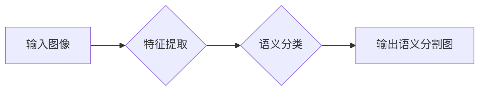

## Semantic Segmentation原理与代码实例讲解

> 关键词：Semantic Segmentation, 深度学习, 计算机视觉, 图像分割, CNN, U-Net,  PyTorch

## 1. 背景介绍

在计算机视觉领域，图像分割是将图像划分为多个相互独立的区域，每个区域代表着图像中不同的物体或场景。其中，语义分割（Semantic Segmentation）是一种更高级的图像分割技术，它不仅将图像分割成不同的区域，而且对每个像素都进行分类，赋予其相应的语义标签。例如，在对一张街道场景进行语义分割后，我们可以得到每个像素对应的标签，如“道路”、“人行道”、“建筑物”、“车辆”等。

语义分割在许多应用场景中具有重要意义，例如：

* **自动驾驶:**  帮助车辆识别道路、行人、车辆等重要信息，从而实现自动驾驶功能。
* **医疗影像分析:**  用于分割医学图像中的器官、肿瘤等区域，辅助医生进行诊断和治疗。
* **机器人视觉:**  帮助机器人识别周围环境中的物体，进行导航和操作。
* **遥感图像分析:**  用于分割遥感图像中的土地利用类型、植被覆盖度等信息，支持土地资源管理和环境监测。

## 2. 核心概念与联系

语义分割的核心是利用深度学习模型学习图像特征，并根据这些特征对每个像素进行分类。

**Mermaid 流程图:**



**核心概念:**

* **特征提取:**  利用卷积神经网络（CNN）提取图像的特征，例如边缘、纹理、形状等。
* **语义分类:**  根据提取的特征，对每个像素进行分类，并赋予其相应的语义标签。

## 3. 核心算法原理 & 具体操作步骤

### 3.1  算法原理概述

语义分割算法的核心是利用深度学习模型学习图像特征，并根据这些特征对每个像素进行分类。常见的语义分割算法包括：

* **Fully Convolutional Networks (FCN):**  将全连接层替换为卷积层，使得模型能够对图像进行端到端的语义分割。
* **U-Net:**  一种专门用于医学图像分割的网络结构，具有良好的语义信息恢复能力。
* **DeepLab:**  一种基于 atrous convolution 的语义分割网络，能够有效地学习图像的全局上下文信息。

### 3.2  算法步骤详解

以 U-Net 算法为例，其具体操作步骤如下：

1. **输入图像:**  将待分割的图像作为输入。
2. **编码路径:**  利用多个卷积层和池化层提取图像的特征，并逐渐降低特征图的分辨率。
3. **解码路径:**  利用转置卷积层和上采样操作恢复特征图的分辨率，并融合编码路径的特征信息。
4. **分类层:**  利用 1x1 卷积层将特征图映射到类别数对应的输出，并使用 softmax 函数进行概率归一化。
5. **输出语义分割图:**  将每个像素的预测概率映射到相应的语义标签，得到最终的语义分割图。

### 3.3  算法优缺点

**优点:**

* 精度高： U-Net 算法能够学习到图像的丰富语义信息，从而实现高精度的语义分割。
* 训练效率高： U-Net 算法的结构简单，训练速度相对较快。
* 数据需求低： U-Net 算法能够在相对较小的训练数据上取得良好的性能。

**缺点:**

* 对于大尺寸图像，计算量较大。
* 对于复杂场景，可能难以准确分割出所有物体。

### 3.4  算法应用领域

U-Net 算法广泛应用于医学图像分割、遥感图像分析、自动驾驶等领域。

## 4. 数学模型和公式 & 详细讲解 & 举例说明

### 4.1  数学模型构建

语义分割模型通常采用卷积神经网络（CNN）作为基础架构。CNN 通过多个卷积层、池化层和全连接层来提取图像特征并进行分类。

**卷积层:**  使用卷积核对图像进行卷积运算，提取图像的局部特征。

**池化层:**  对卷积层的输出进行下采样，减少特征图的大小，提高模型的鲁棒性。

**全连接层:**  将池化层的输出进行扁平化，并连接到全连接层，用于进行分类。

### 4.2  公式推导过程

**卷积运算:**

$$
y_{i,j} = \sum_{m=0}^{M-1} \sum_{n=0}^{N-1} x_{i+m,j+n} * w_{m,n}
$$

其中：

* $y_{i,j}$ 是卷积输出的像素值。
* $x_{i+m,j+n}$ 是输入图像的像素值。
* $w_{m,n}$ 是卷积核的权值。
* $M$ 和 $N$ 是卷积核的大小。

**池化运算:**

$$
y_{i,j} = \max(x_{i,j}, x_{i+1,j}, x_{i,j+1}, x_{i+1,j+1})
$$

其中：

* $y_{i,j}$ 是池化输出的像素值。
* $x_{i,j}$ 是输入特征图的像素值。

### 4.3  案例分析与讲解

以 U-Net 算法为例，其解码路径利用转置卷积层和上采样操作恢复特征图的分辨率。转置卷积层可以看作是卷积层的逆运算，它可以将低分辨率的特征图转换为高分辨率的特征图。上采样操作可以将特征图的大小放大，从而恢复到与输入图像相同的尺寸。

## 5. 项目实践：代码实例和详细解释说明

### 5.1  开发环境搭建

* Python 3.6+
* PyTorch 1.0+
* CUDA 10.0+ (可选，用于 GPU 加速)

### 5.2  源代码详细实现

```python
import torch
import torch.nn as nn

class UNet(nn.Module):
    def __init__(self, in_channels, out_channels):
        super(UNet, self).__init__()

        # 编码路径
        self.conv1 = nn.Conv2d(in_channels, 64, kernel_size=3, padding=1)
        self.relu1 = nn.ReLU()
        self.pool1 = nn.MaxPool2d(kernel_size=2, stride=2)
        self.conv2 = nn.Conv2d(64, 128, kernel_size=3, padding=1)
        self.relu2 = nn.ReLU()
        self.pool2 = nn.MaxPool2d(kernel_size=2, stride=2)
        self.conv3 = nn.Conv2d(128, 256, kernel_size=3, padding=1)
        self.relu3 = nn.ReLU()
        self.pool3 = nn.MaxPool2d(kernel_size=2, stride=2)
        self.conv4 = nn.Conv2d(256, 512, kernel_size=3, padding=1)
        self.relu4 = nn.ReLU()
        self.pool4 = nn.MaxPool2d(kernel_size=2, stride=2)

        # 解码路径
        self.upconv1 = nn.ConvTranspose2d(512, 256, kernel_size=2, stride=2)
        self.conv5 = nn.Conv2d(256, 256, kernel_size=3, padding=1)
        self.relu5 = nn.ReLU()
        self.upconv2 = nn.ConvTranspose2d(256, 128, kernel_size=2, stride=2)
        self.conv6 = nn.Conv2d(128, 128, kernel_size=3, padding=1)
        self.relu6 = nn.ReLU()
        self.upconv3 = nn.ConvTranspose2d(128, 64, kernel_size=2, stride=2)
        self.conv7 = nn.Conv2d(64, 64, kernel_size=3, padding=1)
        self.relu7 = nn.ReLU()

        # 分类层
        self.conv8 = nn.Conv2d(64, out_channels, kernel_size=1)

    def forward(self, x):
        # 编码路径
        x1 = self.relu1(self.conv1(x))
        x2 = self.relu2(self.conv2(self.pool1(x1)))
        x3 = self.relu3(self.conv3(self.pool2(x2)))
        x4 = self.relu4(self.conv4(self.pool3(x3)))

        # 解码路径
        x5 = self.relu5(self.conv5(self.upconv1(x4)))
        x6 = torch.cat([x5, x3], dim=1)
        x7 = self.relu6(self.conv6(self.upconv2(x6)))
        x8 = torch.cat([x7, x2], dim=1)
        x9 = self.relu7(self.conv7(self.upconv3(x8)))

        # 分类层
        out = self.conv8(x9)
        return out
```

### 5.3  代码解读与分析

* **UNet 类:**  定义了 U-Net 模型的结构。
* **__init__ 方法:**  初始化模型的各个层。
* **forward 方法:**  定义了模型的正向传播过程。

### 5.4  运行结果展示

运行代码后，可以得到语义分割的结果，即每个像素对应的语义标签。

## 6. 实际应用场景

语义分割在许多实际应用场景中发挥着重要作用，例如：

* **自动驾驶:**  帮助车辆识别道路、行人、车辆等重要信息，从而实现自动驾驶功能。
* **医疗影像分析:**  用于分割医学图像中的器官、肿瘤等区域，辅助医生进行诊断和治疗。
* **机器人视觉:**  帮助机器人识别周围环境中的物体，进行导航和操作。
* **遥感图像分析:**  用于分割遥感图像中的土地利用类型、植被覆盖度等信息，支持土地资源管理和环境监测。

### 6.4  未来应用展望

随着深度学习技术的不断发展，语义分割算法的精度和效率将不断提高，其应用场景也将更加广泛。例如：

* **三维场景重建:**  利用语义分割技术，可以对三维场景进行更精细的重建。
* **虚拟现实和增强现实:**  语义分割可以帮助虚拟现实和增强现实系统更好地理解和交互用户周围的环境。
* **智能家居:**  语义分割可以帮助智能家居设备更好地理解用户的需求，并提供更个性化的服务。

## 7. 工具和资源推荐

### 7.1  学习资源推荐

* **书籍:**
    * Deep Learning for Computer Vision with Python
    * Computer Vision: Algorithms and Applications
* **在线课程:**
    * Coursera: Deep Learning Specialization
    * Udacity: Intro to Self-Driving Cars
* **博客:**
    * https://blog.openai.com/
    * https://towardsdatascience.com/

### 7.2  开发工具推荐

* **PyTorch:**  一个开源的深度学习框架，支持 GPU 加速。
* **TensorFlow:**  另一个开源的深度学习框架。