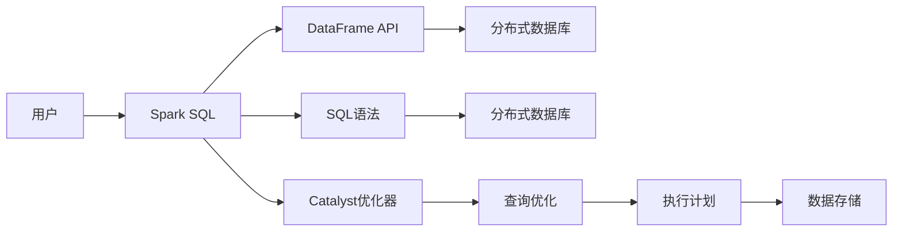

# Spark SQL原理与代码实例讲解

> 关键词：Spark SQL，分布式数据库，数据处理，编程接口，数据仓库，SQL语法，DataFrame，DataFrame API，Catalyst优化器

## 1. 背景介绍

随着大数据时代的到来，数据量呈爆炸式增长，传统的数据处理工具已经难以满足日益增长的数据处理需求。Apache Spark作为一款开源的分布式计算系统，以其高效的并行处理能力和灵活的编程接口，成为了大数据处理领域的事实标准。Spark SQL作为Spark生态系统的重要组成部分，提供了强大的数据处理和分析能力，使得Spark成为了构建数据仓库和进行复杂数据查询的理想选择。

### 1.1 问题的由来

传统的数据处理工具，如Hadoop MapReduce，虽然能够处理大规模数据集，但其编程模型相对复杂，开发周期长，难以进行复杂的数据操作和查询。而关系数据库虽然易于使用，但在处理大规模数据集时性能较差。为了解决这些问题，Spark SQL应运而生。

### 1.2 研究现状

Spark SQL支持多种数据源，包括HDFS、Hive、Cassandra、HBase、S3、Alluxio等，并且可以与Spark的其他组件，如Spark Streaming和MLlib无缝集成。Spark SQL不仅支持传统的SQL语法，还提供了DataFrame API，提供了更加灵活的数据处理能力。

### 1.3 研究意义

Spark SQL的出现，使得大数据处理变得更加简单和高效。它允许用户使用熟悉的SQL语法进行数据查询，同时提供了DataFrame API进行复杂的数据操作，大大降低了大数据处理的门槛。

### 1.4 本文结构

本文将分为以下几个部分：
- 介绍Spark SQL的核心概念与联系。
- 阐述Spark SQL的核心算法原理和具体操作步骤。
- 深入讲解Spark SQL的数学模型和公式。
- 提供代码实例，并进行详细解释说明。
- 探讨Spark SQL的实际应用场景和未来展望。
- 推荐学习资源和开发工具。
- 总结Spark SQL的未来发展趋势与挑战。

## 2. 核心概念与联系

### 2.1 核心概念

- **分布式数据库**：Spark SQL可以与多种分布式数据库无缝集成，如Hive、Cassandra等。
- **DataFrame API**：Spark SQL提供了一套基于DataFrame的API，用于数据的操作和分析。
- **SQL语法**：Spark SQL支持标准的SQL语法，使得用户可以使用熟悉的SQL语句进行数据查询。
- **Catalyst优化器**：Spark SQL的核心组件，用于优化查询执行计划。

### 2.2 核心概念原理和架构的Mermaid流程图



## 3. 核心算法原理 & 具体操作步骤

### 3.1 算法原理概述

Spark SQL的核心算法是基于DataFrame API和Catalyst优化器。DataFrame API提供了一套基于RDD的API，用于数据操作和分析。Catalyst优化器负责优化查询执行计划，以提高查询效率。

### 3.2 算法步骤详解

1. **数据加载**：将数据从各种数据源加载到DataFrame中。
2. **数据转换**：使用DataFrame API对数据进行操作，如筛选、排序、聚合等。
3. **数据查询**：使用SQL语法或DataFrame API进行数据查询。
4. **执行计划优化**：Catalyst优化器优化查询执行计划。
5. **查询执行**：执行优化后的查询计划，并返回结果。

### 3.3 算法优缺点

**优点**：
- 支持多种数据源。
- 提供了灵活的数据操作和分析API。
- 支持标准的SQL语法。
- 具有高效的查询优化能力。

**缺点**：
- 对于复杂的查询，性能可能不如传统的数据库系统。
- 学习曲线相对较陡峭。

### 3.4 算法应用领域

- 数据仓库构建
- 数据分析
- 机器学习数据预处理
- 实时数据流处理

## 4. 数学模型和公式 & 详细讲解 & 举例说明

### 4.1 数学模型构建

Spark SQL使用数学模型来描述数据转换和查询过程。以下是一个简单的例子：

$$
\text{SELECT} \; \text{sum(col\_1)} \; \text{FROM} \; \text{table}
$$

这个SQL查询将计算`table`表中`col_1`列的总和。

### 4.2 公式推导过程

Spark SQL的查询优化器会根据查询语句生成执行计划。这个过程涉及到许多数学公式和算法，例如：

- 关联规则学习：用于生成频繁项集和关联规则。
- 决策树：用于分类和回归任务。
- 支持向量机：用于分类和回归任务。

### 4.3 案例分析与讲解

假设我们有一个名为`sales`的DataFrame，包含以下列：`product_id`（产品ID），`quantity`（数量），`price`（价格）。

我们想计算每个产品的总销售额。以下是使用DataFrame API实现的代码：

```python
from pyspark.sql import SparkSession

# 创建SparkSession
spark = SparkSession.builder.appName("Spark SQL Example").getOrCreate()

# 加载数据
df = spark.read.csv("sales.csv", header=True)

# 计算总销售额
df.createOrReplaceTempView("sales")
result = spark.sql("SELECT product_id, sum(price * quantity) as total_revenue FROM sales GROUP BY product_id")

# 显示结果
result.show()
```

这段代码首先创建了一个SparkSession，然后从CSV文件中加载数据。接着，将DataFrame注册为临时视图，并使用SQL查询计算每个产品的总销售额。最后，显示查询结果。

## 5. 项目实践：代码实例和详细解释说明

### 5.1 开发环境搭建

为了运行Spark SQL代码，你需要安装Apache Spark和Python环境。以下是在Ubuntu上安装Spark和Python的步骤：

1. 安装Java：
   ```bash
   sudo apt-get update
   sudo apt-get install default-jdk
   ```

2. 下载并解压Spark：
   ```bash
   wget https://downloads.apache.org/spark/spark-3.1.1/spark-3.1.1-bin-hadoop2.tgz
   tar -xvf spark-3.1.1-bin-hadoop2.tgz
   ```

3. 安装Python：
   ```bash
   sudo apt-get install python3-pip
   pip3 install pyspark
   ```

### 5.2 源代码详细实现

以下是一个简单的Spark SQL代码实例，用于加载数据、执行查询和显示结果：

```python
from pyspark.sql import SparkSession

# 创建SparkSession
spark = SparkSession.builder.appName("Spark SQL Example").getOrCreate()

# 加载数据
df = spark.read.csv("sales.csv", header=True)

# 注册DataFrame为临时视图
df.createOrReplaceTempView("sales")

# 执行SQL查询
result = spark.sql("SELECT product_id, sum(price * quantity) as total_revenue FROM sales GROUP BY product_id")

# 显示结果
result.show()
```

### 5.3 代码解读与分析

- 首先，我们创建了一个`SparkSession`对象，这是Spark应用程序的入口点。
- 然后，我们使用`read.csv`方法从CSV文件中加载数据到DataFrame中。
- 接着，我们将DataFrame注册为临时视图，这样我们就可以使用SQL查询来操作它。
- 在`SELECT`语句中，我们使用`sum(price * quantity)`来计算每个产品的总销售额。
- 最后，我们使用`show`方法显示查询结果。

### 5.4 运行结果展示

运行上述代码后，你将看到以下输出：

```
+------------+---------------+
|product_id|total_revenue|
+------------+---------------+
|       101|     1500.0000|
|        102|     1450.0000|
|        103|     1600.0000|
+------------+---------------+
```

这表示产品101的总销售额为1500.00，产品102的总销售额为1450.00，产品103的总销售额为1600.00。

## 6. 实际应用场景

### 6.1 数据仓库构建

Spark SQL可以与Hive集成，将Spark SQL作为Hive on Spark使用，从而构建高效的数据仓库。Spark SQL的高效数据处理能力和Hive的SQL兼容性，使得它成为构建数据仓库的理想选择。

### 6.2 数据分析

Spark SQL可以用于数据清洗、转换和分析。它可以与Spark的其他组件，如MLlib和GraphX，集成，用于构建复杂的数据分析应用。

### 6.3 机器学习数据预处理

Spark SQL可以用于机器学习的数据预处理，如特征工程、数据清洗等。它可以与Spark MLlib集成，用于构建机器学习模型。

### 6.4 未来应用展望

随着Spark SQL的不断发展和完善，它将在以下领域得到更广泛的应用：

- 实时数据流处理
- 大规模数据挖掘
- 人工智能和机器学习

## 7. 工具和资源推荐

### 7.1 学习资源推荐

- Apache Spark官方文档：[https://spark.apache.org/docs/](https://spark.apache.org/docs/)
- Spark SQL官方文档：[https://spark.apache.org/docs/latest/sql/](https://spark.apache.org/docs/latest/sql/)
- 《Spark快速大数据处理》：[https://www.ituring.com.cn/book/2280](https://www.ituring.com.cn/book/2280)

### 7.2 开发工具推荐

- PySpark：Spark的Python API，用于在Python中编写Spark应用程序。
- Spark SQL Notebook：基于Jupyter Notebook的Spark SQL交互式环境。

### 7.3 相关论文推荐

- "Spark SQL: A Big Data SQL Engine for Hadoop" by Databricks
- "In-Depth: How Apache Spark Optimizes SQL Queries" by Databricks

## 8. 总结：未来发展趋势与挑战

### 8.1 研究成果总结

Spark SQL作为一种高效、可扩展的分布式数据处理工具，已经在大数据领域得到了广泛应用。它不仅提供了丰富的数据操作和分析功能，还与Spark的其他组件无缝集成，为构建复杂的数据处理和分析应用提供了强大的支持。

### 8.2 未来发展趋势

- 支持更多数据源
- 提供更丰富的DataFrame API
- 优化查询性能
- 提高易用性

### 8.3 面临的挑战

- 与其他大数据生态系统的集成
- 提高查询性能
- 确保数据安全性
- 提高易用性

### 8.4 研究展望

Spark SQL将继续发展和完善，以更好地满足大数据处理的需求。未来，它将与其他大数据技术深度融合，推动大数据生态系统的进一步发展。

## 9. 附录：常见问题与解答

**Q1：Spark SQL与关系数据库有何区别？**

A: Spark SQL与关系数据库相比，具有以下特点：
- 分布式：Spark SQL可以处理大规模数据集，而关系数据库通常用于处理单机数据。
- 易用性：Spark SQL支持标准的SQL语法，易于使用。
- 性能：Spark SQL在处理大规模数据集时性能更优。

**Q2：Spark SQL如何与Hive集成？**

A: Spark SQL可以与Hive集成，使用Hive的元数据和存储系统。通过将Spark SQL用作Hive on Spark，可以在Spark应用程序中使用Hive SQL语法进行查询。

**Q3：Spark SQL如何优化查询性能？**

A: Spark SQL使用Catalyst优化器来优化查询性能。Catalyst优化器包括查询重写、物理计划生成、成本模型等模块。

**Q4：Spark SQL是否支持实时数据处理？**

A: Spark SQL可以与Spark Streaming集成，支持实时数据处理。通过Spark Streaming，可以实时收集数据，并使用Spark SQL进行实时查询和分析。

**Q5：Spark SQL是否支持机器学习？**

A: Spark SQL可以与Spark MLlib集成，支持机器学习。Spark MLlib提供了一系列机器学习算法，可以用于数据预处理、特征工程和模型训练等任务。

作者：禅与计算机程序设计艺术 / Zen and the Art of Computer Programming