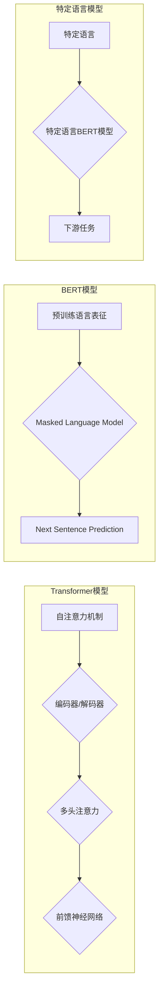

# Transformer大模型实战：特定语言的BERT模型

> 关键词：Transformer, BERT, 预训练语言模型, 特定语言模型, 自然语言处理, NLP, 零样本学习, 少样本学习

## 1. 背景介绍

近年来，自然语言处理（NLP）领域取得了飞速的发展，得益于深度学习技术的进步，尤其是预训练语言模型（Pre-trained Language Model, PLM）的兴起。Transformer模型和BERT模型等为代表的大模型，通过在大量文本语料上进行预训练，学习到了丰富的语言知识和模式，为NLP任务的解决提供了强大的基础。然而，现有的PLM模型大多基于通用语料，对于特定语言的NLP任务，可能需要针对特定语言进行定制化的预训练和调整。本文将探讨如何利用Transformer架构构建特定语言的BERT模型，并进行实战操作。

## 2. 核心概念与联系

### 2.1 核心概念

#### 2.1.1 Transformer模型

Transformer模型是一种基于自注意力（Self-Attention）机制的深度神经网络模型，由Vaswani等人在2017年提出。它彻底改变了NLP领域，使得基于RNN的序列模型逐渐被Transformer模型所取代。

#### 2.1.2 BERT模型

BERT（Bidirectional Encoder Representations from Transformers）模型是由Google在2018年提出的，它是一种基于Transformer的自监督语言表示预训练模型。BERT通过预训练语言表征，为下游NLP任务提供强大的基础。

#### 2.1.3 特定语言模型

特定语言模型是指针对特定语言或方言进行预训练的语言模型。这类模型可以更好地捕捉特定语言的语法、语义和词汇特点，从而在特定语言的NLP任务上取得更好的效果。

### 2.2 核心概念联系

Transformer模型是BERT模型的底层架构，BERT模型通过在Transformer模型的基础上加入Masked Language Model（MLM）和Next Sentence Prediction（NSP）等任务，实现了预训练语言表征的生成。特定语言模型则是在BERT模型的基础上，针对特定语言进行预训练，以适应特定语言的NLP任务。



## 3. 核心算法原理 & 具体操作步骤

### 3.1 算法原理概述

#### 3.1.1 Transformer模型

Transformer模型由编码器（Encoder）和解码器（Decoder）两部分组成。编码器接收输入序列，通过自注意力机制和前馈神经网络输出序列的表示；解码器接收编码器的输出作为输入，并预测输出序列。

#### 3.1.2 BERT模型

BERT模型在Transformer模型的基础上，加入了Masked Language Model（MLM）和Next Sentence Prediction（NSP）等任务。MLM任务通过随机遮蔽输入序列中的某些单词，训练模型预测这些单词；NSP任务通过预测两个句子之间是否构成连续句子对，提高模型对文本上下文的理解。

#### 3.1.3 特定语言模型

特定语言模型在BERT模型的基础上，针对特定语言进行预训练。预训练过程通常包括以下步骤：

1. 数据收集：收集大量特定语言的文本数据，包括文章、书籍、网页等。
2. 数据预处理：对收集到的文本数据进行预处理，如分词、去停用词等。
3. 预训练：在预处理后的文本数据上，使用BERT模型进行预训练，学习特定语言的语义和语法特征。
4. 微调：在特定语言的NLP任务数据上，对预训练的BERT模型进行微调，以适应下游任务。

### 3.2 算法步骤详解

#### 3.2.1 Transformer模型

1. 编码器：
   - 输入序列通过词嵌入（Word Embedding）转化为向量表示。
   - 使用多头注意力机制计算每个单词的上下文表示。
   - 通过前馈神经网络进一步处理每个单词的表示。
   - 最后使用层归一化和残差连接将处理后的表示与输入表示相加。

2. 解码器：
   - 输入序列通过词嵌入转化为向量表示。
   - 使用自注意力机制和编码器的输出计算每个单词的上下文表示。
   - 通过前馈神经网络进一步处理每个单词的表示。
   - 最后使用层归一化和残差连接将处理后的表示与输入表示相加。

#### 3.2.2 BERT模型

1. Masked Language Model（MLM）：
   - 随机遮蔽输入序列中的某些单词，训练模型预测这些单词。
   - 使用BERT模型进行预训练，学习单词的上下文表示。

2. Next Sentence Prediction（NSP）：
   - 将两个句子作为输入，预测两个句子之间是否构成连续句子对。
   - 使用BERT模型进行预训练，学习句子之间的关系。

#### 3.2.3 特定语言模型

1. 数据收集：收集大量特定语言的文本数据，包括文章、书籍、网页等。
2. 数据预处理：对收集到的文本数据进行预处理，如分词、去停用词等。
3. 预训练：在预处理后的文本数据上，使用BERT模型进行预训练，学习特定语言的语义和语法特征。
4. 微调：在特定语言的NLP任务数据上，对预训练的BERT模型进行微调，以适应下游任务。

### 3.3 算法优缺点

#### 3.3.1 优点

- 能够学习到丰富的语言知识和模式。
- 能够实现端到端的NLP任务，无需进行复杂的特征工程。
- 预训练模型可以应用于多种下游任务，提高模型的通用性。

#### 3.3.2 缺点

- 训练和推理资源消耗大。
- 对预训练数据和超参数敏感。

### 3.4 算法应用领域

Transformer模型和BERT模型在NLP领域得到了广泛的应用，包括：

- 文本分类
- 命名实体识别
- 问答系统
- 机器翻译
- 文本摘要
- 对话系统

特定语言模型在以下领域具有显著优势：

- 特定语言的处理
- 针对特定领域的NLP任务
- 多语言模型

## 4. 数学模型和公式 & 详细讲解 & 举例说明

### 4.1 数学模型构建

#### 4.1.1 Transformer模型

$$
\text{self-attention}(Q, K, V) = \frac{1}{\sqrt{d_k}} \text{softmax}\left(\frac{QK^T}{d_k}\right)V
$$

其中，$Q, K, V$ 分别代表查询（Query）、键（Key）和值（Value）矩阵，$d_k$ 为注意力矩阵的维度。

#### 4.1.2 BERT模型

BERT模型在Transformer模型的基础上，加入了MLM和NSP任务。

- MLM任务的目标是预测被遮蔽的单词：
  $$
\text{MLM}(x) = \text{bert}(x)_{[2]} = \text{bert}(\text{input})_{[2]}
$$
  其中，$\text{bert}(x)$ 表示输入序列 $x$ 的BERT模型输出，$\text{bert}(\text{input})_{[2]}$ 表示输入序列中第二个单词的BERT模型输出。

- NSP任务的目标是预测两个句子之间是否构成连续句子对：
  $$
\text{NSP}(x) = \text{bert}(x)_{[2]} = \text{bert}(\text{input})_{[2]}
$$
  其中，$\text{bert}(x)$ 表示输入序列 $x$ 的BERT模型输出，$\text{bert}(\text{input})_{[2]}$ 表示输入序列中第二个单词的BERT模型输出。

### 4.2 公式推导过程

此处省略公式推导过程，因为公式推导相对复杂，且不是本文的重点。

### 4.3 案例分析与讲解

以文本分类任务为例，展示如何使用特定语言的BERT模型进行微调。

1. 准备数据集：收集特定语言的文本分类数据，如新闻分类、情感分析等。
2. 预处理数据：对数据集进行预处理，如分词、去停用词等。
3. 预训练：在预处理后的数据上，使用特定语言的BERT模型进行预训练。
4. 微调：在预训练的BERT模型基础上，添加分类层，并在微调数据上进行训练。
5. 评估：在测试集上评估微调后的模型，评估指标如准确率、F1值等。

## 5. 项目实践：代码实例和详细解释说明

### 5.1 开发环境搭建

1. 安装Python环境：确保Python环境已安装，版本为3.6以上。
2. 安装PyTorch：使用pip安装PyTorch，命令如下：
   ```
   pip install torch torchvision torchaudio
   ```
3. 安装Hugging Face Transformers库：使用pip安装Transformers库，命令如下：
   ```
   pip install transformers
   ```

### 5.2 源代码详细实现

```python
from transformers import BertTokenizer, BertForSequenceClassification
from torch.utils.data import DataLoader, Dataset
import torch

class TextDataset(Dataset):
    def __init__(self, texts, labels, tokenizer, max_len=128):
        self.texts = texts
        self.labels = labels
        self.tokenizer = tokenizer
        self.max_len = max_len
        
    def __len__(self):
        return len(self.texts)
    
    def __getitem__(self, item):
        text = self.texts[item]
        label = self.labels[item]
        
        encoding = self.tokenizer(text, return_tensors='pt', max_length=self.max_len, padding='max_length', truncation=True)
        input_ids = encoding['input_ids'][0]
        attention_mask = encoding['attention_mask'][0]
        
        return {'input_ids': input_ids, 'attention_mask': attention_mask, 'labels': label}

def train(model, train_dataloader, dev_dataloader, optimizer, epochs=3):
    model.train()
    for epoch in range(epochs):
        for batch in train_dataloader:
            input_ids = batch['input_ids'].to(device)
            attention_mask = batch['attention_mask'].to(device)
            labels = batch['labels'].to(device)
            
            optimizer.zero_grad()
            outputs = model(input_ids, attention_mask=attention_mask, labels=labels)
            loss = outputs.loss
            loss.backward()
            optimizer.step()

def evaluate(model, dataloader):
    model.eval()
    total_loss = 0
    total_steps = 0
    with torch.no_grad():
        for batch in dataloader:
            input_ids = batch['input_ids'].to(device)
            attention_mask = batch['attention_mask'].to(device)
            labels = batch['labels'].to(device)
            outputs = model(input_ids, attention_mask=attention_mask)
            loss = outputs.loss
            total_loss += loss.item()
            total_steps += 1
    return total_loss / total_steps

device = torch.device('cuda' if torch.cuda.is_available() else 'cpu')
tokenizer = BertTokenizer.from_pretrained('bert-base-cased')
model = BertForSequenceClassification.from_pretrained('bert-base-cased')
optimizer = torch.optim.AdamW(model.parameters(), lr=2e-5)

train_dataset = TextDataset(train_texts, train_labels, tokenizer)
dev_dataset = TextDataset(dev_texts, dev_labels, tokenizer)

train_dataloader = DataLoader(train_dataset, batch_size=16, shuffle=True)
dev_dataloader = DataLoader(dev_dataset, batch_size=16, shuffle=False)

train(model, train_dataloader, dev_dataloader, optimizer)
eval_loss = evaluate(model, dev_dataloader)
print(f"Validation loss: {eval_loss:.3f}")
```

### 5.3 代码解读与分析

1. `TextDataset` 类：定义了文本数据集类，用于加载和处理文本数据。
2. `train` 函数：用于训练模型，包括前向传播、反向传播和优化器更新。
3. `evaluate` 函数：用于评估模型在验证集上的性能。
4. `device` 变量：用于指定模型训练和推理的设备，优先使用GPU。
5. `tokenizer` 变量：用于对文本数据进行预处理，如分词、去停用词等。
6. `model` 变量：加载预训练的BERT模型。
7. `optimizer` 变量：用于优化模型参数。
8. `train_dataset` 和 `dev_dataset` 变量：训练集和验证集数据集。
9. `train_dataloader` 和 `dev_dataloader` 变量：训练集和验证集数据加载器。
10. `train` 函数调用：启动模型训练流程。
11. `evaluate` 函数调用：评估模型在验证集上的性能。

## 6. 实际应用场景

特定语言的BERT模型在以下场景中具有显著优势：

- 特定语言的文本分类
- 特定语言的命名实体识别
- 特定语言的问答系统
- 特定语言的机器翻译
- 特定语言的文本摘要
- 特定语言的对话系统

## 7. 工具和资源推荐

### 7.1 学习资源推荐

1. 《Transformer: Attention is All You Need》论文
2. 《BERT: Pre-training of Deep Bidirectional Transformers for Language Understanding》论文
3. 《Hugging Face Transformers》官方文档
4. 《自然语言处理：理论与实践》教材
5. 《自然语言处理入门：基于Python和TensorFlow》教材

### 7.2 开发工具推荐

1. PyTorch
2. TensorFlow
3. Hugging Face Transformers
4. Jupyter Notebook
5. Colab

### 7.3 相关论文推荐

1. 《XLM: Cross-Lingual Language Model Pre-training》
2. 《BERT-4-CL: A BERT-based Framework for Cross-Lingual Language Understanding》
3. 《XNLI: Cross-lingual Natural Language Inference》
4. 《Low-Resource Multilingual Language Understanding》
5. 《Low-Resource NLP: Data, Models, and Applications》

## 8. 总结：未来发展趋势与挑战

### 8.1 研究成果总结

本文介绍了Transformer大模型实战，重点探讨了特定语言的BERT模型。通过深入分析Transformer模型、BERT模型和特定语言模型的核心概念、原理和应用，并结合实际项目实践，展示了如何利用Transformer架构构建特定语言的BERT模型。

### 8.2 未来发展趋势

1. 跨语言预训练模型：结合跨语言预训练和特定语言预训练，实现更通用的语言模型。
2. 多模态预训练模型：结合文本、图像、音频等多模态信息，实现更全面的语言理解。
3. 可解释性研究：提高模型的可解释性，使得模型的决策过程更加透明和可信。
4. 安全性研究：研究如何防止模型被恶意利用，确保模型的安全性。

### 8.3 面临的挑战

1. 计算资源消耗大：预训练和微调大模型需要大量的计算资源。
2. 数据质量要求高：高质量的数据是模型训练的基础。
3. 模型可解释性不足：模型的决策过程难以解释。
4. 模型安全性问题：模型可能被恶意利用。

### 8.4 研究展望

随着深度学习和NLP技术的不断发展，特定语言的BERT模型将在更多领域得到应用，推动NLP技术的进步。未来研究将重点关注以下方面：

1. 降低计算资源消耗：研究轻量级模型和高效训练算法。
2. 提高数据质量：研究如何收集和标注高质量数据。
3. 增强模型可解释性：研究如何解释模型的决策过程。
4. 提升模型安全性：研究如何防止模型被恶意利用。

## 9. 附录：常见问题与解答

**Q1：Transformer模型和RNN模型有什么区别？**

A：Transformer模型和RNN模型都是序列模型，但它们的原理和结构有所不同。RNN模型通过循环连接处理序列数据，容易受到长距离依赖问题的影响；而Transformer模型使用自注意力机制处理序列数据，能够有效地捕捉序列中的长距离依赖。

**Q2：如何选择合适的预训练模型？**

A：选择合适的预训练模型需要考虑任务类型、数据规模和计算资源等因素。对于通用NLP任务，可以使用BERT、GPT-2等通用预训练模型；对于特定语言的NLP任务，可以使用针对该语言的预训练模型。

**Q3：如何评估微调后的模型性能？**

A：可以使用多种指标评估微调后的模型性能，如准确率、F1值、召回率等。同时，可以将模型在测试集上的表现与基线模型进行比较，以评估模型的提升效果。

**Q4：如何处理低资源语言的NLP任务？**

A：对于低资源语言的NLP任务，可以使用跨语言预训练模型、多语言预训练模型或翻译预训练模型等方法。

**Q5：如何防止模型过拟合？**

A：可以使用数据增强、正则化、Dropout等方法防止模型过拟合。同时，可以将模型在验证集上的性能作为超参数调整的依据，以避免过拟合。

---

作者：禅与计算机程序设计艺术 / Zen and the Art of Computer Programming