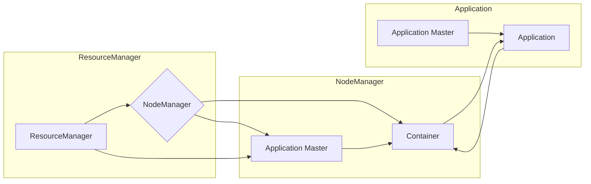

# Yarn原理与代码实例讲解

> 关键词：Yarn，Hadoop，资源管理，分布式计算，MapReduce，容器化

## 1. 背景介绍

随着大数据时代的到来，分布式计算已经成为数据处理和分析的核心技术。Apache Hadoop作为分布式计算框架的先驱，为大规模数据处理提供了强大的基础设施。Hadoop的YARN（Yet Another Resource Negotiator）作为其核心组件之一，负责资源管理和任务调度，是Hadoop生态系统中的重要组成部分。

本文将深入解析Yarn的原理，并通过代码实例展示其应用，帮助读者全面理解Yarn的工作机制和实际操作。

## 2. 核心概念与联系

### 2.1 Yarn核心概念

Yarn的核心概念包括：

- ** ResourceManager（RM）**：集群资源管理器，负责整个集群的资源管理和任务调度。
- **NodeManager（NM）**：节点管理器，负责单个节点的资源管理和任务执行。
- **Application Master（AM）**：每个应用程序的驱动程序，负责协调应用程序的运行，如启动/停止容器、监控资源使用情况等。
- **Container**：Yarn资源分配的基本单元，封装了运行应用程序所需的资源，如CPU、内存和磁盘空间等。

### 2.2 Yarn架构的Mermaid流程图



### 2.3 Yarn与其他组件的联系

Yarn作为Hadoop的核心组件，与以下组件紧密相连：

- **HDFS**：Hadoop分布式文件系统，为Yarn提供数据存储。
- **MapReduce**：Yarn的早期用户，后逐渐发展出更多基于Yarn的分布式计算框架，如Spark、Flink等。
- **HBase**、**Hive**：Yarn为这些数据仓库提供了计算能力。

## 3. 核心算法原理 & 具体操作步骤

### 3.1 算法原理概述

Yarn的资源管理基于以下原理：

- **资源隔离**：Yarn将集群资源划分为多个隔离的单元，每个单元可以独立分配给不同的应用程序。
- **弹性调度**：Yarn根据应用程序的需求动态调整资源分配，实现资源的最大化利用。
- **负载均衡**：Yarn会尝试将应用程序均匀地分配到不同的节点上，以避免单点过载。

### 3.2 算法步骤详解

1. **启动 ResourceManager**： ResourceManager 作为整个集群的资源管理器，负责管理集群资源和调度任务。
2. **启动 NodeManager**： NodeManager 在集群中的每个节点上运行，负责该节点的资源管理和任务执行。
3. **提交应用程序**：用户将应用程序提交给 ResourceManager，应用程序包括应用程序描述文件（YAML或XML格式）和应用程序代码。
4. **资源分配**：ResourceManager 根据应用程序的需求分配资源。
5. **启动 Application Master**： ResourceManager 为应用程序启动 Application Master，负责应用程序的执行。
6. **执行任务**：Application Master 负责启动和监控任务，并将任务分配给 NodeManager 执行。
7. **任务完成**：任务完成后，Application Master 向 ResourceManager 报告任务完成情况。

### 3.3 算法优缺点

**优点**：

- **资源隔离**：Yarn支持不同应用程序之间的资源隔离，避免资源竞争。
- **弹性调度**：Yarn可以根据应用程序的需求动态调整资源分配，提高资源利用率。
- **高可用性**：Yarn的高可用性设计确保了集群的稳定性。

**缺点**：

- **复杂性**：Yarn的架构较为复杂，需要较高的维护成本。
- **资源竞争**：在某些情况下，资源竞争可能导致性能下降。

### 3.4 算法应用领域

Yarn广泛应用于以下领域：

- **大数据处理**：Yarn是Hadoop生态系统中处理大数据的核心组件。
- **流式处理**：Yarn支持流式处理框架，如Apache Flink。
- **机器学习**：Yarn支持机器学习框架，如Apache Spark MLlib。

## 4. 数学模型和公式 & 详细讲解 & 举例说明

### 4.1 数学模型构建

Yarn的资源管理可以抽象为一个优化问题：

最大化资源利用率 = $\sum_{i=1}^{N} \frac{R_i}{C_i}$

其中，$R_i$ 表示第 i 个应用程序的资源需求，$C_i$ 表示第 i 个应用程序的资源分配。

### 4.2 公式推导过程

假设集群共有 N 个节点，每个节点可分配的资源为 $R$。对于每个应用程序，我们定义其资源需求为 $R_i$，资源分配为 $C_i$。则最大化资源利用率的公式可以表示为：

最大化资源利用率 = $\sum_{i=1}^{N} \frac{R_i}{C_i}$

### 4.3 案例分析与讲解

假设集群有 3 个节点，每个节点可分配的资源为 100 个单位。现有 2 个应用程序，其资源需求分别为 40 和 60 个单位。如何进行资源分配？

根据最大化资源利用率的公式，我们可以得到以下三种分配方案：

- 方案一：应用程序 A 分配 40 个单位，应用程序 B 分配 60 个单位。
- 方案二：应用程序 A 分配 50 个单位，应用程序 B 分配 50 个单位。
- 方案三：应用程序 A 分配 30 个单位，应用程序 B 分配 70 个单位。

通过计算三种方案的资源利用率，我们可以发现方案二具有最高的资源利用率，因此是最佳方案。

## 5. 项目实践：代码实例和详细解释说明

### 5.1 开发环境搭建

1. 安装 Hadoop 集群，并启动 ResourceManager 和 NodeManager。
2. 安装 Java 开发环境。
3. 安装 Maven 构建工具。

### 5.2 源代码详细实现

以下是一个简单的 Yarn 应用程序示例，该程序将计算一个数字序列的总和。

```java
import org.apache.hadoop.conf.Configuration;
import org.apache.hadoop.fs.Path;
import org.apache.hadoop.io.IntWritable;
import org.apache.hadoop.io.Text;
import org.apache.hadoop.mapred.JobConf;
import org.apache.hadoop.mapred.Mapper;
import org.apache.hadoop.mapred.Reducer;
import org.apache.hadoop.mapred.lib.KeyValueTextInputFormat;
import org.apache.hadoop.mapred.lib output.TextOutputFormat;

public class WordCount {

  public static class TokenizerMapper extends Mapper<Object, Text, Text, IntWritable> {

    public void map(Object key, Text value, OutputCollector<Text, IntWritable> context) throws IOException, InterruptedException {
      String[] tokens = value.toString().split("\\s+");
      for (String token : tokens) {
        context.collect(new Text(token), new IntWritable(1));
      }
    }
  }

  public static class IntSumReducer extends Reducer<Text, IntWritable, Text, IntWritable> {

    public void reduce(Text key, Iterator<IntWritable> values, OutputCollector<Text, IntWritable> context) throws IOException, InterruptedException {
      int sum = 0;
      while (values.hasNext()) {
        sum += values.next().get();
      }
      context.collect(key, new IntWritable(sum));
    }
  }

  public static void main(String[] args) throws Exception {
    Configuration conf = new Configuration();
    JobConf job = new JobConf(conf);
    job.setJobName("word count");
    job.setOutputKeyClass(Text.class);
    job.setOutputValueClass(IntWritable.class);
    job.setMapperClass(TokenizerMapper.class);
    job.setCombinerClass(IntSumReducer.class);
    job.setReducerClass(IntSumReducer.class);
    job.setInputFormat Class(KeyValueTextInputFormat.class);
    job.setOutputFormat Class(TextOutputFormat.class);
    FileInputFormat.addInputPath(job, new Path(args[0]));
    FileOutputFormat.setOutputPath(job, new Path(args[1]));
    System.exit(job.waitForCompletion(true) ? 0 : 1);
  }
}
```

### 5.3 代码解读与分析

以上代码定义了一个简单的 WordCount 应用程序，它将输入的数字序列进行拆分，并统计每个数字出现的次数。

- `TokenizerMapper` 类实现了 `Mapper` 接口，负责将输入数据拆分成键值对。
- `IntSumReducer` 类实现了 `Reducer` 接口，负责统计每个键值对的值。
- `main` 方法配置了 JobConf，定义了 Mapper 和 Reducer 类，并设置了输入输出路径。

### 5.4 运行结果展示

将以上代码打包成 jar 文件，并提交给 ResourceManager：

```bash
hadoop jar wordcount.jar input/output
```

运行结果将在输出路径下生成一个文件，其中包含了每个数字出现的次数。

## 6. 实际应用场景

Yarn 在以下实际应用场景中发挥了重要作用：

- **大数据处理**：Yarn 是 Hadoop 生态系统中处理大数据的核心组件，广泛应用于电商、金融、医疗等行业的海量数据处理。
- **流式处理**：Yarn 支持 Apache Flink 等流式处理框架，为实时数据处理提供了强大支持。
- **机器学习**：Yarn 支持 Apache Spark MLlib 等机器学习框架，为大规模机器学习提供了计算平台。

## 7. 工具和资源推荐

### 7.1 学习资源推荐

- Apache Hadoop 官方文档：https://hadoop.apache.org/docs/stable/hadoop-project-dist/hadoop-common/SingleCluster.html
- 《Hadoop权威指南》
- 《Hadoop应用开发实战》

### 7.2 开发工具推荐

- IntelliJ IDEA
- Eclipse
- Maven

### 7.3 相关论文推荐

- Apache Hadoop YARN: Yet Another Resource Negotiator
- YARN: Yet Another Resource Negotiator

## 8. 总结：未来发展趋势与挑战

### 8.1 研究成果总结

本文深入解析了 Yarn 的原理和实现，并通过代码实例展示了其应用。Yarn 作为 Hadoop 的核心组件，在分布式计算领域发挥了重要作用。随着 Hadoop 生态系统的不断发展，Yarn 也将持续演进，以适应更加复杂的计算需求。

### 8.2 未来发展趋势

- **智能化调度**：Yarn 将进一步发展智能化调度算法，实现更高效的资源利用。
- **弹性伸缩**：Yarn 将支持更灵活的弹性伸缩机制，以适应动态变化的资源需求。
- **跨平台支持**：Yarn 将支持更多操作系统和硬件平台，提高其通用性。

### 8.3 面临的挑战

- **安全性**：随着数据安全意识的提高，Yarn 需要提供更加严格的安全机制。
- **可扩展性**：Yarn 需要进一步提高其可扩展性，以支持更大规模的集群。
- **可维护性**：Yarn 的架构较为复杂，需要进一步提高其可维护性。

### 8.4 研究展望

Yarn 作为分布式计算领域的领先技术，将继续发挥其重要作用。未来的研究将集中于以下方向：

- **智能化调度**：开发更加智能化的调度算法，实现更高效的资源利用。
- **混合云支持**：支持混合云环境，实现跨平台的数据处理和分析。
- **边缘计算**：将 Yarn 的技术扩展到边缘计算领域，支持实时数据处理。

## 9. 附录：常见问题与解答

**Q1：Yarn 和 Hadoop 的关系是什么？**

A：Yarn 是 Hadoop 的核心组件之一，负责资源管理和任务调度。Hadoop 是一个分布式计算框架，包括 Yarn、HDFS、MapReduce 等组件。

**Q2：Yarn 如何实现资源隔离？**

A：Yarn 将集群资源划分为多个隔离的单元，每个单元可以独立分配给不同的应用程序，从而实现资源隔离。

**Q3：Yarn 的弹性调度如何工作？**

A：Yarn 根据应用程序的需求动态调整资源分配，实现资源的最大化利用。当应用程序需要更多资源时，Yarn 会从空闲节点上分配资源；当应用程序释放资源时，Yarn 会将资源回收以供其他应用程序使用。

**Q4：Yarn 与其他资源管理框架（如 Kubernetes）有何区别？**

A：Yarn 主要用于大数据处理场景，而 Kubernetes 主要用于容器化应用。Yarn 更擅长资源管理和任务调度，而 Kubernetes 更擅长容器编排和自动化部署。

**Q5：Yarn 的未来发展方向是什么？**

A：Yarn 将进一步发展智能化调度算法、弹性伸缩机制和跨平台支持，以适应更加复杂的计算需求。

---

作者：禅与计算机程序设计艺术 / Zen and the Art of Computer Programming