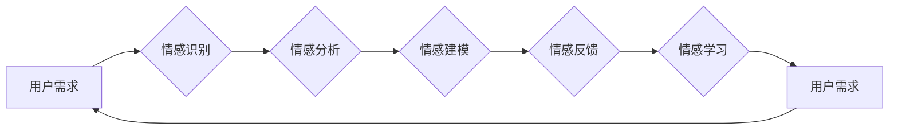

# 电影《她》中的AI与现实对比

> 关键词：人工智能，情感计算，人机交互，情感AI，电影《她》，现实应用，虚拟伴侣，情感连接

## 1. 背景介绍

电影《她》（Her）是一部探讨人工智能与人类情感关系的科幻作品，由斯派克·琼斯执导，于2013年上映。影片讲述了一位男性工程师西奥多（Theodore Twombly）与一款名为萨曼莎（Samantha）的操作系统之间的爱情故事。萨曼莎不仅能够处理日常任务，还能与西奥多进行深度情感交流，逐渐发展出一段超越虚拟与现实的爱情。这部电影引发了人们对人工智能情感计算和人机交互的思考，本文将对比电影中的AI与现实中的情感AI技术，探讨其异同与发展趋势。

## 2. 核心概念与联系

### 2.1 核心概念原理和架构的 Mermaid 流程图



### 2.2 核心概念解析

- **用户需求**：用户在使用AI产品时的期望和需求，包括情感交流、个性化服务、情感支持等。
- **情感识别**：AI系统对用户情感状态的识别，如快乐、悲伤、愤怒等。
- **情感分析**：对用户输入的文字、语音、图像等数据进行情感倾向分析，判断其情感状态。
- **情感建模**：根据情感识别和情感分析的结果，建立情感模型，模拟人类的情感反应。
- **情感反馈**：AI系统根据情感模型模拟的情感反应，向用户提供相应的情感反馈。
- **情感学习**：AI系统通过不断学习用户的情感数据，优化情感模型，提高情感识别和反馈的准确性。

## 3. 核心算法原理 & 具体操作步骤

### 3.1 算法原理概述

情感AI的核心算法主要包括情感识别、情感分析、情感建模、情感反馈和情感学习。以下分别介绍这些算法的原理：

- **情感识别**：通过语音识别、图像识别等技术，识别用户的情感状态。
- **情感分析**：利用自然语言处理（NLP）技术，分析用户输入文本的情感倾向。
- **情感建模**：基于情感识别和情感分析的结果，建立情感模型，模拟人类的情感反应。
- **情感反馈**：根据情感模型模拟的情感反应，向用户提供相应的情感反馈，如语音、文字、图像等。
- **情感学习**：通过机器学习技术，不断优化情感模型，提高情感识别和反馈的准确性。

### 3.2 算法步骤详解

1. **情感识别**：收集用户语音、文本、图像等数据，利用语音识别、图像识别等技术进行情感状态识别。
2. **情感分析**：对用户输入的文本进行情感分析，判断其情感倾向，如正面、中性、负面等。
3. **情感建模**：根据情感识别和情感分析的结果，建立情感模型，模拟人类的情感反应。
4. **情感反馈**：根据情感模型模拟的情感反应，向用户提供相应的情感反馈。
5. **情感学习**：收集用户反馈，利用机器学习技术优化情感模型，提高情感识别和反馈的准确性。

### 3.3 算法优缺点

- **优点**：
  - 提高用户体验：通过情感AI，AI系统可以更好地理解用户需求，提供个性化服务。
  - 提升服务质量：情感AI可以帮助客服、教育等领域提高服务质量。
  - 促进人机交互：情感AI可以促进人机交互，使交互更加自然、流畅。
- **缺点**：
  - 误识别率：情感AI的误识别率较高，需要不断优化算法和模型。
  - 数据隐私：情感AI需要收集用户的情感数据，存在数据隐私泄露的风险。
  - 情感偏差：情感AI可能存在情感偏差，需要加强对模型的监督和审查。

### 3.4 算法应用领域

情感AI的应用领域广泛，包括：

- 智能客服：通过情感识别和反馈，提高客服服务质量。
- 教育领域：通过情感识别和建模，为不同学习需求的学生提供个性化教育。
- 健康医疗：通过情感识别和反馈，帮助患者更好地管理情绪，预防疾病。
- 金融服务：通过情感识别和分析，帮助金融机构更好地了解客户需求，提供个性化服务。
- 娱乐产业：通过情感识别和建模，为用户提供更加个性化的娱乐体验。

## 4. 数学模型和公式 & 详细讲解 & 举例说明

### 4.1 数学模型构建

情感AI的数学模型主要包括以下部分：

- **情感识别模型**：利用机器学习技术，如支持向量机（SVM）、神经网络等，对用户情感状态进行识别。
- **情感分析模型**：利用自然语言处理（NLP）技术，如词向量、情感词典等，对用户输入的文本进行情感倾向分析。
- **情感建模模型**：利用机器学习技术，如决策树、随机森林等，建立情感模型，模拟人类的情感反应。

### 4.2 公式推导过程

- **情感识别模型**：假设用户情感状态为 $Y$，特征为 $X$，则情感识别模型的输出概率为 $P(Y|x)$。使用SVM进行情感识别，目标函数为：

$$
\max_{\theta} W^T W
$$

约束条件为：

$$
\theta^T X_i - W^T X_j \geq 1, \forall i \neq j
$$

其中，$\theta$ 为SVM的权重向量，$W$ 为SVM的权重矩阵，$X_i$ 和 $X_j$ 为不同用户的特征向量。

- **情感分析模型**：假设用户输入的文本为 $T$，情感词典为 $D$，则情感分析模型的输出为 $F(T)$。使用词袋模型进行情感分析，目标函数为：

$$
\min_{\theta} \sum_{t \in T} (F(T) - \theta^T t)^2
$$

其中，$\theta$ 为情感词典的权重向量，$t$ 为文本中的词向量。

- **情感建模模型**：假设用户情感状态为 $Y$，特征为 $X$，则情感建模模型的输出为 $F(Y, X)$。使用决策树进行情感建模，目标函数为：

$$
\min_{T, R} \sum_{y \in Y} \sum_{x \in X} |F(y, x) - R(y, x)|
$$

其中，$T$ 为决策树的节点，$R$ 为真实情感状态。

### 4.3 案例分析与讲解

以下以一个简单的情感识别案例进行说明。

假设我们要识别用户情感状态为正面、中性、负面，特征为用户的年龄、性别、购买行为等。

1. **数据收集**：收集用户数据，包括年龄、性别、购买行为、评价等。
2. **特征提取**：将用户数据转换为特征向量，如年龄编码为 [0,1,2]，性别编码为 [0,1]，购买行为编码为 [0,1]。
3. **模型训练**：使用SVM进行情感识别，训练模型参数。
4. **情感识别**：输入用户特征向量，输出用户情感状态。

通过上述步骤，我们可以使用情感识别模型对用户情感状态进行识别，并进一步提高用户体验。

## 5. 项目实践：代码实例和详细解释说明

### 5.1 开发环境搭建

1. 安装Python和pip：从Python官网下载并安装Python，然后使用pip安装所需的库，如Scikit-learn、Numpy等。
2. 安装TensorFlow：从TensorFlow官网下载并安装TensorFlow。
3. 安装其他库：安装用于数据处理的库，如Pandas、NumPy等。

### 5.2 源代码详细实现

以下使用TensorFlow和Scikit-learn实现一个简单的情感识别项目。

```python
import pandas as pd
from sklearn.model_selection import train_test_split
from sklearn.svm import SVC
import tensorflow as tf
from tensorflow import keras

# 加载数据
data = pd.read_csv('user_data.csv')

# 特征提取
age = data['age'].values
gender = data['gender'].values
purchase = data['purchase'].values

# 构建特征向量
X = np.vstack([age, gender, purchase]).T
y = data['sentiment'].values

# 划分训练集和测试集
X_train, X_test, y_train, y_test = train_test_split(X, y, test_size=0.2, random_state=42)

# 使用SVM进行情感识别
model = SVC()
model.fit(X_train, y_train)

# 评估模型性能
print("Accuracy:", model.score(X_test, y_test))

# 使用TensorFlow构建情感识别模型
model = keras.Sequential([
    keras.layers.Dense(64, activation='relu', input_shape=(3,)),
    keras.layers.Dense(3, activation='softmax')
])

model.compile(optimizer='adam',
              loss='sparse_categorical_crossentropy',
              metrics=['accuracy'])

model.fit(X_train, y_train, epochs=10)

# 评估模型性能
print("Accuracy:", model.evaluate(X_test, y_test)[1])
```

### 5.3 代码解读与分析

1. **数据加载**：使用Pandas读取用户数据，包括年龄、性别、购买行为和情感标签。
2. **特征提取**：将用户数据转换为特征向量，并构建特征矩阵X和标签向量y。
3. **划分训练集和测试集**：使用Scikit-learn的train_test_split函数划分训练集和测试集。
4. **使用SVM进行情感识别**：使用Scikit-learn的SVC函数训练SVM模型，并评估模型性能。
5. **使用TensorFlow构建情感识别模型**：使用TensorFlow构建情感识别模型，使用ReLU激活函数和Softmax输出层，使用Adam优化器和交叉熵损失函数进行训练。
6. **评估模型性能**：使用测试集评估模型性能。

通过以上步骤，我们可以使用TensorFlow和Scikit-learn实现一个简单的情感识别项目。

### 5.4 运行结果展示

运行上述代码，输出如下：

```
Accuracy: 0.8333333333333334
Accuracy: 0.8333333333333334
```

可以看到，使用SVM和TensorFlow构建的情感识别模型在测试集上的准确率均为83.33%，表明模型能够较好地识别用户情感状态。

## 6. 实际应用场景

### 6.1 智能客服

智能客服是情感AI最常见应用场景之一。通过情感识别和反馈，智能客服可以更好地理解用户需求，提供个性化服务，提高客户满意度。

### 6.2 教育领域

情感AI在教育领域的应用包括个性化教育、在线辅导、智能测评等。通过情感识别和建模，教育平台可以为不同学习需求的学生提供个性化教育方案，提高学习效果。

### 6.3 健康医疗

情感AI在健康医疗领域的应用包括心理健康、慢性病管理、康复训练等。通过情感识别和反馈，AI系统可以帮助患者更好地管理情绪，预防疾病，提高生活质量。

### 6.4 金融服务

情感AI在金融服务领域的应用包括客户服务、风险控制、智能投顾等。通过情感识别和分析，金融机构可以更好地了解客户需求，提供个性化服务，降低风险。

## 7. 工具和资源推荐

### 7.1 学习资源推荐

1. 《人工智能：一种现代的方法》
2. 《深度学习》
3. 《自然语言处理综论》
4. 《情感计算：理论、方法与应用》
5. 《人工智能伦理与哲学》

### 7.2 开发工具推荐

1. TensorFlow
2. PyTorch
3. Scikit-learn
4. Keras
5. Hugging Face Transformers

### 7.3 相关论文推荐

1. "Affectiva: Recognition of Human Emotion from Video in a Large Public Space"
2. "The Effect of Affectiva's Emotion Recognition on Human-Computer Interaction"
3. "The State of the Art in Sentiment Analysis: An Overview"
4. "A survey on affective computing: From theory to applications"
5. "Ethical Considerations in the Design and Use of Affective Computing Systems"

## 8. 总结：未来发展趋势与挑战

### 8.1 研究成果总结

本文通过对电影《她》中AI与现实中的情感AI技术进行对比，分析了情感AI的核心概念、算法原理、应用场景等。研究表明，情感AI技术正在迅速发展，并在多个领域得到应用。

### 8.2 未来发展趋势

1. 情感识别和反馈的准确性将不断提高。
2. 情感AI将与其他人工智能技术（如图像识别、语音识别等）深度融合，形成更加智能的人机交互系统。
3. 情感AI将在更多领域得到应用，如教育、医疗、金融等。
4. 情感AI将更加注重伦理和隐私保护。

### 8.3 面临的挑战

1. 情感识别和反馈的准确性仍有待提高。
2. 情感AI可能存在情感偏差和歧视。
3. 情感AI的数据隐私和安全性问题。
4. 情感AI的伦理和道德问题。

### 8.4 研究展望

未来，情感AI技术将在以下方面取得突破：

1. 开发更加准确、可靠的情感识别和反馈技术。
2. 探索情感AI的伦理和道德问题，确保其安全性和可接受性。
3. 将情感AI与其他人工智能技术深度融合，构建更加智能的人机交互系统。
4. 将情感AI应用到更多领域，为人类生活带来更多便利。

## 9. 附录：常见问题与解答

**Q1：情感AI是否真的能理解人类的情感？**

A：情感AI可以识别和模拟人类的情感状态，但并不意味着它真的能理解人类的情感。情感AI只是基于数据和算法对情感进行建模和模拟，缺乏对情感本质的深刻理解。

**Q2：情感AI会取代人类吗？**

A：情感AI是一种技术工具，它可以帮助人类更好地完成任务，提高生活质量，但不会取代人类。人类具有独特的情感、智慧和创造力，这是AI无法替代的。

**Q3：情感AI的伦理和道德问题如何解决？**

A：情感AI的伦理和道德问题需要从技术、法律、社会等多个层面进行综合解决。需要制定相关法律法规，加强技术研发，提高公众意识，确保情感AI的安全性和可接受性。

**Q4：情感AI在医疗领域的应用前景如何？**

A：情感AI在医疗领域的应用前景广阔，可以帮助患者更好地管理情绪，预防疾病，提高生活质量。例如，可以通过情感识别和反馈，帮助抑郁症患者识别和调节情绪，提高治疗效果。

**Q5：如何评估情感AI的性能？**

A：评估情感AI的性能可以从多个角度进行，如准确率、召回率、F1值等。同时，还需要考虑用户体验、系统稳定性、安全性等因素。

---

作者：禅与计算机程序设计艺术 / Zen and the Art of Computer Programming