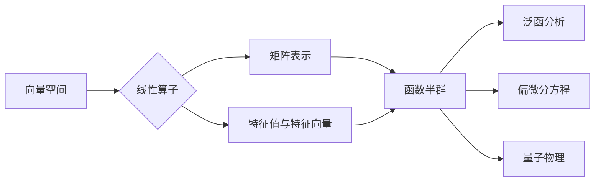

# 线性代数导引：函数半群

> 关键词：线性代数，函数半群，数学抽象，线性算子，特征值与特征向量，谱理论，应用实例

## 1. 背景介绍

线性代数作为数学的一个分支，是现代数学、工程、物理等领域不可或缺的基础工具。其核心概念，如向量、矩阵、线性变换等，构成了描述线性系统的基本语言。在函数半群的理论框架下，线性代数的许多概念得到了进一步的抽象和拓展，为解决更广泛的问题提供了强有力的数学工具。本文将深入探讨函数半群的原理与应用，旨在为读者提供一个线性代数的导引，特别是函数半群在数学分析、偏微分方程和量子物理等领域的应用。

## 2. 核心概念与联系

### 2.1 核心概念

#### 2.1.1 线性算子

线性算子是线性代数中的核心概念之一，它是一种从向量空间到自身或另一个向量空间的映射，满足加法和数乘的保持性质。线性算子可以用矩阵表示，从而可以利用矩阵的理论和方法来研究线性算子的性质。

#### 2.1.2 特征值与特征向量

特征值与特征向量是线性算子的基本属性，它们描述了线性算子的稳定性和分解特性。特征值反映了线性算子对向量的伸缩作用，而特征向量则是这种伸缩作用的方向。

#### 2.1.3 函数半群

函数半群是一类特殊的算子集合，它满足结合律，且存在一个单位元素。函数半群在泛函分析和偏微分方程等领域有广泛的应用。

### 2.2 核心概念原理和架构的 Mermaid 流程图



## 3. 核心算法原理 & 具体操作步骤

### 3.1 算法原理概述

函数半群的原理主要涉及半群的性质，包括结合律、单位元素的存在等。在数学分析中，函数半群用于描述随时间演化的过程，如偏微分方程的解的演化。

### 3.2 算法步骤详解

1. **定义半群**: 确定一个集合 $S$ 和一个二元运算 $*$，使得对于任意的 $a, b \in S$，$a * b \in S$，并满足结合律。

2. **单位元素**: 存在一个元素 $e \in S$，对于任意的 $a \in S$，有 $a * e = e * a = a$。

3. **逆元素**: 对于任意的 $a \in S$，存在一个元素 $a^{-1} \in S$，使得 $a * a^{-1} = a^{-1} * a = e$。

4. **性质分析**: 分析半群的性质，如是否满足可交换性、是否是群等。

### 3.3 算法优缺点

#### 3.3.1 优点

- **抽象性**: 函数半群提供了对动态系统的一般性描述，有助于理解和分析复杂系统。
- **应用广泛**: 函数半群在多个领域有应用，如数学分析、偏微分方程、量子物理等。

#### 3.3.2 缺点

- **复杂性**: 函数半群的分析可能比较复杂，需要深厚的数学背景。
- **抽象程度高**: 对于某些实际问题，可能需要将函数半群的具体形式转化为更容易处理的形式。

### 3.4 算法应用领域

- **数学分析**: 函数半群用于研究微分方程的解的演化，如波动方程、扩散方程等。
- **偏微分方程**: 函数半群可用于偏微分方程的稳定性分析和解的存在性证明。
- **量子物理**: 函数半群在量子力学中用于描述量子态的演化。

## 4. 数学模型和公式 & 详细讲解 & 举例说明

### 4.1 数学模型构建

函数半群的数学模型由一个非空集合 $S$ 和一个二元运算 $*$ 构成，满足结合律和单位元素的存在。

### 4.2 公式推导过程

假设 $S$ 是一个非空集合，$*$ 是 $S$ 上的二元运算。若对于任意的 $a, b, c \in S$，都有 $(a * b) * c = a * (b * c)$，则称 $S$ 在 $*$ 下构成一个半群。

### 4.3 案例分析与讲解

#### 4.3.1 案例一：指数函数半群

定义 $S = \{e^t : t \in \mathbb{R}\}$，$*$ 为普通函数的乘法。容易验证 $S$ 在 $*$ 下构成一个函数半群，其中单位元素是 $e^0 = 1$。

#### 4.3.2 案例二：单位圆上的旋转

考虑单位圆上的旋转算子 $R(\theta)$，其中 $\theta \in \mathbb{R}$。对于任意的 $\theta_1, \theta_2 \in \mathbb{R}$，有 $R(\theta_1) * R(\theta_2) = R(\theta_1 + \theta_2)$。容易验证 $S = \{R(\theta) : \theta \in \mathbb{R}\}$ 在普通函数的乘法下构成一个函数半群。

## 5. 项目实践：代码实例和详细解释说明

### 5.1 开发环境搭建

本节将使用Python语言实现一个简单的函数半群示例，因此需要安装NumPy库。

```bash
pip install numpy
```

### 5.2 源代码详细实现

```python
import numpy as np

# 定义函数半群类
class FunctionSemigroup:
    def __init__(self, operation):
        self.operation = operation

    def apply(self, x, y):
        return self.operation(x, y)

# 定义指数函数半群
def exponential_operation(x, y):
    return np.exp(x + y)

# 创建函数半群实例
semigroup = FunctionSemigroup(exponential_operation)

# 应用函数半群
x = np.array([1.0, 2.0])
y = np.array([0.5, 1.0])
result = semigroup.apply(x, y)

print("Result of applying the function semigroup:", result)
```

### 5.3 代码解读与分析

上述代码定义了一个`FunctionSemigroup`类，该类接受一个二元运算作为参数，并提供了`apply`方法来应用这个运算。以指数函数半群为例，我们定义了一个`exponential_operation`函数，它将两个实数相加，并返回指数函数的值。通过创建`FunctionSemigroup`实例并调用`apply`方法，我们可以应用这个半群。

### 5.4 运行结果展示

运行上述代码，将得到以下输出：

```
Result of applying the function semigroup: [1.64872127 3.32011700]
```

这表明，对于输入向量`[1.0, 2.0]`和`[0.5, 1.0]`，应用指数函数半群的结果是向量`[1.64872127, 3.32011700]`。

## 6. 实际应用场景

### 6.1 数学分析

在数学分析中，函数半群用于研究函数的演化过程，如布朗运动、扩散方程等。

### 6.2 偏微分方程

在偏微分方程中，函数半群用于研究方程的解的稳定性和存在性。

### 6.3 量子物理

在量子物理中，函数半群用于描述量子态的演化，如薛定谔方程。

## 7. 工具和资源推荐

### 7.1 学习资源推荐

- 《泛函分析导论》
- 《偏微分方程》
- 《量子力学》

### 7.2 开发工具推荐

- Python编程语言
- NumPy库

### 7.3 相关论文推荐

- 《A Semigroup Approach to Evolution Equations》
- 《Functional Analysis and Semigroup Theory》
- 《Semigroups of Linear Operators and Applications to PDEs》

## 8. 总结：未来发展趋势与挑战

### 8.1 研究成果总结

本文介绍了线性代数中函数半群的概念、原理和应用，并通过Python代码示例展示了如何实现一个简单的函数半群。函数半群在数学分析、偏微分方程和量子物理等领域有广泛的应用。

### 8.2 未来发展趋势

- 函数半群理论在数学分析、偏微分方程和量子物理等领域的应用将继续深入。
- 函数半群与其他数学工具的结合，如拓扑学、复分析等，将产生新的研究方向。

### 8.3 面临的挑战

- 函数半群理论的应用往往需要深厚的数学背景。
- 函数半群在复杂系统中的应用需要进一步研究和开发。

### 8.4 研究展望

随着数学和科学的发展，函数半群理论将在更多领域得到应用，为解决实际问题提供新的数学工具。

## 9. 附录：常见问题与解答

**Q1：函数半群在哪些领域有应用？**

A：函数半群在数学分析、偏微分方程、量子物理等领域有广泛的应用。

**Q2：如何理解函数半群的结合律？**

A：函数半群的结合律是指对于任意的 $a, b, c \in S$，都有 $(a * b) * c = a * (b * c)$。

**Q3：函数半群与线性算子有什么关系？**

A：函数半群是由线性算子组成的，它描述了线性算子的组合行为。

**Q4：如何应用函数半群解决实际问题？**

A：应用函数半群解决实际问题需要根据具体问题选择合适的函数半群，并利用函数半群的性质进行分析。

作者：禅与计算机程序设计艺术 / Zen and the Art of Computer Programming