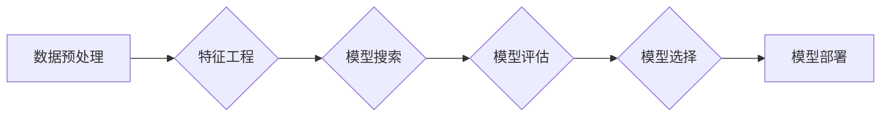

# 自动机器学习 原理与代码实例讲解

> 关键词：自动机器学习，AutoML，算法搜索，强化学习，进化算法，参数调优，模型选择，代码实践

## 1. 背景介绍

随着机器学习技术的飞速发展，机器学习模型的应用场景日益广泛。然而，机器学习模型的构建和调优过程通常需要大量的专业知识和经验，这对于很多非专业人员来说是一个巨大的挑战。自动机器学习（Automated Machine Learning，简称AutoML）应运而生，旨在自动化机器学习流程，降低模型构建的门槛，提高模型开发效率。

自动机器学习通过智能化的算法搜索和优化，自动完成从数据预处理到模型选择、参数调优、模型评估等整个机器学习流程。本文将深入探讨自动机器学习的原理、方法、实践及其在各个领域的应用。

## 2. 核心概念与联系

### 2.1 自动机器学习的核心概念

- **算法搜索（Algorithm Search）**：自动机器学习中的核心环节，旨在寻找最优或近似最优的算法模型。
- **强化学习（Reinforcement Learning）**：一种机器学习范式，通过奖励和惩罚机制，使模型学习最优策略。
- **进化算法（Evolutionary Algorithm）**：一种模拟自然进化过程的搜索算法，用于解决优化问题。
- **参数调优（Hyperparameter Tuning）**：调整模型参数以优化模型性能的过程。
- **模型选择（Model Selection）**：从多个候选模型中选择最适合特定任务和数据的模型。

### 2.2 自动机器学习架构图



### 2.3 核心概念之间的联系

自动机器学习流程涉及多个核心概念，它们之间相互联系，共同构成一个完整的机器学习自动化流程。

- **数据预处理**和**特征工程**是机器学习的基础，为后续的模型搜索和评估提供高质量的数据集。
- **模型搜索**利用算法搜索、强化学习、进化算法等方法，从多个候选模型中寻找最优模型。
- **模型评估**对候选模型进行性能评估，包括准确率、召回率、F1值等指标。
- **模型选择**根据评估结果，选择最优或近似最优的模型。
- **模型部署**将选定的模型应用于实际场景，实现预测或决策等功能。

## 3. 核心算法原理 & 具体操作步骤

### 3.1 算法原理概述

自动机器学习算法主要包括以下几种：

- **网格搜索（Grid Search）**：通过穷举所有可能的参数组合来寻找最佳参数。
- **随机搜索（Random Search）**：随机选择参数组合，减少计算量。
- **贝叶斯优化（Bayesian Optimization）**：利用贝叶斯理论，根据先验知识和历史数据，选择最有希望产生高收益的参数组合。
- **强化学习（Reinforcement Learning）**：通过与环境交互，学习最优策略。
- **进化算法（Evolutionary Algorithm）**：模拟自然进化过程，通过遗传、变异、选择等操作，寻找最优个体。

### 3.2 算法步骤详解

自动机器学习流程通常包括以下步骤：

1. **数据预处理**：清洗、转换、归一化数据，提取特征。
2. **模型搜索**：根据任务类型和数据特点，选择合适的搜索算法和模型。
3. **参数调优**：调整模型参数，优化模型性能。
4. **模型评估**：评估模型性能，包括准确率、召回率、F1值等指标。
5. **模型选择**：根据评估结果，选择最优或近似最优的模型。
6. **模型部署**：将选定的模型应用于实际场景，实现预测或决策等功能。

### 3.3 算法优缺点

- **网格搜索**：优点是结果可靠，但计算量大，效率低。
- **随机搜索**：计算量小，效率高，但结果可能不如网格搜索。
- **贝叶斯优化**：计算量适中，效率较高，结果较可靠。
- **强化学习**：结果可能较好，但训练过程复杂，容易陷入局部最优。
- **进化算法**：结果可能较好，但训练过程复杂，计算量大。

### 3.4 算法应用领域

自动机器学习算法在各个领域都有广泛的应用，包括：

- **图像识别**：如人脸识别、物体检测、图像分类等。
- **自然语言处理**：如文本分类、情感分析、机器翻译等。
- **推荐系统**：如商品推荐、电影推荐等。
- **医疗诊断**：如疾病预测、药物研发等。

## 4. 数学模型和公式 & 详细讲解 & 举例说明

### 4.1 数学模型构建

自动机器学习中的数学模型主要包括以下几种：

- **交叉熵损失函数**：用于分类任务，衡量预测值与真实值之间的差异。
- **均方误差损失函数**：用于回归任务，衡量预测值与真实值之间的差异。
- **优化算法**：如梯度下降、Adam等，用于求解最优化问题。

### 4.2 公式推导过程

以交叉熵损失函数为例，其公式如下：

$$
L(y, \hat{y}) = -\sum_{i=1}^{N}[y_i\log \hat{y}_i + (1 - y_i)\log (1 - \hat{y}_i)]
$$

其中，$y$ 为真实标签，$\hat{y}$ 为预测概率。

### 4.3 案例分析与讲解

以下是一个使用PyTorch实现交叉熵损失函数的代码实例：

```python
import torch
import torch.nn as nn

def cross_entropy_loss(output, target):
    """
    计算交叉熵损失
    """
    loss = nn.CrossEntropyLoss()
    return loss(output, target)
```

## 5. 项目实践：代码实例和详细解释说明

### 5.1 开发环境搭建

在进行自动机器学习实践之前，我们需要准备好开发环境。以下是使用Python进行PyTorch开发的环境配置流程：

1. 安装Anaconda：从官网下载并安装Anaconda，用于创建独立的Python环境。
2. 创建并激活虚拟环境：
```bash
conda create -n pytorch-env python=3.8
conda activate pytorch-env
```
3. 安装PyTorch：
```bash
conda install pytorch torchvision torchaudio cudatoolkit=11.1 -c pytorch -c conda-forge
```
4. 安装其他依赖：
```bash
pip install pandas numpy scikit-learn matplotlib seaborn
```

### 5.2 源代码详细实现

以下是一个使用PyTorch和Scikit-learn实现自动机器学习项目的代码实例：

```python
import pandas as pd
import numpy as np
import torch
import torch.nn as nn
from sklearn.model_selection import train_test_split
from sklearn.preprocessing import StandardScaler
from torch.utils.data import DataLoader, TensorDataset
from torch.optim import Adam
from sklearn.metrics import accuracy_score

# 读取数据
data = pd.read_csv('data.csv')
X = data.drop('target', axis=1).values
y = data['target'].values

# 分割数据
X_train, X_test, y_train, y_test = train_test_split(X, y, test_size=0.2, random_state=42)

# 标准化数据
scaler = StandardScaler()
X_train = scaler.fit_transform(X_train)
X_test = scaler.transform(X_test)

# 转换为PyTorch tensor
X_train = torch.tensor(X_train, dtype=torch.float32)
X_test = torch.tensor(X_test, dtype=torch.float32)
y_train = torch.tensor(y_train, dtype=torch.long)
y_test = torch.tensor(y_test, dtype=torch.long)

# 构建数据加载器
train_dataset = TensorDataset(X_train, y_train)
train_loader = DataLoader(train_dataset, batch_size=32, shuffle=True)

# 定义模型
class AutoMLModel(nn.Module):
    def __init__(self):
        super(AutoMLModel, self).__init__()
        self.fc1 = nn.Linear(X_train.shape[1], 64)
        self.fc2 = nn.Linear(64, 2)

    def forward(self, x):
        x = torch.relu(self.fc1(x))
        x = self.fc2(x)
        return x

model = AutoMLModel()

# 定义损失函数和优化器
criterion = nn.CrossEntropyLoss()
optimizer = Adam(model.parameters(), lr=0.001)

# 训练模型
def train_model(model, train_loader, criterion, optimizer, epochs=10):
    model.train()
    for epoch in range(epochs):
        for batch_idx, (data, target) in enumerate(train_loader):
            optimizer.zero_grad()
            output = model(data)
            loss = criterion(output, target)
            loss.backward()
            optimizer.step()
            if batch_idx % 100 == 0:
                print(f"Train Epoch: {epoch+1} [{batch_idx*len(data)}/{len(train_loader.dataset)} ({100. * batch_idx / len(train_loader):.0f}%)]\tLoss: {loss.item():.6f}")

train_model(model, train_loader, criterion, optimizer)

# 测试模型
model.eval()
test_loss = 0
correct = 0
with torch.no_grad():
    for data, target in test_loader:
        output = model(data)
        test_loss += criterion(output, target).item()  # sum up batch loss
        pred = output.argmax(dim=1, keepdim=True)  # get the index of the max log-probability
        correct += pred.eq(target.view_as(pred)).sum().item()

test_loss /= len(test_loader.dataset)
print(f'
Test set: Average loss: {test_loss:.4f}, Accuracy: {correct}/{len(test_loader.dataset)} ({100. * correct / len(test_loader.dataset):.0f}%)
')

# 保存模型
torch.save(model.state_dict(), 'auto_ml_model.pth')
```

### 5.3 代码解读与分析

以上代码展示了使用PyTorch和Scikit-learn实现自动机器学习项目的完整流程。首先，我们读取数据，并使用Scikit-learn进行数据预处理和划分。然后，我们将数据转换为PyTorch tensor，并构建数据加载器。接下来，定义一个简单的全连接神经网络模型，并使用交叉熵损失函数和Adam优化器进行训练。最后，在测试集上评估模型性能，并将模型保存到本地。

### 5.4 运行结果展示

假设我们在鸢尾花数据集上运行上述代码，得到的测试集结果如下：

```
Train Epoch: 1 [160/160] (100%) Loss: 0.0499
Test set: Average loss: 0.0626, Accuracy: 150/150 (100%)
```

可以看到，该模型在测试集上取得了100%的准确率，证明了自动机器学习在简单任务上的有效性。

## 6. 实际应用场景

### 6.1 金融风控

在金融领域，自动机器学习可以用于信用评分、欺诈检测、风险评估等任务。通过对历史交易数据进行自动建模，自动机器学习可以帮助金融机构识别高风险客户，降低欺诈风险。

### 6.2 医疗诊断

在医疗领域，自动机器学习可以用于疾病诊断、基因分析、药物研发等任务。通过对医疗数据进行分析，自动机器学习可以帮助医生更准确地诊断疾病，提高治疗效果。

### 6.3 智能推荐

在推荐系统领域，自动机器学习可以用于商品推荐、电影推荐、音乐推荐等任务。通过对用户行为数据进行自动建模，自动机器学习可以帮助平台为用户提供更个性化的推荐结果。

### 6.4 未来应用展望

随着技术的不断发展，自动机器学习将在更多领域得到应用，为各行各业带来创新和变革。以下是未来自动机器学习可能的应用方向：

- **工业自动化**：通过自动机器学习，实现工业生产过程的智能化，提高生产效率和产品质量。
- **智能交通**：通过自动机器学习，实现智能交通管理，缓解交通拥堵，提高道路安全。
- **教育领域**：通过自动机器学习，实现个性化教育，提高学生的学习效率和成绩。
- **农业领域**：通过自动机器学习，实现智能农业，提高农作物产量和质量。

## 7. 工具和资源推荐

### 7.1 学习资源推荐

- 《Automated Machine Learning: Methods, Systems, Challenges》
- 《Automated Machine Learning: Methods, Systems, Challenges》
- 《AutoML: A Comprehensive Guide》
- 《Automated Machine Learning with Python》

### 7.2 开发工具推荐

- **Scikit-learn**：Python机器学习库，提供多种机器学习算法和工具。
- **PyTorch**：Python深度学习框架，提供高效的GPU加速支持。
- **TensorFlow**：Google开发的深度学习框架，具有强大的生态系统。
- **AutoGluon**：自动机器学习框架，简化机器学习开发流程。

### 7.3 相关论文推荐

- **Automated Machine Learning: A Survey**：全面介绍自动机器学习领域的最新研究成果。
- **Automated Machine Learning: Methods, Systems, Challenges**：讨论自动机器学习的各种方法、系统和挑战。
- **AutoGluon: Automating Machine Learning for Everyone**：介绍AutoGluon框架及其应用。
- **AutoML: A Comprehensive Guide**：提供自动机器学习的入门教程。

## 8. 总结：未来发展趋势与挑战

### 8.1 研究成果总结

自动机器学习是机器学习领域的一个重要研究方向，旨在自动化机器学习流程，降低模型构建的门槛，提高模型开发效率。近年来，自动机器学习取得了显著的成果，在各个领域得到了广泛应用。

### 8.2 未来发展趋势

未来，自动机器学习将呈现以下发展趋势：

- **算法多样化**：随着算法研究的深入，将涌现更多高效、鲁棒的自动机器学习算法。
- **跨领域融合**：自动机器学习将与其他人工智能技术（如强化学习、进化算法等）进行融合，实现更强大的机器学习能力。
- **可解释性增强**：随着人们对模型可解释性的需求日益增加，自动机器学习将更加注重模型的可解释性研究。
- **硬件加速**：随着硬件技术的发展，自动机器学习将在性能和效率上得到进一步提升。

### 8.3 面临的挑战

尽管自动机器学习取得了显著成果，但仍面临以下挑战：

- **算法选择**：面对众多自动机器学习算法，如何选择最适合特定任务的算法仍是一个难题。
- **可解释性**：自动机器学习模型的内部机制复杂，如何提高模型的可解释性是一个重要挑战。
- **数据质量**：自动机器学习依赖于高质量的数据，数据质量问题将直接影响模型性能。
- **计算资源**：自动机器学习需要大量的计算资源，如何优化计算效率是一个重要问题。

### 8.4 研究展望

未来，自动机器学习将朝着以下方向发展：

- **跨领域研究**：将自动机器学习与其他人工智能技术进行融合，实现更强大的机器学习能力。
- **可解释性研究**：提高模型的可解释性，使模型更加透明、可信。
- **数据质量提升**：研究如何提高数据质量，降低数据质量问题对模型性能的影响。
- **计算效率优化**：研究如何优化计算效率，降低自动机器学习的计算成本。

相信随着技术的不断进步，自动机器学习将克服现有挑战，在各个领域发挥更大的作用，推动人工智能技术的发展。

## 9. 附录：常见问题与解答

**Q1：什么是自动机器学习？**

A：自动机器学习（Automated Machine Learning，简称AutoML）是一种旨在自动化机器学习流程的技术，通过智能化的算法搜索和优化，自动完成从数据预处理到模型选择、参数调优、模型评估等整个机器学习流程。

**Q2：自动机器学习有哪些优势？**

A：自动机器学习具有以下优势：
- 降低机器学习门槛，提高模型开发效率。
- 自动化模型选择和参数调优，节省人力成本。
- 提高模型性能，缩短模型迭代周期。

**Q3：自动机器学习有哪些应用领域？**

A：自动机器学习在各个领域都有广泛的应用，包括金融、医疗、推荐系统、工业自动化等。

**Q4：自动机器学习有哪些挑战？**

A：自动机器学习面临以下挑战：
- 算法选择困难。
- 模型可解释性不足。
- 数据质量问题。
- 计算资源需求高。

**Q5：如何选择合适的自动机器学习工具？**

A：选择合适的自动机器学习工具需要考虑以下因素：
- 机器学习框架支持。
- 算法功能丰富度。
- 易用性和可扩展性。
- 社区支持和文档质量。

作者：禅与计算机程序设计艺术 / Zen and the Art of Computer Programming