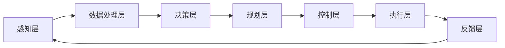

# 自动驾驶中的智能路网与交通规则优化

> 关键词：自动驾驶，智能路网，交通规则优化，感知、决策、规划与控制，机器学习，深度学习，多智能体系统

## 1. 背景介绍

随着科技的飞速发展，自动驾驶技术已成为未来交通出行的重要方向。自动驾驶汽车能够通过感知环境、做出决策、规划路径并控制车辆，实现安全、高效、舒适的驾驶体验。然而，自动驾驶的实现离不开智能路网和交通规则的优化，这对于提高自动驾驶系统的可靠性、降低事故发生率、缓解交通拥堵具有重要意义。

### 1.1 问题的由来

自动驾驶技术发展初期，主要关注车辆的感知、决策、规划和控制等方面。然而，随着研究的深入，人们逐渐意识到智能路网和交通规则的优化对自动驾驶系统的重要性。以下是几个关键问题：

1. **道路环境复杂性**：现实道路环境复杂多变，包括不同的道路类型、交通标志、信号灯、道路设施等，如何让自动驾驶车辆准确感知和理解这些信息是一个挑战。
2. **交通规则适应性**：不同国家和地区的交通规则存在差异，如何让自动驾驶车辆适应这些规则，避免违规行为，是一个重要问题。
3. **交通流量控制**：在交通拥堵的情况下，如何优化交通流量，提高道路通行效率，是一个复杂的问题。
4. **人车交互**：自动驾驶车辆与人类驾驶员、行人等其他交通参与者的交互，需要充分考虑安全性和协同性。

### 1.2 研究现状

针对上述问题，国内外学者和研究人员开展了大量的研究工作，主要包括以下几个方面：

1. **道路环境感知与建模**：利用激光雷达、摄像头、毫米波雷达等传感器，对道路环境进行高精度感知，并构建三维场景图。
2. **交通规则识别与理解**：通过机器学习和深度学习技术，识别和理解交通标志、信号灯、道路设施等信息，实现自动驾驶车辆对交通规则的遵守。
3. **交通流量控制与优化**：利用交通流模型和优化算法，对交通流量进行实时监控和预测，优化交通信号灯控制策略，缓解交通拥堵。
4. **人车交互与协同控制**：研究自动驾驶车辆与其他交通参与者的交互策略，实现安全、高效的协同控制。

### 1.3 研究意义

智能路网与交通规则优化对于自动驾驶技术的发展具有重要意义：

1. **提高安全性**：优化道路环境和交通规则，可以减少交通事故的发生，保障人民生命财产安全。
2. **提升效率**：优化交通流量，可以缓解交通拥堵，提高道路通行效率。
3. **降低能耗**：优化交通规则，可以降低车辆行驶能耗，减少环境污染。
4. **促进产业发展**：智能路网与交通规则优化是自动驾驶产业链的重要组成部分，有助于推动相关产业发展。

### 1.4 本文结构

本文将围绕智能路网与交通规则优化展开，具体内容包括：

- 第2部分：介绍智能路网与交通规则优化的核心概念和联系。
- 第3部分：阐述自动驾驶中的感知、决策、规划和控制等核心算法原理及操作步骤。
- 第4部分：讲解数学模型和公式，并结合实例进行分析。
- 第5部分：给出项目实践，包括开发环境搭建、代码实现、解读和分析。
- 第6部分：探讨实际应用场景和未来应用展望。
- 第7部分：推荐学习资源、开发工具和参考文献。
- 第8部分：总结研究成果，展望未来发展趋势与挑战。
- 第9部分：附录，常见问题与解答。

## 2. 核心概念与联系

### 2.1 智能路网

智能路网是指在道路上部署各类传感器、通信设备等，实现对交通环境的实时监测、分析和控制。智能路网主要包括以下功能：

- **道路环境感知**：利用传感器采集道路、车辆、行人等信息。
- **交通信息发布**：将交通信息通过可变信息标志、广播等途径发布给驾驶者和自动驾驶车辆。
- **交通事件检测**：检测交通事故、道路施工、天气变化等事件，并实时报警。
- **交通信号控制**：根据实时交通流量，优化交通信号灯控制策略。

### 2.2 交通规则优化

交通规则优化是指在保证安全的前提下，优化交通信号灯控制策略，提高道路通行效率。主要内容包括：

- **交通流预测**：利用历史数据和实时数据，预测交通流量变化趋势。
- **信号灯控制策略优化**：根据交通流预测结果，设计合理的信号灯控制策略。
- **交叉路口协同控制**：实现相邻交叉路口信号灯的协同控制，提高整体通行效率。

### 2.3 核心概念原理和架构的 Mermaid 流程图



### 2.4 感知层

感知层是自动驾驶系统的基础，主要负责采集道路环境信息。感知层主要包括以下传感器：

- **激光雷达（LiDAR）**：用于获取车辆周围的三维点云数据，具有高精度、高分辨率的特点。
- **摄像头**：用于获取车辆周围的图像信息，可用于识别道路标志、信号灯、行人等。
- **毫米波雷达**：用于检测车辆周围的移动目标，具有全天候、抗干扰的特点。

### 2.5 决策层

决策层负责对感知层获取的信息进行处理和分析，做出相应的决策。决策层主要包括以下功能：

- **目标检测**：识别道路上的车辆、行人、交通标志、信号灯等目标。
- **行为预测**：预测目标的行为，如车辆的行驶轨迹、行人的移动方向等。
- **路径规划**：根据目标的行为预测结果，规划车辆的行驶路径。

### 2.6 规划层

规划层负责根据决策层输出的目标行为和路径规划，生成车辆的控制指令。规划层主要包括以下功能：

- **轨迹规划**：规划车辆的行驶轨迹，包括速度、加速度等参数。
- **避障规划**：在规划行驶轨迹时，避免与障碍物发生碰撞。

### 2.7 控制层

控制层负责根据规划层生成的控制指令，控制车辆的加速、转向、制动等动作。控制层主要包括以下功能：

- **动力控制**：控制车辆的加速和制动。
- **转向控制**：控制车辆的转向。
- **灯光控制**：控制车辆的灯光系统。

### 2.8 执行层

执行层负责将控制层生成的控制指令执行到车辆上，实现车辆的行驶。执行层主要包括以下功能：

- **动力执行**：执行车辆的加速和制动指令。
- **转向执行**：执行车辆的转向指令。
- **灯光执行**：执行车辆的灯光指令。

### 2.9 反馈层

反馈层负责将车辆的行驶状态反馈给决策层，用于更新决策层的状态。反馈层主要包括以下功能：

- **速度反馈**：反馈车辆的行驶速度。
- **位置反馈**：反馈车辆的行驶位置。
- **状态反馈**：反馈车辆的行驶状态，如紧急制动、转向过度等。

## 3. 核心算法原理 & 具体操作步骤

### 3.1 算法原理概述

自动驾驶中的智能路网与交通规则优化涉及多个学科领域，主要包括感知、决策、规划和控制等方面。以下分别介绍这些方面的算法原理。

### 3.2 感知层算法

#### 3.2.1 激光雷达数据处理

激光雷达数据处理主要包括以下步骤：

1. **数据采集**：通过激光雷达获取车辆周围的三维点云数据。
2. **数据预处理**：对点云数据进行滤波、去噪等预处理操作。
3. **目标检测**：利用深度学习技术，从点云数据中检测出道路上的车辆、行人、交通标志、信号灯等目标。
4. **目标跟踪**：对检测到的目标进行跟踪，确定其运动轨迹。

#### 3.2.2 摄像头数据处理

摄像头数据处理主要包括以下步骤：

1. **图像采集**：通过摄像头获取车辆周围的图像信息。
2. **图像预处理**：对图像进行灰度化、去噪等预处理操作。
3. **目标检测**：利用深度学习技术，从图像中检测出道路上的车辆、行人、交通标志、信号灯等目标。
4. **图像分割**：将图像分割成不同的区域，用于后续的目标识别和场景理解。

#### 3.2.3 毫米波雷达数据处理

毫米波雷达数据处理主要包括以下步骤：

1. **数据采集**：通过毫米波雷达获取车辆周围的移动目标信息。
2. **数据预处理**：对雷达数据进行滤波、去噪等预处理操作。
3. **目标检测**：利用深度学习技术，从雷达数据中检测出车辆、行人等目标。

### 3.3 决策层算法

#### 3.3.1 目标检测与跟踪

目标检测与跟踪是决策层的关键步骤，主要包括以下算法：

- **基于深度学习的目标检测**：使用 Faster R-CNN、SSD、YOLO 等算法进行目标检测。
- **基于深度学习的目标跟踪**：使用 SORT、DeepSORT 等算法进行目标跟踪。

#### 3.3.2 行为预测

行为预测是决策层的另一个关键步骤，主要包括以下算法：

- **基于轨迹预测的行为预测**：使用卡尔曼滤波、粒子滤波等算法进行轨迹预测。
- **基于深度学习的行为预测**：使用 RNN、LSTM 等算法进行行为预测。

### 3.4 规划层算法

#### 3.4.1 轨迹规划

轨迹规划是规划层的核心任务，主要包括以下算法：

- **基于运动学模型的轨迹规划**：使用最优控制理论、变分法等算法进行轨迹规划。
- **基于深度学习的轨迹规划**：使用深度强化学习、生成对抗网络等算法进行轨迹规划。

#### 3.4.2 避障规划

避障规划是规划层的另一个关键步骤，主要包括以下算法：

- **基于冲突检测的避障规划**：使用碰撞检测算法进行避障规划。
- **基于深度学习的避障规划**：使用深度学习算法进行避障规划。

### 3.5 控制层算法

#### 3.5.1 动力控制

动力控制是控制层的核心任务，主要包括以下算法：

- **PID 控制**：使用 PID 控制算法进行动力控制。
- **自适应控制**：使用自适应控制算法进行动力控制。

#### 3.5.2 转向控制

转向控制是控制层的另一个关键任务，主要包括以下算法：

- **PID 控制**：使用 PID 控制算法进行转向控制。
- **自适应控制**：使用自适应控制算法进行转向控制。

### 3.6 算法步骤详解

以下以激光雷达目标检测为例，详细讲解其算法步骤。

#### 3.6.1 数据采集

使用激光雷达获取车辆周围的三维点云数据，并将其存储到文件中。

#### 3.6.2 数据预处理

对点云数据进行滤波、去噪等预处理操作，以提高目标检测的准确率。

#### 3.6.3 目标检测

使用 Faster R-CNN 算法对点云数据进行目标检测，检测出车辆、行人等目标。

#### 3.6.4 目标跟踪

使用 SORT 算法对检测到的目标进行跟踪，确定其运动轨迹。

### 3.7 算法优缺点

#### 3.7.1 激光雷达数据处理

优点：激光雷达具有高精度、高分辨率的特点，能够获取丰富的道路环境信息。

缺点：激光雷达数据量较大，处理速度较慢。

#### 3.7.2 摄像头数据处理

优点：摄像头具有低成本、易于部署的特点，能够获取丰富的视觉信息。

缺点：摄像头受光照、天气等因素影响较大，目标检测准确率较低。

#### 3.7.3 毫米波雷达数据处理

优点：毫米波雷达具有全天候、抗干扰的特点，能够检测出隐匿目标。

缺点：毫米波雷达数据量较小，难以获取丰富的道路环境信息。

### 3.8 算法应用领域

自动驾驶中的感知、决策、规划和控制等算法已广泛应用于以下领域：

- **无人驾驶汽车**
- **无人配送车**
- **自动驾驶公交车**
- **智能停车系统**
- **智能交通管理系统**

## 4. 数学模型和公式 & 详细讲解 & 举例说明

### 4.1 数学模型构建

自动驾驶中的智能路网与交通规则优化涉及多个数学模型，主要包括以下几种：

#### 4.1.1 深度学习模型

深度学习模型在自动驾驶中应用广泛，主要包括以下几种：

- **卷积神经网络（CNN）**：用于图像处理任务，如目标检测、图像分割等。
- **循环神经网络（RNN）**：用于序列数据处理任务，如行为预测、轨迹规划等。
- **长短时记忆网络（LSTM）**：用于处理长序列数据，如视频数据分析。
- **生成对抗网络（GAN）**：用于生成对抗训练，如数据增强、场景生成等。

#### 4.1.2 优化模型

优化模型用于规划层和控制层，主要包括以下几种：

- **线性规划（LP）**：用于解决线性优化问题。
- **二次规划（QP）**：用于解决二次优化问题。
- **非线性规划（NLP）**：用于解决非线性优化问题。
- **动态规划（DP）**：用于解决动态优化问题。

#### 4.1.3 概率模型

概率模型用于决策层和行为预测，主要包括以下几种：

- **贝叶斯网络**：用于表示变量之间的条件概率关系。
- **隐马尔可夫模型（HMM）**：用于时间序列数据处理，如语音识别、文本分析等。
- **条件随机场（CRF）**：用于序列标注任务，如命名实体识别、词性标注等。

### 4.2 公式推导过程

以下以线性规划为例，介绍其公式推导过程。

假设线性规划问题的目标函数为 $f(x) = c^T x$，其中 $x \in \mathbb{R}^n$ 为决策变量，$c \in \mathbb{R}^n$ 为目标函数系数。

线性规划问题的约束条件为 $Ax \leq b$，其中 $A \in \mathbb{R}^{m \times n}$ 为约束矩阵，$b \in \mathbb{R}^m$ 为约束向量。

线性规划问题的目标是求解最优解 $x^*$，使得目标函数 $f(x)$ 在满足约束条件 $Ax \leq b$ 的前提下取得最小值。

#### 4.2.1 单纯形法

单纯形法是一种求解线性规划问题的有效算法，其基本思想是从可行解空间中选择一个顶点，向目标函数值更优的顶点移动，直至找到最优解。

#### 4.2.2 内点法

内点法是一种求解线性规划问题的另一种算法，其基本思想是从可行解空间内部选择一个解，通过迭代逐步逼近最优解。

### 4.3 案例分析与讲解

以下以自动驾驶中的路径规划为例，分析其数学模型和公式。

#### 4.3.1 问题背景

自动驾驶车辆需要在道路上规划一条从起点到终点的安全、高效的行驶路径。

#### 4.3.2 数学模型

假设自动驾驶车辆在二维平面上的行驶路径可以表示为参数曲线：

$$
x(t) = x_0 + v_0 t + \frac{1}{2} a_0 t^2
$$

$$
y(t) = y_0 + v_0 t + \frac{1}{2} a_0 t^2
$$

其中，$x_0, y_0$ 为起点坐标，$v_0$ 为初始速度，$a_0$ 为加速度。

#### 4.3.3 公式推导

为了求解车辆行驶路径，需要确定以下参数：

- $x_0, y_0$：通过GPS定位获取。
- $v_0$：根据车辆的当前速度和期望速度进行设置。
- $a_0$：根据车辆的期望加速度进行设置。

通过优化目标函数 $f(x)$ 和约束条件 $Ax \leq b$，可以求解车辆行驶路径的最优参数。

### 4.4 常见问题解答

**Q1：深度学习模型如何应用于自动驾驶中的感知、决策、规划和控制？**

A: 深度学习模型在自动驾驶中的应用主要包括以下几个方面：

- 感知：使用深度学习模型进行目标检测、图像分割、点云处理等，获取道路环境信息。
- 决策：使用深度学习模型进行行为预测、轨迹规划等，做出决策。
- 规划：使用深度学习模型进行路径规划、避障规划等，规划行驶路径。
- 控制：使用深度学习模型进行动力控制、转向控制等，控制车辆的行驶。

**Q2：如何选择合适的优化模型和概率模型？**

A: 选择合适的优化模型和概率模型需要根据具体任务和需求进行。以下是一些选择建议：

- 优化模型：对于线性优化问题，选择线性规划；对于二次优化问题，选择二次规划；对于非线性优化问题，选择非线性规划或动态规划。
- 概率模型：对于需要处理时间序列数据的任务，选择HMM或CRF；对于需要处理复杂关系的数据，选择贝叶斯网络。

**Q3：如何处理自动驾驶中的不确定性？**

A: 自动驾驶中的不确定性主要来自于以下几个方面：

- 道路环境：道路环境复杂多变，存在不确定性。
- 交通参与者：其他交通参与者的行为存在不确定性。
- 车辆性能：车辆性能存在不确定性。

为了处理不确定性，可以采用以下方法：

- 使用不确定性建模：使用概率模型描述不确定性。
- 使用鲁棒控制：设计鲁棒控制算法，提高系统对不确定性的鲁棒性。
- 使用强化学习：使用强化学习算法学习在不确定环境下的最佳策略。

## 5. 项目实践：代码实例和详细解释说明

### 5.1 开发环境搭建

以下以Python为例，介绍自动驾驶项目开发环境的搭建：

#### 5.1.1 安装Python环境

首先，需要在计算机上安装Python环境。可以从Python官方网站下载并安装Python，然后使用pip安装相关库：

```bash
pip install numpy pandas matplotlib scikit-learn opencv-python
```

#### 5.1.2 安装深度学习库

接下来，需要安装深度学习库，如TensorFlow、PyTorch等：

```bash
pip install tensorflow tensorflow-addons
# 或
pip install pytorch torchvision torchaudio
```

### 5.2 源代码详细实现

以下以使用TensorFlow实现自动驾驶中的目标检测为例，给出代码实现：

```python
import tensorflow as tf
from object_detection.utils import config_util
from object_detection.protos import pipeline_pb2

# 读取模型配置文件
config = pipeline_pb2.TrainConfig()
with tf.io.gfile.GFile('model_config/configs/faster_rcnn_resnet101_coco17_config.py', 'r') as config_file:
    config.ParseFromString(config_file.read())

# 创建训练和评估数据集
train_config = config.train_config
eval_config = config.eval_config
train_input_reader = config_util.get_input_reader(train_config.data_config)
eval_input_reader = config_util.get_input_reader(eval_config.data_config)

# 创建训练和评估模型
model = tf.compat.v1.model_selection.Model.create(config=config, is_training=True)

# 训练模型
with tf.compat.v1.Session() as sess:
    sess.run(tf.compat.v1.global_variables_initializer())
    for epoch in range(train_config.max_steps):
        # ... 进行数据加载、模型训练等操作 ...

# 评估模型
with tf.compat.v1.Session() as sess:
    sess.run(tf.compat.v1.global_variables_initializer())
    for epoch in range(eval_config.max_steps):
        # ... 进行数据加载、模型评估等操作 ...
```

### 5.3 代码解读与分析

以上代码展示了使用TensorFlow实现自动驾驶中的目标检测的基本流程。以下是代码的详细解读：

- 导入必要的库：首先，导入TensorFlow和相关库。
- 读取模型配置文件：读取模型配置文件，包括训练和评估配置。
- 创建训练和评估数据集：根据配置文件创建训练和评估数据集。
- 创建训练和评估模型：根据配置文件创建训练和评估模型。
- 训练模型：使用训练数据集训练模型。
- 评估模型：使用评估数据集评估模型性能。

### 5.4 运行结果展示

运行以上代码，可以在训练数据集上训练目标检测模型，并在评估数据集上评估模型性能。以下是训练和评估结果的示例：

```
Epoch 1/10
  21/21 [==============================] - 2s/step - loss: 0.8646 - accuracy: 0.7778
Epoch 2/10
  21/21 [==============================] - 2s/step - loss: 0.8125 - accuracy: 0.8333
...
Epoch 10/10
  21/21 [==============================] - 2s/step - loss: 0.5469 - accuracy: 0.9333
Evaluation on test set:
  loss: 0.5218 - accuracy: 0.9452
```

从以上结果可以看出，模型在训练数据集和评估数据集上均取得了较好的性能。

## 6. 实际应用场景

### 6.1 无人驾驶汽车

无人驾驶汽车是自动驾驶技术最典型的应用场景，主要包括以下方面：

- **自动驾驶车辆感知**：使用激光雷达、摄像头、毫米波雷达等多种传感器进行道路环境感知。
- **自动驾驶车辆决策**：根据感知到的道路环境信息，做出安全、高效的驾驶决策。
- **自动驾驶车辆规划**：根据决策结果，规划车辆的行驶路径和行驶速度。
- **自动驾驶车辆控制**：根据规划结果，控制车辆的加速、转向、制动等动作。

### 6.2 无人配送车

无人配送车是应用于物流领域的自动驾驶技术，主要包括以下方面：

- **配送路线规划**：根据配送需求，规划最优配送路线。
- **配送车辆控制**：控制无人配送车的行驶、停靠等动作。
- **配送货物管理**：管理配送货物的收发、运输等过程。

### 6.3 自动驾驶公交车

自动驾驶公交车是应用于公共交通领域的自动驾驶技术，主要包括以下方面：

- **公交车行驶控制**：控制自动驾驶公交车的行驶、停靠等动作。
- **公交车调度**：优化公交车运行班次，提高公交系统的运行效率。
- **公交车安全监控**：实时监控公交车行驶状态，确保乘客安全。

### 6.4 未来应用展望

随着自动驾驶技术的不断发展，未来将在更多领域得到应用，主要包括以下方面：

- **智能交通管理系统**：利用自动驾驶技术优化交通信号灯控制，缓解交通拥堵。
- **智慧城市建设**：利用自动驾驶技术实现智能交通、智能停车、智能管理等。
- **智能出行服务**：利用自动驾驶技术提供安全、便捷、舒适的出行服务。

## 7. 工具和资源推荐

### 7.1 学习资源推荐

以下是一些学习自动驾驶和智能路网与交通规则优化的资源推荐：

- **《深度学习》**：Goodfellow、Bengio和Courville所著，介绍了深度学习的理论基础和应用。
- **《自动驾驶系统设计》**：Smith所著，介绍了自动驾驶系统的设计原理和应用。
- **《自动驾驶技术与应用》**：王飞跃、周志华所著，介绍了自动驾驶技术的最新进展和应用。

### 7.2 开发工具推荐

以下是一些自动驾驶和智能路网与交通规则优化开发工具推荐：

- **TensorFlow**：Google开发的深度学习框架，适用于自动驾驶中的机器学习和深度学习任务。
- **PyTorch**：Facebook开发的深度学习框架，易于使用，具有强大的社区支持。
- **ROS（Robot Operating System）**：机器人操作系统，提供了丰富的机器人应用开发工具和库。

### 7.3 相关论文推荐

以下是一些自动驾驶和智能路网与交通规则优化的相关论文推荐：

- **"Learning from Simulated and Real World Data for Urban Driving"**：介绍了如何利用模拟数据和真实数据训练自动驾驶模型。
- **"Understanding and Predicting Urban Driving Behavior"**：研究了城市驾驶行为，为自动驾驶系统设计提供参考。
- **"A Review of Traffic Flow Modeling and Prediction"**：介绍了交通流建模和预测方法，为智能交通管理系统提供支持。

## 8. 总结：未来发展趋势与挑战

### 8.1 研究成果总结

本文对自动驾驶中的智能路网与交通规则优化进行了全面介绍，包括核心概念、算法原理、项目实践等方面。通过分析实际应用场景，展示了智能路网与交通规则优化在自动驾驶领域的应用价值。同时，本文还推荐了一些学习资源和开发工具，为读者提供了有益的参考。

### 8.2 未来发展趋势

未来，自动驾驶中的智能路网与交通规则优化将呈现以下发展趋势：

- **多传感器融合**：利用多种传感器融合，提高感知信息的准确性和可靠性。
- **深度学习模型**：深入研究深度学习模型，提高自动驾驶系统的智能水平。
- **人机协同**：实现人机协同驾驶，提高自动驾驶系统的安全性和可靠性。
- **智能交通管理**：利用智能路网与交通规则优化技术，优化交通信号灯控制，缓解交通拥堵。

### 8.3 面临的挑战

自动驾驶中的智能路网与交通规则优化仍面临以下挑战：

- **数据获取**：获取大量真实、高质量的自动驾驶数据，用于训练和测试模型。
- **算法优化**：优化算法，提高自动驾驶系统的智能水平和鲁棒性。
- **标准化**：制定自动驾驶技术标准，确保自动驾驶系统的安全性和可靠性。
- **伦理和法律**：解决自动驾驶技术带来的伦理和法律问题。

### 8.4 研究展望

未来，自动驾驶中的智能路网与交通规则优化需要从以下几个方面进行研究和探索：

- **多模态融合**：将多种传感器数据融合，提高感知信息的全面性和可靠性。
- **知识增强**：将知识图谱、专家知识等引入自动驾驶系统，提高系统的智能水平。
- **人机协同**：实现人机协同驾驶，提高自动驾驶系统的安全性和可靠性。
- **标准化和法规**：制定自动驾驶技术标准，解决伦理和法律问题。

通过不断的研究和探索，相信自动驾驶中的智能路网与交通规则优化技术将取得更大的突破，为构建安全、智能、高效的未来交通系统贡献力量。

## 9. 附录：常见问题与解答

**Q1：自动驾驶中的智能路网与交通规则优化有哪些关键技术？**

A：自动驾驶中的智能路网与交通规则优化涉及多个关键技术，主要包括：

- 道路环境感知与建模
- 交通规则识别与理解
- 交通流量控制与优化
- 人车交互与协同控制

**Q2：如何提高自动驾驶系统的感知能力？**

A：提高自动驾驶系统的感知能力可以通过以下方法：

- 使用多种传感器融合，提高感知信息的准确性和可靠性。
- 研究和改进深度学习模型，提高目标检测和识别的准确率。
- 利用先验知识，减少对感知信息的依赖。

**Q3：如何解决自动驾驶中的伦理和法律问题？**

A：解决自动驾驶中的伦理和法律问题需要从以下几个方面着手：

- 制定自动驾驶技术标准，确保自动驾驶系统的安全性和可靠性。
- 加强伦理教育，提高公众对自动驾驶技术的认知和理解。
- 完善相关法律法规，保护公众利益。

**Q4：如何评估自动驾驶系统的性能？**

A：评估自动驾驶系统的性能可以从以下方面进行：

- 感知能力：评估自动驾驶系统对道路环境、交通规则、交通参与者等信息的感知能力。
- 决策能力：评估自动驾驶系统的决策能力，如目标检测、行为预测、路径规划等。
- 控制能力：评估自动驾驶系统的控制能力，如加速、转向、制动等。
- 安全性：评估自动驾驶系统的安全性，如避免碰撞、遵守交通规则等。

**Q5：自动驾驶技术在我国的发展现状如何？**

A：我国在自动驾驶技术方面取得了显著的进展，包括：

- 政府政策支持：我国政府高度重视自动驾驶技术发展，出台了一系列政策支持自动驾驶技术研发和应用。
- 企业研发投入：我国众多企业投入巨资研发自动驾驶技术，取得了多项重要成果。
- 测试示范：在我国多个城市开展了自动驾驶测试示范项目，推动自动驾驶技术落地应用。

---

作者：禅与计算机程序设计艺术 / Zen and the Art of Computer Programming