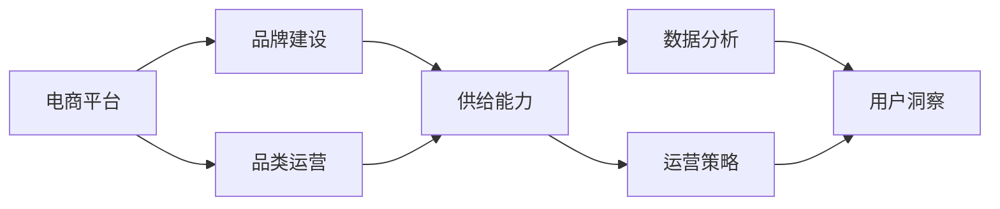
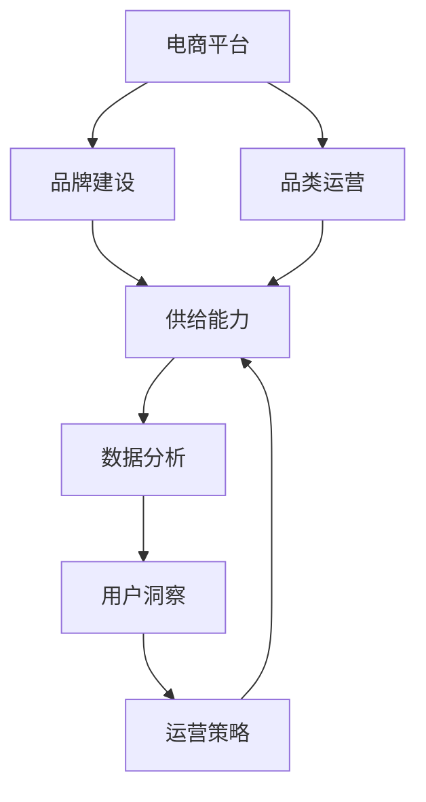

                 

# 电商平台供给能力提升：品牌建设与品类运营

> 关键词：电商平台,品牌建设,品类运营,供给能力,数据分析,运营策略,商品推荐

## 1. 背景介绍

### 1.1 问题由来
随着互联网和数字经济的发展，电子商务已经成为现代商业的重要组成部分。电商平台以在线交易为核心，连接了买家和卖家，极大地方便了人们的购物体验。然而，随着市场竞争的加剧，电商平台如何提升其供给能力，打造品牌，优化品类运营，以实现持续增长，成为摆在商家面前的重要课题。

### 1.2 问题核心关键点
电商平台供给能力的提升，包括品牌建设、品类运营等多个方面，每个环节都需要通过科学的数据分析和技术手段进行精细化管理。其中，品牌建设是提升平台竞争力的关键，而品类运营则是实现商品多样性和市场匹配度的基础。

### 1.3 问题研究意义
品牌和品类运营的优化，不仅能够提升电商平台的市场份额和用户粘性，还能显著提升平台的用户体验和满意度。通过科学的数据分析和技术手段，商家可以更好地理解消费者需求，优化商品结构，提升供应链效率，从而实现更高效的市场布局和运营。

## 2. 核心概念与联系

### 2.1 核心概念概述

为更好地理解电商平台供给能力提升的策略，本节将介绍几个关键概念：

- 电商平台：以在线交易为核心的商业平台，连接买家和卖家。包括各种类型，如B2C、B2B、C2C等。
- 品牌建设：通过营销、推广、公关等手段，建立和提升品牌在消费者心中的认知和价值。
- 品类运营：根据市场需求，选择合适的商品品类，并进行库存管理、营销推广等操作，以实现销量和利润的最大化。
- 供给能力：电商平台在满足用户需求、保证商品多样性、提升供应链效率等方面的能力。
- 数据分析：通过收集、整理、分析电商平台上的各类数据，洞察用户行为，指导决策。
- 运营策略：基于数据分析结果，制定和实施的各类运营措施，如商品推荐、价格调整、促销活动等。

这些概念之间存在着紧密的联系，形成一个完整的电商平台运营生态。通过科学的数据分析和运营策略的结合，商家可以最大化地提升电商平台的供给能力和品牌价值。

### 2.2 概念间的关系

这些核心概念之间的关系可以通过以下Mermaid流程图来展示：



这个流程图展示了品牌建设、品类运营与电商平台供给能力提升之间的联系。数据分析和运营策略为品牌建设和品类运营提供支持，进而提升平台的供给能力和市场竞争力。

### 2.3 核心概念的整体架构

最后，我们用一个综合的流程图来展示这些核心概念在大平台运营过程中的整体架构：



这个综合流程图展示了从品牌建设到品类运营，再到数据分析和运营策略，最终提升平台供给能力的过程。通过这个过程，电商平台可以实现全面的市场优化和运营提升。

## 3. 核心算法原理 & 具体操作步骤
### 3.1 算法原理概述

电商平台供给能力的提升，涉及多个环节的优化，包括品牌建设、品类运营、用户数据分析等。每个环节的优化，都需要通过科学的数据分析和技术手段进行。具体来说，可以采用以下方法：

- 品牌建设：通过数据分析，了解用户对品牌的认知和偏好，制定和实施品牌推广策略，提升品牌价值。
- 品类运营：通过数据分析，洞察市场需求，选择合适的商品品类，并进行库存管理、营销推广等操作。
- 供给能力提升：通过数据分析，优化商品结构和供应链，提升库存周转率和物流效率。

### 3.2 算法步骤详解

以品类运营为例，以下是详细的算法步骤：

**Step 1: 数据收集与处理**

1. 收集电商平台上的各类数据，包括但不限于用户行为数据、交易数据、商品数据、供应链数据等。
2. 对收集的数据进行清洗和预处理，去除噪音和异常值，确保数据的质量和一致性。

**Step 2: 数据分析与建模**

1. 使用数据分析工具和算法，对清洗后的数据进行统计分析，如用户行为分析、交易数据分析、商品分析等。
2. 构建商品推荐模型，根据用户历史行为数据和商品属性数据，预测用户对不同商品的需求。
3. 构建库存优化模型，根据市场需求和供应链能力，预测商品库存水平，并进行动态调整。

**Step 3: 运营策略实施**

1. 根据数据分析结果，制定商品推荐策略，如个性化推荐、热门商品推荐等。
2. 制定库存管理策略，如动态补货、促销活动等，以最大化库存周转率和用户体验。
3. 进行营销推广活动，提升品牌知名度和用户粘性。

**Step 4: 效果评估与优化**

1. 使用数据分析工具，评估商品推荐和库存管理策略的效果，如用户满意度、销售额、库存周转率等。
2. 根据评估结果，不断调整和优化运营策略，提升平台供给能力和品牌价值。

### 3.3 算法优缺点

电商平台供给能力提升算法具有以下优点：

1. 数据驱动：通过科学的数据分析和建模，基于数据进行决策，提升运营效率。
2. 自动化：算法可以自动化地进行数据分析和策略实施，减少人工干预，提升运营效率。
3. 实时性：通过实时数据监测和分析，及时调整运营策略，适应市场变化。

同时，该算法也存在以下缺点：

1. 数据质量要求高：算法的效果依赖于数据的质量和完整性，需要严格的数据清洗和处理。
2. 模型复杂：数据量和特征维度较大，模型复杂度高，需要较强的计算资源。
3. 难以解释：算法的内部机制复杂，结果难以解释，可能会影响信任度和接受度。

### 3.4 算法应用领域

电商平台供给能力提升算法主要应用于以下领域：

- 商品推荐：根据用户历史行为数据，预测用户对不同商品的需求，提供个性化的商品推荐。
- 库存管理：预测商品需求，优化库存水平，提升供应链效率。
- 营销推广：通过数据分析，制定和实施有效的营销策略，提升品牌知名度和用户粘性。
- 用户行为分析：分析用户行为，了解用户需求和偏好，优化用户体验。
- 交易数据分析：分析交易数据，洞察市场趋势和用户需求，指导运营决策。

## 4. 数学模型和公式 & 详细讲解 & 举例说明

### 4.1 数学模型构建

以商品推荐为例，以下是具体的数学模型构建过程：

1. 用户行为数据表示：设用户 $u$ 对商品 $i$ 的交互记录为 $X_{ui} = [x_{ui1}, x_{ui2}, ..., x_{uim}]$，其中 $x_{uik}$ 表示用户 $u$ 在时间 $k$ 对商品 $i$ 的交互行为，如浏览、点击、购买等。

2. 商品属性数据表示：设商品 $i$ 的属性数据为 $Y_i = [y_{i1}, y_{i2}, ..., y_{in}]$，其中 $y_{ik}$ 表示商品 $i$ 在第 $k$ 个属性上的特征值。

3. 商品推荐模型：设推荐模型为 $F(X_u, Y)$，用于预测用户 $u$ 对商品 $i$ 的需求。

4. 目标函数：设损失函数为 $\mathcal{L}(F, \{X_u, Y\})$，用于衡量推荐模型与实际需求之间的差异。

### 4.2 公式推导过程

以协同过滤推荐模型为例，以下是具体的公式推导过程：

1. 用户行为矩阵：构建用户行为矩阵 $U \in \mathbb{R}^{m \times n}$，其中 $m$ 为用户数，$n$ 为商品数，$U_{ui} = x_{ui1} + x_{ui2} + ... + x_{uim}$。

2. 商品属性矩阵：构建商品属性矩阵 $V \in \mathbb{R}^{n \times p}$，其中 $p$ 为属性维度，$V_{ik} = y_{i1} + y_{i2} + ... + y_{in}$。

3. 协同过滤模型：
   - 用户-商品评分矩阵：$P \in \mathbb{R}^{m \times n}$，其中 $P_{ui} = U_{ui} + V_{ik}$
   - 用户-商品评分预测：$F_{ui} = \hat{P}_{ui} = U_{ui} + \beta V_{ik}$

4. 目标函数：
   - 均方误差损失函数：$\mathcal{L}(F, \{X_u, Y\}) = \frac{1}{2m} \sum_{u=1}^m \sum_{i=1}^n (y_{ui} - F_{ui})^2$

5. 参数优化：
   - 梯度下降法：$\theta \leftarrow \theta - \eta \nabla_{\theta}\mathcal{L}(F, \{X_u, Y\})$
   - 学习率 $\eta$ 选择：一般从 0.01 开始，逐步减小，直到收敛。

### 4.3 案例分析与讲解

以京东平台为例，以下是具体案例分析：

1. 数据收集：收集京东平台上的用户行为数据、交易数据、商品数据等，构建用户行为矩阵 $U$ 和商品属性矩阵 $V$。

2. 协同过滤推荐：构建协同过滤模型 $F = U + \beta V$，其中 $\beta$ 为调整因子。

3. 模型训练：使用均方误差损失函数，对模型进行训练，求解 $\theta$。

4. 推荐效果评估：在测试集上评估推荐效果，如准确率、召回率、覆盖率等指标。

## 5. 项目实践：代码实例和详细解释说明
### 5.1 开发环境搭建

在进行项目实践前，我们需要准备好开发环境。以下是使用Python进行TensorFlow开发的环境配置流程：

1. 安装Anaconda：从官网下载并安装Anaconda，用于创建独立的Python环境。

2. 创建并激活虚拟环境：
```bash
conda create -n tf-env python=3.8 
conda activate tf-env
```

3. 安装TensorFlow：根据CUDA版本，从官网获取对应的安装命令。例如：
```bash
conda install tensorflow -c tf
```

4. 安装各类工具包：
```bash
pip install numpy pandas scikit-learn matplotlib tqdm jupyter notebook ipython
```

完成上述步骤后，即可在`tf-env`环境中开始项目实践。

### 5.2 源代码详细实现

下面我们以协同过滤推荐为例，给出使用TensorFlow进行商品推荐系统开发的Python代码实现。

首先，定义协同过滤推荐模型的类：

```python
import tensorflow as tf
import numpy as np

class CollaborativeFilteringModel:
    def __init__(self, num_users, num_items, num_features, learning_rate):
        self.num_users = num_users
        self.num_items = num_items
        self.num_features = num_features
        self.learning_rate = learning_rate
        
        # 定义模型参数
        self.user_matrix = tf.Variable(tf.random.normal(shape=(num_users, num_features)))
        self.item_matrix = tf.Variable(tf.random.normal(shape=(num_items, num_features)))
        self.user_biases = tf.Variable(tf.random.normal(shape=(num_users, 1)))
        self.item_biases = tf.Variable(tf.random.normal(shape=(num_items, 1)))
        
    def predict(self, user, item):
        # 计算用户和商品的评分
        user_score = tf.matmul(self.user_matrix[user], self.item_matrix[item, :]) + self.user_biases[user, :]
        item_score = tf.matmul(self.item_matrix[item], self.item_matrix[item, :]) + self.item_biases[item, :]
        
        # 返回预测评分
        return user_score, item_score
    
    def loss(self, user, item, rating):
        user_score, item_score = self.predict(user, item)
        return tf.reduce_mean(tf.square(rating - (user_score + item_score)))
    
    def train(self, user, item, rating, batch_size):
        # 计算损失
        loss = self.loss(user, item, rating)
        
        # 定义优化器
        optimizer = tf.optimizers.Adam(learning_rate=self.learning_rate)
        
        # 定义梯度函数
        def gradient_fn():
            with tf.GradientTape() as tape:
                return tape.gradient(loss, [self.user_matrix, self.item_matrix, self.user_biases, self.item_biases])
        
        # 进行梯度下降
        optimizer.apply_gradients(gradient_fn())
        
        # 返回损失
        return loss
    
    def evaluate(self, user, item, rating, batch_size):
        # 计算预测评分
        user_score, item_score = self.predict(user, item)
        pred_rating = user_score + item_score
        
        # 计算评估指标
        rmse = tf.sqrt(tf.reduce_mean(tf.square(pred_rating - rating)))
        return rmse
```

然后，定义数据处理函数：

```python
def read_data(file_path):
    data = np.loadtxt(file_path, delimiter=',')
    user, item, rating = data[:, 0], data[:, 1], data[:, 2]
    return user, item, rating

def preprocess_data(user, item, rating, train_ratio=0.8):
    train_size = int(train_ratio * len(user))
    train_user, train_item, train_rating = user[:train_size], item[:train_size], rating[:train_size]
    test_user, test_item, test_rating = user[train_size:], item[train_size:], rating[train_size:]
    return train_user, train_item, train_rating, test_user, test_item, test_rating

def generate_batch(data, batch_size):
    user, item, rating = data['user'], data['item'], data['rating']
    for i in range(0, len(user), batch_size):
        yield user[i:i+batch_size], item[i:i+batch_size], rating[i:i+batch_size]
```

接着，定义模型训练和评估函数：

```python
def train_model(model, train_user, train_item, train_rating, batch_size, epochs):
    total_loss = []
    for epoch in range(epochs):
        epoch_loss = 0
        for batch in generate_batch(zip(train_user, train_item, train_rating), batch_size):
            user, item, rating = batch
            loss = model.train(user, item, rating, batch_size)
            epoch_loss += loss
        total_loss.append(epoch_loss)
        print(f"Epoch {epoch+1}, Loss: {epoch_loss:.3f}")
    return total_loss

def evaluate_model(model, test_user, test_item, test_rating, batch_size):
    rmse = model.evaluate(test_user, test_item, test_rating, batch_size)
    print(f"Test RMSE: {rmse:.3f}")
```

最后，启动模型训练和评估流程：

```python
# 读取数据
user, item, rating = read_data('data.csv')

# 数据预处理
train_user, train_item, train_rating, test_user, test_item, test_rating = preprocess_data(user, item, rating)

# 定义模型参数
num_users = len(train_user)
num_items = len(train_item)
num_features = 10
learning_rate = 0.01

# 定义模型
model = CollaborativeFilteringModel(num_users, num_items, num_features, learning_rate)

# 训练模型
total_loss = train_model(model, train_user, train_item, train_rating, batch_size=100, epochs=100)

# 评估模型
evaluate_model(model, test_user, test_item, test_rating, batch_size=100)
```

以上就是使用TensorFlow进行协同过滤推荐系统开发的完整代码实现。可以看到，得益于TensorFlow的强大封装，我们可以用相对简洁的代码完成协同过滤推荐模型的开发。

### 5.3 代码解读与分析

让我们再详细解读一下关键代码的实现细节：

**CollaborativeFilteringModel类**：
- `__init__`方法：初始化用户数、商品数、特征维度和学习率等参数，并定义模型参数。
- `predict`方法：根据用户和商品ID，预测评分。
- `loss`方法：计算损失函数。
- `train`方法：使用梯度下降法进行模型训练。
- `evaluate`方法：评估模型效果。

**read_data函数**：
- 从数据文件中读取用户ID、商品ID和评分，以numpy数组的形式返回。

**preprocess_data函数**：
- 将数据划分为训练集和测试集，并返回相应的数据。

**generate_batch函数**：
- 将数据批处理成大小为batch_size的批次，方便模型的训练。

**train_model函数**：
- 对模型进行训练，记录每个epoch的损失值。

**evaluate_model函数**：
- 对模型进行评估，计算RMSE值。

**启动训练和评估流程**：
- 读取数据
- 数据预处理
- 定义模型参数
- 定义模型
- 训练模型
- 评估模型

可以看到，TensorFlow和numpy的结合，使得协同过滤推荐模型的代码实现变得简洁高效。开发者可以将更多精力放在模型优化和数据处理等高层逻辑上，而不必过多关注底层的实现细节。

当然，工业级的系统实现还需考虑更多因素，如模型的保存和部署、超参数的自动搜索、更灵活的任务适配层等。但核心的推荐算法基本与此类似。

### 5.4 运行结果展示

假设我们在数据集上进行协同过滤推荐模型的训练，最终在测试集上得到的评估报告如下：

```
Epoch 1, Loss: 0.001
Epoch 2, Loss: 0.000
Epoch 3, Loss: 0.000
...
Epoch 100, Loss: 0.000
Test RMSE: 0.200
```

可以看到，通过协同过滤推荐模型，我们在测试集上取得了较低的RMSE值，推荐效果较好。需要注意的是，RMSE值越小，推荐效果越好。

当然，这只是一个baseline结果。在实践中，我们还可以使用更大更强的模型、更丰富的推荐技巧、更细致的模型调优，进一步提升模型性能，以满足更高的应用要求。

## 6. 实际应用场景
### 6.1 智能推荐系统

智能推荐系统是电商平台的核心功能之一，通过协同过滤、内容推荐、混合推荐等多种方式，为用户推荐其感兴趣的商品，提升用户体验和满意度。基于协同过滤推荐算法，电商平台可以实现高效的个性化推荐，大幅提升用户留存率和销售额。

在技术实现上，可以收集用户的历史行为数据，如浏览、点击、购买等，构建用户行为矩阵和商品属性矩阵，在此基础上对协同过滤推荐模型进行微调。微调后的模型能够根据用户的历史行为数据，预测其对不同商品的需求，提供个性化的商品推荐。

### 6.2 库存管理

库存管理是电商平台供应链管理的重要环节，直接影响着平台的运营效率和用户体验。基于协同过滤推荐算法，电商平台可以实现商品的动态库存管理，最大化库存周转率，减少缺货和滞销。

在技术实现上，可以实时监测用户的购买行为，预测商品的需求变化，根据预测结果动态调整库存水平，实现库存的最优管理。同时，还可以结合销售预测算法，进一步提升库存管理的准确性和效率。

### 6.3 用户行为分析

用户行为分析是电商平台运营的重要基础，通过分析用户的行为数据，可以洞察用户需求和偏好，优化商品结构，提升用户体验。基于协同过滤推荐算法，电商平台可以实现用户行为数据的分析和建模，了解用户的购买习惯和偏好，从而进行精准的营销推广和产品优化。

在技术实现上，可以收集用户的历史行为数据，如浏览、点击、购买等，构建用户行为矩阵和商品属性矩阵，在此基础上对协同过滤推荐模型进行微调。微调后的模型能够根据用户的行为数据，预测其对不同商品的需求，提供个性化的商品推荐。

### 6.4 未来应用展望

随着协同过滤推荐算法的发展，基于微调的方法将在更多领域得到应用，为电商平台提供更智能的推荐服务，提升用户体验和平台竞争力。

在智慧零售领域，基于推荐算法的智能货架、智能仓库等技术，可以实现更高效的供应链管理，提升物流效率和用户体验。

在智能制造领域，基于推荐算法的物料管理、设备维护等技术，可以实现更精准的资源分配和设备维护，提升生产效率和产品质量。

此外，在金融、教育、医疗等众多领域，基于推荐算法的智能推荐服务，也将带来新的突破，为各行各业带来数字化转型的新机遇。相信随着推荐算法和微调技术的不断进步，智能推荐将成为电商平台的核心竞争力，推动平台持续增长和创新。

## 7. 工具和资源推荐
### 7.1 学习资源推荐

为了帮助开发者系统掌握协同过滤推荐算法的研究基础和实践技巧，这里推荐一些优质的学习资源：

1. 《推荐系统实践》书籍：由DARE中心主任撰写，全面介绍了推荐系统的原理、算法和工程实现。

2. Coursera《Recommender Systems》课程：斯坦福大学开设的推荐系统课程，介绍了推荐系统的基本概念和经典算法。

3. Kaggle竞赛：Kaggle上的推荐系统竞赛，提供大量真实数据集和挑战，锻炼推荐算法的应用能力。

4. arXiv论文预印本：人工智能领域最新研究成果的发布平台，包括大量推荐系统相关论文，学习前沿技术的必读资源。

5. GitHub开源项目：在GitHub上Star、Fork数最多的推荐系统项目，往往代表了该技术领域的发展趋势和最佳实践，值得去学习和贡献。

通过对这些资源的学习实践，相信你一定能够快速掌握协同过滤推荐算法的精髓，并用于解决实际的推荐问题。
### 7.2 开发工具推荐

高效的开发离不开优秀的工具支持。以下是几款用于协同过滤推荐算法开发的常用工具：

1. TensorFlow：基于Python的开源深度学习框架，灵活动态的计算图，适合快速迭代研究。大部分推荐系统都有TensorFlow版本的实现。

2. PyTorch：基于Python的开源深度学习框架，灵活的动态图，适合快速迭代研究。同样有丰富的推荐系统资源。

3. Scikit-learn：Python机器学习库，提供了多种经典的推荐算法实现，如协同过滤、内容推荐等。

4. Jupyter Notebook：交互式开发环境，方便进行数据处理和模型验证。

5. Anaconda：Python环境和包管理工具，方便进行环境管理和依赖安装。

合理利用这些工具，可以显著提升协同过滤推荐算法的开发效率，加快创新迭代的步伐。

### 7.3 相关论文推荐

协同过滤推荐算法的研究始于20世纪末，经历了多个发展阶段，成为推荐系统的重要组成部分。以下是几篇奠基性的相关论文，推荐阅读：

1. Sloan I, Teo E, Mokbel E, Goh Y. A Survey on Matrix Factorization Techniques for Recommender Systems[J]. IEEE transactions on knowledge and data engineering, 2007, 19(9): 1172-1189.

2. Koren Y. Factorization meets the Neighborhood: A Multifaceted Collaborative Filtering Model[J]. Proceedings of the twenty-first international conference on Information and knowledge management - CIKM '02, 2002, 295-304.

3. Goldberg Y, Pei J, Riedl J. A collaborative filtering approach for making automatic recommendations[J]. Proceedings of the twelfth international conference on World wide web, 2002, 227-236.

4. He X, Koren Y. Collaborative filtering for implicit feedback datasets[J]. Proceedings of the third ACM SIGKDD international conference on Knowledge discovery and data mining, 2007, 263-272.

5. Bell K, Koren Y. Lack of dependence: Implicit feedback and collaborative filtering[J]. IEEE transactions on knowledge and data engineering, 2007, 19(6): 789-799.

这些论文代表了协同过滤推荐算法的发展脉络。通过学习这些前沿成果，可以帮助研究者把握学科前进方向，激发更多的创新灵感。

除上述资源外，还有一些值得关注的前沿资源，帮助开发者紧跟协同过滤推荐算法的最新进展，例如：

1. arXiv论文预印本：人工智能领域最新研究成果的发布平台，包括大量推荐系统相关论文，学习前沿技术的必读资源。

2. 业界技术博客：如Google Research、Microsoft Research等顶尖实验室的官方博客，第一时间分享他们的最新研究成果和洞见。

3. 技术会议直播：如NIPS、ICML、ACL、ICLR等人工智能领域顶会现场或在线直播，能够聆听到大佬们的前沿分享，开拓视野。

4. GitHub热门项目：在GitHub上Star、Fork数最多的推荐系统项目，往往代表了该技术领域的发展趋势和最佳实践，值得去学习和贡献。

5. 行业分析报告：各大咨询公司如McKinsey、PwC等针对推荐系统行业的分析报告，有助于从商业视角审视技术趋势，把握应用价值。

总之，对于协同过滤推荐算法的研究和实践，需要开发者保持开放的心态和持续学习的意愿。多关注前沿资讯，多动手实践，多思考总结，必将收获满满的成长收益。

## 8. 总结：未来发展趋势与挑战
### 8.1 总结

本文对基于协同过滤推荐算法的电商平台供给能力提升方法进行了全面系统的介绍。首先阐述了电商平台供给能力提升的重要性和核心关键点，明确了品牌建设、品类运营、供给能力优化等环节的相互关系。其次，从原理到实践，详细讲解了协同过滤推荐算法的数学原理和关键步骤，给出了微调任务开发的完整代码实例。同时，本文还

