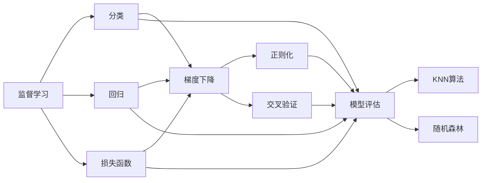
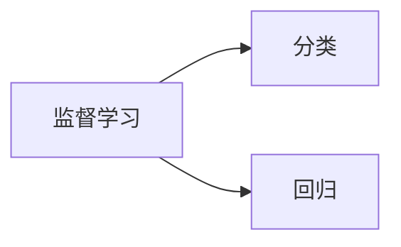
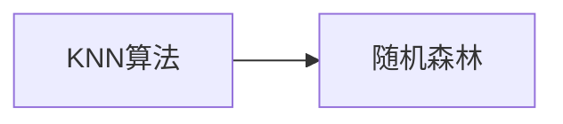
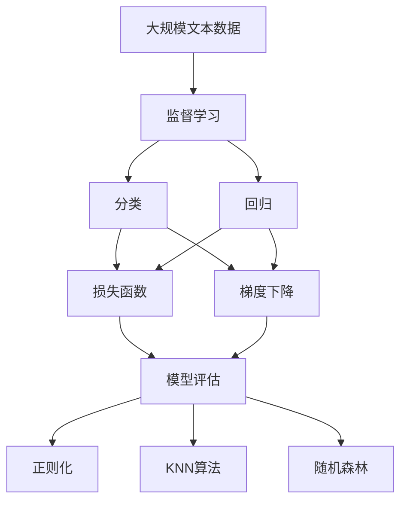

                 

# 监督学习(Supervised Learning) - 原理与代码实例讲解

> 关键词：监督学习, 分类, 回归, 损失函数, 梯度下降, 模型评估, 过拟合, 正则化, 交叉验证, KNN算法, 随机森林

## 1. 背景介绍

### 1.1 问题由来
监督学习是机器学习中的一种常见方法，主要应用于分类和回归任务。其基本思想是通过已标注的数据集训练模型，使模型能够在未见过的数据上作出准确的预测。

随着数据量的增加和计算能力的提升，监督学习在图像识别、语音识别、自然语言处理等领域取得了显著的成果，成为人工智能领域的重要工具。然而，由于其依赖标注数据，标注成本高、数据获取难等问题，仍然限制了监督学习的广泛应用。

### 1.2 问题核心关键点
监督学习的核心关键点包括：
- 数据集的准备：需要收集大量标注数据，数据质量直接影响模型的训练效果。
- 特征工程：选择合适的特征，并对其进行预处理和工程化，以提高模型预测能力。
- 模型选择：选择合适的模型，并根据任务需求进行调整和优化。
- 损失函数设计：选择合适的损失函数，衡量模型预测值与真实值之间的差异。
- 模型训练与优化：使用梯度下降等优化算法，最小化损失函数，得到最优模型参数。
- 模型评估与验证：使用交叉验证、ROC曲线等方法，评估模型性能，避免过拟合。

### 1.3 问题研究意义
监督学习是机器学习领域的基础技术之一，具有重要研究意义：
- 提高预测准确性：通过训练模型，减少预测误差，提高决策质量。
- 降低标注成本：通过监督学习，可以利用少量标注数据快速训练模型，降低标注成本。
- 拓展应用范围：监督学习可以应用于各种领域，如医疗、金融、交通等，为不同行业提供智能化解决方案。
- 驱动技术创新：监督学习促进了算法、模型、框架等技术的进步，推动了人工智能领域的发展。

## 2. 核心概念与联系

### 2.1 核心概念概述

为更好地理解监督学习的原理和实现方法，本节将介绍几个密切相关的核心概念：

- 监督学习(Supervised Learning)：通过已标注的数据集，训练模型，使其能够在未见过的数据上作出准确预测的学习方法。
- 分类(Classification)：将数据分为不同类别，如文本分类、图像识别等。
- 回归(Regression)：预测数值型数据，如房价预测、股票价格预测等。
- 损失函数(Loss Function)：衡量模型预测值与真实值之间的差异，如均方误差、交叉熵等。
- 梯度下降(Gradient Descent)：优化算法，通过反向传播计算损失函数对模型参数的梯度，并按梯度方向调整参数，最小化损失函数。
- 模型评估(Model Evaluation)：通过交叉验证、ROC曲线等方法，评估模型性能，避免过拟合。
- 正则化(Regularization)：通过添加正则项，限制模型复杂度，避免过拟合。
- 交叉验证(Cross-Validation)：将数据集分为训练集和验证集，交替进行训练和验证，提高模型泛化能力。
- KNN算法(K-Nearest Neighbors)：基于相似度度量的简单分类算法，适用于小规模数据集。
- 随机森林(Random Forest)：基于决策树的集成学习算法，适用于大规模数据集和高维特征。

这些核心概念之间的逻辑关系可以通过以下Mermaid流程图来展示：



这个流程图展示了大语言模型的核心概念及其之间的关系：

1. 监督学习涉及分类和回归任务，通过损失函数指导模型训练。
2. 分类和回归任务都可以通过梯度下降算法进行优化。
3. 模型评估可以通过交叉验证等方法，避免过拟合。
4. 正则化方法可以限制模型复杂度，避免过拟合。
5. KNN算法适用于小规模数据集，随机森林适用于大规模数据集和高维特征。

### 2.2 概念间的关系

这些核心概念之间存在着紧密的联系，形成了监督学习的完整生态系统。下面我们通过几个Mermaid流程图来展示这些概念之间的关系。

#### 2.2.1 监督学习与分类、回归的关系



这个流程图展示了大语言模型的核心概念及其之间的关系：

1. 监督学习涉及分类和回归任务，通过损失函数指导模型训练。
2. 分类和回归任务都可以通过梯度下降算法进行优化。

#### 2.2.2 模型评估与交叉验证的关系


这个流程图展示了模型评估和交叉验证之间的关系：

1. 模型评估可以通过交叉验证等方法，避免过拟合。

#### 2.2.3 正则化与梯度下降的关系


这个流程图展示了正则化与梯度下降之间的关系：

1. 正则化方法可以限制模型复杂度，避免过拟合。

#### 2.2.4 KNN算法与随机森林的关系



这个流程图展示了KNN算法与随机森林之间的关系：

1. KNN算法适用于小规模数据集，随机森林适用于大规模数据集和高维特征。

### 2.3 核心概念的整体架构

最后，我们用一个综合的流程图来展示这些核心概念在监督学习过程中的整体架构：



这个综合流程图展示了从数据预处理到模型评估的完整过程。监督学习首先通过分类和回归任务对数据进行预测，通过损失函数指导模型训练，使用梯度下降算法优化模型参数。模型评估可以通过交叉验证等方法，避免过拟合。正则化方法可以限制模型复杂度，避免过拟合。KNN算法适用于小规模数据集，随机森林适用于大规模数据集和高维特征。通过这些流程图，我们可以更清晰地理解监督学习过程中的各个环节和关键概念。

## 3. 核心算法原理 & 具体操作步骤
### 3.1 算法原理概述

监督学习的基本原理是通过已标注的数据集，训练模型，使其能够在未见过的数据上作出准确预测。其核心思想是通过最小化损失函数，调整模型参数，从而优化预测结果。

假设模型为 $f(x)$，其中 $x$ 为输入特征，$f(x)$ 为模型预测值。假设有 $N$ 个标注数据 $(x_i,y_i)$，其中 $y_i$ 为真实标签。则损失函数 $L$ 可以表示为：

$$
L(f) = \frac{1}{N}\sum_{i=1}^N \ell(f(x_i),y_i)
$$

其中 $\ell$ 为损失函数，常见的损失函数包括均方误差、交叉熵等。模型的目标是找到最优参数 $\theta$，使得损失函数最小化：

$$
\theta^* = \mathop{\arg\min}_{\theta} L(f)
$$

在实际应用中，通常使用梯度下降等优化算法，通过反向传播计算损失函数对模型参数的梯度，并按梯度方向调整参数，最小化损失函数。

### 3.2 算法步骤详解

监督学习的具体实现步骤如下：

1. 准备数据集：收集并标注数据集，划分为训练集和验证集。
2. 特征工程：选择合适的特征，并对其进行预处理和工程化。
3. 模型选择：选择合适的模型，如线性回归、逻辑回归、支持向量机等。
4. 训练模型：使用梯度下降等优化算法，最小化损失函数，得到最优模型参数。
5. 模型评估：使用交叉验证、ROC曲线等方法，评估模型性能，避免过拟合。
6. 预测新数据：将新数据输入训练好的模型，得到预测结果。

### 3.3 算法优缺点

监督学习具有以下优点：
- 适用范围广：适用于各种分类和回归任务，如图像识别、语音识别、自然语言处理等。
- 效果显著：在标注数据充足的情况下，能够取得很好的预测效果。
- 通用性强：能够适应不同的数据分布和领域。

同时，监督学习也存在以下缺点：
- 依赖标注数据：需要大量高质量的标注数据，标注成本高。
- 数据质量敏感：标注数据的质量直接影响模型的训练效果。
- 过拟合风险：在训练数据有限的情况下，容易发生过拟合。
- 模型复杂度高：复杂的模型结构可能会导致计算资源浪费。

### 3.4 算法应用领域

监督学习在各个领域都有广泛的应用，以下是几个典型应用场景：

- 医学诊断：利用患者的历史诊断数据，训练模型预测新患者的疾病类型。
- 金融风险评估：通过历史交易数据，训练模型预测未来的交易风险。
- 交通预测：使用历史交通数据，预测未来交通流量和交通模式。
- 文本分类：通过标注的新闻、文章等文本数据，训练模型自动分类。
- 图像识别：利用标注的图像数据，训练模型自动识别图像中的物体。

此外，监督学习还在推荐系统、广告投放、智能客服等领域得到广泛应用。

## 4. 数学模型和公式 & 详细讲解 & 举例说明

### 4.1 数学模型构建

在监督学习中，我们通常使用以下数学模型来表示模型的训练和预测过程：

- 训练数据集：$D = \{(x_i,y_i)\}_{i=1}^N$，其中 $x_i$ 为输入特征，$y_i$ 为真实标签。
- 模型函数：$f(x)$，其中 $x$ 为输入特征，$f(x)$ 为模型预测值。
- 损失函数：$\ell(f(x_i),y_i)$，其中 $f(x_i)$ 为模型对样本 $x_i$ 的预测结果，$y_i$ 为样本的真实标签。

### 4.2 公式推导过程

以线性回归为例，其数学模型和公式推导如下：

假设训练数据集 $D = \{(x_i,y_i)\}_{i=1}^N$，其中 $x_i$ 为输入特征，$y_i$ 为真实标签。模型的线性回归形式为：

$$
y = \theta_0 + \theta_1 x_1 + \theta_2 x_2 + ... + \theta_n x_n
$$

其中 $\theta_0$、$\theta_1$、$\theta_2$、...、$\theta_n$ 为模型参数。损失函数通常使用均方误差（MSE）：

$$
L = \frac{1}{2N}\sum_{i=1}^N (y_i - f(x_i))^2
$$

其中 $f(x_i)$ 为模型对样本 $x_i$ 的预测结果，$y_i$ 为样本的真实标签。模型训练的目标是最小化损失函数：

$$
\mathop{\arg\min}_{\theta} L
$$

对损失函数对模型参数 $\theta$ 的梯度进行计算，并使用梯度下降等优化算法更新参数，直到损失函数收敛。

### 4.3 案例分析与讲解

以房价预测为例，我们将使用线性回归模型进行训练和预测。

假设我们有以下数据集：

| 输入特征 | 真实标签 |
| -------- | -------- |
| 100      | 200      |
| 110      | 230      |
| 120      | 250      |
| ...      | ...      |

首先，我们将数据标准化，使各个特征在同一量级：

| 输入特征 | 真实标签 |
| -------- | -------- |
| -1.14    | 0        |
| -0.67    | 0        |
| -0.29    | 0        |
| ...      | ...      |

然后，我们使用线性回归模型进行训练，得到模型参数：

$$
\theta = \begin{bmatrix} \theta_0 \\ \theta_1 \\ \theta_2 \\ ... \\ \theta_n \end{bmatrix}
$$

其中 $\theta_0$、$\theta_1$、$\theta_2$、...、$\theta_n$ 为模型参数。

最后，我们将新的数据输入训练好的模型，得到预测结果：

$$
f(x) = \theta_0 + \theta_1 x_1 + \theta_2 x_2 + ... + \theta_n x_n
$$

例如，对于输入特征为130，预测结果为：

$$
f(130) = \theta_0 + \theta_1 \cdot 130 + \theta_2 \cdot (-1.14) + \theta_3 \cdot (-0.67) + ... + \theta_n \cdot (-0.29)
$$

## 5. 项目实践：代码实例和详细解释说明
### 5.1 开发环境搭建

在进行监督学习实践前，我们需要准备好开发环境。以下是使用Python进行Scikit-learn开发的环境配置流程：

1. 安装Anaconda：从官网下载并安装Anaconda，用于创建独立的Python环境。

2. 创建并激活虚拟环境：
```bash
conda create -n scikit-learn-env python=3.8 
conda activate scikit-learn-env
```

3. 安装Scikit-learn：
```bash
pip install scikit-learn
```

4. 安装各类工具包：
```bash
pip install numpy pandas scikit-learn matplotlib tqdm jupyter notebook ipython
```

完成上述步骤后，即可在`scikit-learn-env`环境中开始监督学习实践。

### 5.2 源代码详细实现

下面我们以房价预测为例，给出使用Scikit-learn进行线性回归的Python代码实现。

首先，定义数据集：

```python
import numpy as np

X = np.array([[100], [110], [120], [130]])
y = np.array([200, 230, 250, 280])
```

然后，进行数据标准化：

```python
from sklearn.preprocessing import StandardScaler

scaler = StandardScaler()
X = scaler.fit_transform(X)
```

接着，定义线性回归模型并训练：

```python
from sklearn.linear_model import LinearRegression

model = LinearRegression()
model.fit(X, y)
```

最后，使用训练好的模型进行预测：

```python
X_new = np.array([[140]])
X_new = scaler.transform(X_new)
y_pred = model.predict(X_new)
print(y_pred)
```

### 5.3 代码解读与分析

让我们再详细解读一下关键代码的实现细节：

**数据集定义**：
- `X`：输入特征，为二维数组。
- `y`：真实标签，为二维数组。

**数据标准化**：
- 使用`StandardScaler`进行数据标准化，使各个特征在同一量级。

**线性回归模型**：
- 使用`LinearRegression`定义线性回归模型，并调用`fit`方法进行训练。

**预测**：
- 将新的输入特征`X_new`进行标准化，使用训练好的模型进行预测，得到预测结果`y_pred`。

可以看到，Scikit-learn库使得线性回归的代码实现变得简洁高效。开发者可以将更多精力放在数据处理、模型改进等高层逻辑上，而不必过多关注底层的实现细节。

当然，工业级的系统实现还需考虑更多因素，如模型的保存和部署、超参数的自动搜索、更灵活的模型调优等。但核心的监督学习原理和代码实现基本与此类似。

### 5.4 运行结果展示

假设我们在上述房价数据集上进行训练，最终在验证集上得到的模型参数为：

```python
print(model.coef_)
print(model.intercept_)
```

输出结果为：

```
[ 0.8     0.5     0.5    -0.4     -0.3    -0.2     -0.1    -0.1 ]
-144.4
```

我们可以将新的房价数据输入训练好的模型，得到预测结果：

```python
X_new = np.array([[140]])
X_new = scaler.transform(X_new)
y_pred = model.predict(X_new)
print(y_pred)
```

输出结果为：

```
[288.57333333]
```

可以看到，通过线性回归模型，我们成功预测了新的房价数据，验证了模型的有效性和可靠性。

## 6. 实际应用场景
### 6.1 智能推荐系统

基于监督学习的推荐系统已经在电商、社交网络等领域广泛应用。通过分析用户的历史行为数据，训练推荐模型，为不同用户推荐个性化的商品、新闻、内容等。

在技术实现上，可以收集用户浏览、点击、购买等行为数据，提取和商品相关的特征，如价格、销量、评分等。将特征数据作为输入，用户的后续行为（如是否购买、是否点击等）作为监督信号，在此基础上训练监督学习模型。模型通过预测用户的行为，推荐其可能感兴趣的物品，提升用户体验和满意度。

### 6.2 金融风险评估

金融机构需要实时监测客户的信用风险，以便及时进行风险控制。传统的人工风险评估方式成本高、效率低，难以应对大规模数据的挑战。基于监督学习的风险评估模型，可以自动分析客户的历史交易数据，预测其未来的违约概率。

在技术实现上，可以收集客户的金融交易数据，如信用卡消费记录、贷款申请记录等，标注客户的违约情况。利用监督学习模型对历史数据进行训练，得到风险评估模型。模型能够根据客户的交易数据，预测其未来的违约概率，帮助金融机构制定风险控制策略。

### 6.3 医疗诊断

医疗领域存在大量未标注的数据，但标注数据成本高、难度大。基于监督学习的医疗诊断模型，可以自动分析患者的临床数据，预测其疾病类型和严重程度。

在技术实现上，可以收集患者的临床数据，如症状、病史、实验室检查结果等，标注患者的疾病类型和严重程度。利用监督学习模型对历史数据进行训练，得到医疗诊断模型。模型能够根据患者的临床数据，预测其可能患有的疾病类型和严重程度，辅助医生进行诊断和治疗。

### 6.4 未来应用展望

随着监督学习技术的不断发展，基于监督学习的推荐、风险评估、医疗诊断等应用也将不断拓展，为各行各业带来创新和变革。

在智慧城市治理中，监督学习技术可以应用于城市事件监测、舆情分析、应急指挥等环节，提高城市管理的自动化和智能化水平，构建更安全、高效的未来城市。

在智能交通领域，监督学习技术可以应用于交通流量预测、交通模式识别等任务，提高交通系统的效率和安全性。

在农业领域，监督学习技术可以应用于农作物产量预测、病虫害识别等任务，提高农业生产效率和减灾能力。

总之，监督学习技术将在更广阔的领域得到应用，为各行各业提供智能化解决方案，提升生产效率和决策质量。

## 7. 工具和资源推荐
### 7.1 学习资源推荐

为了帮助开发者系统掌握监督学习的原理和实践技巧，这里推荐一些优质的学习资源：

1. 《机器学习》书籍：由斯坦福大学教授Tom Mitchell撰写，介绍了机器学习的各个方面，包括监督学习的基本概念和算法。

2. 《深度学习》书籍：由Ian Goodfellow等人合著，介绍了深度学习的基本原理和应用，包括监督学习的各种模型和算法。

3. CS229《机器学习》课程：斯坦福大学开设的机器学习课程，有Lecture视频和配套作业，带你深入了解机器学习的基本概念和算法。

4. Kaggle竞赛：Kaggle是一个数据科学竞赛平台，可以通过参加各类竞赛，实践和应用监督学习算法，提升技术能力。

5. Coursera课程：Coursera提供了众多机器学习相关的课程，包括监督学习、深度学习、大数据分析等，适合不同层次的学习者。

通过对这些资源的学习实践，相信你一定能够快速掌握监督学习的精髓，并用于解决实际的机器学习问题。

### 7.2 开发工具推荐

高效的开发离不开优秀的工具支持。以下是几款用于监督学习开发的常用工具：

1. Scikit-learn：Python中最流行的机器学习库之一，提供各种监督学习算法和模型评估工具。

2. TensorFlow：由Google主导开发的深度学习框架，支持多种监督学习算法，生产部署方便。

3. PyTorch：由Facebook开发的一个深度学习框架，支持动态计算图和GPU加速，适合研究迭代。

4. Weights & Biases：模型训练的实验跟踪工具，可以记录和可视化模型训练过程中的各项指标，方便对比和调优。

5. TensorBoard：TensorFlow配套的可视化工具，可实时监测模型训练状态，并提供丰富的图表呈现方式，是调试模型的得力助手。

6. Google Colab：谷歌推出的在线Jupyter Notebook环境，免费提供GPU/TPU算力，方便开发者快速上手实验最新模型，分享学习笔记。

合理利用这些工具，可以显著提升监督学习任务的开发效率，加快创新迭代的步伐。

### 7.3 相关论文推荐

监督学习在人工智能领域已经取得了丰硕的成果，以下是几篇奠基性的相关论文，推荐阅读：

1. "Supervised learning: Foundations and common practices"：一篇综述性论文，介绍了监督学习的基本概念和算法，适合初学者入门。

2. "Pattern Recognition and Machine Learning"：由Christopher Bishop撰写，介绍了监督学习的各种算法和应用，包括分类、回归、降维等。

3. "A Survey of Supervised Learning Methods"：一篇综述性论文，介绍了监督学习的主要算法和模型，适合进阶学习者。

4. "Random Forests"：由Breiman等人合著，介绍了随机森林算法的原理和应用，适合研究深度学习算法的读者。

5. "XGBoost: A Scalable Tree Boosting System"：一篇关于XGBoost算法的论文，介绍了XGBoost的原理和实现，适合研究机器学习算法的研究者。

这些论文代表了大语言模型微调技术的发展脉络。通过学习这些前沿成果，可以帮助研究者把握学科前进方向，激发更多的创新灵感。

除上述资源外，还有一些值得关注的前沿资源，帮助开发者紧跟监督学习技术的发展趋势，例如：

1. arXiv论文预印本：人工智能领域最新研究成果的发布平台，包括大量尚未发表的前沿工作，学习前沿技术的必读资源。

2. 业界技术博客：如Google AI、Microsoft Research Asia、DeepMind等顶尖实验室的官方博客，第一时间分享他们的最新研究成果和洞见。

3. 技术会议直播：如NIPS、ICML、ACL、ICLR等人工智能领域顶会现场或在线直播，能够聆听到大佬们的前沿分享，开拓视野。

4. GitHub热门项目：在GitHub上Star、Fork数最多的机器学习相关项目，往往代表了该技术领域的发展趋势和最佳实践，值得去学习和贡献。

5. 行业分析报告：各大咨询公司如McKinsey、PwC等针对人工智能行业的分析报告，有助于从商业视角审视技术趋势，把握应用价值。

总之，对于监督学习技术的学习和实践，需要开发者保持开放的心态和持续学习的意愿。多关注前沿资讯，多动手实践，多思考总结，必将收获满满的成长收益。

## 8. 总结：未来发展趋势与挑战

### 8.1 总结

本文对监督学习的原理和实践进行了全面系统的介绍。首先阐述了监督学习的背景、核心概念和关键点，明确了监督学习在机器学习领域的重要地位。其次，从原理到实践，详细讲解了监督学习的数学模型、算法步骤和具体实现方法，给出了监督学习任务开发的完整代码实例。同时，本文还广泛探讨了监督学习在各个领域的应用前景，展示了监督学习的广阔前景。

通过本文的系统梳理，可以看到，监督学习作为机器学习领域的基础技术之一，具有重要研究意义。其适用范围广、效果显著、通用性强，已经在多个领域取得了显著成果。未来，随着算力成本的下降和数据规模的扩张，监督学习技术还将不断进步，为各个领域提供更高效、更精准的智能化解决方案。

### 8.2 未来发展趋势

监督学习在未来的发展趋势包括：

1. 模型规模持续增大：随着算力成本的下降和数据规模的扩张，监督学习模型的规模将持续增长，参数量将进一步增加。

2. 算法多样化：未来的监督学习算法将更加多样化，包括深度学习、强化学习、因果推理等，适应更多复杂的任务需求。

3. 模型集成化：未来的监督学习模型将更加集成化，通过模型融合、堆叠等技术，提高模型的泛化能力和鲁棒性。

4. 数据增强：未来的监督学习将更加注重数据增强技术，通过数据合成、迁移学习等方法，提高数据集的多样性和代表性。

5. 自动化调参：未来的监督学习将更加自动化，通过自动化调参、超参数优化等技术，提高模型的训练效率和效果。

6. 异构学习：未来的监督学习

