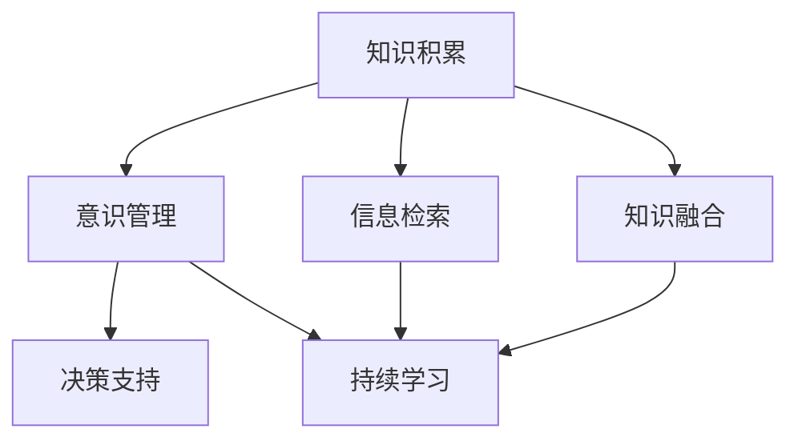

                 

# 知识积累在意识管理中的作用

## 1. 背景介绍

### 1.1 问题由来

在当前快速变化的信息社会中，人们面对的各类信息源众多且杂乱无章。如何有效地组织、管理并利用这些信息，成为个人和组织亟需解决的问题。在知识管理领域，意识管理（Consciousness Management）成为一个关键的子领域，旨在通过各种方式将知识内化为个人或组织的意识，从而提升其决策和行动能力。

意识管理通过整合已有的知识和经验，帮助人们在处理信息时更加明智和高效。它涵盖了从信息检索、数据整合到决策制定等多个环节，旨在让知识和经验对决策产生积极的影响。在这一过程中，知识积累扮演了核心角色，成为意识管理能否成功的关键因素之一。

### 1.2 问题核心关键点

知识积累对意识管理的重要性体现在以下几个方面：
1. **信息过滤**：知识积累帮助筛选和过滤大量信息，聚焦于与当前任务最相关的知识。
2. **知识融合**：将不同来源、不同格式的知识融合到一个统一的知识框架中，提升知识的结构化程度。
3. **知识激活**：将知识激活为意识，使其在需要时能够迅速被提取和使用。
4. **决策支持**：知识积累提供决策依据，辅助制定更加合理和高效的决策。
5. **持续学习**：持续积累新知识，保持意识管理系统的更新和优化。

本节将深入探讨知识积累在意识管理中的作用，从理论基础、实现机制到具体应用，全方位揭示这一关键领域的深层含义。

## 2. 核心概念与联系

### 2.1 核心概念概述

1. **知识积累**：通过有组织的方式收集、存储、整合和利用知识的过程。通常包括收集、分类、检索和更新等步骤。
2. **意识管理**：将知识转化为行动意识，通过信息检索、知识融合、决策支持等手段，提升个人或组织的行为决策能力。
3. **信息检索**：从存储库中获取相关信息的过程。
4. **知识融合**：将不同来源、不同格式的知识进行整合，形成一个统一的知识框架。
5. **决策支持**：利用知识库中的信息，辅助决策制定。
6. **持续学习**：通过不断积累新知识，保持系统更新和优化。

这些核心概念之间存在紧密的联系，知识积累为意识管理提供了基础支撑，而意识管理则将知识转化为有价值的行动。

### 2.2 概念间的关系

知识积累与意识管理的关系可以通过以下Mermaid流程图来展示：



这个流程图展示知识积累与意识管理之间的相互依赖关系：知识积累为意识管理提供必要的信息和知识基础；意识管理则通过信息检索和知识融合，进一步利用这些知识，辅助决策并持续学习新知识。

## 3. 核心算法原理 & 具体操作步骤

### 3.1 算法原理概述

意识管理系统的核心算法原理可以概括为以下几个步骤：
1. **知识收集**：从不同的信息源（如网络、书籍、文档等）收集知识。
2. **知识存储**：将收集到的知识存储在一个结构化的知识库中。
3. **信息检索**：根据用户或系统的需求，从知识库中检索相关知识。
4. **知识融合**：将检索到的知识进行整合，形成统一的认识框架。
5. **决策支持**：基于整合后的知识，辅助决策制定。
6. **持续学习**：不断更新知识库，学习新的知识，确保系统的时效性。

### 3.2 算法步骤详解

#### 3.2.1 知识收集

知识收集过程通常涉及以下步骤：
1. **确定收集目标**：明确需要收集的知识类型和来源。
2. **数据抓取**：使用爬虫或API等方式从互联网或其他渠道获取数据。
3. **数据预处理**：对获取的数据进行清洗、去重、格式化等预处理。
4. **数据存储**：将处理后的数据存储在知识库中，如文档数据库、图数据库等。

#### 3.2.2 知识存储

知识存储通常使用分布式数据库或云存储系统，以确保存储容量和访问速度。存储方式可以是文本、关系型数据、图形数据或知识图谱等。

#### 3.2.3 信息检索

信息检索过程通常包括以下几个步骤：
1. **用户查询**：用户输入查询条件，描述所需知识。
2. **查询解析**：对用户查询进行解析，转化为可操作的查询语句。
3. **检索匹配**：在知识库中检索与查询条件匹配的记录。
4. **结果展示**：将检索结果以摘要、文档、图表等形式展示给用户。

#### 3.2.4 知识融合

知识融合通常使用知识图谱或语义网等技术，将不同来源、不同格式的知识整合到统一的框架中，形成逻辑上相互关联的知识网络。

#### 3.2.5 决策支持

决策支持系统（Decision Support System, DSS）利用整合后的知识，辅助用户或系统进行决策。DSS通常包含以下组件：
1. **数据仓库**：存储历史数据和知识。
2. **数据挖掘**：从数据仓库中提取有用的信息和模式。
3. **知识库**：存储和整合各种知识。
4. **推理引擎**：根据规则和知识库中的信息，进行推理和决策。
5. **用户界面**：与用户交互，展示推理结果和决策建议。

#### 3.2.6 持续学习

持续学习机制通过以下几个步骤，确保意识管理系统能够持续更新和优化：
1. **数据监控**：实时监控知识库的更新情况。
2. **新数据抓取**：自动抓取新的数据和信息。
3. **数据更新**：定期更新知识库中的数据和信息。
4. **模型训练**：使用新的数据和信息训练模型，提高系统性能。

### 3.3 算法优缺点

知识积累与意识管理算法的优点包括：
1. **知识复用**：通过知识积累，可以在多个场景中复用已有的知识。
2. **决策支持**：利用知识库辅助决策，减少决策的盲目性和错误。
3. **知识共享**：通过知识库，实现知识的共享和传播。

缺点包括：
1. **数据质量问题**：数据来源和格式多样，数据质量参差不齐，影响知识积累和融合效果。
2. **系统复杂度**：涉及信息检索、知识融合、决策支持等多个环节，系统复杂度较高。
3. **学习曲线陡峭**：需要掌握多种技术和工具，对用户和开发者都有较高的要求。

### 3.4 算法应用领域

知识积累与意识管理算法已经在多个领域得到广泛应用，例如：
1. **医疗健康**：通过知识积累，为医生提供临床决策支持，提高诊断和治疗的准确性和效率。
2. **金融投资**：利用知识库中的市场数据和分析结果，辅助投资决策，降低风险。
3. **教育培训**：为教师和学生提供知识库和资源，提升教学和学习效果。
4. **科研研发**：在科学研究中，利用知识库中的文献和数据，加速知识发现和创新。
5. **智能客服**：通过知识库，为客服系统提供快速响应的答案，提升服务质量。
6. **智慧城市**：在城市管理中，利用知识库中的数据，支持交通、环境、公共安全等方面的决策。

## 4. 数学模型和公式 & 详细讲解 & 举例说明

### 4.1 数学模型构建

#### 4.1.1 知识表示

知识表示是知识积累的数学基础。常用的知识表示方法包括：
1. **符号表示**：使用符号和逻辑表达式表示知识。
2. **语义网**：使用RDF（Resource Description Framework）表示知识。
3. **知识图谱**：使用图结构表示知识，包含实体、关系和属性等。
4. **本体论**：使用形式化的语言描述知识结构，包括类、属性、关系等。

#### 4.1.2 知识检索

知识检索通常使用布尔检索、向量空间模型、语义检索等技术。以下以向量空间模型为例，展示知识检索的数学模型：

设知识库中有$N$个文档，每个文档有$m$个特征项，每个特征项的权重为$\vec{w}$。用户查询$Q$的向量表示为$\vec{q}$。知识检索的目标是最小化查询与文档之间的距离：

$$
\min_{\vec{w}} \sum_{i=1}^N (\vec{q} - \vec{w})^2
$$

其中，$\vec{w}$表示文档的向量表示，$\vec{q}$表示用户查询的向量表示。

#### 4.1.3 知识融合

知识融合通常使用知识图谱或语义网技术，将不同来源、不同格式的知识整合到一个统一的知识框架中。以下以知识图谱为例，展示知识融合的数学模型：

知识图谱中的知识表示为三元组$(R, S, O)$，其中$R$表示实体关系，$S$表示实体，$O$表示实体属性。知识融合的目标是将不同图谱中的三元组进行关联，形成统一的知识图谱：

$$
\max_{R,S,O} \sum_{i=1}^n \sum_{j=1}^m \min_{(r,s,o)} d(r,s,o)
$$

其中，$d(r,s,o)$表示三元组$(r,s,o)$之间的距离，$n$和$m$分别表示图谱中的三元组个数。

### 4.2 公式推导过程

#### 4.2.1 知识检索的向量空间模型

设知识库中有$N$个文档，每个文档有$m$个特征项，每个特征项的权重为$\vec{w}$。用户查询$Q$的向量表示为$\vec{q}$。知识检索的目标是最小化查询与文档之间的距离：

$$
\min_{\vec{w}} \sum_{i=1}^N (\vec{q} - \vec{w})^2
$$

其中，$\vec{w}$表示文档的向量表示，$\vec{q}$表示用户查询的向量表示。

设$w_{ij}$表示文档$i$中的第$j$个特征项的权重，$q_j$表示用户查询中的第$j$个特征项的权重。向量距离公式为：

$$
\min_{w_{ij}} \sum_{i=1}^N \sum_{j=1}^m (w_{ij} - q_j)^2
$$

通过求解上述优化问题，可以得到与用户查询最匹配的文档。

#### 4.2.2 知识图谱的合并

知识图谱中的知识表示为三元组$(R, S, O)$，其中$R$表示实体关系，$S$表示实体，$O$表示实体属性。知识融合的目标是将不同图谱中的三元组进行关联，形成统一的知识图谱：

$$
\max_{R,S,O} \sum_{i=1}^n \sum_{j=1}^m \min_{(r,s,o)} d(r,s,o)
$$

其中，$d(r,s,o)$表示三元组$(r,s,o)$之间的距离，$n$和$m$分别表示图谱中的三元组个数。

设$(r_{ij}, s_{ij}, o_{ij})$表示图谱$i$中的三元组$(r,s,o)$，$d_{ij}(r,s,o)$表示$r_{ij}$与$r$之间的距离。知识图谱合并的目标是最小化距离总和：

$$
\min_{r_{ij},s_{ij},o_{ij}} \sum_{i=1}^n \sum_{j=1}^m d_{ij}(r,s,o)
$$

通过求解上述优化问题，可以得到统一的知识图谱。

### 4.3 案例分析与讲解

#### 4.3.1 医疗健康中的应用

在医疗健康领域，知识积累和意识管理算法可以帮助医生进行临床决策支持。例如，IBM的Watson Health平台利用自然语言处理和知识图谱技术，整合了大量的医学文献、临床指南、药物信息等，为医生提供基于实证的诊疗建议，提高了诊断和治疗的准确性和效率。

#### 4.3.2 金融投资中的应用

在金融投资领域，知识积累和意识管理算法可以辅助投资者进行决策。例如，Bloomberg使用的Ganesha平台，通过整合市场数据、新闻报道、社交媒体等信息，利用机器学习技术，为投资者提供实时的市场分析和投资建议，帮助降低投资风险。

## 5. 项目实践：代码实例和详细解释说明

### 5.1 开发环境搭建

为了进行知识积累和意识管理系统的开发，需要搭建一个Python开发环境。以下是详细的安装步骤：

1. **安装Python**：下载并安装Python 3.8或更高版本，建议使用Anaconda环境管理工具。
   ```bash
   conda install python=3.8
   ```

2. **安装Pip**：在Python环境中安装Pip，Pip是Python的包管理工具。
   ```bash
   conda install pip
   ```

3. **安装必要的Python库**：安装常用的Python库，如NumPy、Pandas、Scikit-learn等。
   ```bash
   pip install numpy pandas scikit-learn
   ```

4. **安装Django框架**：Django是一个流行的Python Web框架，用于构建Web应用。
   ```bash
   pip install django
   ```

5. **安装Flask框架**：Flask是一个轻量级的Python Web框架，适合快速开发原型。
   ```bash
   pip install flask
   ```

6. **安装知识管理相关的库**：安装用于知识管理系统的库，如Whoosh、Elasticsearch等。
   ```bash
   pip install whoosh elasticsearch
   ```

### 5.2 源代码详细实现

以下是一个基于Django框架的知识管理系统示例代码：

#### 5.2.1 创建Django项目

```bash
django-admin startproject knowledge_base
cd knowledge_base
```

#### 5.2.2 创建Django应用

```bash
python manage.py startapp knowledge_manager
```

#### 5.2.3 编写模型

在`knowledge_manager/models.py`文件中，定义知识模型：

```python
from django.db import models

class Knowledge(models.Model):
    title = models.CharField(max_length=255)
    content = models.TextField()
    date = models.DateTimeField(auto_now_add=True)

    def __str__(self):
        return self.title
```

#### 5.2.4 编写视图

在`knowledge_manager/views.py`文件中，定义知识管理系统的视图：

```python
from django.shortcuts import render, redirect
from .models import Knowledge

def index(request):
    knowledge_list = Knowledge.objects.all()
    return render(request, 'knowledge/index.html', {'knowledge_list': knowledge_list})

def add_knowledge(request):
    if request.method == 'POST':
        title = request.POST['title']
        content = request.POST['content']
        new_knowledge = Knowledge(title=title, content=content)
        new_knowledge.save()
        return redirect('index')
    return render(request, 'knowledge/add.html')
```

#### 5.2.5 编写模板

在`knowledge_manager/templates/knowledge`目录下，创建`index.html`和`add.html`模板文件：

`index.html`：

```html


  <h1>知识库</h1>
  <ul>
    
      <li><a href="">{{ knowledge.title }}</a></li>
    
  </ul>
  <a href="">添加知识</a>

```

`add.html`：

```html


  <h1>添加知识</h1>
  <form method="post">
    
    <input type="text" name="title" placeholder="标题">
    <textarea name="content" placeholder="内容"></textarea>
    <button type="submit">提交</button>
  </form>

```

#### 5.2.6 编写URL路由

在`knowledge_base/urls.py`文件中，定义知识管理系统的URL路由：

```python
from django.urls import path
from . import views

urlpatterns = [
    path('', views.index, name='index'),
    path('add/', views.add_knowledge, name='add_knowledge'),
    path('knowledge/<int:id>/', views.knowledge_detail, name='knowledge_detail'),
]
```

### 5.3 代码解读与分析

在上述代码中，我们通过Django框架实现了一个简单的知识管理系统。具体步骤如下：

1. **创建Django项目**：使用`django-admin startproject`命令创建Django项目。
2. **创建Django应用**：在项目目录下使用`python manage.py startapp`命令创建Django应用。
3. **编写模型**：在应用目录下定义知识模型，包含标题、内容和创建时间。
4. **编写视图**：在应用目录下编写视图，实现知识列表和知识添加功能。
5. **编写模板**：在应用目录下创建模板文件，用于呈现知识列表和知识添加表单。
6. **编写URL路由**：在项目目录下定义URL路由，映射视图与模板。

### 5.4 运行结果展示

启动Django开发服务器，访问`http://localhost:8000`，可以看到知识列表和知识添加页面。

## 6. 实际应用场景

### 6.4 未来应用展望

知识积累和意识管理算法将在未来继续拓展其应用场景，成为各行各业智能化转型的重要工具。以下是一些未来应用展望：

1. **智能教育**：知识积累和意识管理算法可以帮助教师和学生进行教学和学习，提高教学效果和学习效率。例如，使用知识图谱技术，为学生提供个性化的学习路径和资源推荐。
2. **智慧办公**：通过知识积累和意识管理，为员工提供知识检索和决策支持，提高工作效率和决策质量。例如，使用知识图谱和自然语言处理技术，为员工提供实时的信息查询和分析。
3. **智能制造**：在制造业中，利用知识积累和意识管理，优化生产流程，提高生产效率和产品质量。例如，通过知识图谱和推理引擎，优化设备维护和故障诊断。
4. **智慧交通**：在智慧交通领域，利用知识积累和意识管理，优化交通管理，提高交通安全和效率。例如，通过知识图谱和推理引擎，优化交通信号控制和路线规划。
5. **智能医疗**：在医疗领域，利用知识积累和意识管理，提高医疗诊断和治疗的准确性和效率。例如，通过知识图谱和自然语言处理技术，为医生提供临床决策支持。

## 7. 工具和资源推荐

### 7.1 学习资源推荐

为了帮助开发者系统掌握知识积累和意识管理技术，以下是一些优质的学习资源：

1. **《知识管理：战略、系统与技术》**：这本书系统介绍了知识管理的理论、方法和实践，适合初学者和从业者阅读。
2. **《信息检索与知识管理》**：这本书介绍了信息检索和知识管理的基本概念和算法，适合学习信息检索和知识管理的开发者。
3. **Coursera《信息检索》课程**：由斯坦福大学教授讲授，介绍了信息检索的原理和应用，适合对信息检索感兴趣的开发者。
4. **Kaggle《知识管理》竞赛**：通过实际竞赛，了解知识管理系统的设计和实现，适合实际应用开发的开发者。
5. **GitHub知识管理系统开源项目**：如Apache Elyra、Knative等，提供了开源的知识管理系统的实现和示例，适合学习代码实践的开发者。

### 7.2 开发工具推荐

为了提高知识积累和意识管理系统的开发效率，以下是一些推荐的开发工具：

1. **Django框架**：Python Web框架，适合快速开发原型和构建Web应用。
2. **Flask框架**：轻量级的Python Web框架，适合快速开发API接口和微服务。
3. **Elasticsearch**：分布式搜索引擎，适合大规模知识库的构建和检索。
4. **Whoosh**：Python搜索引擎，适合构建小型知识库和快速原型。
5. **Hadoop**：分布式计算平台，适合处理大规模数据和知识库的构建。

### 7.3 相关论文推荐

以下是一些在知识积累和意识管理领域具有代表性的论文，推荐阅读：

1. **《知识管理：理论、系统与应用》**：这篇综述文章介绍了知识管理的理论、技术和应用，适合全面了解知识管理领域。
2. **《基于本体的知识图谱构建与应用》**：这篇论文介绍了基于本体的知识图谱构建方法及其应用，适合深入了解知识图谱技术。
3. **《信息检索与自然语言处理》**：这篇综述文章介绍了信息检索和自然语言处理的基本概念和应用，适合了解信息检索和自然语言处理在知识管理中的应用。
4. **《基于机器学习的知识管理技术》**：这篇论文介绍了基于机器学习的知识管理技术，适合了解机器学习在知识管理中的应用。

## 8. 总结：未来发展趋势与挑战

### 8.1 研究成果总结

本文对知识积累和意识管理技术进行了全面系统的介绍。通过深入探讨知识积累在意识管理中的作用，展示了知识积累如何帮助人们更好地组织和利用知识，提升决策和行动能力。从理论基础到具体应用，全方位揭示了这一技术的核心价值。

### 8.2 未来发展趋势

展望未来，知识积累和意识管理技术将呈现以下几个发展趋势：

1. **智能分析**：通过机器学习和大数据分析，实现知识库的智能分析和预测，提升决策支持效果。
2. **跨领域融合**：将知识积累和意识管理技术与其他领域的技术（如机器学习、人工智能、区块链等）进行融合，实现跨领域的智能化应用。
3. **知识图谱普及**：知识图谱技术将得到更广泛的应用，成为知识管理的主流技术。
4. **个性化推荐**：通过机器学习和数据分析，实现知识库的个性化推荐，提升用户体验。
5. **分布式存储**：利用分布式存储和计算技术，提升知识库的可扩展性和可靠性。

### 8.3 面临的挑战

知识积累和意识管理技术在发展过程中面临以下挑战：

1. **数据质量**：数据源多样化，数据质量参差不齐，影响知识积累和融合效果。
2. **系统复杂度**：涉及信息检索、知识融合、决策支持等多个环节，系统复杂度较高。
3. **技术更新**：知识管理技术不断发展，需要持续学习新技术，保持系统更新。
4. **隐私保护**：知识管理涉及大量敏感数据，需要保护隐私和数据安全。
5. **跨领域协作**：知识积累和意识管理需要与其他领域的技术进行协同，面临技术协作的挑战。

### 8.4 研究展望

面向未来，知识积累和意识管理技术需要在以下几个方面进行研究：

1. **数据质量提升**：通过数据清洗、去重和格式转换等技术，提升数据质量，增强知识积累效果。
2. **系统复杂度优化**：通过模块化设计、自动化技术等，降低系统复杂度，提高开发效率。
3. **技术更新适应**：持续关注新技术发展，进行技术更新和适应，保持系统的前沿性和先进性。
4. **隐私保护机制**：建立隐私保护机制，保护敏感数据的安全和隐私。
5. **跨领域协作研究**：与其他领域的技术进行协同研究，探索知识管理技术在不同领域的应用。

总之，知识积累和意识管理技术在未来的发展将更加智能化和自动化，成为各行各业智能化转型的重要工具。只有不断突破技术瓶颈，才能实现知识积累和意识管理技术的全面普及和应用。

## 9. 附录：常见问题与解答

**Q1：知识积累和意识管理有哪些关键技术？**

A: 知识积累和意识管理的关键技术包括：
1. **信息检索**：从知识库中检索相关知识。
2. **知识融合**：将不同来源、不同格式的知识整合到一个统一的知识框架中。
3. **决策支持**：利用知识库中的信息，辅助决策制定。
4. **知识图谱**：使用图结构表示知识，包含实体、关系和属性等。
5. **自然语言处理**：将文本转换为结构化的知识，辅助信息检索和知识融合。

**Q2：如何设计知识积累系统？**

A: 设计知识积累系统需要考虑以下因素：
1. **数据源选择**：选择可靠的数据源，确保数据的质量和完整性。
2. **数据预处理**：对获取的数据进行清洗、去重、格式化等预处理。
3. **存储策略**：选择合适的存储方式，如文档数据库、图数据库等。
4. **检索算法**：选择合适的检索算法，如布尔检索、向量空间模型、语义检索等。
5. **知识图谱构建**：使用知识图谱技术，将不同来源的知识整合到一个统一的知识框架中。

**Q3：知识积累和意识管理如何应用在医疗领域？**

A: 在医疗领域，知识积累和意识管理可以用于：
1. **临床决策支持**：为医生提供基于实证的诊疗建议，提高诊断和治疗的准确性和效率。
2. **医疗知识图谱**：构建医疗知识图谱，提供实时的临床指南和医学文献检索。
3. **医疗数据分析**：利用知识图谱和机器学习技术，分析病历数据，发现疾病模式和预测疾病发展。

**Q4：知识积累和意识管理的应用场景有哪些？

