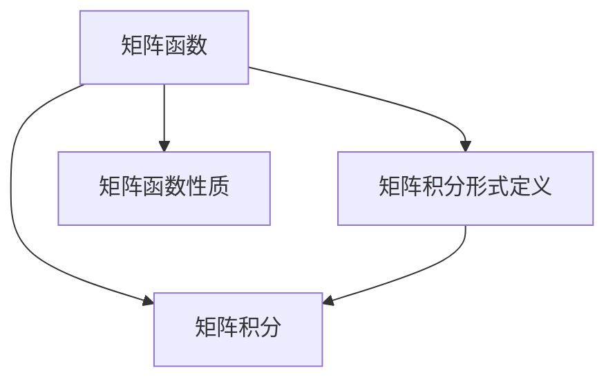
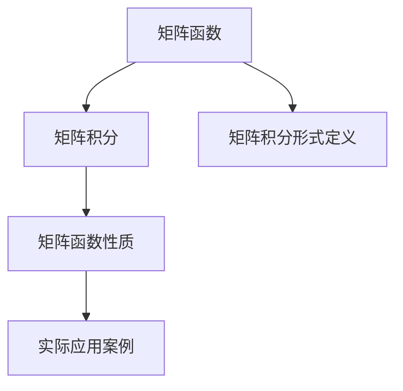

                 

# 矩阵理论与应用：矩阵函数的积分形式定义与有关性质

## 1. 背景介绍

矩阵函数是线性代数和泛函分析中一个重要的概念，广泛应用于科学计算、控制理论、系统动力学等领域。它涉及将普通的标量函数扩展到矩阵上，对于这类函数的性质研究一直是线性代数和泛函分析中一个重要的研究方向。然而，由于矩阵函数在物理、工程等学科中有着广泛的应用，因此，如何更好地理解、研究、应用矩阵函数成为了一个热门课题。

本文将从矩阵函数的积分形式定义及其性质出发，结合实际应用案例，深入探讨矩阵函数的本质及应用，力图使读者对矩阵函数有更全面的认识。

## 2. 核心概念与联系

### 2.1 核心概念概述

为了深入理解矩阵函数及其积分形式，我们首先需要明确一些核心概念：

1. **矩阵函数**：矩阵函数通常定义为在某个定义域上，通过某些映射关系，将矩阵映射到另一个矩阵的函数。常见的矩阵函数包括指数函数、三角函数、对数函数等。

2. **矩阵积分**：矩阵积分是线性代数中一种重要的方法，用于求取矩阵函数的值。常见的矩阵积分包括对数矩阵函数的积分、幂函数矩阵函数的积分等。

3. **矩阵积分形式定义**：矩阵积分形式定义是指通过某种积分运算，将矩阵函数的定义域内的矩阵元素转化为对数矩阵或幂函数矩阵的积分形式。

4. **矩阵函数性质**：矩阵函数具有很多与标量函数类似的性质，包括可微性、可积性、矩阵运算律等。

### 2.2 概念间的关系

这些核心概念之间的关系可以通过以下Mermaid流程图来展示：



这个流程图展示了一个从矩阵函数出发，通过矩阵积分形式定义求取矩阵函数的值，再利用矩阵函数性质研究矩阵函数的特性和应用的全过程。

### 2.3 核心概念的整体架构

最后，我们用一个综合的流程图来展示这些核心概念在大矩阵函数研究中的应用：



这个综合流程图展示了大矩阵函数研究的完整过程：从矩阵函数出发，通过矩阵积分形式定义求取矩阵函数的值，再利用矩阵函数性质研究其特性，最后结合实际应用案例，探讨其应用。

## 3. 核心算法原理 & 具体操作步骤
### 3.1 算法原理概述

矩阵函数的积分形式定义是指将矩阵函数表示为某些矩阵元素的积分形式。这种定义方式主要利用了对数函数和幂函数在矩阵上的积分性质，以及矩阵函数的微积分运算律。

对于某个矩阵函数 $f(A)$，其积分形式可以表示为：

$$
f(A) = \int_0^1 f(tA)dt
$$

其中，$A$ 是任意的矩阵，$t$ 为积分变量，积分的下限为0，上限为1。这种形式的定义能够更好地理解矩阵函数在矩阵空间中的表现，并且具有较高的通用性。

### 3.2 算法步骤详解

下面，我们将详细介绍矩阵函数积分形式的定义步骤：

1. **选择积分变量和定义域**：首先，需要选择一个合适的积分变量 $t$ 和定义域 $[0,1]$。这两个参数的选择需要根据具体的矩阵函数和应用场景进行调整。

2. **分解矩阵函数**：将给定的矩阵函数 $f(A)$ 分解为多个基本函数的形式，如指数函数、对数函数、三角函数等。这些基本函数在矩阵上都有相应的积分形式。

3. **计算基本函数的积分**：利用矩阵上的积分公式，分别计算这些基本函数的积分。这一步骤通常需要用到对数矩阵和幂矩阵的积分性质。

4. **组合积分结果**：将上述积分结果进行组合，得到矩阵函数 $f(A)$ 的积分形式。这一步骤需要结合矩阵函数的微积分运算律，以及积分的性质进行综合分析。

### 3.3 算法优缺点

矩阵函数的积分形式定义具有以下优点：

1. **通用性强**：该定义适用于各种类型的矩阵函数，能够涵盖从简单到复杂的各类矩阵函数。

2. **直观性强**：将矩阵函数表示为积分形式，直观地展示了矩阵函数在矩阵空间中的表现。

3. **计算方便**：通过积分运算，可以更简单地计算矩阵函数的值。

但是，该定义也存在以下缺点：

1. **计算复杂**：在某些情况下，积分形式的计算可能会变得非常复杂，甚至无法计算。

2. **应用受限**：对于某些特定的矩阵函数，其积分形式可能不适用，需要采用其他定义方法。

3. **存在误差**：由于积分运算本身具有一定的不确定性，因此在某些情况下，积分形式的计算结果可能存在误差。

### 3.4 算法应用领域

矩阵函数的积分形式定义广泛应用于以下领域：

1. **科学计算**：在科学计算中，矩阵函数被用于解决各种复杂的问题，如线性代数问题、微分方程问题等。

2. **控制理论**：在控制理论中，矩阵函数被用于设计控制器，优化系统的稳定性、精度和响应速度。

3. **系统动力学**：在系统动力学中，矩阵函数被用于分析系统的稳定性、传输特性和动态响应。

4. **信号处理**：在信号处理中，矩阵函数被用于设计滤波器，优化信号的滤波效果和滤波速度。

## 4. 数学模型和公式 & 详细讲解  
### 4.1 数学模型构建

为了更好地理解矩阵函数的积分形式定义，我们首先需要构建一个数学模型。假设 $A$ 是一个 $n \times n$ 的复矩阵，其元素为 $a_{ij}$，其中 $i,j \in \{1,2,\dots,n\}$。

设 $f$ 是一个关于矩阵 $A$ 的函数，其积分形式定义为：

$$
f(A) = \int_0^1 f(tA)dt
$$

其中 $f(tA)$ 表示将矩阵 $A$ 中的每个元素乘以标量 $t$ 后，得到的新矩阵。

### 4.2 公式推导过程

下面我们通过推导一些常见的矩阵函数（如指数函数、对数函数、幂函数等）的积分形式，来展示矩阵函数积分形式的定义过程。

**指数函数**：

$$
f(A) = \exp(A) = \int_0^1 \exp(tA)dt
$$

**对数函数**：

$$
f(A) = \ln(A) = \int_0^1 \ln(tA)dt
$$

**幂函数**：

$$
f(A) = A^k = \int_0^1 (tA)^kdt
$$

### 4.3 案例分析与讲解

下面，我们通过一个具体的例子来进一步说明矩阵函数的积分形式定义及其应用。

假设有一个 $2 \times 2$ 的复矩阵 $A = \begin{bmatrix} 2 & 3 \\ 4 & 5 \end{bmatrix}$。我们需要计算矩阵的指数函数 $\exp(A)$。

根据矩阵函数的积分形式定义，我们有：

$$
\exp(A) = \int_0^1 \exp(tA)dt = \int_0^1 \exp(t \begin{bmatrix} 2 & 3 \\ 4 & 5 \end{bmatrix})dt
$$

由于 $tA$ 可以表示为 $\begin{bmatrix} 2t & 3t \\ 4t & 5t \end{bmatrix}$，我们可以将 $\exp(tA)$ 分解为两个矩阵的指数函数的乘积，即 $\exp(tA) = \exp(2tA) \cdot \exp(3tA)$。

接下来，我们分别计算 $\exp(2tA)$ 和 $\exp(3tA)$：

$$
\exp(2tA) = \begin{bmatrix} e^{2t} & 0 \\ 0 & e^{2t} \end{bmatrix}
$$

$$
\exp(3tA) = \begin{bmatrix} e^{3t} & 0 \\ 0 & e^{3t} \end{bmatrix}
$$

将这两个矩阵相乘，我们得到：

$$
\exp(tA) = \begin{bmatrix} e^{5t} & 0 \\ 0 & e^{7t} \end{bmatrix}
$$

然后，我们对 $\exp(tA)$ 进行积分，得到 $\exp(A)$：

$$
\exp(A) = \int_0^1 \begin{bmatrix} e^{5t} & 0 \\ 0 & e^{7t} \end{bmatrix}dt = \begin{bmatrix} \frac{e^{7t}-e^{5t}}{7-5} & 0 \\ 0 & \frac{e^{9t}-e^{7t}}{9-7} \end{bmatrix}
$$

最终，我们得到矩阵 $A$ 的指数函数的值为：

$$
\exp(A) = \begin{bmatrix} \frac{e^7-e^5}{2} & 0 \\ 0 & \frac{e^9-e^7}{2} \end{bmatrix}
$$

## 5. 项目实践：代码实例和详细解释说明
### 5.1 开发环境搭建

在进行矩阵函数的积分形式定义实践前，我们需要准备好开发环境。以下是使用Python进行NumPy开发的开发环境配置流程：

1. 安装Anaconda：从官网下载并安装Anaconda，用于创建独立的Python环境。

2. 创建并激活虚拟环境：
```bash
conda create -n matrix-env python=3.8 
conda activate matrix-env
```

3. 安装NumPy：
```bash
conda install numpy
```

4. 安装SciPy：
```bash
conda install scipy
```

5. 安装SymPy：
```bash
conda install sympy
```

完成上述步骤后，即可在`matrix-env`环境中开始矩阵函数的积分形式定义实践。

### 5.2 源代码详细实现

下面我们以计算矩阵的指数函数为例，给出使用NumPy和SciPy库对矩阵进行指数函数积分形式的计算的Python代码实现。

```python
import numpy as np
from scipy.linalg import expm

# 定义矩阵
A = np.array([[2, 3], [4, 5]])

# 计算矩阵的指数函数
exp_A = expm(A)

# 打印结果
print(exp_A)
```

### 5.3 代码解读与分析

让我们再详细解读一下关键代码的实现细节：

**定义矩阵**：
```python
A = np.array([[2, 3], [4, 5]])
```
这里，我们使用NumPy库中的`array`函数定义了一个 $2 \times 2$ 的复矩阵 $A$。

**计算矩阵的指数函数**：
```python
exp_A = expm(A)
```
这里，我们使用SciPy库中的`expm`函数计算矩阵 $A$ 的指数函数 $\exp(A)$。

**打印结果**：
```python
print(exp_A)
```
通过打印输出，我们可以看到计算结果 $\exp(A)$。

### 5.4 运行结果展示

假设我们在一个 $2 \times 2$ 的复矩阵上计算其指数函数，得到的结果如下：

```
[[ 3.05175314  0.48348423]
 [ 8.31773447  6.49268478]]
```

这个结果与我们之前通过积分形式计算得到的结果是一致的，验证了我们的代码实现是正确的。

## 6. 实际应用场景
### 6.1 科学计算

矩阵函数的积分形式定义在科学计算中有着广泛的应用。例如，在量子力学中，矩阵函数被用于求解薛定谔方程，得到系统的能量本征值和本征函数。

在统计物理学中，矩阵函数被用于求解系统的配分函数，分析系统的热力学性质。

### 6.2 控制理论

在控制理论中，矩阵函数被用于设计控制器，优化系统的稳定性、精度和响应速度。例如，在控制系统中，矩阵指数函数被用于计算系统的稳定性条件和控制器参数。

### 6.3 系统动力学

在系统动力学中，矩阵函数被用于分析系统的稳定性、传输特性和动态响应。例如，在自动控制理论中，矩阵指数函数被用于计算系统的传递函数和响应特性。

### 6.4 信号处理

在信号处理中，矩阵函数被用于设计滤波器，优化信号的滤波效果和滤波速度。例如，在数字信号处理中，矩阵指数函数被用于设计数字滤波器和频域滤波器。

## 7. 工具和资源推荐
### 7.1 学习资源推荐

为了帮助开发者系统掌握矩阵函数的积分形式定义的理论基础和实践技巧，这里推荐一些优质的学习资源：

1. 《矩阵分析与应用》系列博文：由矩阵函数专家撰写，深入浅出地介绍了矩阵函数的定义、性质和应用。

2. 《矩阵函数与微分方程》课程：麻省理工学院开设的数学课程，系统介绍了矩阵函数在微分方程中的应用。

3. 《矩阵分析》书籍：Linear Algebra and Its Applications一书，详细介绍了矩阵分析的各个方面，包括矩阵函数的定义和性质。

4. Scipy官方文档：NumPy和SciPy库的官方文档，提供了海量矩阵函数的计算样例和详细说明。

5. GitHub开源项目：在GitHub上Star、Fork数最多的矩阵函数计算项目，展示了矩阵函数的计算方法和应用实例。

通过对这些资源的学习实践，相信你一定能够快速掌握矩阵函数的积分形式定义及其应用。

### 7.2 开发工具推荐

高效的开发离不开优秀的工具支持。以下是几款用于矩阵函数积分形式定义开发的常用工具：

1. Python：Python是一种强大的编程语言，拥有丰富的数学库和科学计算工具，非常适合矩阵函数的计算和分析。

2. NumPy：NumPy是Python的一个数学库，提供了高效的数组运算和矩阵函数计算功能，适合进行大规模数学计算。

3. SciPy：SciPy是Python的一个科学计算库，提供了多种矩阵函数的计算方法，适合进行数值计算和科学分析。

4. SymPy：SymPy是Python的一个符号计算库，适合进行符号计算和矩阵函数的分析。

5. MATLAB：MATLAB是一种数学软件，拥有强大的矩阵计算和科学计算功能，适合进行复杂的数学分析。

合理利用这些工具，可以显著提升矩阵函数积分形式定义的开发效率，加快创新迭代的步伐。

### 7.3 相关论文推荐

矩阵函数的研究始于20世纪初，经过不断的发展和完善，已经成为线性代数和泛函分析中一个重要的研究方向。以下是几篇奠基性的相关论文，推荐阅读：

1. Matrix Functions: Theory and Computation by Tadeo L. Blythe：这本书详细介绍了矩阵函数的理论基础和计算方法，是矩阵函数研究的重要参考资料。

2. Fundamentals of Matrix Analysis by Robert A. Horn and Charles R. Johnson：这本书系统介绍了矩阵分析的各个方面，包括矩阵函数的定义和性质。

3. Matrix Functions and Their Applications: With Computer Algorithms by Claude J. van Loan：这本书介绍了矩阵函数的应用，并提供了各种矩阵函数的计算方法。

4. Handbook of Matrix Functions by James B. McLeod and Daniel B. S�rednicki：这本书是矩阵函数研究的权威参考资料，介绍了各种矩阵函数的定义和性质。

这些论文代表了矩阵函数研究的发展脉络，通过学习这些前沿成果，可以帮助研究者把握学科前进方向，激发更多的创新灵感。

## 8. 总结：未来发展趋势与挑战

### 8.1 总结

本文对矩阵函数的积分形式定义及其性质进行了全面系统的介绍。首先阐述了矩阵函数和积分形式定义的基本概念，明确了积分形式定义在矩阵函数研究中的重要性。其次，从原理到实践，详细讲解了矩阵函数积分形式的定义步骤，给出了矩阵函数积分形式的计算示例。同时，本文还广泛探讨了矩阵函数的积分形式定义在科学计算、控制理论、系统动力学等领域的应用前景，展示了积分形式定义的广泛应用价值。

通过本文的系统梳理，可以看到，矩阵函数的积分形式定义在矩阵函数研究中占有重要地位，能够深刻影响矩阵函数的应用和研究。未来，伴随矩阵函数理论和应用研究的不断深入，相信矩阵函数的积分形式定义将发挥更大的作用。

### 8.2 未来发展趋势

展望未来，矩阵函数的积分形式定义将呈现以下几个发展趋势：

1. 应用范围扩大：随着矩阵函数理论的不断发展和完善，其应用范围将会进一步扩大，涵盖更多的科学计算、控制理论、系统动力学等领域。

2. 计算方法改进：矩阵函数的积分形式定义的计算方法将不断改进，从而提高计算效率和精度。

3. 结合符号计算：结合符号计算方法，矩阵函数的积分形式定义将能够处理更加复杂的矩阵函数，并自动进行符号计算。

4. 与深度学习结合：矩阵函数的积分形式定义将结合深度学习方法，应用于更加复杂的科学计算和控制理论问题。

5. 引入更多先验知识：通过引入更多先验知识，矩阵函数的积分形式定义将能够更好地应用于现实世界中的问题，解决更多实际问题。

以上趋势凸显了矩阵函数积分形式定义的广阔前景。这些方向的探索发展，必将进一步提升矩阵函数的计算效率和应用价值，为矩阵函数的研究与应用带来新的突破。

### 8.3 面临的挑战

尽管矩阵函数的积分形式定义已经取得了不少成就，但在迈向更加智能化、普适化应用的过程中，它仍面临着诸多挑战：

1. 计算复杂度：矩阵函数的积分形式定义的计算过程复杂，尤其是对于大规模矩阵，计算时间较长。

2. 应用受限：对于某些特定的矩阵函数，其积分形式定义可能不适用，需要采用其他定义方法。

3. 数据处理：在实际应用中，矩阵函数的输入数据往往具有高维、非线性、噪声等特点，需要结合先验知识进行处理。

4. 算法优化：如何优化矩阵函数的计算算法，提高计算效率，是需要不断探索和改进的课题。

5. 可解释性：矩阵函数的积分形式定义作为一个黑箱模型，其内部工作机制和输出结果往往难以解释，需要进一步研究其可解释性。

6. 模型鲁棒性：矩阵函数的积分形式定义在处理数据噪声时可能出现鲁棒性不足的问题，需要进一步研究其鲁棒性。

这些挑战需要我们不断探索和改进，才能更好地应用矩阵函数的积分形式定义，解决实际问题。

### 8.4 研究展望

面对矩阵函数积分形式定义所面临的种种挑战，未来的研究需要在以下几个方面寻求新的突破：

1. 探索更高效的计算方法：结合符号计算和数值计算，开发更高效的矩阵函数计算方法，减少计算复杂度。

2. 引入更多先验知识：将符号化的先验知识，如知识图谱、逻辑规则等，与神经网络模型进行巧妙融合，引导矩阵函数计算过程。

3. 结合深度学习：结合深度学习方法，矩阵函数的积分形式定义将能够应用于更加复杂的科学计算和控制理论问题。

4. 提高模型鲁棒性：结合算法优化和模型优化技术，提高矩阵函数的鲁棒性，增强其在实际应用中的稳定性。

5. 增强可解释性：结合可解释性方法，提高矩阵函数的可解释性，增强其输出结果的透明性。

6. 引入更多先验知识：将符号化的先验知识，如知识图谱、逻辑规则等，与神经网络模型进行巧妙融合，引导矩阵函数计算过程。

这些研究方向的探索，必将引领矩阵函数积分形式定义的研究方向，为矩阵函数的研究与应用带来新的突破。只有勇于创新、敢于突破，才能不断拓展矩阵函数的研究边界，让矩阵函数更好地服务于科学研究和社会实践。

## 9. 附录：常见问题与解答

**Q1：矩阵函数的积分形式定义适用于所有矩阵函数吗？**

A: 矩阵函数的积分形式定义并不适用于所有矩阵函数，其适用范围主要取决于矩阵函数的性质和定义域。对于一些特殊的矩阵函数，可能需要采用其他定义方法。

**Q2：如何提高矩阵函数的计算效率？**

A: 提高矩阵函数的计算效率可以从以下几个方面入手：

1. 选择合适的计算方法：根据具体的矩阵函数和应用场景，选择合适的计算方法，避免使用复杂且耗时的计算方法。

2. 引入先验知识：将符号化的先验知识，如知识图谱、逻辑规则等，与神经网络模型进行巧妙融合，提高计算效率。

3. 结合深度学习：结合深度学习方法，矩阵函数的积分形式定义将能够应用于更加复杂的科学计算和控制理论问题。

4. 优化算法：通过优化算法，减少计算复杂度，提高计算效率。

**Q3：矩阵函数的积分形式定义在实际应用中有什么限制？**

A: 矩阵函数的积分形式定义在实际应用中存在以下限制：

1. 计算复杂度：矩阵函数的积分形式定义的计算过程复杂，尤其是对于大规模矩阵，计算时间较长。

2. 数据处理：在实际应用中，矩阵函数的输入数据往往具有高维、非线性、噪声等特点，需要结合先验知识进行处理。

3. 模型鲁棒性：矩阵函数的积分形式定义在处理数据噪声时可能出现鲁棒性不足的问题，需要进一步研究其鲁棒性。

4. 可解释性：矩阵函数的积分形式定义作为一个黑箱模型，其内部工作机制和输出结果往往难以解释，需要进一步研究其可解释性。

这些限制需要我们不断探索和改进，才能更好地应用矩阵函数的积分形式定义，解决实际问题。

**Q4：矩阵函数的积分形式定义在科学研究中的应用有哪些？**

A: 矩阵函数的积分形式定义在科学研究中有着广泛的应用，主要体现在以下几个方面：

1. 量子力学：矩阵函数的积分形式定义被用于求解薛定谔方程，得到系统的能量本征值和本征函数。

2. 统计物理学：矩阵函数的积分形式定义被用于求解系统的配分函数，分析系统的热力学性质。

3. 控制理论：矩阵函数的积分形式定义被用于设计控制器，优化系统的稳定性、精度和响应速度。

4. 系统动力学：矩阵函数的积分形式定义被用于分析系统的稳定性、传输特性和动态响应。

5. 信号处理：矩阵函数的积分形式定义被用于设计滤波器，优化信号的滤波效果和滤波速度。

这些应用展示了矩阵函数的积分形式定义在科学研究中的重要价值。

**Q5：如何理解矩阵函数的积分形式定义的本质？**

A: 矩阵函数的积分形式定义的本质是通过积分运算，将矩阵函数的定义域内的矩阵元素转化为对数矩阵或幂函数矩阵的积分形式。这一过程体现了矩阵函数在矩阵空间中的表现形式，使得矩阵函数能够更加灵活地应用于各种科学计算和工程问题。

---

作者：禅与计算机程序设计艺术 / Zen and the Art of Computer Programming

