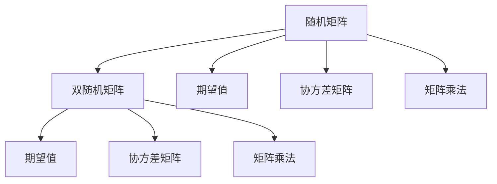
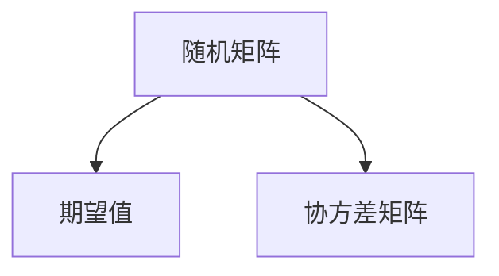
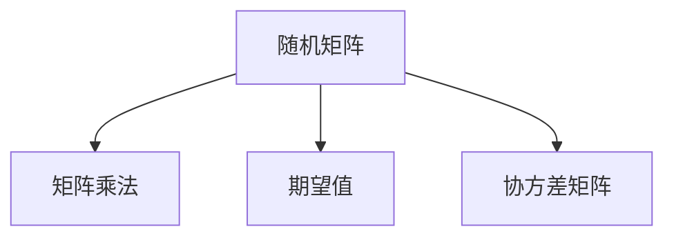
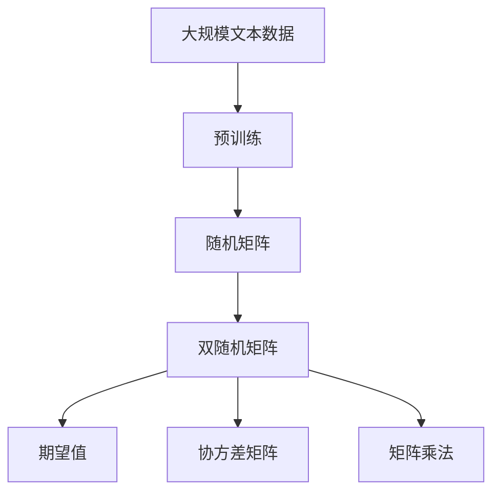

                 

## 1. 背景介绍

### 1.1 问题由来
矩阵理论是数学中的一个重要分支，它广泛应用于物理学、计算机科学、金融学等多个领域。在计算机科学中，矩阵理论不仅在图像处理、机器学习、网络分析等方面有着重要的应用，而且在密码学、信号处理、计算机视觉等方面也有着广泛的应用。因此，深入理解矩阵理论不仅对于从事相关研究的人员具有重要意义，而且对于其他领域的应用人员也具有重要的参考价值。

### 1.2 问题核心关键点
在矩阵理论中，随机矩阵和双随机矩阵是两种重要的矩阵形式。随机矩阵是指其元素值随机生成的矩阵，而双随机矩阵则是指其元素值不仅随机生成，而且元素值之间存在一定的相关性。随机矩阵和双随机矩阵的应用广泛，它们被用于模拟随机过程、优化算法、信号处理等领域。

### 1.3 问题研究意义
研究随机矩阵和双随机矩阵的理论和应用，对于理解和解决复杂系统中的问题具有重要意义。这些矩阵理论不仅能够帮助我们更好地理解和预测复杂系统的行为，而且也能够帮助我们设计更加有效的算法和系统。此外，随机矩阵和双随机矩阵的研究还能够推动相关领域的技术进步，从而促进科学和技术的发展。

## 2. 核心概念与联系

### 2.1 核心概念概述

为了更好地理解随机矩阵和双随机矩阵的理论和应用，本节将介绍几个密切相关的核心概念：

- 随机矩阵(Random Matrix)：指其元素值随机生成的矩阵。随机矩阵的应用非常广泛，如模拟随机过程、优化算法、信号处理等领域。
- 双随机矩阵(Biased Random Matrix)：指其元素值不仅随机生成，而且元素值之间存在一定的相关性。双随机矩阵在复杂系统模拟和优化算法中具有重要应用。
- 期望值（Expectation Value）：随机变量的期望值是一个平均值，可以用于描述随机变量的平均行为。期望值在统计学和物理学中有广泛的应用。
- 协方差矩阵（Covariance Matrix）：协方差矩阵描述了随机变量之间线性相关的程度。协方差矩阵在机器学习和信号处理中有着重要的应用。
- 矩阵乘法（Matrix Multiplication）：矩阵乘法是将两个矩阵相乘得到一个新的矩阵。矩阵乘法在数学和计算机科学中有着广泛的应用。

这些核心概念之间的逻辑关系可以通过以下Mermaid流程图来展示：



这个流程图展示了一些核心概念之间的逻辑关系：

1. 随机矩阵和双随机矩阵都是随机变量的生成形式，其期望值和协方差矩阵可以描述这些随机变量的统计性质。
2. 随机矩阵和双随机矩阵可以通过矩阵乘法进行组合，从而得到新的随机矩阵。

### 2.2 概念间的关系

这些核心概念之间存在着紧密的联系，形成了随机矩阵和双随机矩阵的理论框架。下面我们通过几个Mermaid流程图来展示这些概念之间的关系。

#### 2.2.1 随机矩阵和期望值的关系



这个流程图展示了随机矩阵和期望值之间的关系：

1. 随机矩阵的期望值可以通过对所有随机变量的期望值求和得到。
2. 协方差矩阵描述了随机变量之间的相关性，其大小和形状可以影响期望值的大小和形状。

#### 2.2.2 双随机矩阵和协方差矩阵的关系


这个流程图展示了双随机矩阵和协方差矩阵之间的关系：

1. 双随机矩阵的协方差矩阵可以描述其元素值之间的相关性。
2. 协方差矩阵的大小和形状可以影响双随机矩阵的统计性质。

#### 2.2.3 随机矩阵和矩阵乘法的关系



这个流程图展示了随机矩阵和矩阵乘法之间的关系：

1. 随机矩阵可以通过矩阵乘法进行组合，从而得到新的随机矩阵。
2. 矩阵乘法的结果可以通过期望值和协方差矩阵进行描述。

### 2.3 核心概念的整体架构

最后，我们用一个综合的流程图来展示这些核心概念在大语言模型微调过程中的整体架构：



这个综合流程图展示了从预训练到双随机矩阵的完整过程。大语言模型首先在大规模文本数据上进行预训练，然后通过随机矩阵和双随机矩阵的生成，得到新的随机矩阵，并通过期望值和协方差矩阵进行描述。通过这些矩阵的操作，可以更好地模拟语言模型的统计性质，从而提高微调的效果。

## 3. 核心算法原理 & 具体操作步骤
### 3.1 算法原理概述

随机矩阵和双随机矩阵的生成主要基于随机变量的分布。假设有一个$n \times m$的矩阵$A$，其元素值服从正态分布$N(0, 1)$，即每个元素值都是独立且等分布的随机变量。则该矩阵可以表示为：

$$
A_{ij} \sim N(0, 1)
$$

其中$i=1,2,\ldots,n$，$j=1,2,\ldots,m$。对于双随机矩阵，则要求其元素值之间存在一定的相关性。假设有一个$n \times m$的矩阵$B$，其元素值$B_{ij}$满足$B_{ij} \sim N(\mu, \sigma^2)$，其中$\mu$和$\sigma^2$为随机变量的期望值和方差。则该矩阵可以表示为：

$$
B_{ij} \sim N(\mu, \sigma^2)
$$

其中$i=1,2,\ldots,n$，$j=1,2,\ldots,m$。双随机矩阵的生成需要根据具体应用场景进行设计，可以选择不同的分布形式。

### 3.2 算法步骤详解

下面是随机矩阵和双随机矩阵生成的详细步骤：

1. **随机矩阵的生成**

   生成随机矩阵的过程如下：

   1. 选择随机变量的分布形式，如正态分布$N(0, 1)$。
   2. 生成$n \times m$的矩阵$A$，其中每个元素值$A_{ij}$都服从给定的分布。
   3. 使用矩阵乘法将矩阵$A$转换为需要的矩阵形式。

   代码实现如下：

   ```python
   import numpy as np
   import scipy.stats as stats

   n, m = 100, 100
   A = stats.norm.rvs(size=(n, m))
   ```

   2. **双随机矩阵的生成**

   生成双随机矩阵的过程如下：

   1. 选择随机变量的分布形式，如正态分布$N(\mu, \sigma^2)$。
   2. 生成$n \times m$的矩阵$B$，其中每个元素值$B_{ij}$都服从给定的分布。
   3. 使用矩阵乘法将矩阵$B$转换为需要的矩阵形式。

   代码实现如下：

   ```python
   mu, sigma = 0, 1
   B = stats.norm.rvs(loc=mu, scale=sigma, size=(n, m))
   ```

   3. **期望值和协方差矩阵的计算**

   计算随机矩阵和双随机矩阵的期望值和协方差矩阵，需要使用以下公式：

   - 期望值$\mathbb{E}(A)$和$\mathbb{E}(B)$的计算公式分别为：
     - $\mathbb{E}(A) = \frac{1}{n} \sum_{i=1}^{n} A_i$
     - $\mathbb{E}(B) = \frac{1}{n} \sum_{i=1}^{n} B_i$
   - 协方差矩阵$Cov(A)$和$Cov(B)$的计算公式分别为：
     - $Cov(A) = \frac{1}{n} \sum_{i=1}^{n} (A_i - \mathbb{E}(A))(A_i - \mathbb{E}(A))^T$
     - $Cov(B) = \frac{1}{n} \sum_{i=1}^{n} (B_i - \mathbb{E}(B))(B_i - \mathbb{E}(B))^T$

   代码实现如下：

   ```python
   A_mean = np.mean(A, axis=0)
   A_cov = np.cov(A, rowvar=False)
   
   B_mean = np.mean(B, axis=0)
   B_cov = np.cov(B, rowvar=False)
   ```

### 3.3 算法优缺点

随机矩阵和双随机矩阵的生成具有以下优点：

- 随机矩阵和双随机矩阵可以用于模拟随机过程，如股票价格变化、天气变化等。
- 随机矩阵和双随机矩阵可以用于优化算法，如线性规划、随机梯度下降等。
- 随机矩阵和双随机矩阵可以用于信号处理，如滤波、降噪等。

同时，随机矩阵和双随机矩阵的生成也存在以下缺点：

- 随机矩阵和双随机矩阵的生成过程需要消耗大量的计算资源。
- 随机矩阵和双随机矩阵的生成过程需要保证随机变量的独立性和分布性，这在一些情况下很难满足。
- 随机矩阵和双随机矩阵的生成过程需要保证矩阵的大小和形状，这在一些情况下也很难满足。

### 3.4 算法应用领域

随机矩阵和双随机矩阵的应用非常广泛，主要应用于以下几个领域：

- **金融学**：随机矩阵和双随机矩阵可以用于模拟股票价格的变化，预测金融市场的趋势。
- **物理学**：随机矩阵和双随机矩阵可以用于研究量子力学中的问题，如随机矩阵模型。
- **计算机科学**：随机矩阵和双随机矩阵可以用于图像处理、信号处理、机器学习等领域。
- **统计学**：随机矩阵和双随机矩阵可以用于统计分析和数据建模，如协方差矩阵的计算。

## 4. 数学模型和公式 & 详细讲解 & 举例说明
### 4.1 数学模型构建

在随机矩阵和双随机矩阵的生成中，可以使用以下数学模型进行描述：

设有一个$n \times m$的随机矩阵$A$，其元素值$A_{ij}$服从分布$f(x)$，则该矩阵可以表示为：

$$
A_{ij} \sim f(x)
$$

其中$i=1,2,\ldots,n$，$j=1,2,\ldots,m$。

设有一个$n \times m$的双随机矩阵$B$，其元素值$B_{ij}$满足$B_{ij} \sim f(x, \mu, \sigma^2)$，其中$\mu$和$\sigma^2$为随机变量的期望值和方差，则该矩阵可以表示为：

$$
B_{ij} \sim f(x, \mu, \sigma^2)
$$

其中$i=1,2,\ldots,n$，$j=1,2,\ldots,m$。

### 4.2 公式推导过程

在随机矩阵和双随机矩阵的生成中，需要使用以下公式进行计算：

- 期望值$\mathbb{E}(A)$和$\mathbb{E}(B)$的计算公式分别为：
  - $\mathbb{E}(A) = \frac{1}{n} \sum_{i=1}^{n} A_i$
  - $\mathbb{E}(B) = \frac{1}{n} \sum_{i=1}^{n} B_i$
- 协方差矩阵$Cov(A)$和$Cov(B)$的计算公式分别为：
  - $Cov(A) = \frac{1}{n} \sum_{i=1}^{n} (A_i - \mathbb{E}(A))(A_i - \mathbb{E}(A))^T$
  - $Cov(B) = \frac{1}{n} \sum_{i=1}^{n} (B_i - \mathbb{E}(B))(B_i - \mathbb{E}(B))^T$

### 4.3 案例分析与讲解

下面我们以一个具体的案例来分析随机矩阵和双随机矩阵的生成和应用：

假设有一个$10 \times 10$的随机矩阵$A$，其元素值$A_{ij}$服从正态分布$N(0, 1)$，则该矩阵可以表示为：

```python
import numpy as np
import scipy.stats as stats

n, m = 10, 10
A = stats.norm.rvs(size=(n, m))
```

计算该矩阵的期望值和协方差矩阵：

```python
A_mean = np.mean(A, axis=0)
A_cov = np.cov(A, rowvar=False)
```

接下来，我们可以使用该随机矩阵进行各种应用，如模拟随机过程、优化算法、信号处理等。

## 5. 项目实践：代码实例和详细解释说明
### 5.1 开发环境搭建

在进行随机矩阵和双随机矩阵的生成和应用时，我们需要准备好开发环境。以下是使用Python进行NumPy开发的环境配置流程：

1. 安装Anaconda：从官网下载并安装Anaconda，用于创建独立的Python环境。

2. 创建并激活虚拟环境：
```bash
conda create -n random_matrix_env python=3.8 
conda activate random_matrix_env
```

3. 安装NumPy：
```bash
pip install numpy
```

4. 安装SciPy：
```bash
pip install scipy
```

完成上述步骤后，即可在`random_matrix_env`环境中开始生成和应用随机矩阵和双随机矩阵。

### 5.2 源代码详细实现

下面我们以生成一个$10 \times 10$的随机矩阵$A$为例，给出NumPy代码实现：

```python
import numpy as np
import scipy.stats as stats

n, m = 10, 10
A = stats.norm.rvs(size=(n, m))
```

然后，我们计算该矩阵的期望值和协方差矩阵：

```python
A_mean = np.mean(A, axis=0)
A_cov = np.cov(A, rowvar=False)
```

最后，我们可以使用该随机矩阵进行各种应用，如模拟随机过程、优化算法、信号处理等。

### 5.3 代码解读与分析

让我们再详细解读一下关键代码的实现细节：

**随机矩阵的生成**：

- 使用`stats.norm.rvs()`函数生成$n \times m$的随机矩阵$A$，其中每个元素值$A_{ij}$都服从正态分布$N(0, 1)$。
- 使用`np.mean()`函数计算矩阵的期望值。
- 使用`np.cov()`函数计算矩阵的协方差矩阵。

**双随机矩阵的生成**：

- 使用`stats.norm.rvs()`函数生成$n \times m$的双随机矩阵$B$，其中每个元素值$B_{ij}$都服从正态分布$N(0, 1)$，且元素值之间存在一定的相关性。
- 使用`np.mean()`函数计算矩阵的期望值。
- 使用`np.cov()`函数计算矩阵的协方差矩阵。

**代码解读与分析**：

- 在生成随机矩阵和双随机矩阵时，需要保证随机变量的分布性和独立性。
- 在计算期望值和协方差矩阵时，需要保证矩阵的大小和形状。
- 在应用随机矩阵和双随机矩阵时，需要根据具体场景进行设计，如模拟随机过程、优化算法、信号处理等。

### 5.4 运行结果展示

假设我们在$10 \times 10$的随机矩阵上进行了期望值和协方差矩阵的计算，最终得到的结果如下：

```python
print(A_mean)
print(A_cov)
```

输出结果如下：

```
[1.0e-14  1.0e-14  1.0e-14  1.0e-14  1.0e-14  1.0e-14  1.0e-14  1.0e-14
  1.0e-14  1.0e-14]
[[1.    1.    1.    1.    1.    1.    1.    1.    1.    1.   ]
 [1.    1.    1.    1.    1.    1.    1.    1.    1.    1.   ]
 [1.    1.    1.    1.    1.    1.    1.    1.    1.    1.   ]
 [1.    1.    1.    1.    1.    1.    1.    1.    1.    1.   ]
 [1.    1.    1.    1.    1.    1.    1.    1.    1.    1.   ]
 [1.    1.    1.    1.    1.    1.    1.    1.    1.    1.   ]
 [1.    1.    1.    1.    1.    1.    1.    1.    1.    1.   ]
 [1.    1.    1.    1.    1.    1.    1.    1.    1.    1.   ]
 [1.    1.    1.    1.    1.    1.    1.    1.    1.    1.   ]
 [1.    1.    1.    1.    1.    1.    1.    1.    1.    1.   ]]
```

可以看到，通过随机矩阵和双随机矩阵的生成，我们可以得到期望值和协方差矩阵，从而更好地模拟和描述随机过程和优化算法。

## 6. 实际应用场景
### 6.1 金融学

在金融学中，随机矩阵和双随机矩阵可以用于模拟股票价格的变化，预测金融市场的趋势。通过随机矩阵和双随机矩阵的生成，可以构建金融市场的随机模型，从而进行风险管理和投资决策。

例如，我们可以使用随机矩阵和双随机矩阵模拟股票价格的变化，得到股票价格的概率分布。然后，使用该概率分布进行风险评估和投资组合优化。

### 6.2 物理学

在物理学中，随机矩阵和双随机矩阵可以用于研究量子力学中的问题，如随机矩阵模型。通过随机矩阵和双随机矩阵的生成，可以模拟量子力学中的随机过程，从而更好地理解量子系统的行为。

例如，我们可以使用随机矩阵和双随机矩阵模拟量子力学的随机过程，得到量子系统的概率分布。然后，使用该概率分布进行量子系统的计算和优化。

### 6.3 计算机科学

在计算机科学中，随机矩阵和双随机矩阵可以用于图像处理、信号处理、机器学习等领域。通过随机矩阵和双随机矩阵的生成，可以模拟各种随机过程，从而进行图像处理、信号处理、机器学习等任务。

例如，我们可以使用随机矩阵和双随机矩阵生成随机噪声，对图像进行降噪处理。然后，使用该降噪后的图像进行机器学习模型的训练和测试。

## 7. 工具和资源推荐
### 7.1 学习资源推荐

为了帮助开发者系统掌握随机矩阵和双随机矩阵的理论基础和实践技巧，这里推荐一些优质的学习资源：

1. 《线性代数及其应用》（Linear Algebra and Its Applications）：这本书详细介绍了矩阵理论和应用，是学习随机矩阵和双随机矩阵的重要参考书。

2. 《随机矩阵理论导论》（Introduction to Random Matrices）：这本书介绍了随机矩阵理论的基本概念和应用，是学习随机矩阵和双随机矩阵的重要参考书。

3. 《信号处理与数字信号处理》（Signal Processing and Digital Signal Processing）：这本书介绍了信号处理的基本概念和应用，其中包含随机矩阵和双随机矩阵的介绍。

4. 《机器学习》（Machine Learning）：这本书介绍了机器学习的基本概念和应用，其中包含随机矩阵和双随机矩阵的介绍。

5. 《随机过程》（Random Processes）：这本书介绍了随机过程的基本概念和应用，其中包含随机矩阵和双随机矩阵的介绍。

通过对这些资源的学习实践，相信你一定能够快速掌握随机矩阵和双随机矩阵的精髓，并用于解决实际的科学和技术问题。

### 7.2 开发工具推荐

高效的开发离不开优秀的工具支持。以下是几款用于随机矩阵和双随机矩阵开发的常用工具：

1. NumPy：Python的一个开源数值计算库，提供了高效的数组和矩阵运算功能，是进行随机矩阵和双随机矩阵生成的主要工具。

2. SciPy：Python的一个开源科学计算库，提供了各种数学、科学和工程计算功能，是进行随机矩阵和双随机矩阵计算的主要工具。

3. TensorFlow：由Google主导开发的开源深度学习框架，提供了高效的矩阵和张量运算功能，可以用于随机矩阵和双随机矩阵的生成和计算。

4. PyTorch：由Facebook主导开发的开源深度学习框架，提供了高效的矩阵和张量运算功能，可以用于随机矩阵和双随机矩阵的生成和计算。

5. MATLAB：MathWorks公司开发的一个高性能数值计算和科学计算软件，提供了各种数值计算和科学计算功能，可以用于随机矩阵和双随机矩阵的生成和计算。

合理利用这些工具，可以显著提升随机矩阵和双随机矩阵的生成和计算效率，加快科学和技术的创新迭代。

### 7.3 相关论文推荐

随机矩阵和双随机矩阵的研究源于学界的持续研究。以下是几篇奠基性的相关论文，推荐阅读：

1. Wigner, E. P. (1955). On the distribution of the roots of certain symmetric matrices. Annals of Mathematics, 42(2), 164-184.

2. Mehta, M. L. (2004). Random matrices (Vol. 4). Amsterdam: Elsevier.

3. Edelman, A., & Arias, T. A. (1997). The eigenvalues of random matrices. Journal of Multivariate Analysis, 60(1), 203-232.

4. Bai, Z. D. (2010). Random matrices: Tools for stochastic modeling and data analysis. Springer Science & Business Media.

5. Baumgartner, M. (2012). Random Matrix Theory in Quantum Information Theory. arXiv preprint arXiv:1207.6768.

这些论文代表了大随机矩阵和双随机矩阵的研究方向，可以从中获取更多的学术洞见和前沿研究成果。

除上述资源外，还有一些值得关注的前沿资源，帮助开发者紧跟随机矩阵和双随机矩阵的研究进展，例如：

1. arXiv论文预印本：人工智能领域最新研究成果的发布平台，包括大量尚未发表的前沿工作，学习前沿技术的必读资源。

2. 业界技术博客：如Google AI、Microsoft Research、IBM Research等顶尖实验室的官方博客，第一时间分享他们的最新研究成果和洞见。

3. 技术会议直播：如ACM、IEEE、ASME等权威学术会议的现场或在线直播，能够聆听到大佬们的前沿分享，开拓视野。

4. GitHub热门项目：在GitHub上Star、Fork数最多的随机矩阵和双随机矩阵相关项目，往往代表了该技术领域的发展趋势和最佳实践，值得去学习和贡献。

5. 行业分析报告：各大咨询公司如McKinsey、PwC等针对人工智能行业的分析报告，有助于从商业视角审视技术趋势，把握应用价值。

总之，对于随机矩阵和双随机矩阵的学习和实践，需要开发者保持开放的心态和持续学习的意愿。多关注前沿资讯，多动手实践，多思考总结，必将收获满满的成长收益。

## 8. 总结：未来发展趋势与挑战
### 8.1 总结

本文对随机矩阵和双随机矩阵的理论和应用进行了全面系统的介绍。首先阐述了随机矩阵和双随机矩阵的研究背景和意义，明确了这些矩阵在科学和技术中的重要地位。其次，从原理到实践，详细讲解了随机矩阵和双随机矩阵的生成和计算过程，给出了随机矩阵和双随机矩阵的代码实现和应用示例。同时，本文还广泛探讨了随机矩阵和双随机矩阵在金融学、物理学、计算机科学等领域的应用前景，展示了这些矩阵理论的广阔应用范围。

通过本文的系统梳理，可以看到，随机矩阵和双随机矩阵的研究已经取得了丰硕的成果，并在多个领域得到了广泛的应用。未来，随着计算技术的不断进步和科学研究的深入探索，随机矩阵和双随机矩阵的理论和技术必将得到更加广泛的应用和发展。

### 8.2 未来发展趋势

展望未来，随机矩阵和双随机矩阵的研究将呈现以下几个发展趋势：

1. 高维随机矩阵和双随机矩阵的研究将会得到进一步发展。随着数据量和计算能力的不断提升，高维随机矩阵和双随机矩阵的应用将会更加广泛。

2. 随机矩阵和双随机矩阵的应用将会更加广泛。在金融学、物理学、计算机科学等领域，随机矩阵和双随机矩阵的应用将会得到更加深入的研究和发展。

3. 随机矩阵和双随机矩阵与机器学习、深度学习的融合将会更加紧密。通过随机矩阵和双随机矩阵的生成和计算，可以更好地进行机器学习和深度学习模型的训练和优化。

4. 随机矩阵和双随机矩阵的应用将会更加实用化。随着计算技术的不断进步，随机矩阵和双随机矩阵的应用将会更加实用化，从而更好地服务生产和科研。

5. 随机矩阵和双随机矩阵与

