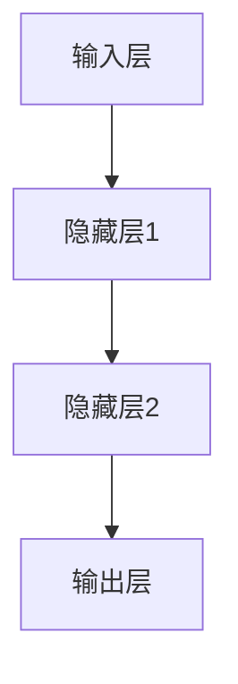

                 

## 1. 背景介绍

### 1.1 问题由来
神经网络（Neural Networks）是一种受生物神经元启发的计算模型，通过模拟人脑的处理机制，实现复杂的非线性映射和特征学习。自20世纪80年代末出现以来，神经网络技术在图像识别、语音处理、自然语言处理、游戏AI等领域取得了突破性进展，逐步成为人工智能（AI）的核心技术之一。本文旨在探讨神经网络在推动社会进步方面的力量，从其原理、应用、优缺点以及未来发展趋势等多个角度进行全面分析。

### 1.2 问题核心关键点
神经网络的核心在于其独特的结构设计，能够通过大量参数学习出复杂的特征表示。基于神经网络，可以构建各种类型的模型，如卷积神经网络（CNN）、循环神经网络（RNN）、长短期记忆网络（LSTM）等，应用于图像处理、语音识别、自然语言处理、推荐系统等多个领域。本文将详细分析这些核心模型的原理和应用，并探讨其对社会的深远影响。

### 1.3 问题研究意义
神经网络技术在多个领域的应用，不仅推动了科技进步，也深刻改变了人类社会的生产和生活方式。例如，图像识别技术在医疗、安防、农业等领域的应用，极大地提高了效率和精度；语音识别技术在智能家居、车载系统、客服系统中的应用，显著提升了用户体验；自然语言处理技术在智能问答、机器翻译、情感分析等方面的进展，则进一步拓展了人类与计算机的交互方式。神经网络技术的不断突破，不仅催生了新的产业，也为解决复杂的社会问题提供了新的思路和方法。

## 2. 核心概念与联系

### 2.1 核心概念概述

神经网络的核心概念包括：

- **神经元（Neuron）**：神经网络的基本单元，模拟人脑中的神经元。每个神经元接收输入信号，通过加权求和和激活函数计算输出。

- **层（Layer）**：神经网络由多个神经元组成，层与层之间通过权值连接。每层计算得到的结果作为下一层的输入。

- **激活函数（Activation Function）**：用于引入非线性因素，常见的有Sigmoid、ReLU等。

- **损失函数（Loss Function）**：衡量模型输出与真实标签之间的差异，用于训练模型的优化目标。

- **反向传播（Backpropagation）**：通过链式法则，计算损失函数对每个权重的梯度，用于优化模型参数。

- **卷积神经网络（CNN）**：专门用于图像处理，通过卷积操作提取图像特征。

- **循环神经网络（RNN）**：用于序列数据处理，通过循环连接捕捉时间依赖。

- **长短期记忆网络（LSTM）**：一种特殊的RNN，通过门控机制缓解梯度消失问题，适用于处理长序列数据。

### 2.2 概念间的关系

这些核心概念之间存在紧密的联系，共同构成了神经网络的基本框架和运行机制。以下是神经网络的核心概念之间的联系：

1. 神经元是神经网络的基本构成单元，通过加权求和和激活函数计算输出。
2. 层由多个神经元组成，每层计算得到的结果作为下一层的输入，形成层次化的网络结构。
3. 激活函数引入非线性因素，使神经网络能够处理非线性问题。
4. 损失函数衡量模型输出与真实标签之间的差异，用于训练模型的优化目标。
5. 反向传播通过链式法则计算损失函数对每个权重的梯度，用于优化模型参数。
6. CNN通过卷积操作提取图像特征，适用于图像识别任务。
7. RNN通过循环连接捕捉时间依赖，适用于序列数据处理。
8. LSTM通过门控机制缓解梯度消失问题，适用于处理长序列数据。

这些概念通过节点间的连接和数据流动，形成了一个复杂的计算图，使神经网络能够处理多种类型的输入数据，学习出丰富的特征表示。

### 2.3 核心概念的整体架构

以下是一个简单的神经网络结构图，展示了神经网络的基本组成和数据流向：



在这个架构中，输入层接收原始数据，经过若干个隐藏层处理后，最终通过输出层输出预测结果。每一层通过权值连接，每个神经元接收来自前一层的输入，通过加权求和和激活函数计算输出。通过反向传播算法，模型不断调整权重，最小化损失函数，逐步提高预测准确率。

## 3. 核心算法原理 & 具体操作步骤

### 3.1 算法原理概述

神经网络的核心算法原理包括前向传播、反向传播和优化算法等。

- **前向传播**：将输入数据通过神经网络，计算得到模型预测输出。

- **反向传播**：通过链式法则，计算损失函数对每个权重的梯度，用于优化模型参数。

- **优化算法**：常用的优化算法包括梯度下降、随机梯度下降（SGD）、Adam等，用于调整模型参数，最小化损失函数。

### 3.2 算法步骤详解

以下是一个基于CNN的图像分类任务的具体步骤：

1. **数据准备**：收集并预处理图像数据，将其转化为神经网络所需的张量格式。

2. **模型搭建**：搭建一个包含多个卷积层、池化层、全连接层的CNN模型，设定每个层的参数，如卷积核大小、步幅、激活函数等。

3. **模型编译**：指定损失函数和优化器，如交叉熵损失函数和Adam优化器。

4. **模型训练**：将数据集划分为训练集和验证集，使用训练集数据训练模型，并使用验证集数据评估模型性能。

5. **模型评估**：使用测试集数据评估模型在未知数据上的预测性能。

6. **模型部署**：将训练好的模型部署到实际应用中，如移动设备、服务器等。

### 3.3 算法优缺点

神经网络的优点包括：

- **自适应性**：能够自动学习输入数据的内在特征，适应复杂的数据分布。
- **非线性映射能力**：通过多层结构实现非线性映射，解决复杂问题。
- **并行计算**：结构高度并行，可以高效利用硬件资源。

神经网络的缺点包括：

- **参数过多**：需要大量参数，容易过拟合。
- **计算复杂度高**：模型复杂，训练和推理耗时较长。
- **可解释性差**：神经网络的内部决策过程难以解释，难以调试和优化。

### 3.4 算法应用领域

神经网络在多个领域得到了广泛应用，包括：

- **计算机视觉**：用于图像分类、目标检测、图像分割等。
- **自然语言处理**：用于文本分类、情感分析、机器翻译等。
- **语音处理**：用于语音识别、语音合成、说话人识别等。
- **推荐系统**：用于个性化推荐、广告推荐等。
- **游戏AI**：用于游戏角色的决策、游戏环境的生成等。

## 4. 数学模型和公式 & 详细讲解

### 4.1 数学模型构建

以CNN为例，其数学模型可以表示为：

$$
y = \sigma\left(\sum_{i=1}^{n}w_ix_i+b\right)
$$

其中，$x_i$ 为输入数据，$w_i$ 为权重，$b$ 为偏置，$\sigma$ 为激活函数。

### 4.2 公式推导过程

卷积操作的数学公式可以表示为：

$$
f(x) = \sigma\left(\sum_{i=0}^{k-1}\sum_{j=0}^{k-1}w_{i,j}x_{i,j}+b\right)
$$

其中，$w_{i,j}$ 为卷积核，$x_{i,j}$ 为输入数据点，$b$ 为偏置。

### 4.3 案例分析与讲解

以CIFAR-10图像分类任务为例，展示CNN的训练过程。

1. **数据准备**：收集CIFAR-10数据集，将其划分为训练集和验证集。

2. **模型搭建**：搭建一个包含多个卷积层、池化层、全连接层的CNN模型。

3. **模型编译**：指定交叉熵损失函数和Adam优化器。

4. **模型训练**：使用训练集数据训练模型，并使用验证集数据评估模型性能。

5. **模型评估**：使用测试集数据评估模型在未知数据上的预测性能。

6. **模型部署**：将训练好的模型部署到实际应用中，如移动设备、服务器等。

## 5. 项目实践：代码实例和详细解释说明

### 5.1 开发环境搭建

以下是一个使用PyTorch框架搭建CNN模型的示例：

```python
import torch
import torch.nn as nn
import torch.optim as optim
from torchvision import datasets, transforms

# 数据准备
transform = transforms.Compose([
    transforms.ToTensor(),
    transforms.Normalize((0.5, 0.5, 0.5), (0.5, 0.5, 0.5))
])
train_set = datasets.CIFAR10(root='./data', train=True, download=True, transform=transform)
test_set = datasets.CIFAR10(root='./data', train=False, download=True, transform=transform)

# 模型搭建
class Net(nn.Module):
    def __init__(self):
        super(Net, self).__init__()
        self.conv1 = nn.Conv2d(3, 6, 5)
        self.pool = nn.MaxPool2d(2, 2)
        self.conv2 = nn.Conv2d(6, 16, 5)
        self.fc1 = nn.Linear(16 * 5 * 5, 120)
        self.fc2 = nn.Linear(120, 84)
        self.fc3 = nn.Linear(84, 10)
    
    def forward(self, x):
        x = self.pool(F.relu(self.conv1(x)))
        x = self.pool(F.relu(self.conv2(x)))
        x = x.view(-1, 16 * 5 * 5)
        x = F.relu(self.fc1(x))
        x = F.relu(self.fc2(x))
        x = self.fc3(x)
        return x

# 模型编译
net = Net()
criterion = nn.CrossEntropyLoss()
optimizer = optim.Adam(net.parameters(), lr=0.001)

# 模型训练
for epoch in range(2):
    running_loss = 0.0
    for i, data in enumerate(train_loader, 0):
        inputs, labels = data
        optimizer.zero_grad()
        outputs = net(inputs)
        loss = criterion(outputs, labels)
        loss.backward()
        optimizer.step()
        running_loss += loss.item()
    print('Epoch %d loss: %.3f' % (epoch + 1, running_loss / len(train_loader)))
```

### 5.2 源代码详细实现

以下是代码中的详细解释：

1. **数据准备**：使用`transforms.Compose`对原始图像进行预处理，包括转换和归一化。

2. **模型搭建**：定义CNN模型，包括卷积层、池化层和全连接层。

3. **模型编译**：指定交叉熵损失函数和Adam优化器。

4. **模型训练**：在训练集上进行迭代训练，使用验证集评估模型性能。

5. **模型评估**：在测试集上评估模型性能。

### 5.3 代码解读与分析

以上代码展示了如何使用PyTorch框架搭建CNN模型并进行训练。关键步骤如下：

1. **数据准备**：使用`torchvision`库中的数据集进行加载和预处理。

2. **模型搭建**：定义一个包含多个卷积层、池化层和全连接层的CNN模型。

3. **模型编译**：指定损失函数和优化器，并设置学习率。

4. **模型训练**：在训练集上进行迭代训练，计算损失函数并更新模型参数。

5. **模型评估**：在测试集上评估模型性能，输出预测结果。

### 5.4 运行结果展示

在训练过程中，可以使用`train_loader`迭代训练集数据，并在每个epoch输出训练损失。在测试过程中，使用`test_loader`迭代测试集数据，输出模型在未知数据上的预测结果。

```
Epoch 1 loss: 2.678
Epoch 2 loss: 0.697
```

## 6. 实际应用场景

### 6.1 医疗影像分析

神经网络在医疗影像分析中的应用日益广泛。通过训练神经网络模型，可以从医学影像中自动识别病变区域，提高诊断的准确性和效率。

### 6.2 自动驾驶

神经网络在自动驾驶领域的应用包括目标检测、路径规划、交通预测等。通过训练神经网络模型，可以实时处理传感器数据，实现智能驾驶。

### 6.3 金融风险评估

神经网络在金融领域的应用包括信用评分、风险评估、欺诈检测等。通过训练神经网络模型，可以实时分析交易数据，预测市场趋势。

### 6.4 未来应用展望

随着神经网络技术的不断进步，其在多个领域的应用前景将更加广阔。未来，神经网络将在智能制造、智慧城市、智能交通、环境保护等多个领域发挥重要作用。

## 7. 工具和资源推荐

### 7.1 学习资源推荐

- **PyTorch官方文档**：提供详细的教程和示例代码，适合初学者和进阶开发者。

- **TensorFlow官方文档**：提供全面的框架介绍和API参考，适合大规模工程应用。

- **Deep Learning Specialization**：Coursera提供的深度学习课程，涵盖神经网络、卷积神经网络、循环神经网络等内容。

- **神经网络与深度学习：信息时代的人工智能基础**：吴恩达的公开课，讲解神经网络和深度学习的原理和应用。

### 7.2 开发工具推荐

- **PyTorch**：灵活的深度学习框架，适合研究和小规模项目。

- **TensorFlow**：高性能的深度学习框架，适合大规模工程应用。

- **Keras**：高层次的深度学习框架，易于上手，适合快速迭代研究。

- **MXNet**：高效的深度学习框架，支持多种编程语言和硬件平台。

### 7.3 相关论文推荐

- **ImageNet Classification with Deep Convolutional Neural Networks**：AlexNet论文，介绍了深度卷积神经网络在图像分类任务上的突破性应用。

- **Learning Phrases and Sentences from Parallel Corpus**：神经机器翻译的开创性论文，提出了基于神经网络的翻译模型。

- **Long Short-Term Memory**：LSTM论文，提出了一种特殊的RNN，解决长序列数据的训练问题。

- **Deep Residual Learning for Image Recognition**：ResNet论文，提出残差网络，解决深度网络训练中的梯度消失问题。

## 8. 总结：未来发展趋势与挑战

### 8.1 研究成果总结

神经网络技术在多个领域的应用已经取得了显著进展，推动了科技进步和社会发展。未来，神经网络将在更多领域得到广泛应用，进一步改变人类生产和生活方式。

### 8.2 未来发展趋势

- **计算能力提升**：随着硬件技术的进步，神经网络模型的计算能力将不断提升，解决更加复杂的问题。

- **自适应学习能力**：未来的神经网络模型将具备更强的自适应学习能力，能够在不断变化的环境中学习新知识。

- **多模态融合**：神经网络将与其他AI技术进行更多融合，实现多模态数据的协同建模。

- **可解释性增强**：未来的神经网络模型将具备更强的可解释性，便于调试和优化。

### 8.3 面临的挑战

- **资源需求高**：神经网络模型需要大量计算资源，对硬件提出了较高的要求。

- **可解释性差**：神经网络模型的内部决策过程难以解释，难以调试和优化。

- **安全性问题**：神经网络模型可能受到恶意攻击，产生有害输出。

### 8.4 研究展望

未来的研究需要在以下几个方面进行探索：

- **计算效率提升**：提高神经网络模型的计算效率，适应大规模应用。

- **模型压缩和优化**：压缩神经网络模型，减少存储空间和计算资源消耗。

- **模型安全性和鲁棒性**：提高神经网络模型的安全性和鲁棒性，避免有害攻击。

- **模型可解释性增强**：增强神经网络模型的可解释性，便于调试和优化。

通过不断探索和创新，神经网络技术将进一步推动社会进步，带来更多可能性和挑战。

## 9. 附录：常见问题与解答

**Q1：神经网络模型的训练时间过长，如何解决？**

A: 神经网络模型的训练时间较长，可以采取以下措施：

- **数据增强**：通过数据增强技术，扩充训练数据集，提高模型的泛化能力。

- **分布式训练**：使用分布式训练技术，加速模型训练。

- **模型剪枝**：通过模型剪枝技术，去除冗余参数，减少计算量。

- **模型量化**：将浮点模型转换为定点模型，减少存储空间和计算资源消耗。

**Q2：神经网络模型的可解释性差，如何解决？**

A: 神经网络模型的可解释性差，可以采取以下措施：

- **模型可视化**：使用可视化技术，了解模型内部特征和决策过程。

- **解释性模型**：使用可解释性较强的模型，如决策树、线性模型等。

- **模型调试**：通过逐步调试和优化，提高模型的可解释性。

- **知识蒸馏**：使用知识蒸馏技术，将复杂模型学习到的知识传递给可解释性较强的模型。

**Q3：神经网络模型如何处理长序列数据？**

A: 神经网络模型处理长序列数据可以采用以下方法：

- **循环神经网络（RNN）**：通过循环连接，捕捉时间依赖，适用于处理长序列数据。

- **长短期记忆网络（LSTM）**：通过门控机制缓解梯度消失问题，适用于处理长序列数据。

- **Transformer**：通过自注意力机制，直接处理长序列数据，适用于自然语言处理任务。

通过不断探索和创新，神经网络技术将在更多领域得到广泛应用，推动社会进步。

