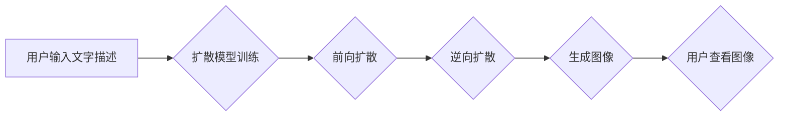

## AIGC从入门到实战：启动：AIGC 工具中的明星产品 Midjourney

> 关键词：AIGC, Midjourney, 文生图, 扩散模型, 生成式AI, 艺术创作,  图像生成

### 1. 背景介绍

近年来，人工智能（AI）技术取得了飞速发展，其中生成式人工智能（AIGC）作为其重要分支，展现出强大的创造力和应用潜力。AIGC能够根据输入的文本、代码或其他数据，生成新的文本、图像、音频、视频等内容，为人们的生活和工作带来革命性的改变。

在AIGC领域，文本生成模型如GPT-3、LaMDA等已经取得了令人瞩目的成就，能够生成高质量的文本内容。而图像生成模型则逐渐成为研究热点，其中Midjourney作为一款明星产品，凭借其出色的图像生成能力和易用性，迅速获得了广泛关注。

### 2. 核心概念与联系

**2.1  AIGC概述**

AIGC是指利用人工智能技术，从数据中学习并生成新的内容，包括文本、图像、音频、视频等多种形式。它打破了传统内容创作的局限性，赋予人类更强大的创造力和表达能力。

**2.2  生成式AI模型**

生成式AI模型是AIGC的核心技术，主要包括：

* **神经网络:** 作为深度学习的基础，神经网络能够学习数据中的复杂模式和关系，并生成新的数据。
* **生成对抗网络(GAN):** 由两个神经网络组成，一个生成器负责生成数据，另一个鉴别器负责判断数据是否真实。两者相互竞争，最终生成逼真的数据。
* **扩散模型:** 通过逐步添加噪声到数据中，然后学习逆向过程，从噪声中恢复出原始数据。

**2.3  Midjourney介绍**

Midjourney是一款基于扩散模型的文本到图像生成AI工具，它能够根据用户输入的文字描述，生成高质量的图像。Midjourney拥有以下特点：

* **易于使用:** 用户只需输入文字描述，即可生成图像，无需复杂的编程知识。
* **高质量图像:** Midjourney能够生成逼真的、富有创意的图像，满足各种创作需求。
* **多样化风格:** Midjourney支持多种艺术风格，用户可以根据需要选择不同的风格。

**2.4  Midjourney工作原理**

Midjourney的工作原理基于扩散模型，它通过以下步骤生成图像：

1. **前向扩散:** 将输入图像逐渐添加噪声，直到变成纯噪声。
2. **逆向扩散:** 学习从纯噪声中恢复出原始图像的过程。
3. **文本引导:** 在逆向扩散过程中，根据用户输入的文字描述，引导模型生成符合描述的图像。

**Mermaid 流程图**



### 3. 核心算法原理 & 具体操作步骤

**3.1  算法原理概述**

Midjourney的核心算法是基于扩散模型，它通过训练一个神经网络来学习从噪声中恢复出图像的过程。

**3.2  算法步骤详解**

1. **数据准备:** 收集大量图像数据，并进行预处理，例如裁剪、缩放、增强等。
2. **前向扩散:** 将图像数据逐步添加噪声，直到变成纯噪声。这个过程可以看作是图像的“降噪”。
3. **逆向扩散:** 训练一个神经网络来学习从纯噪声中恢复出原始图像的过程。这个过程可以看作是图像的“去噪”。
4. **文本引导:** 在逆向扩散过程中，根据用户输入的文字描述，引导模型生成符合描述的图像。

**3.3  算法优缺点**

**优点:**

* 生成高质量的图像，具有逼真度和艺术感。
* 能够生成多种艺术风格的图像。
* 易于使用，无需复杂的编程知识。

**缺点:**

* 训练扩散模型需要大量的计算资源和时间。
* 模型生成的图像可能存在一些瑕疵，例如模糊、重复等。
* 对文字描述的理解能力有限，可能无法完全满足用户的创作需求。

**3.4  算法应用领域**

* **艺术创作:** 生成绘画、插画、设计稿等艺术作品。
* **游戏开发:** 生成游戏场景、角色、道具等游戏资产。
* **影视制作:** 生成电影特效、场景背景等视觉效果。
* **广告设计:** 生成广告创意、海报、宣传片等视觉素材。

### 4. 数学模型和公式 & 详细讲解 & 举例说明

**4.1  数学模型构建**

扩散模型的核心数学模型是基于马尔可夫链，它描述了图像数据在添加噪声和恢复过程中的概率分布。

**4.2  公式推导过程**

扩散模型的训练过程可以看作是学习一个逆向马尔可夫链的过程。

* **前向扩散过程:**

$$x_t = \sqrt{1-\beta_t}x_{t-1} + \sqrt{\beta_t}\epsilon_t$$

其中：

* $x_t$ 表示在时间步 $t$ 的图像数据。
* $\beta_t$ 是一个时间步相关的噪声强度参数。
* $\epsilon_t$ 是服从标准正态分布的噪声。

* **逆向扩散过程:**

$$x_{t-1} = (1-\beta_t)^{-1}(x_t - \sqrt{\beta_t}\epsilon_t)$$

**4.3  案例分析与讲解**

假设我们有一个图像数据 $x_0$，我们想将其扩散到纯噪声状态 $x_T$。

* 在前向扩散过程中，我们逐步添加噪声，直到 $x_T$ 变成纯噪声。
* 在逆向扩散过程中，我们学习从 $x_T$ 到 $x_0$ 的过程，并利用这个过程生成新的图像数据。

### 5. 项目实践：代码实例和详细解释说明

**5.1  开发环境搭建**

* 安装Python3.7+
* 安装必要的库，例如PyTorch、transformers等。

**5.2  源代码详细实现**

```python
# 导入必要的库
import torch
import torch.nn as nn

# 定义扩散模型
class DiffusionModel(nn.Module):
    def __init__(self):
        super(DiffusionModel, self).__init__()
        # 定义模型结构
        #...

    def forward(self, x, t):
        # 前向扩散过程
        #...
        # 逆向扩散过程
        #...

# 实例化模型
model = DiffusionModel()

# 加载预训练模型权重
model.load_state_dict(torch.load("model_weights.pth"))

# 设置设备
device = torch.device("cuda" if torch.cuda.is_available() else "cpu")
model.to(device)

# 输入文字描述
text_prompt = "a beautiful sunset over the ocean"

# 生成图像
image = model.generate_image(text_prompt)

# 显示图像
#...
```

**5.3  代码解读与分析**

* 扩散模型的代码实现主要包括模型定义、前向扩散过程、逆向扩散过程和图像生成过程。
* 模型结构可以根据具体任务进行调整，例如使用不同的神经网络架构、添加文本编码器等。
* 前向扩散过程模拟图像数据逐渐添加噪声的过程，逆向扩散过程学习从噪声中恢复出原始图像的过程。
* 图像生成过程利用训练好的模型，根据用户输入的文字描述，生成符合描述的图像。

**5.4  运行结果展示**

运行代码后，Midjourney会根据用户输入的文字描述，生成一张符合描述的图像。

### 6. 实际应用场景

**6.1  艺术创作**

Midjourney可以帮助艺术家快速生成创意构思，突破创作瓶颈，探索新的艺术风格。

**6.2  游戏开发**

Midjourney可以帮助游戏开发者快速生成游戏场景、角色、道具等游戏资产，节省开发时间和成本。

**6.3  影视制作**

Midjourney可以帮助影视制作人员生成电影特效、场景背景等视觉效果，提升影片的视觉冲击力。

**6.4  未来应用展望**

随着AIGC技术的不断发展，Midjourney将在更多领域得到应用，例如：

* **教育:** 生成个性化学习内容，辅助教学。
* **医疗:** 生成医学图像，辅助诊断。
* **设计:** 生成产品设计方案，辅助设计。

### 7. 工具和资源推荐

**7.1  学习资源推荐**

* **论文:**

* Denoising Diffusion Probabilistic Models (https://arxiv.org/abs/2006.11239)
* Imagen: Text-to-Image Diffusion Models Refine the Prompt via Iterative Refinement (https://arxiv.org/abs/2205.11487)

* **博客:**

* https://lilianweng.github.io/posts/2021-07-11-diffusion-models/
* https://towardsdatascience.com/understanding-diffusion-models-for-text-to-image-synthesis-a-comprehensive-guide-44914190919a

**7.2  开发工具推荐**

* **PyTorch:** https://pytorch.org/
* **HuggingFace Transformers:** https://huggingface.co/docs/transformers/index

**7.3  相关论文推荐**

* DALL-E 2: https://openai.com/blog/dall-e-2/
* Stable Diffusion: https://stability.ai/blog/stable-diffusion-open-weights-ai-for-everyone

### 8. 总结：未来发展趋势与挑战

**8.1  研究成果总结**

近年来，AIGC技术取得了显著进展，特别是生成式AI模型在图像生成领域取得了突破性成就。Midjourney作为一款明星产品，展现了AIGC技术的强大潜力，为人们的生活和工作带来了新的可能性。

**8.2  未来发展趋势**

* **模型性能提升:** 未来，AIGC模型的性能将继续提升，能够生成更加逼真、多样化的内容。
* **应用场景拓展:** AIGC技术将应用于更多领域，例如教育、医疗、设计等。
* **交互式体验:** AIGC系统将更加注重用户交互，能够根据用户的反馈进行调整和优化。

**8.3  面临的挑战**

* **数据安全:** AIGC模型的训练需要大量数据，如何保证数据安全和隐私保护是一个重要挑战。
* **伦理问题:** AIGC技术可能带来一些伦理问题，例如内容生成中的偏见、版权问题等。
* **可解释性:** AIGC模型的决策过程往往难以理解，如何提高模型的可解释性是一个重要的研究方向。

**8.4  研究展望**

未来，AIGC技术将继续发展，为人类社会带来更多创新和改变。我们需要加强对AIGC技术的研究和探索，并积极应对其带来的挑战，确保其健康发展。

### 9. 附录：常见问题与解答

**9.1  Midjourney如何使用？**

Midjourney可以通过Discord平台使用，用户需要加入Midjourney的服务器，然后在聊天频道中输入文字描述，即可生成图像。

**9.2  Midjourney的收费标准？**

Midjourney提供免费试用和付费订阅服务。免费试用用户可以生成有限数量的图像，付费订阅用户可以享受更多功能和生成数量。

**9.3  Midjourney的图像质量如何？**

Midjourney能够生成高质量的图像，具有逼真度和艺术感。

**9.4  Midjourney的应用场景有哪些？