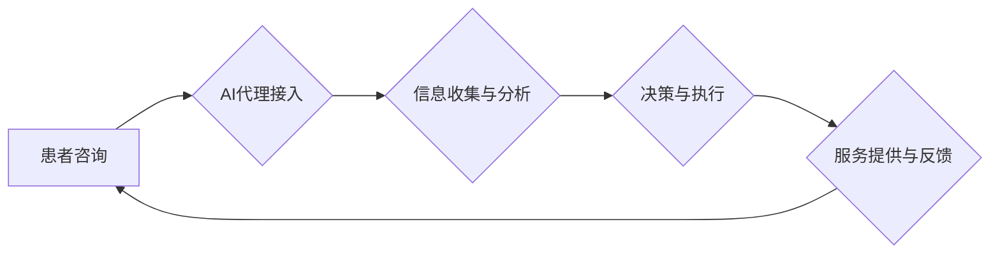

## AI代理在健康医疗中的工作流程与患者管理

> 关键词：人工智能代理、医疗保健、患者管理、工作流程优化、机器学习、自然语言处理

## 1. 背景介绍

医疗保健行业正处于数字化转型时期，人工智能（AI）技术正在迅速改变着医疗服务模式。AI代理作为一种新型的智能化技术，在医疗保健领域展现出巨大的潜力，能够有效地优化工作流程、提高患者管理效率，并最终提升医疗服务质量。

传统的医疗工作流程往往冗长、繁琐，患者信息管理分散，沟通效率低下。AI代理能够通过自动化处理任务、智能分析数据、提供个性化服务等方式，有效解决这些问题。例如，AI代理可以自动预约医生、提醒患者服药、收集患者病历信息，并根据患者的病情提供个性化的健康建议。

## 2. 核心概念与联系

**2.1 AI代理的概念**

AI代理是一种能够自主执行任务、与用户交互、学习和适应环境的智能软件系统。它通常由以下几个核心组件组成：

* **感知模块:** 收集来自外部环境的信息，例如患者的语音、文本、图像等。
* **推理模块:** 分析和理解感知到的信息，并根据预先设定的规则或机器学习模型做出决策。
* **执行模块:** 执行决策，例如预约医生、发送短信、控制医疗设备等。
* **学习模块:** 从过去的经验中学习，不断改进自己的决策能力。

**2.2 AI代理在医疗保健中的应用场景**

AI代理在医疗保健领域具有广泛的应用场景，例如：

* **患者咨询与预约:** AI代理可以接听患者的咨询电话，提供基本的医疗信息，并帮助患者预约医生。
* **远程医疗:** AI代理可以帮助医生进行远程诊断和治疗，例如通过视频通话与患者进行沟通，查看患者的病历信息，并提供远程医疗建议。
* **药物管理:** AI代理可以帮助患者管理药物，例如提醒患者服药，记录服药情况，并根据患者的病情调整药物剂量。
* **健康监测:** AI代理可以帮助患者监测自己的健康状况，例如通过 wearable 设备收集患者的生理数据，并根据数据分析提供健康建议。

**2.3 AI代理与患者管理的联系**

AI代理能够有效地提升患者管理效率，主要体现在以下几个方面：

* **个性化服务:** AI代理可以根据患者的个人信息、病史、生活习惯等因素，提供个性化的医疗服务和健康建议。
* **实时沟通:** AI代理可以提供24小时的在线咨询服务，及时解答患者的疑问，并提供必要的帮助。
* **数据分析:** AI代理可以收集和分析患者的医疗数据，帮助医生更好地了解患者的病情，制定更有效的治疗方案。
* **流程自动化:** AI代理可以自动化处理一些重复性的患者管理任务，例如预约医生、发送短信、记录病历等，释放医护人员的工作时间，让他们能够专注于更重要的工作。

**2.4 工作流程图**



## 3. 核心算法原理 & 具体操作步骤

**3.1 算法原理概述**

AI代理在医疗保健领域的应用主要依赖于以下几个核心算法：

* **自然语言处理 (NLP):** 用于理解和处理患者的自然语言输入，例如语音、文本等。
* **机器学习 (ML):** 用于训练AI代理，使其能够从数据中学习，并做出更准确的决策。
* **深度学习 (DL):** 用于处理复杂的数据，例如图像、视频等，并进行更精准的分析和识别。

**3.2 算法步骤详解**

1. **数据收集与预处理:** 收集患者的医疗数据，例如病历、检查报告、生活习惯等，并进行清洗、格式化等预处理工作。
2. **特征提取:** 从患者数据中提取有用的特征，例如年龄、性别、症状、病史等。
3. **模型训练:** 使用机器学习算法训练AI代理模型，使其能够根据患者特征预测疾病风险、诊断病情、制定治疗方案等。
4. **模型评估与优化:** 对训练好的模型进行评估，并根据评估结果进行优化，提高模型的准确性和效率。
5. **部署与应用:** 将训练好的模型部署到实际应用场景中，例如患者咨询系统、远程医疗平台等。

**3.3 算法优缺点**

**优点:**

* **自动化处理:** AI代理能够自动化处理一些重复性的任务，提高效率。
* **个性化服务:** AI代理可以根据患者的个人信息提供个性化的服务。
* **数据分析:** AI代理可以收集和分析患者数据，帮助医生更好地了解患者的病情。

**缺点:**

* **数据依赖:** AI代理的性能取决于训练数据的质量和数量。
* **伦理问题:** AI代理的应用可能涉及到患者隐私和数据安全等伦理问题。
* **解释性问题:** 一些AI算法的决策过程难以解释，这可能导致患者对AI代理的信任度降低。

**3.4 算法应用领域**

* **疾病诊断:** AI代理可以辅助医生进行疾病诊断，例如根据患者的症状和检查报告预测疾病风险。
* **个性化治疗:** AI代理可以根据患者的基因信息、生活习惯等因素，制定个性化的治疗方案。
* **药物研发:** AI代理可以加速药物研发过程，例如预测药物的疗效和安全性。
* **医疗保健管理:** AI代理可以帮助医院和诊所进行医疗保健管理，例如优化资源配置、提高患者满意度。

## 4. 数学模型和公式 & 详细讲解 & 举例说明

**4.1 数学模型构建**

在AI代理的医疗保健应用中，常用的数学模型包括：

* **逻辑回归:** 用于预测二分类问题，例如患者是否患有某种疾病。
* **支持向量机 (SVM):** 用于分类和回归问题，例如根据患者的特征预测疾病风险。
* **决策树:** 用于分类和回归问题，例如根据患者的症状诊断疾病。
* **神经网络:** 用于处理复杂的数据，例如图像、视频等，并进行更精准的分析和识别。

**4.2 公式推导过程**

例如，逻辑回归模型的预测公式如下：

$$
P(y=1|x) = \frac{1}{1 + e^{-(w^T x + b)}}
$$

其中：

* $P(y=1|x)$ 是患者患有疾病的概率。
* $x$ 是患者的特征向量。
* $w$ 是模型的权重向量。
* $b$ 是模型的偏置项。

**4.3 案例分析与讲解**

假设我们想要训练一个AI代理模型，用于预测患者是否患有糖尿病。我们可以收集患者的年龄、体重、血压等特征数据，并将其作为训练数据。然后，我们可以使用逻辑回归模型训练这个AI代理模型。

训练完成后，我们可以将模型应用到新的患者数据中，预测他们是否患有糖尿病。例如，如果一个患者的年龄为40岁，体重为80公斤，血压为130/80mmHg，那么AI代理模型可以根据这些特征数据，预测该患者患糖尿病的概率。

## 5. 项目实践：代码实例和详细解释说明

**5.1 开发环境搭建**

* 操作系统: Ubuntu 20.04
* Python 版本: 3.8
* 必要的库: TensorFlow, PyTorch, scikit-learn, NLTK

**5.2 源代码详细实现**

```python
# 导入必要的库
import tensorflow as tf
from sklearn.model_selection import train_test_split
from sklearn.metrics import accuracy_score

# 加载数据
(x_train, y_train), (x_test, y_test) = tf.keras.datasets.mnist.load_data()

# 数据预处理
x_train = x_train.astype('float32') / 255.0
x_test = x_test.astype('float32') / 255.0

# 将数据转换为适合模型输入的格式
x_train = x_train.reshape((x_train.shape[0], 28 * 28))
x_test = x_test.reshape((x_test.shape[0], 28 * 28))

# 将标签转换为 one-hot 编码
y_train = tf.keras.utils.to_categorical(y_train, num_classes=10)
y_test = tf.keras.utils.to_categorical(y_test, num_classes=10)

# 创建模型
model = tf.keras.models.Sequential([
    tf.keras.layers.Dense(128, activation='relu', input_shape=(784,)),
    tf.keras.layers.Dropout(0.2),
    tf.keras.layers.Dense(10, activation='softmax')
])

# 编译模型
model.compile(optimizer='adam',
              loss='categorical_crossentropy',
              metrics=['accuracy'])

# 训练模型
model.fit(x_train, y_train, epochs=10, batch_size=32)

# 评估模型
loss, accuracy = model.evaluate(x_test, y_test)
print('Test loss:', loss)
print('Test accuracy:', accuracy)
```

**5.3 代码解读与分析**

这段代码实现了使用 TensorFlow 库训练一个简单的深度学习模型，用于识别手写数字。

* 首先，代码导入必要的库，并加载 MNIST 数据集。
* 然后，代码对数据进行预处理，例如将数据转换为浮点数，并将其转换为适合模型输入的格式。
* 接着，代码创建了一个简单的深度学习模型，包含一个全连接层和一个 softmax 层。
* 然后，代码编译模型，指定优化器、损失函数和评估指标。
* 最后，代码训练模型，并评估模型的性能。

**5.4 运行结果展示**

运行这段代码后，会输出模型的训练过程和评估结果。

## 6. 实际应用场景

**6.1 患者咨询与预约**

AI代理可以接听患者的咨询电话，提供基本的医疗信息，并帮助患者预约医生。例如，患者可以通过语音或文本向AI代理询问感冒的症状和治疗方法，或者预约心内科医生。

**6.2 远程医疗**

AI代理可以帮助医生进行远程诊断和治疗，例如通过视频通话与患者进行沟通，查看患者的病历信息，并提供远程医疗建议。例如，患者可以通过视频通话与医生进行远程咨询，医生可以根据患者的症状和病历信息，远程诊断病情并提供治疗方案。

**6.3 药物管理**

AI代理可以帮助患者管理药物，例如提醒患者服药，记录服药情况，并根据患者的病情调整药物剂量。例如，患者可以通过AI代理设置服药提醒，AI代理会根据患者的服药计划，在指定的时间提醒患者服药。

**6.4 未来应用展望**

随着AI技术的不断发展，AI代理在医疗保健领域的应用场景将会更加广泛。例如，AI代理可以帮助医生进行更精准的疾病诊断，制定更个性化的治疗方案，并提高患者的治疗效果。

## 7. 工具和资源推荐

**7.1 学习资源推荐**

* **在线课程:** Coursera, edX, Udacity 等平台提供许多关于AI和机器学习的在线课程。
* **书籍:** 《深度学习》、《机器学习实战》等书籍是学习AI和机器学习的经典教材。
* **开源项目:** TensorFlow, PyTorch 等开源项目提供了丰富的学习资源和代码示例。

**7.2 开发工具推荐**

* **Python:** Python 是目前最流行的AI开发语言。
* **TensorFlow:** TensorFlow 是一个开源的机器学习框架，支持多种深度学习模型的训练和部署。
* **PyTorch:** PyTorch 是另一个开源的机器学习框架，以其灵活性和易用性而闻名。

**7.3 相关论文推荐**

* **Attention Is All You Need:** https://arxiv