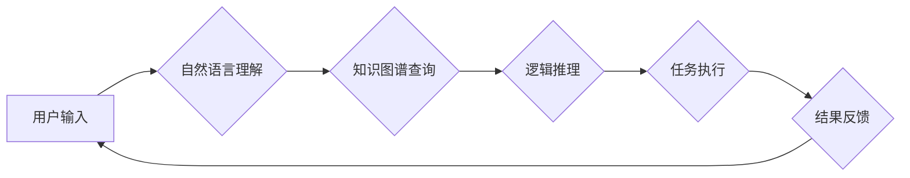

## AI助理时代的企业变革

> 关键词：人工智能、AI助理、企业变革、自动化、流程优化、数据分析、决策支持、未来趋势

### 1. 背景介绍

人工智能（AI）技术近年来发展迅速，并开始深刻地改变着各行各业。其中，AI助理作为一种新型的智能应用，凭借其强大的智能处理能力和便捷的操作方式，正在逐渐成为企业数字化转型的重要驱动力。

AI助理是指能够理解和响应人类自然语言指令，并执行相关任务的智能软件系统。它可以帮助企业自动化重复性工作，提高工作效率，释放人力资源，并提供更精准的数据分析和决策支持。

随着AI技术的不断进步，AI助理的应用场景也越来越广泛，涵盖了客服、营销、销售、人力资源、财务等多个领域。企业越来越认识到AI助理的价值，并积极探索其在企业运营中的应用。

### 2. 核心概念与联系

**2.1 AI助理的核心概念**

AI助理的核心概念包括：

* **自然语言处理（NLP）：** 理解和处理人类语言，包括文本和语音。
* **机器学习（ML）：** 从数据中学习模式和知识，并根据学习到的知识进行预测和决策。
* **知识图谱（KG）：**  组织和存储知识的结构化表示，用于辅助AI助理理解和推理。
* **对话系统：**  与用户进行交互，并根据用户的指令提供服务。

**2.2 AI助理与企业变革的联系**

AI助理的应用可以帮助企业实现以下方面的变革：

* **自动化流程：**  AI助理可以自动化重复性工作，例如数据录入、邮件回复、预约安排等，提高工作效率，降低成本。
* **个性化服务：**  AI助理可以根据用户的需求和喜好提供个性化的服务，例如推荐产品、提供定制化方案等，提升用户体验。
* **数据驱动决策：**  AI助理可以分析海量数据，提供数据驱动的决策支持，帮助企业做出更明智的决策。
* **提升员工生产力：**  AI助理可以解放员工从重复性工作中，让他们专注于更具创造性和战略性的工作，提升员工生产力。

**2.3 AI助理架构流程图**



### 3. 核心算法原理 & 具体操作步骤

**3.1 算法原理概述**

AI助理的核心算法原理主要包括：

* **词嵌入：** 将单词映射到向量空间，捕捉单词之间的语义关系。
* **序列标注：**  识别文本序列中的标签，例如命名实体识别、情感分析等。
* **机器翻译：** 将文本从一种语言翻译成另一种语言。
* **对话管理：**  控制对话流程，理解用户意图，并生成相应的回复。

**3.2 算法步骤详解**

1. **数据预处理：**  清洗和格式化数据，例如去除停用词、分词、词性标注等。
2. **模型训练：**  使用训练数据训练AI模型，例如使用深度学习算法训练词嵌入模型、序列标注模型等。
3. **模型评估：**  使用测试数据评估模型的性能，例如计算准确率、召回率、F1-score等。
4. **模型部署：**  将训练好的模型部署到生产环境中，用于实际应用。

**3.3 算法优缺点**

**优点：**

* **自动化程度高：**  可以自动化许多重复性工作，提高效率。
* **精准度高：**  基于机器学习算法，可以实现更高的精准度。
* **可扩展性强：**  可以根据需要扩展功能和应用场景。

**缺点：**

* **数据依赖性强：**  需要大量高质量的数据进行训练。
* **解释性差：**  一些深度学习模型的决策过程难以解释。
* **伦理风险：**  需要考虑AI助理的伦理风险，例如数据隐私、算法偏见等。

**3.4 算法应用领域**

AI助理的应用领域非常广泛，包括：

* **客服：**  提供24小时在线客服，解答用户疑问，处理投诉。
* **营销：**  进行精准营销，推荐个性化产品，提高转化率。
* **销售：**  辅助销售人员完成销售工作，例如生成报价单、安排会议等。
* **人力资源：**  招聘、培训、绩效管理等。
* **财务：**  自动处理财务报表、进行风险评估等。

### 4. 数学模型和公式 & 详细讲解 & 举例说明

**4.1 数学模型构建**

AI助理的数学模型通常基于统计学习和概率论。例如，词嵌入模型可以使用Word2Vec或GloVe算法，将单词映射到向量空间，并使用余弦相似度来衡量单词之间的语义关系。

**4.2 公式推导过程**

Word2Vec模型使用神经网络来学习词嵌入。其目标是预测上下文词，并通过反向传播算法更新词向量。

**Word2Vec目标函数：**

$$J(\theta) = -\frac{1}{N} \sum_{i=1}^{N} \sum_{j \in C(w_i)} \log p(w_j | w_i; \theta)$$

其中：

* $N$ 是训练样本的数量。
* $w_i$ 是中心词。
* $C(w_i)$ 是中心词 $w_i$ 的上下文词集合。
* $p(w_j | w_i; \theta)$ 是中心词 $w_i$ 给定上下文词 $w_j$ 的概率，由神经网络参数 $\theta$ 决定。

**4.3 案例分析与讲解**

假设我们有一个句子：“The cat sat on the mat”。

使用Word2Vec模型，我们可以学习到“cat”和“mat”之间的语义关系。因为它们经常出现在同一个句子中，所以它们的词向量会比较接近。

我们可以使用余弦相似度来衡量“cat”和“mat”之间的语义相似度：

$$similarity(\text{cat}, \text{mat}) = \frac{\text{cat} \cdot \text{mat}}{||\text{cat}|| ||\text{mat}||}$$

其中：

* $\text{cat}$ 和 $\text{mat}$ 是“cat”和“mat”的词向量。
* $\cdot$ 表示点积运算。
* $||\cdot||$ 表示向量的模长。

如果“cat”和“mat”的词向量比较接近，则它们的余弦相似度会比较高，表示它们在语义上比较相似。

### 5. 项目实践：代码实例和详细解释说明

**5.1 开发环境搭建**

* Python 3.x
* TensorFlow 或 PyTorch
* NLTK 或 spaCy

**5.2 源代码详细实现**

```python
import nltk
from nltk.corpus import stopwords
from nltk.tokenize import word_tokenize

# 下载停用词列表
nltk.download('stopwords')

# 定义文本预处理函数
def preprocess_text(text):
    # 分词
    tokens = word_tokenize(text)
    # 去除停用词
    stop_words = set(stopwords.words('english'))
    tokens = [word for word in tokens if word.lower() not in stop_words]
    return tokens

# 示例文本
text = "This is an example sentence for text preprocessing."

# 预处理文本
processed_text = preprocess_text(text)

# 打印预处理后的文本
print(processed_text)
```

**5.3 代码解读与分析**

* 该代码示例演示了如何使用NLTK库对文本进行预处理，包括分词和去除停用词。
* `word_tokenize()`函数将文本分割成单词。
* `stopwords.words('english')`函数获取英文停用词列表。
* 代码中使用列表推导式过滤掉停用词，保留语义相关的单词。

**5.4 运行结果展示**

```
['example','sentence', 'text', 'preprocessing']
```

### 6. 实际应用场景

**6.1 客服自动化**

AI助理可以接管客户服务，回答常见问题，处理简单的请求，例如预约、查询订单状态等。

**6.2 营销自动化**

AI助理可以根据用户的行为和偏好，提供个性化的产品推荐，发送精准的营销邮件，提高营销转化率。

**6.3 数据分析与决策支持**

AI助理可以分析海量数据，识别趋势和模式，为企业决策提供数据支持。

**6.4 未来应用展望**

随着AI技术的不断发展，AI助理的应用场景将更加广泛，例如：

* **个性化教育：**  根据学生的学习进度和需求，提供个性化的学习方案。
* **医疗辅助：**  辅助医生诊断疾病、制定治疗方案。
* **法律服务：**  辅助律师进行法律研究、撰写法律文件。

### 7. 工具和资源推荐

**7.1 学习资源推荐**

* **在线课程：**  Coursera、edX、Udacity 等平台提供丰富的AI课程。
* **书籍：**  《深度学习》、《人工智能：一种现代方法》等。
* **博客和论坛：**  Towards Data Science、Machine Learning Mastery 等。

**7.2 开发工具推荐**

* **Python：**  主流的AI开发语言。
* **TensorFlow：**  开源深度学习框架。
* **PyTorch：**  另一个流行的深度学习框架。
* **Hugging Face Transformers：**  提供预训练的自然语言处理模型。

**7.3 相关论文推荐**

* **Attention Is All You Need：**  Transformer模型的开创性论文。
* **BERT：**  预训练语言表示模型。
* **GPT-3：**  强大的文本生成模型。

### 8. 总结：未来发展趋势与挑战

**8.1 研究成果总结**

近年来，AI助理领域取得了显著进展，例如：

* **模型性能提升：**  深度学习算法的不断发展，使得AI助理的性能大幅提升。
* **应用场景拓展：**  AI助理的应用场景越来越广泛，覆盖了多个领域。
* **开源工具普及：**  开源框架和预训练模型的普及，降低了AI助理开发的门槛。

**8.2 未来发展趋势**

* **更强大的模型：**  研究人员将继续开发更强大的AI模型，例如多模态AI助理，能够理解和处理文本、图像、音频等多种数据类型。
* **更个性化的服务：**  AI助理将更加个性化，能够根据用户的需求和喜好提供定制化的服务。
* **更安全的应用：**  研究人员将更加关注AI助理的安全性，例如防止数据泄露、算法偏见等问题。

**8.3 面临的挑战**

* **数据隐私：**  AI助理需要大量数据进行训练，如何保护用户数据隐私是一个重要的挑战。
* **算法偏见：**  AI模型可能存在算法偏见，导致不公平的结果。
* **伦理风险：**  AI助理的应用可能带来伦理风险，例如失业、隐私侵犯等。

**8.4 研究展望**

未来，AI助理研究将更加注重以下方面：

* **可解释性：**  提高AI模型的可解释性，使得人类能够理解AI模型的决策过程。
* **鲁棒性：**  提高AI模型的鲁棒性，使其能够应对各种异常情况。
* **公平性：**  研究如何消除AI模型中的算法偏见，确保AI技术公平公正地应用于各个群体。

### 9. 附录：常见问题与解答

**9.1 如何选择合适的AI助理平台？**

选择AI助理平台时，需要考虑以下因素：

* **功能需求：**  不同的平台提供不同的功能，需要根据企业的具体需求选择。
* **数据安全：**  选择数据安全可靠的平台。
* **价格：**  不同的平台价格不同，需要