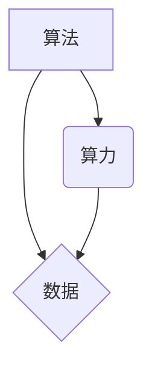

## AI发展的三匹马：算法、算力与数据

> 关键词：人工智能、算法、算力、数据、深度学习、机器学习、模型训练、数据标注、GPU加速

### 1. 背景介绍

人工智能（AI）近年来发展迅速，已渗透到生活的方方面面，从智能手机的语音助手到自动驾驶汽车，无处不在。AI的蓬勃发展离不开三大核心要素：算法、算力和数据。这三者相互依存，共同推动着AI技术的进步。

**1.1 算法：AI的思维引擎**

算法是AI的核心，它决定了AI模型如何学习和决策。不同的算法适用于不同的任务，例如分类、预测、识别等。深度学习算法，特别是卷积神经网络（CNN）和循环神经网络（RNN），在图像识别、自然语言处理等领域取得了突破性进展。

**1.2 算力：AI的能量源泉**

算力是AI训练和运行模型所需的计算资源。AI模型的训练需要大量的计算，尤其是深度学习模型，其规模庞大，参数数量巨大。强大的算力才能支撑AI模型的训练和推理。近年来，GPU（图形处理单元）的加速能力显著提升，成为AI训练的利器。

**1.3 数据：AI的营养来源**

数据是AI模型学习和训练的基础。AI模型通过学习海量数据，提取其中的规律和模式，从而实现智能化决策。数据质量直接影响AI模型的性能，高质量的数据能够训练出更准确、更可靠的AI模型。

### 2. 核心概念与联系

算法、算力和数据相互关联，共同构成了AI发展的基石。

**2.1 算法与算力的关系**

算法的复杂度决定了训练所需的算力。复杂的算法需要更多的计算资源，而简单的算法则可以利用较少的算力进行训练。

**2.2 算法与数据的关系**

算法决定了如何从数据中学习。不同的算法适用于不同的数据类型和任务。例如，CNN擅长处理图像数据，而RNN擅长处理序列数据。

**2.3 算力和数据的关系**

算力决定了数据处理的速度和效率。强大的算力可以更快地处理海量数据，从而加速AI模型的训练。

**2.4 三者之间的相互作用**

算法、算力和数据相互作用，共同推动着AI的发展。算法的进步需要强大的算力和海量数据，而算力和数据的进步也需要算法的指导。



### 3. 核心算法原理 & 具体操作步骤

**3.1 算法原理概述**

深度学习算法是一种基于人工神经网络的机器学习算法。它通过多层神经网络结构，学习数据中的复杂特征和模式。深度学习算法能够自动学习特征，无需人工特征工程，因此在许多领域取得了优异的性能。

**3.2 算法步骤详解**

1. **数据预处理:** 将原始数据进行清洗、转换和格式化，使其适合深度学习模型的训练。
2. **模型构建:** 根据任务需求，选择合适的深度学习模型架构，例如CNN、RNN等。
3. **模型训练:** 使用训练数据，通过反向传播算法，调整模型参数，使其能够准确地预测或分类数据。
4. **模型评估:** 使用测试数据，评估模型的性能，例如准确率、召回率等。
5. **模型调优:** 根据评估结果，调整模型参数或架构，进一步提高模型性能。
6. **模型部署:** 将训练好的模型部署到实际应用场景中，用于预测或分类新的数据。

**3.3 算法优缺点**

**优点:**

* 自动学习特征，无需人工特征工程。
* 能够处理复杂数据，学习复杂模式。
* 在许多领域取得了优异的性能。

**缺点:**

* 训练数据量大，训练时间长。
* 训练成本高，需要强大的算力。
* 模型解释性差，难以理解模型的决策过程。

**3.4 算法应用领域**

深度学习算法广泛应用于以下领域：

* **图像识别:** 人脸识别、物体检测、图像分类等。
* **自然语言处理:** 语音识别、机器翻译、文本生成等。
* **推荐系统:** 商品推荐、内容推荐等。
* **医疗诊断:** 病情诊断、疾病预测等。
* **金融分析:** 风险评估、欺诈检测等。

### 4. 数学模型和公式 & 详细讲解 & 举例说明

**4.1 数学模型构建**

深度学习模型本质上是一个复杂的数学模型，其核心是神经网络结构。神经网络由多个层组成，每一层包含多个神经元。神经元之间通过连接权重进行信息传递。

**4.2 公式推导过程**

深度学习模型的训练基于反向传播算法。反向传播算法通过计算损失函数的梯度，更新模型参数，使其能够最小化损失函数。损失函数衡量模型预测结果与真实结果之间的差异。

**损失函数:**

$$L = \frac{1}{N} \sum_{i=1}^{N} loss(y_i, \hat{y}_i)$$

其中：

* $L$ 是损失函数的值。
* $N$ 是样本数量。
* $y_i$ 是真实标签。
* $\hat{y}_i$ 是模型预测结果。
* $loss(y_i, \hat{y}_i)$ 是单个样本的损失函数值。

**梯度下降:**

$$\theta = \theta - \alpha \nabla L(\theta)$$

其中：

* $\theta$ 是模型参数。
* $\alpha$ 是学习率。
* $\nabla L(\theta)$ 是损失函数对参数的梯度。

**4.3 案例分析与讲解**

例如，在图像分类任务中，可以使用CNN模型。CNN模型通过卷积层和池化层提取图像特征，然后通过全连接层进行分类。损失函数可以使用交叉熵损失函数，梯度下降算法可以用来更新模型参数。

### 5. 项目实践：代码实例和详细解释说明

**5.1 开发环境搭建**

使用Python语言开发深度学习项目，需要安装以下软件包：

* TensorFlow 或 PyTorch：深度学习框架。
* NumPy：数值计算库。
* Matplotlib：数据可视化库。

**5.2 源代码详细实现**

以下是一个使用TensorFlow实现图像分类的简单代码示例：

```python
import tensorflow as tf

# 定义模型架构
model = tf.keras.models.Sequential([
    tf.keras.layers.Conv2D(32, (3, 3), activation='relu', input_shape=(28, 28, 1)),
    tf.keras.layers.MaxPooling2D((2, 2)),
    tf.keras.layers.Conv2D(64, (3, 3), activation='relu'),
    tf.keras.layers.MaxPooling2D((2, 2)),
    tf.keras.layers.Flatten(),
    tf.keras.layers.Dense(10, activation='softmax')
])

# 编译模型
model.compile(optimizer='adam',
              loss='sparse_categorical_crossentropy',
              metrics=['accuracy'])

# 训练模型
model.fit(x_train, y_train, epochs=5)

# 评估模型
loss, accuracy = model.evaluate(x_test, y_test)
print('Test loss:', loss)
print('Test accuracy:', accuracy)
```

**5.3 代码解读与分析**

这段代码定义了一个简单的CNN模型，用于图像分类任务。模型包含两层卷积层、两层池化层、一层全连接层和一层输出层。

* `tf.keras.models.Sequential`：定义一个顺序模型，层级结构清晰。
* `tf.keras.layers.Conv2D`：卷积层，用于提取图像特征。
* `tf.keras.layers.MaxPooling2D`：池化层，用于降维和提取更抽象的特征。
* `tf.keras.layers.Flatten`：将多维特征转换为一维向量。
* `tf.keras.layers.Dense`：全连接层，用于分类。
* `tf.keras.optimizers.Adam`：优化器，用于更新模型参数。
* `tf.keras.losses.sparse_categorical_crossentropy`：损失函数，用于衡量模型预测结果与真实结果之间的差异。
* `model.fit`：训练模型。
* `model.evaluate`：评估模型性能。

**5.4 运行结果展示**

训练完成后，可以使用测试数据评估模型的性能。模型的准确率通常会随着训练epochs的增加而提高。

### 6. 实际应用场景

**6.1 图像识别**

* **人脸识别:** 用于解锁手机、验证身份、监控安全等。
* **物体检测:** 用于自动驾驶汽车、安防监控、工业自动化等。
* **图像分类:** 用于医疗影像诊断、产品识别、内容推荐等。

**6.2 自然语言处理**

* **语音识别:** 用于智能语音助手、语音搜索、语音翻译等。
* **机器翻译:** 用于跨语言沟通、文本翻译、文档处理等。
* **文本生成:** 用于自动写作、聊天机器人、代码生成等。

**6.3 其他应用场景**

* **推荐系统:** 根据用户行为和偏好，推荐商品、内容、服务等。
* **金融分析:** 用于风险评估、欺诈检测、股票预测等。
* **医疗诊断:** 用于疾病诊断、药物研发、个性化医疗等。

**6.4 未来应用展望**

随着算法、算力和数据的不断发展，AI将应用于更多领域，例如：

* **个性化教育:** 根据学生的学习情况，提供个性化的学习方案。
* **智能制造:** 自动化生产流程，提高生产效率和质量。
* **智慧城市:** 利用AI技术，提高城市管理效率和居民生活质量。

### 7. 工具和资源推荐

**7.1 学习资源推荐**

* **在线课程:** Coursera、edX、Udacity等平台提供丰富的AI课程。
* **书籍:** 《深度学习》、《机器学习实战》等书籍是学习AI的基础。
* **博客和论坛:** TensorFlow、PyTorch等框架的官方博客和论坛提供技术文档和社区支持。

**7.2 开发工具推荐**

* **深度学习框架:** TensorFlow、PyTorch、Keras等框架提供丰富的工具和API，用于开发AI模型。
* **数据处理工具:** Pandas、NumPy等工具用于数据清洗、转换和分析。
* **可视化工具:** Matplotlib、Seaborn等工具用于数据可视化。

**7.3 相关论文推荐**

* **《ImageNet Classification with Deep Convolutional Neural Networks》**
* **《Attention Is All You Need》**
* **《Generative Adversarial Networks》**

### 8. 总结：未来发展趋势与挑战

**8.1 研究成果总结**

近年来，AI技术取得了显著进展，特别是深度学习算法在图像识别、自然语言处理等领域取得了突破性成果。

**8.2 未来发展趋势**

* **模型规模和复杂度提升:** 模型参数数量将继续增加，模型架构将更加复杂。
* **数据质量和多样性提升:** 海量高质量数据将成为AI发展的关键。
* **算法效率和鲁棒性提升:** 研究更有效的算法，提高模型训练速度和鲁棒性。
* **AI伦理和安全问题:** 随着AI技术的应用越来越广泛，伦理和安全问题将更加重要。

**8.3 面临的挑战**

* **算力需求:** 训练大型AI模型需要大量的算力资源。
* **数据标注:** 数据标注是训练AI模型的关键步骤，但成本高且耗时。
* **模型解释性:** 许多AI模型的决策过程难以理解，这限制了其在一些领域中的应用。
* **伦理和安全问题:** AI技术可能带来一些伦理和安全风险，需要谨慎对待。

**8.4 研究展望**

未来，AI研究将继续朝着更智能、更安全、更可解释的方向发展。

### 9. 附录：