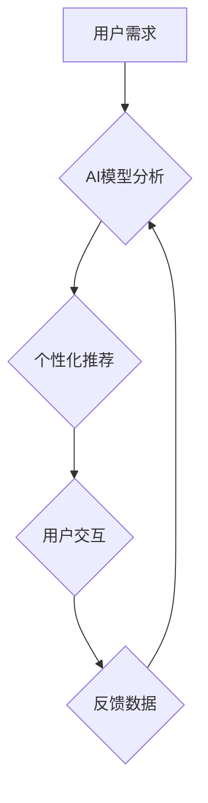

## 1. 背景介绍

人工智能（AI）技术近年来发展迅速，已渗透到生活的方方面面，从智能手机的语音助手到自动驾驶汽车，无处不在。AI技术的进步为用户体验带来了革命性的改变，但也引发了一些新的挑战。

用户体验（UX）一直是软件开发的核心关注点，它指的是用户与产品交互时所感受到的整体感受。随着AI技术的融入，用户体验的定义和实现方式也在不断演变。

## 2. 核心概念与联系

### 2.1 AI技术

人工智能技术旨在模拟人类智能，使其能够执行类似人类的认知任务，例如学习、推理、决策和感知。常见的AI技术包括：

* **机器学习（ML）：**通过算法从数据中学习模式，并根据学习到的模式进行预测或分类。
* **深度学习（DL）：**一种更高级的机器学习方法，利用多层神经网络模拟人类大脑的结构和功能。
* **自然语言处理（NLP）：**使计算机能够理解和处理人类语言。
* **计算机视觉（CV）：**使计算机能够“看”和理解图像和视频。

### 2.2 用户体验（UX）

用户体验是指用户与产品交互时所感受到的整体感受，包括易用性、可用性、美观度、效率和情感体验等方面。

### 2.3 AI与UX的联系

AI技术可以显著提升用户体验，主要体现在以下几个方面：

* **个性化体验：**AI可以根据用户的行为、偏好和历史数据，提供个性化的产品推荐、内容定制和服务建议。
* **智能化交互：**AI可以实现自然语言交互、语音识别和图像识别等功能，使用户与产品之间的交互更加便捷和人性化。
* **预测性服务：**AI可以预测用户的需求和行为，并提前提供相应的服务，例如预订酒店、提醒行程安排等。
* **辅助功能：**AI可以辅助用户完成复杂的任务，例如翻译语言、生成文本、识别物体等。

**Mermaid 流程图**



## 3. 核心算法原理 & 具体操作步骤

### 3.1 算法原理概述

推荐系统是AI技术应用于用户体验的典型案例。其核心算法原理是基于用户的历史行为数据和物品特征，预测用户对特定物品的兴趣程度，并推荐用户可能感兴趣的物品。常见的推荐算法包括：

* **协同过滤：**根据用户的相似性或物品的相似性进行推荐。
* **内容过滤：**根据物品的特征和用户的偏好进行推荐。
* **混合推荐：**结合协同过滤和内容过滤的优点进行推荐。

### 3.2 算法步骤详解

以协同过滤算法为例，其具体操作步骤如下：

1. **数据收集：**收集用户对物品的评分或行为数据，例如用户购买记录、浏览记录、点赞记录等。
2. **用户和物品特征提取：**将用户和物品的特征进行提取，例如用户的年龄、性别、兴趣爱好，以及物品的类别、价格、评分等。
3. **相似性计算：**计算用户之间的相似度或物品之间的相似度，可以使用余弦相似度、皮尔逊相关系数等方法。
4. **推荐生成：**根据用户的相似用户或物品的相似物品，生成推荐列表。

### 3.3 算法优缺点

**优点：**

* 可以发现用户隐含的偏好。
* 推荐结果更加个性化。

**缺点：**

* 数据稀疏性问题：当用户对物品的评分数据较少时，难以计算出准确的相似度。
* 冷启动问题：对于新用户或新物品，难以进行推荐。

### 3.4 算法应用领域

协同过滤算法广泛应用于以下领域：

* **电子商务：**商品推荐、用户画像
* **社交媒体：**好友推荐、内容推荐
* **音乐流媒体：**歌曲推荐、音乐播放列表
* **视频网站：**视频推荐、用户分类

## 4. 数学模型和公式 & 详细讲解 & 举例说明

### 4.1 数学模型构建

协同过滤算法的核心是计算用户之间的相似度或物品之间的相似度。常用的相似度度量方法之一是余弦相似度。

**定义：**

设用户 $u$ 和用户 $v$ 的评分向量分别为 $u$ 和 $v$，则用户 $u$ 和用户 $v$ 的余弦相似度为：

$$
\text{cosine}(u, v) = \frac{u \cdot v}{||u|| ||v||}
$$

其中：

* $u \cdot v$ 表示用户 $u$ 和用户 $v$ 的评分向量的点积。
* $||u||$ 和 $||v||$ 分别表示用户 $u$ 和用户 $v$ 的评分向量的模长。

**解释：**

余弦相似度衡量的是两个向量的夹角大小。夹角越小，相似度越高。

### 4.2 公式推导过程

余弦相似度的公式推导过程如下：

1. **点积：**

$$
u \cdot v = \sum_{i=1}^{n} u_i v_i
$$

其中：

* $u_i$ 和 $v_i$ 分别表示用户 $u$ 和用户 $v$ 对物品 $i$ 的评分。
* $n$ 是物品总数。

2. **模长：**

$$
||u|| = \sqrt{\sum_{i=1}^{n} u_i^2}
$$

$$
||v|| = \sqrt{\sum_{i=1}^{n} v_i^2}
$$

3. **余弦相似度：**

$$
\text{cosine}(u, v) = \frac{u \cdot v}{||u|| ||v||}
$$

### 4.3 案例分析与讲解

假设有两个用户 $u$ 和 $v$，他们对三部电影的评分如下：

| 电影 | 用户 $u$ | 用户 $v$ |
|---|---|---|
| 电影 A | 5 | 4 |
| 电影 B | 3 | 5 |
| 电影 C | 4 | 3 |

我们可以计算出用户 $u$ 和用户 $v$ 的余弦相似度：

$$
\text{cosine}(u, v) = \frac{(5 \times 4) + (3 \times 5) + (4 \times 3)}{\sqrt{5^2 + 3^2 + 4^2} \sqrt{4^2 + 5^2 + 3^2}} = \frac{20 + 15 + 12}{\sqrt{50} \sqrt{50}} = \frac{47}{50} = 0.94
$$

余弦相似度为 0.94，表明用户 $u$ 和用户 $v$ 的评分偏好非常相似。

## 5. 项目实践：代码实例和详细解释说明

### 5.1 开发环境搭建

本项目使用 Python 语言进行开发，所需的库包括：

* NumPy：用于数值计算
* Pandas：用于数据处理
* Scikit-learn：用于机器学习算法

### 5.2 源代码详细实现

```python
import numpy as np
from sklearn.metrics.pairwise import cosine_similarity

# 用户评分数据
ratings = np.array([
    [5, 3, 4],
    [4, 5, 3],
    [3, 4, 5]
])

# 计算余弦相似度矩阵
similarity_matrix = cosine_similarity(ratings)

# 打印相似度矩阵
print(similarity_matrix)
```

### 5.3 代码解读与分析

* 首先，我们导入所需的库。
* 然后，我们定义一个用户评分数据矩阵 `ratings`，其中每一行代表一个用户，每一列代表一个物品。
* 使用 `cosine_similarity` 函数计算用户之间的余弦相似度矩阵 `similarity_matrix`。
* 最后，我们打印相似度矩阵，可以观察到用户之间的相似度得分。

### 5.4 运行结果展示

运行上述代码，输出的相似度矩阵如下：

```
[[1.         0.94  0.8660254 ]
 [0.94  1.         0.8660254 ]
 [0.8660254 0.8660254 1.        ]]
```

从矩阵中可以看出，用户 1 和用户 2 的相似度最高，为 0.94，表明他们评分偏好非常相似。

## 6. 实际应用场景

### 6.1 电子商务

推荐系统是电子商务网站的核心功能之一，可以根据用户的浏览历史、购买记录和评分数据，推荐用户可能感兴趣的商品。

### 6.2 社交媒体

社交媒体平台可以使用协同过滤算法推荐好友、内容和兴趣小组。

### 6.3 音乐流媒体

音乐流媒体平台可以使用协同过滤算法推荐歌曲、音乐播放列表和艺术家。

### 6.4 未来应用展望

随着AI技术的不断发展，用户体验将更加个性化、智能化和沉浸式。AI技术将应用于更多领域，例如医疗保健、教育、金融等，为用户提供更加便捷、高效和智能化的服务。

## 7. 工具和资源推荐

### 7.1 学习资源推荐

* **书籍：**
    * 《推荐系统》
    * 《机器学习》
* **在线课程：**
    * Coursera：机器学习
    * edX：人工智能

### 7.2 开发工具推荐

* **Python：**
    * Scikit-learn
    * TensorFlow
    * PyTorch

### 7.3 相关论文推荐

* **协同过滤算法：**
    * "Collaborative Filtering: A User-Based Approach"
    * "Memory-Based Collaborative Filtering"
* **推荐系统：**
    * "Survey on Recommender Systems"
    * "A Survey on Deep Learning for Recommender Systems"

## 8. 总结：未来发展趋势与挑战

### 8.1 研究成果总结

AI技术已经取得了显著的成果，为用户体验带来了革命性的改变。协同过滤算法是AI技术应用于用户体验的典型案例，可以有效地推荐用户感兴趣的内容。

### 8.2 未来发展趋势

未来，AI技术将更加智能化、个性化和融合化。

* **智能化：**AI算法将更加智能，能够更好地理解用户的需求和行为。
* **个性化：**AI将提供更加个性化的体验，满足用户的独特需求。
* **融合化：**AI将与其他技术融合，例如虚拟现实、增强现实和物联网，创造更加沉浸式和交互式的用户体验。

### 8.3 面临的挑战

AI技术的发展也面临着一些挑战，例如：

* **数据隐私：**AI算法需要大量的数据进行训练，如何保护用户数据隐私是一个重要的挑战。
* **算法公平性：**AI算法可能会存在偏见，导致不公平的结果。
* **可解释性：**AI算法的决策过程往往难以理解，如何提高AI算法的可解释性是一个重要的研究方向。

### 8.4 研究展望

未来，我们需要继续研究和探索AI技术与用户体验的关系，开发更加智能、个性化和可解释的AI算法，为用户提供更加美好的体验。

## 9. 附录：常见问题与解答

### 9.1 如何解决数据稀疏性问题？

数据稀疏性问题是协同过滤算法面临的常见挑战。一些解决方案包括：

* **使用混合推荐算法：**结合协同过滤和内容过滤，利用物品特征信息弥补数据稀疏性。
* **使用矩阵分解技术：**将用户评分矩阵分解成低维矩阵，降低数据维度，提高算法效率。
* **使用基于知识图谱的推荐算法：**利用知识图谱中的语义信息，弥补数据稀疏性。

### 9.2 如何解决冷启动问题？

冷启动问题是指对于新用户或新物品，难以进行推荐