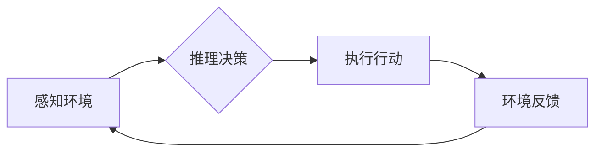

## 1. 背景介绍

在人工智能 (AI) 系统的蓬勃发展中，代理的概念扮演着至关重要的角色。代理作为智能体，能够感知环境、做出决策并与环境交互，是实现 AI 系统自主学习、推理和行动的关键。本文将深入探讨代理在 AI 系统中的作用、核心概念、算法原理、数学模型以及实际应用场景，并展望其未来发展趋势。

随着 AI 技术的不断进步，代理的概念已从理论研究逐渐走向实际应用。从自动驾驶汽车到智能客服机器人，代理技术在各个领域展现出强大的潜力。理解代理的本质和工作机制，对于开发更智能、更可靠的 AI 系统至关重要。

## 2. 核心概念与联系

**2.1 代理的概念**

代理是一个能够感知环境、做出决策并与环境交互的智能体。它可以是软件程序、机器人或其他任何能够执行任务的实体。代理的目标通常是最大化其在环境中获得的回报。

**2.2 代理的类型**

代理可以根据其感知能力、决策机制和交互方式进行分类：

* **简单代理:** 仅能感知环境的有限状态，并根据预先定义的规则做出决策。
* **模型-基于代理:** 建立环境模型，并通过推理和规划来做出决策。
* **学习-基于代理:** 通过与环境交互学习，不断更新其决策策略。

**2.3 代理与环境的交互**

代理与环境的交互通常遵循以下步骤：

1. **感知:** 代理感知环境中的状态信息。
2. **推理:** 代理根据感知到的信息和其目标，进行决策推理。
3. **行动:** 代理执行决策，改变环境状态。
4. **反馈:** 环境反馈给代理新的状态信息。

**2.4 代理的架构**

代理的架构通常包括以下几个部分：

* **感知模块:** 用于感知环境信息。
* **推理模块:** 用于决策推理。
* **行动模块:** 用于执行决策。
* **知识库:** 用于存储代理的知识和经验。

**2.5 Mermaid 流程图**



## 3. 核心算法原理 & 具体操作步骤

**3.1 算法原理概述**

代理算法的核心是决策策略的学习和优化。常见的代理算法包括：

* **强化学习:** 代理通过与环境交互，学习最优的行动策略，以最大化其累积回报。
* **搜索算法:** 代理在环境状态空间中搜索最优路径，以实现其目标。
* **规划算法:** 代理根据环境模型和目标，规划最优行动序列。

**3.2 算法步骤详解**

以强化学习为例，其基本步骤如下：

1. **环境初始化:** 设置环境初始状态和代理初始位置。
2. **状态感知:** 代理感知当前环境状态。
3. **动作选择:** 代理根据当前状态和其策略，选择一个动作。
4. **环境反馈:** 环境根据代理的动作，更新状态并提供奖励信号。
5. **策略更新:** 代理根据奖励信号，更新其策略，以提高未来获得奖励的概率。
6. **重复步骤2-5:** 直到代理达到目标状态或训练结束。

**3.3 算法优缺点**

* **优点:** 能够学习复杂环境下的最优策略，适应性强。
* **缺点:** 训练过程可能需要大量时间和资源，容易陷入局部最优。

**3.4 算法应用领域**

* **自动驾驶:** 训练自动驾驶汽车在复杂道路环境下的决策策略。
* **游戏 AI:** 开发能够与人类玩家进行对抗的游戏 AI。
* **机器人控制:** 训练机器人完成复杂的任务，例如导航、抓取和组装。

## 4. 数学模型和公式 & 详细讲解 & 举例说明

**4.1 数学模型构建**

代理问题可以建模为马尔可夫决策过程 (MDP)。MDP 由以下几个要素组成：

* **状态空间 S:** 环境可能存在的全部状态。
* **动作空间 A:** 代理可以执行的所有动作。
* **转移概率 P(s', r|s, a):** 从状态 s 执行动作 a 后，转移到状态 s' 的概率，以及获得奖励 r 的概率。
* **奖励函数 R(s, a):** 代理在状态 s 执行动作 a 后获得的奖励。

**4.2 公式推导过程**

代理的目标是找到最优策略 π(s)，使得其累积回报最大化。最优策略可以通过 Bellman 方程进行推导：

$$
V^*(s) = \max_a \sum_{s', r} P(s', r|s, a) [R(s, a) + \gamma V^*(s')]
$$

其中，V*(s) 是状态 s 的最优价值函数，γ 是折扣因子，用于权衡未来奖励的价值。

**4.3 案例分析与讲解**

例如，考虑一个简单的迷宫问题。代理的目标是找到从起点到终点的最短路径。我们可以将迷宫建模为 MDP，其中状态空间是迷宫中的所有位置，动作空间是上下左右四个方向，转移概率取决于迷宫的结构，奖励函数则取决于代理是否到达终点。通过 Bellman 方程，我们可以计算出每个位置的最优价值函数，从而找到最优路径。

## 5. 项目实践：代码实例和详细解释说明

**5.1 开发环境搭建**

* Python 3.x
* TensorFlow 或 PyTorch 等深度学习框架
* OpenAI Gym 或其他强化学习环境

**5.2 源代码详细实现**

```python
import gym
import numpy as np

# 定义代理环境
env = gym.make('CartPole-v1')

# 定义代理策略
class Agent:
    def __init__(self, state_size, action_size):
        self.state_size = state_size
        self.action_size = action_size
        self.model =... # 定义神经网络模型

    def act(self, state):
        # 根据状态预测动作
        action = self.model.predict(state)
        return action

# 训练代理
agent = Agent(env.observation_space.shape[0], env.action_space.n)
for episode in range(1000):
    state = env.reset()
    done = False
    while not done:
        action = agent.act(state)
        next_state, reward, done, _ = env.step(action)
        # 更新代理策略
        agent.model.train(state, action, reward, next_state)
        state = next_state

# 测试代理
state = env.reset()
while True:
    action = agent.act(state)
    state, reward, done, _ = env.step(action)
    env.render()
    if done:
        break
```

**5.3 代码解读与分析**

* 代码定义了一个简单的代理环境和代理策略。
* 代理策略使用神经网络模型进行预测，并根据预测结果选择动作。
* 训练过程通过强化学习算法更新代理策略，以提高其在环境中的表现。
* 测试过程演示了训练好的代理在环境中的行为。

**5.4 运行结果展示**

运行代码后，可以观察到代理在环境中学习和执行任务的过程。

## 6. 实际应用场景

**6.1 自动驾驶**

代理技术在自动驾驶领域应用广泛，例如：

* **路径规划:** 代理可以学习最优的路径，避开障碍物并到达目的地。
* **决策控制:** 代理可以根据感知到的环境信息，做出驾驶决策，例如加速、减速、转向和刹车。
* **场景理解:** 代理可以学习识别道路场景，例如交通信号灯、行人、车辆等。

**6.2 智能客服机器人**

代理技术可以用于开发智能客服机器人，例如：

* **对话理解:** 代理可以理解用户的自然语言输入，并识别用户的意图。
* **知识检索:** 代理可以从知识库中检索相关信息，并提供给用户。
* **任务执行:** 代理可以执行用户的指令，例如预订机票、查询余额等。

**6.3 游戏 AI**

代理技术可以用于开发游戏 AI，例如：

* **策略决策:** 代理可以学习游戏策略，并与人类玩家进行对抗。
* **角色行为:** 代理可以控制游戏角色的行为，使其更加智能和逼真。
* **游戏平衡:** 代理可以帮助游戏开发者平衡游戏难度，并提高游戏体验。

**6.4 未来应用展望**

随着 AI 技术的不断发展，代理技术将在更多领域得到应用，例如：

* **医疗保健:** 代理可以辅助医生诊断疾病、制定治疗方案和提供个性化医疗服务。
* **金融服务:** 代理可以用于风险管理、欺诈检测和投资决策。
* **教育:** 代理可以提供个性化学习辅导和智能评估。

## 7. 工具和资源推荐

**7.1 学习资源推荐**

* **书籍:**
    * Reinforcement Learning: An Introduction by Sutton and Barto
    * Artificial Intelligence: A Modern Approach by Russell and Norvig
* **课程:**
    * Stanford CS234: Reinforcement Learning
    * Udacity Deep Reinforcement Learning Nanodegree

**7.2 开发工具推荐**

* **Python:** 广泛用于 AI 开发，拥有丰富的库和工具。
* **TensorFlow:** 深度学习框架，支持强化学习算法。
* **PyTorch:** 深度学习框架，灵活易用。
* **OpenAI Gym:** 强化学习环境，提供各种标准任务。

**7.3 相关论文推荐**

* Deep Q-Network (DQN)
* Proximal Policy Optimization (PPO)
* Trust Region Policy Optimization (TRPO)

## 8. 总结：未来发展趋势与挑战

**8.1 研究成果总结**

近年来，代理技术取得了显著进展，例如：

* 强化学习算法取得了突破性进展，能够解决更复杂的任务。
* 深度学习技术被广泛应用于代理策略的学习和优化。
* 代理技术在自动驾驶、智能客服机器人、游戏 AI 等领域取得了成功应用。

**8.2 未来发展趋势**

* **更智能的代理:** 开发能够学习更复杂行为、更灵活适应环境变化的代理。
* **更安全可靠的代理:** 确保代理在实际应用中安全可靠，并能够应对各种突发情况。
* **更可解释的代理:** 提高代理决策过程的可解释性，帮助人类理解代理的行为逻辑。

**8.3 面临的挑战**

* **数据获取和标注:** 强化学习算法需要大量数据进行训练，数据获取和标注成本较高。
* **模型复杂度和训练效率:** 代理模型的复杂度不断提高，训练效率成为一个瓶颈。
* **安全性和伦理问题:** 代理技术可能带来安全性和伦理问题，需要进行深入研究和探讨。

**8.4 研究展望**

未来，代理技术将继续朝着更智能、更安全、更可解释的方向发展，并在更多领域发挥重要作用。


## 9. 附录：常见问题与解答

**9.1 什么是代理的奖励函数？**

奖励函数是代理在环境中获得奖励的标准。它定义了代理在不同状态下执行不同动作的奖励值。

**9.2 如何选择合适的代理算法？**

选择合适的代理算法取决于具体的应用场景和任务需求。例如，对于离散动作空间的任务，可以使用 Q-learning 算法；对于连续动作空间的任务，可以使用策略梯度算法。

**9.3 如何评估代理的性能？**

代理的性能通常通过累积回报、成功率等指标进行评估。

**9.4 代理技术有哪些局限性？**

代理技术目前还存在一些局限性，例如：

* 数据依赖性强
* 训练时间长
* 难以解释决策过程


作者：禅与计算机程序设计艺术 / Zen and the Art of Computer Programming 
