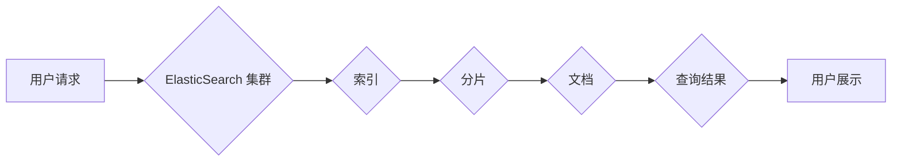

## ElasticSearch原理与代码实例讲解

> 关键词：ElasticSearch, 搜索引擎, NoSQL, 分布式, 索引, 查询, 存储, 性能优化

## 1. 背景介绍

在当今数据爆炸的时代，高效地存储、检索和分析海量数据成为了企业和个人面临的重大挑战。传统的关系型数据库在处理海量数据时存在效率低下、查询复杂等问题。为了解决这些问题，NoSQL数据库应运而生，其中ElasticSearch作为一款开源、分布式、高性能的搜索和分析引擎，凭借其强大的功能和灵活的架构，在海量数据处理领域获得了广泛应用。

ElasticSearch的核心优势在于其基于Lucene的全文检索引擎，能够快速高效地对文本数据进行搜索和分析。它支持多种数据类型，包括文本、数字、日期、地理位置等，并提供丰富的查询语法和分析功能，能够满足各种复杂的数据检索需求。此外，ElasticSearch还具有分布式架构，能够横向扩展，处理海量数据，并提供高可用性和容错能力。

## 2. 核心概念与联系

ElasticSearch的核心概念包括：

* **索引 (Index):**  类似于数据库表，用于存储数据。每个索引包含多个分片。
* **分片 (Shard):**  将索引数据拆分成多个独立的部分，分布在不同的节点上，实现数据并行处理和水平扩展。
* **副本 (Replica):**  每个分片可以有多个副本，用于数据备份和容错。
* **节点 (Node):**  ElasticSearch集群中的单个服务器，可以包含多个分片和副本。
* **文档 (Document):**  索引中的单个数据记录，类似于数据库中的行。
* **映射 (Mapping):**  定义文档结构和数据类型，类似于数据库表的结构定义。

**ElasticSearch 架构流程图:**



## 3. 核心算法原理 & 具体操作步骤

### 3.1  算法原理概述

ElasticSearch的核心算法基于Lucene，它采用倒排索引技术来实现快速高效的全文检索。倒排索引将文档中的每个词语映射到一个包含该词语出现文档的列表，从而实现快速查找文档的过程。

### 3.2  算法步骤详解

1. **分词 (Tokenization):** 将文本数据分割成单个词语或子词。
2. **词干化 (Stemming):** 将词语还原到其词干形式，例如将“running”还原为“run”。
3. **停止词过滤 (Stop Word Removal):** 去除一些常见的无意义词语，例如“the”、“a”、“is”等。
4. **倒排索引构建:** 将每个词语及其在文档中的位置信息存储在倒排索引中。
5. **查询处理:** 当用户发起查询时，ElasticSearch会将查询词语进行分词、词干化和停止词过滤，然后根据倒排索引快速查找包含这些词语的文档。
6. **排序和返回结果:** ElasticSearch会根据查询条件对找到的文档进行排序，并返回给用户。

### 3.3  算法优缺点

**优点:**

* **快速高效:** 倒排索引技术能够实现快速高效的全文检索。
* **灵活扩展:** ElasticSearch的分布式架构能够实现横向扩展，处理海量数据。
* **丰富的功能:** ElasticSearch提供多种数据类型支持、查询语法和分析功能。

**缺点:**

* **数据结构限制:** ElasticSearch主要适用于文本数据，对结构化数据处理能力有限。
* **复杂配置:** ElasticSearch的配置相对复杂，需要一定的学习成本。

### 3.4  算法应用领域

ElasticSearch广泛应用于以下领域:

* **搜索引擎:** 用于构建企业级搜索引擎、网站搜索引擎等。
* **日志分析:** 用于收集、存储和分析日志数据，帮助用户发现问题和趋势。
* **监控和告警:** 用于监控系统性能和状态，并触发告警。
* **数据分析:** 用于对海量数据进行分析，挖掘数据价值。

## 4. 数学模型和公式 & 详细讲解 & 举例说明

### 4.1  数学模型构建

ElasticSearch的查询处理过程可以抽象为一个数学模型，其中查询条件可以表示为一个集合，文档可以表示为一个向量，向量中的每个元素代表文档中词语的权重。查询结果可以通过计算查询条件和文档向量的相似度来确定。

### 4.2  公式推导过程

常用的相似度计算方法包括余弦相似度、Jaccard系数等。

**余弦相似度公式:**

$$
\text{相似度} = \frac{\mathbf{A} \cdot \mathbf{B}}{||\mathbf{A}|| ||\mathbf{B}||}
$$

其中：

* $\mathbf{A}$ 和 $\mathbf{B}$ 分别表示查询条件和文档向量。
* $\mathbf{A} \cdot \mathbf{B}$ 表示两个向量的点积。
* $||\mathbf{A}||$ 和 $||\mathbf{B}||$ 分别表示两个向量的模长。

### 4.3  案例分析与讲解

假设我们有一个查询条件 "苹果手机"，以及两个文档：

* 文档1: "苹果手机很好用"
* 文档2: "华为手机性价比高"

我们可以将这两个文档分别转换为向量，其中每个词语的权重可以根据其在文档中出现的频率来确定。然后，我们可以使用余弦相似度公式计算查询条件和文档向量的相似度，从而确定哪个文档更相关。

## 5. 项目实践：代码实例和详细解释说明

### 5.1  开发环境搭建

为了使用ElasticSearch，我们需要搭建一个开发环境。

* **安装Java:** ElasticSearch依赖于Java运行环境。
* **下载ElasticSearch:** 从ElasticSearch官网下载相应的安装包。
* **配置ElasticSearch:** 根据官方文档配置ElasticSearch的配置文件，例如elasticsearch.yml。
* **启动ElasticSearch:** 启动ElasticSearch服务。

### 5.2  源代码详细实现

以下是一个简单的ElasticSearch代码实例，演示如何创建索引、添加文档和执行查询。

```java
import org.elasticsearch.action.index.IndexRequest;
import org.elasticsearch.action.index.IndexResponse;
import org.elasticsearch.client.RequestOptions;
import org.elasticsearch.client.RestHighLevelClient;
import org.elasticsearch.common.xcontent.XContentType;

import java.io.IOException;

public class ElasticSearchExample {

    public static void main(String[] args) throws IOException {
        // 创建ElasticSearch客户端
        RestHighLevelClient client = new RestHighLevelClient();

        // 创建索引请求
        IndexRequest request = new IndexRequest("my_index")
               .id("1")
               .source("{\"name\":\"John Doe\",\"age\":30,\"city\":\"New York\"}", XContentType.JSON);

        // 添加文档
        IndexResponse response = client.index(request, RequestOptions.DEFAULT);

        // 执行查询
        //...

        // 关闭客户端
        client.close();
    }
}
```

### 5.3  代码解读与分析

* **创建ElasticSearch客户端:** 使用RestHighLevelClient类创建ElasticSearch客户端，用于与ElasticSearch集群进行通信。
* **创建索引请求:** 使用IndexRequest类创建索引请求，指定索引名称、文档ID和文档内容。
* **添加文档:** 使用client.index()方法发送索引请求，将文档添加到索引中。
* **执行查询:** 可以使用其他ElasticSearch API执行查询，例如search()方法。
* **关闭客户端:** 使用client.close()方法关闭ElasticSearch客户端。

### 5.4  运行结果展示

添加文档成功后，我们可以使用ElasticSearch的Web界面或API查看文档内容。

## 6. 实际应用场景

ElasticSearch在各种实际应用场景中发挥着重要作用。

### 6.1  搜索引擎

ElasticSearch可以构建高性能的搜索引擎，例如网站搜索引擎、企业内部搜索引擎等。

### 6.2  日志分析

ElasticSearch可以收集、存储和分析海量日志数据，帮助用户发现问题和趋势。

### 6.3  监控和告警

ElasticSearch可以用于监控系统性能和状态，并触发告警。

### 6.4  未来应用展望

随着数据量的不断增长，ElasticSearch的应用场景将更加广泛，例如：

* **实时数据分析:** ElasticSearch可以用于实时分析流式数据，例如传感器数据、社交媒体数据等。
* **机器学习:** ElasticSearch可以与机器学习算法结合，用于数据挖掘、预测分析等。
* **物联网:** ElasticSearch可以用于存储和分析物联网设备产生的数据。

## 7. 工具和资源推荐

### 7.1  学习资源推荐

* **ElasticSearch官方文档:** https://www.elastic.co/guide/en/elasticsearch/reference/current/index.html
* **ElasticSearch中文社区:** https://www.elastic.co/cn/community
* **ElasticSearch Udemy课程:** https://www.udemy.com/topic/elasticsearch/

### 7.2  开发工具推荐

* **ElasticSearch客户端:** https://www.elastic.co/guide/en/elasticsearch/client/java-rest/current/java-rest-client.html
* **Kibana:** https://www.elastic.co/products/kibana

### 7.3  相关论文推荐

* **Elasticsearch: A Distributed, Scalable Search Engine:** https://www.elastic.co/blog/elasticsearch-a-distributed-scalable-search-engine

## 8. 总结：未来发展趋势与挑战

### 8.1  研究成果总结

ElasticSearch作为一款开源、分布式、高性能的搜索和分析引擎，在海量数据处理领域取得了显著的成果。其基于Lucene的全文检索引擎、倒排索引技术、分布式架构等特点，使其能够高效地处理海量数据，并提供丰富的查询功能和分析能力。

### 8.2  未来发展趋势

ElasticSearch的未来发展趋势包括：

* **更强大的机器学习功能:** ElasticSearch将进一步集成机器学习算法，用于数据挖掘、预测分析等。
* **更完善的实时数据分析能力:** ElasticSearch将支持更强大的实时数据分析功能，例如流式数据处理、实时报表等。
* **更易于使用的界面和API:** ElasticSearch将继续改进其用户界面和API，使其更加易于使用。

### 8.3  面临的挑战

ElasticSearch也面临一些挑战，例如：

* **数据安全:** 如何保障ElasticSearch集群中的数据安全，防止数据泄露和攻击。
* **数据治理:** 如何规范ElasticSearch的数据存储和管理，确保数据质量和一致性。
* **性能优化:** 如何进一步优化ElasticSearch的性能，使其能够处理更大的数据量和更复杂的查询。

### 8.4  研究展望

未来，ElasticSearch的研究方向将集中在以下几个方面：

* **更有效的搜索算法:** 研究更有效的搜索算法，例如基于深度学习的搜索算法。
* **更灵活的数据模型:** 开发更灵活的数据模型，支持更复杂的数据类型和关系。
* **更安全的分布式架构:** 设计更安全的分布式架构，提高ElasticSearch的容错性和安全性。

## 9. 附录：常见问题与解答

### 9.1  ElasticSearch索引类型有哪些？

ElasticSearch支持多种索引类型，包括：

* **文档类型:** 用于存储文档数据。
* **地理空间类型:** 用于存储地理位置数据。
* **数值类型:** 用于存储数值数据。
* **日期类型:** 用于存储日期数据。

### 9.2  ElasticSearch如何进行数据备份和恢复？

ElasticSearch支持使用副本机制进行数据备份和恢复。每个分片可以有多个副本，副本可以分布在不同的节点上。当一个节点发生故障时，可以从其他节点的副本恢复数据。

### 9.3  ElasticSearch如何进行性能优化？

ElasticSearch的性能优化可以从以下几个方面进行