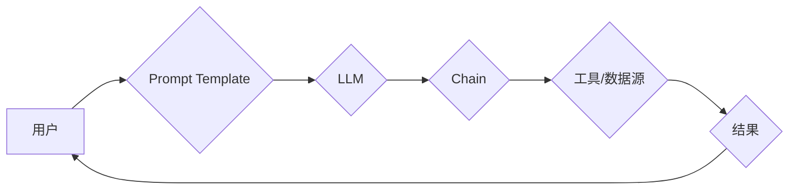

## LangChain 101

> 关键词：LangChain, 大语言模型, 应用开发, 链式调用, 应用程序构建,  AI 工具,  软件开发

### 1. 背景介绍

近年来，大语言模型（LLM）的快速发展，如GPT-3、LaMDA等，为人工智能领域带来了革命性的变革。这些模型展现出惊人的文本生成、理解和翻译能力，为各种应用场景提供了无限可能。然而，直接使用LLM往往需要面对一些挑战：

* **缺乏上下文感知:** LLMs 通常只能处理单个输入，难以理解长文本或多轮对话中的上下文信息。
* **功能单一:** LLMs 通常擅长文本生成，但缺乏执行其他任务的能力，例如检索信息、控制外部工具等。
* **开发复杂:** 与LLMs交互和构建应用程序需要深入了解其内部机制和API，开发难度较高。

为了解决这些问题，LangChain 应运而生。LangChain 是一种开源框架，旨在简化与LLMs的交互，并构建更强大、更灵活的应用程序。

### 2. 核心概念与联系

LangChain 的核心概念是将 LLMs 与其他工具和数据源连接起来，形成一个链式调用（Chain）结构。通过这种方式，应用程序可以利用 LLMs 的强大文本处理能力，同时结合其他工具和数据源，实现更复杂的功能。

**LangChain 架构**



**核心概念:**

* **Prompt Template:** 用于构建输入提示，引导LLM生成期望的输出。
* **LLM:** 大语言模型，负责处理文本信息。
* **Chain:** 连接 LLMs 和其他工具/数据源的链式调用结构。
* **工具/数据源:** 包括数据库、API、文件系统等，提供 LLMs 无法直接访问的信息和功能。
* **结果:**  应用程序最终输出的结果。

### 3. 核心算法原理 & 具体操作步骤

LangChain 并不依赖于特定的算法，而是提供了一套灵活的工具和框架，让开发者可以根据自己的需求构建不同的链式调用结构。

**3.1 算法原理概述**

LangChain 的核心原理是将 LLMs 与其他工具和数据源连接起来，形成一个链式调用结构。

* **提示模板:**  开发者可以使用提示模板来构建输入提示，引导LLM生成期望的输出。提示模板可以包含变量、条件语句等，以实现更灵活的控制。
* **链式调用:**  LangChain 提供了多种类型的链式调用结构，例如顺序调用、并行调用、循环调用等。开发者可以根据任务需求选择合适的链式调用结构。
* **工具集成:**  LangChain 支持多种工具和数据源的集成，例如数据库、API、文件系统等。开发者可以将这些工具集成到链式调用结构中，使 LLMs 能够访问和利用这些资源。

**3.2 算法步骤详解**

1. **定义任务:**  首先，开发者需要明确应用程序要完成的任务。
2. **设计链式调用结构:**  根据任务需求，设计合适的链式调用结构，确定 LLMs 和其他工具/数据源之间的交互方式。
3. **构建提示模板:**  使用提示模板来构建输入提示，引导 LLMs 生成期望的输出。
4. **集成工具和数据源:**  将所需的工具和数据源集成到链式调用结构中。
5. **测试和调试:**  测试和调试链式调用结构，确保应用程序能够正常运行。

**3.3 算法优缺点**

**优点:**

* **灵活性和可扩展性:**  LangChain 提供了灵活的工具和框架，开发者可以根据自己的需求构建不同的链式调用结构，并轻松集成新的工具和数据源。
* **简化开发:**  LangChain 简化了与 LLMs 的交互，降低了应用程序开发的复杂度。
* **增强功能:**  通过连接 LLMs 和其他工具/数据源，应用程序可以实现更复杂的功能，例如信息检索、代码生成、数据分析等。

**缺点:**

* **学习曲线:**  虽然 LangChain 旨在简化开发，但开发者仍然需要学习其核心概念和使用方法。
* **性能瓶颈:**  链式调用结构可能会导致性能瓶颈，尤其是在处理大量数据或复杂任务时。

**3.4 算法应用领域**

LangChain 的应用领域非常广泛，包括：

* **聊天机器人:**  构建更智能、更自然的聊天机器人。
* **内容创作:**  自动生成文章、故事、诗歌等内容。
* **代码生成:**  根据自然语言描述生成代码。
* **数据分析:**  分析文本数据，提取关键信息。
* **教育:**  提供个性化的学习体验。

### 4. 数学模型和公式 & 详细讲解 & 举例说明

LangChain 本身并不依赖于特定的数学模型，而是利用 LLMs 的文本处理能力，通过链式调用结构实现功能。

**4.1 数学模型构建**

LLMs 通常基于 Transformer 架构，其核心是注意力机制。注意力机制允许模型关注输入序列中不同部分的信息，从而更好地理解上下文关系。

**4.2 公式推导过程**

Transformer 架构的注意力机制使用以下公式计算每个词的权重：

$$
Attention(Q, K, V) = softmax(\frac{QK^T}{\sqrt{d_k}})V
$$

其中：

* $Q$：查询矩阵
* $K$：键矩阵
* $V$：值矩阵
* $d_k$：键向量的维度
* $softmax$：softmax 函数

**4.3 案例分析与讲解**

例如，在翻译任务中，LLM 会将源语言句子作为查询矩阵，将目标语言词典作为键矩阵，并将目标语言词典的词向量作为值矩阵。通过注意力机制，LLM 可以计算每个源语言词与每个目标语言词之间的相关性，从而选择最合适的翻译词。

### 5. 项目实践：代码实例和详细解释说明

**5.1 开发环境搭建**

* Python 3.7+
* pip install langchain transformers

**5.2 源代码详细实现**

```python
from langchain.llms import OpenAI
from langchain.prompts import PromptTemplate
from langchain.chains import LLMChain

# 初始化 OpenAI LLM
llm = OpenAI(temperature=0)

# 定义提示模板
template = """
你是一个专业的程序员，请根据以下需求编写 Python 代码：

{requirements}
"""

# 创建提示模板对象
prompt = PromptTemplate(template=template, input_variables=["requirements"])

# 创建 LLMChain 对象
chain = LLMChain(llm=llm, prompt=prompt)

# 调用链式调用结构
response = chain.run(requirements="编写一个函数，计算两个整数的和。")

# 打印结果
print(response)
```

**5.3 代码解读与分析**

* 首先，我们初始化 OpenAI LLM，并设置温度参数以控制模型的随机性。
* 然后，我们定义一个提示模板，用于引导 LLMs 生成 Python 代码。
* 接着，我们创建提示模板对象和 LLMChain 对象，并将 LLMs 和提示模板连接起来。
* 最后，我们调用链式调用结构，并传入需求信息。LLM 会根据提示模板和需求信息生成 Python 代码，并返回结果。

**5.4 运行结果展示**

```python
def sum_two_numbers(a, b):
  return a + b
```

### 6. 实际应用场景

LangChain 的应用场景非常广泛，以下是一些例子：

* **智能客服:**  构建能够理解用户需求并提供个性化服务的智能客服机器人。
* **内容摘要:**  自动生成文章、文档等内容的摘要。
* **代码生成:**  根据自然语言描述生成代码，提高开发效率。
* **数据分析:**  分析文本数据，提取关键信息，辅助决策。

**6.4 未来应用展望**

随着 LLMs 的不断发展，LangChain 将有更多应用场景和可能性。例如：

* **多模态应用:**  将 LLMs 与图像、音频等其他模态数据结合，构建更全面的应用程序。
* **个性化学习:**  根据用户的学习风格和需求，提供个性化的学习体验。
* **科学研究:**  辅助科学家进行数据分析、模型构建等工作，加速科学研究进程。

### 7. 工具和资源推荐

**7.1 学习资源推荐**

* LangChain 官方文档: https://python.langchain.com/docs/
* LangChain GitHub 仓库: https://github.com/langchain-ai/langchain

**7.2 开发工具推荐**

* Python: https://www.python.org/
* OpenAI API: https://platform.openai.com/docs/api-reference

**7.3 相关论文推荐**

* Attention Is All You Need: https://arxiv.org/abs/1706.03762

### 8. 总结：未来发展趋势与挑战

**8.1 研究成果总结**

LangChain 作为一种开源框架，为 LLMs 的应用开发提供了强大的工具和框架，促进了 LLMs 在实际应用中的落地。

**8.2 未来发展趋势**

未来，LangChain 将朝着以下方向发展：

* **更强大的功能:**  支持更多类型的链式调用结构，以及更丰富的工具和数据源集成。
* **更易于使用:**  提供更直观的界面和更友好的 API，降低开发门槛。
* **更强大的安全性:**  加强对用户数据的保护，确保应用程序的安全性。

**8.3 面临的挑战**

LangChain 仍然面临一些挑战：

* **性能优化:**  链式调用结构可能会导致性能瓶颈，需要进一步优化算法和架构。
* **可解释性:**  LLMs 的决策过程难以理解，需要提高模型的可解释性。
* **伦理问题:**  LLMs 的应用可能带来一些伦理问题，需要制定相应的规范和制度。

**8.4 研究展望**

未来，研究者将继续探索 LangChain 的应用潜力，并解决其面临的挑战，推动 LLMs 在各个领域的广泛应用。

### 9. 附录：常见问题与解答

* **Q: 如何选择合适的 LLMs？**

A:  选择合适的 LLMs 需要根据应用程序的需求和预算进行考虑。OpenAI、HuggingFace 等平台提供多种 LLMs，开发者可以根据自己的需求选择合适的模型。

* **Q: 如何构建复杂的链式调用结构？**

A:  LangChain 提供了多种类型的链式调用结构，开发者可以根据自己的需求组合使用。例如，可以使用顺序调用、并行调用、循环调用等结构，构建更复杂的应用程序。

* **Q: 如何解决 LLMs 的安全性问题？**

A:  开发者需要对 LLMs 的输入进行过滤，防止恶意攻击。同时，需要对 LLMs 的输出进行审核，确保其安全性。

作者：禅与计算机程序设计艺术 / Zen and the Art of Computer Programming


