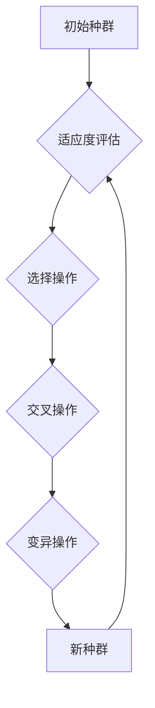

## Python机器学习实战：实现与优化遗传算法

> 关键词：遗传算法、机器学习、Python、优化、进化策略、适应度函数、交叉操作、变异操作

## 1. 背景介绍

在机器学习领域，优化问题无处不在。无论是训练神经网络、寻找模型参数的最佳组合，还是解决复杂的决策问题，都需要高效的优化算法来找到最优解或近似最优解。传统的优化算法，如梯度下降法，在某些情况下可能陷入局部最优，难以找到全局最优解。而遗传算法作为一种启发式优化算法，能够有效地克服这一问题，并应用于各种复杂优化场景。

遗传算法 (Genetic Algorithm, GA) 是一种模拟自然进化过程的优化算法。它通过模拟自然选择、交叉和变异等机制，从初始种群中不断进化，最终产生出适应度最高的个体，即最优解。遗传算法具有以下特点：

* **并行性:** 遗传算法可以同时处理多个候选解，提高搜索效率。
* **全局搜索能力:** 遗传算法能够探索整个搜索空间，避免陷入局部最优。
* **鲁棒性:** 遗传算法对噪声和不确定性具有较强的鲁棒性。

## 2. 核心概念与联系

遗传算法的核心概念包括：

* **种群:** 一组候选解，每个解称为个体。
* **适应度函数:** 用于评估每个个体的优劣，适应度越高，个体越优。
* **选择操作:** 根据个体的适应度，选择部分个体进行下一代的繁殖。
* **交叉操作:** 从两个父代个体中选择部分基因进行交换，产生两个新的子代个体。
* **变异操作:** 在个体基因上进行随机改变，增加种群的多样性。

**Mermaid 流程图:**



## 3. 核心算法原理 & 具体操作步骤

### 3.1  算法原理概述

遗传算法的基本原理是模拟自然选择、交叉和变异的过程，通过迭代优化种群，最终找到最优解。

1. **初始化种群:** 随机生成初始种群，每个个体代表一个候选解。
2. **适应度评估:** 计算每个个体的适应度，适应度越高，个体越优。
3. **选择操作:** 根据适应度，选择部分个体作为父代，进行下一代的繁殖。常用的选择方法包括轮盘赌选择、锦标赛选择等。
4. **交叉操作:** 从两个父代个体中选择部分基因进行交换，产生两个新的子代个体。交叉操作可以促进种群的多样性，并加速算法的收敛速度。
5. **变异操作:** 在个体基因上进行随机改变，增加种群的多样性，避免算法陷入局部最优。
6. **重复步骤2-5:** 重复以上步骤，直到达到预设的终止条件，例如最大迭代次数或目标适应度达到。

### 3.2  算法步骤详解

1. **初始化种群:** 随机生成初始种群，每个个体由一系列基因组成，每个基因代表一个决策变量。
2. **适应度评估:** 定义适应度函数，用于评估每个个体的优劣。适应度函数通常是目标函数的负值，即目标函数值越小，适应度越高。
3. **选择操作:** 使用选择算法从种群中选择部分个体作为父代，进行下一代的繁殖。常用的选择方法包括：
    * **轮盘赌选择:** 根据个体的适应度，计算每个个体被选择的概率，然后随机选择个体。
    * **锦标赛选择:** 从种群中随机选择若干个体进行比赛，选择适应度最高的个体作为父代。
4. **交叉操作:** 从两个父代个体中选择部分基因进行交换，产生两个新的子代个体。常用的交叉操作方法包括：
    * **单点交叉:** 在两个父代个体的基因序列中随机选择一个交叉点，交换交叉点之后的基因。
    * **双点交叉:** 在两个父代个体的基因序列中随机选择两个交叉点，交换两个交叉点之间的基因。
5. **变异操作:** 在个体基因上进行随机改变，增加种群的多样性。常用的变异操作方法包括：
    * **比特翻转:** 随机选择一个基因，将其值进行翻转。
    * **基因插入/删除:** 在个体基因序列中随机插入或删除基因。
6. **新种群生成:** 将所有子代个体组成新的种群，重复步骤2-5，直到达到预设的终止条件。

### 3.3  算法优缺点

**优点:**

* **全局搜索能力:** 遗传算法能够探索整个搜索空间，避免陷入局部最优。
* **并行性:** 遗传算法可以同时处理多个候选解，提高搜索效率。
* **鲁棒性:** 遗传算法对噪声和不确定性具有较强的鲁棒性。

**缺点:**

* **计算复杂度:** 遗传算法的计算复杂度较高，尤其是在处理大规模问题时。
* **参数设置:** 遗传算法需要设置多个参数，例如种群大小、交叉概率、变异概率等，参数设置对算法性能有很大影响。
* **收敛速度:** 遗传算法的收敛速度可能较慢，尤其是在搜索空间较大时。

### 3.4  算法应用领域

遗传算法广泛应用于以下领域:

* **机器学习:** 优化模型参数、特征选择、超参数调优。
* **控制系统:** 控制系统参数优化、自适应控制。
* **图像处理:** 图像压缩、图像识别、图像分割。
* **金融工程:** 投资组合优化、风险管理。
* **生物信息学:** 基因序列分析、蛋白质结构预测。

## 4. 数学模型和公式 & 详细讲解 & 举例说明

### 4.1  数学模型构建

遗传算法的数学模型可以概括为以下几个方面:

* **个体表示:** 个体通常用二进制串或实数向量表示，每个基因代表一个决策变量。
* **适应度函数:** 适应度函数用于评估个体的优劣，通常是目标函数的负值。
* **选择操作:** 选择操作根据个体的适应度，选择部分个体作为父代。常用的选择方法包括轮盘赌选择和锦标赛选择。
* **交叉操作:** 交叉操作用于产生新的子代个体，通常是将两个父代个体的基因进行交换。
* **变异操作:** 变异操作用于增加种群的多样性，通常是随机改变个体基因的值。

### 4.2  公式推导过程

**适应度函数:**

假设目标函数为 $f(x)$，则适应度函数可以定义为:

$$
fitness(x) = -f(x)
$$

其中，$x$ 代表个体，$fitness(x)$ 代表个体的适应度。

**轮盘赌选择:**

每个个体的选择概率与其适应度成正比:

$$
p_i = \frac{fitness(x_i)}{\sum_{j=1}^{N} fitness(x_j)}
$$

其中，$p_i$ 代表个体 $x_i$ 的选择概率，$N$ 代表种群大小。

### 4.3  案例分析与讲解

**例子:**

假设我们要用遗传算法优化一个简单的目标函数:

$$
f(x) = x^2
$$

其中，$x$ 是一个实数变量。

我们可以使用以下步骤来实现遗传算法:

1. **初始化种群:** 生成一个大小为 $N$ 的种群，每个个体是一个实数 $x$。
2. **适应度评估:** 计算每个个体的适应度，即 $fitness(x) = -x^2$。
3. **选择操作:** 使用轮盘赌选择算法选择两个父代个体。
4. **交叉操作:** 使用单点交叉操作产生两个子代个体。
5. **变异操作:** 使用均匀分布随机变异操作对子代个体进行变异。
6. **新种群生成:** 将所有子代个体组成新的种群，重复步骤2-5，直到达到预设的终止条件。

## 5. 项目实践：代码实例和详细解释说明

### 5.1  开发环境搭建

* Python 3.x
* NumPy
* matplotlib

### 5.2  源代码详细实现

```python
import numpy as np
import matplotlib.pyplot as plt

# 定义目标函数
def fitness_function(x):
    return x**2

# 定义遗传算法
def genetic_algorithm(population_size, generations, crossover_rate, mutation_rate):
    # 初始化种群
    population = np.random.uniform(-5, 5, size=(population_size, 1))

    # 迭代优化
    for generation in range(generations):
        # 适应度评估
        fitness_values = -fitness_function(population)

        # 选择操作
        parents = np.random.choice(population, size=population_size, p=fitness_values / np.sum(fitness_values))

        # 交叉操作
        offspring = np.zeros_like(parents)
        for i in range(0, population_size, 2):
            if np.random.rand() < crossover_rate:
                crossover_point = np.random.randint(1)
                offspring[i] = parents[i][:crossover_point] + parents[i+1][crossover_point:]
                offspring[i+1] = parents[i+1][:crossover_point] + parents[i][crossover_point:]

        # 变异操作
        for i in range(population_size):
            if np.random.rand() < mutation_rate:
                offspring[i] += np.random.normal(0, 0.1)

        # 更新种群
        population = offspring

    # 返回最优解
    return population[np.argmax(fitness_values)]

# 设置参数
population_size = 100
generations = 100
crossover_rate = 0.8
mutation_rate = 0.1

# 执行遗传算法
best_solution = genetic_algorithm(population_size, generations, crossover_rate, mutation_rate)

# 打印最优解
print("最优解:", best_solution)

# 绘制目标函数图像
x = np.linspace(-5, 5, 100)
y = x**2
plt.plot(x, y)
plt.scatter(best_solution, fitness_function(best_solution), color='red', label='最优解')
plt.xlabel('x')
plt.ylabel('f(x)')
plt.title('目标函数图像')
plt.legend()
plt.show()
```

### 5.3  代码解读与分析

* **目标函数:** 代码首先定义了一个目标函数 `fitness_function(x)`，该函数用于评估个体的优劣。
* **遗传算法:** `genetic_algorithm()` 函数实现了遗传算法的核心逻辑，包括初始化种群、适应度评估、选择操作、交叉操作、变异操作和种群更新。
* **参数设置:** 代码设置了遗传算法的参数，例如种群大小、迭代次数、交叉概率和变异概率。
* **代码执行:** 代码执行遗传算法，并打印出最优解。
* **图像绘制:** 代码绘制了目标函数图像，并标注了最优解的位置。

### 5.4  运行结果展示

运行代码后，会输出最优解的值，并绘制出目标函数图像，其中标注了最优解的位置。

## 6. 实际应用场景

遗传算法在机器学习领域有着广泛的应用场景，例如:

* **模型参数优化:** 遗传算法可以用于优化机器学习模型的参数