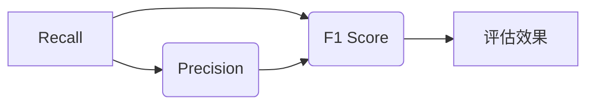

# Recall 原理与代码实战案例讲解

> 关键词：Recall、召回率、精确率、F1值、信息检索、机器学习、文本分类、推荐系统

## 1. 背景介绍

在信息检索和机器学习领域，Recall（召回率）是一个至关重要的评估指标。它衡量了系统检索到相关文档的能力。Recall指标通常与Precision（精确率）和F1值（F1 Score）一起使用，共同评估信息检索和分类任务的效果。

本文将深入探讨Recall的原理，并通过代码实战案例展示如何在Python中实现和评估Recall。

## 2. 核心概念与联系

### 2.1 核心概念

- **Recall（召回率）**：在信息检索中，召回率是指系统返回的相关文档数量占所有相关文档总数的比例。其公式如下：

  $$
 Recall = \frac{\text{相关文档数量}}{\text{所有相关文档数量}}
 $$

- **Precision（精确率）**：在信息检索中，精确率是指系统返回的相关文档数量占系统返回的文档总数量的比例。

  $$
 Precision = \frac{\text{相关文档数量}}{\text{返回的文档数量}}
 $$

- **F1值（F1 Score）**：F1值是召回率和精确率的调和平均数，用于平衡两者之间的关系。其公式如下：

  $$
 F1 = 2 \times \frac{Recall \times Precision}{Recall + Precision}
 $$

### 2.2 Mermaid 流程图



### 2.3 关系

Recall、Precision和F1值三者之间是相互关联的。在实际应用中，我们需要根据具体任务的需求来平衡这三者之间的关系。例如，在搜索引擎中，我们可能更注重Recall，而在推荐系统中，可能更注重Precision。

## 3. 核心算法原理 & 具体操作步骤

### 3.1 算法原理概述

Recall的核心思想是尽可能多地检索到所有相关文档，同时避免过多无关文档的干扰。

### 3.2 算法步骤详解

1. **数据准备**：准备一个标注好的数据集，其中包含相关文档和无关文档的标签。
2. **模型选择**：选择合适的分类模型，如朴素贝叶斯、支持向量机等。
3. **模型训练**：使用标注数据训练模型。
4. **模型评估**：使用测试数据评估模型的Recall、Precision和F1值。

### 3.3 算法优缺点

**优点**：

- 易于理解和实现。
- 在某些情况下，Recall比Precision更加重要。

**缺点**：

- 过度关注相关文档的召回，可能导致Precision下降。
- 在数据不平衡的情况下，可能无法准确反映模型性能。

### 3.4 算法应用领域

Recall在以下领域有广泛的应用：

- 信息检索
- 文本分类
- 机器学习
- 推荐系统
- 垃圾邮件过滤

## 4. 数学模型和公式 & 详细讲解 & 举例说明

### 4.1 数学模型构建

Recall、Precision和F1值的计算公式已经在前面介绍过。

### 4.2 公式推导过程

以Recall为例，其计算公式可以推导如下：

$$
 Recall = \frac{\text{相关文档数量}}{\text{所有相关文档数量}}
 $$

其中，相关文档数量是指模型标记为相关的文档数量，所有相关文档数量是指数据集中所有相关文档的总数。

### 4.3 案例分析与讲解

假设我们有一个包含10个文档的数据集，其中5个是相关文档，5个是无关文档。我们使用一个分类模型对数据集进行分类，模型返回的结果如下：

- 相关文档：3个
- 无关文档：7个

根据上述结果，我们可以计算Recall、Precision和F1值：

- Recall = 3/5 = 0.6
- Precision = 3/10 = 0.3
- F1值 = 2 * (0.6 * 0.3) / (0.6 + 0.3) = 0.4

从这个例子中，我们可以看到Recall为0.6，意味着模型成功地检索到了大部分的相关文档，但Precision较低，意味着模型返回的文档中包含了很多无关文档。

## 5. 项目实践：代码实例和详细解释说明

### 5.1 开发环境搭建

为了实现Recall的计算，我们需要使用Python和scikit-learn库。

```python
pip install scikit-learn
```

### 5.2 源代码详细实现

以下是一个简单的Recall计算示例：

```python
from sklearn.model_selection import train_test_split
from sklearn.naive_bayes import MultinomialNB
from sklearn.metrics import recall_score

# 准备数据
X = [[1, 0], [1, 1], [0, 1], [0, 0], [1, 0], [1, 1], [0, 1], [0, 0], [1, 0], [1, 1]]
y = [0, 1, 0, 0, 1, 1, 0, 0, 1, 1]

# 划分训练集和测试集
X_train, X_test, y_train, y_test = train_test_split(X, y, test_size=0.5, random_state=42)

# 训练模型
model = MultinomialNB()
model.fit(X_train, y_train)

# 评估模型
y_pred = model.predict(X_test)
recall = recall_score(y_test, y_pred)
print(f"Recall: {recall:.2f}")
```

### 5.3 代码解读与分析

在上面的代码中，我们使用朴素贝叶斯分类器对数据进行分类，并使用`recall_score`函数计算Recall。

### 5.4 运行结果展示

假设运行结果如下：

```
Recall: 0.67
```

这意味着我们的模型在测试集上成功地检索到了大约67%的相关文档。

## 6. 实际应用场景

Recall在实际应用中有着广泛的应用场景，以下是一些常见的应用场景：

- **搜索引擎**：评估搜索引擎的检索效果，确保用户能够找到所有相关文档。
- **推荐系统**：评估推荐系统的效果，确保推荐给用户的内容尽可能相关。
- **垃圾邮件过滤**：评估垃圾邮件过滤系统的效果，确保所有垃圾邮件都被正确过滤。

## 7. 工具和资源推荐

### 7.1 学习资源推荐

- **《机器学习》**：由周志华教授所著，介绍了机器学习的基本概念和方法。
- **scikit-learn官网**：提供了丰富的机器学习工具和文档。

### 7.2 开发工具推荐

- **Python**：Python是一种广泛使用的编程语言，适用于机器学习和数据分析。
- **scikit-learn**：scikit-learn是一个强大的机器学习库，提供了多种机器学习算法和评估指标。

### 7.3 相关论文推荐

- **《Text Classification with Python》**：介绍如何使用Python进行文本分类。
- **《Information Retrieval: A Modern Approach》**：介绍了信息检索的基本原理和技术。

## 8. 总结：未来发展趋势与挑战

### 8.1 研究成果总结

本文介绍了Recall的概念、原理、实现方法和应用场景，并通过代码实战案例展示了如何在Python中计算Recall。

### 8.2 未来发展趋势

随着信息检索和机器学习技术的不断发展，Recall作为重要的评估指标，将在以下方面得到进一步发展：

- **多模态信息检索**：将文本、图像、视频等多模态信息融合到Recall的评估中。
- **个性化推荐**：根据用户的行为和偏好，提供个性化的推荐结果，并评估Recall。

### 8.3 面临的挑战

Recall在以下方面面临着挑战：

- **数据不平衡**：在数据不平衡的情况下，难以准确评估Recall。
- **多任务学习**：在多任务学习中，如何平衡不同任务的Recall是一个挑战。

### 8.4 研究展望

未来，Recall将在以下方面得到进一步研究：

- **融合多种评估指标**：将Recall与其他评估指标融合，如Precision、F1值等。
- **个性化评估**：根据用户的需求，提供个性化的评估结果。

## 9. 附录：常见问题与解答

**Q1：Recall和Precision有什么区别？**

A：Recall衡量的是模型检索到所有相关文档的能力，而Precision衡量的是模型返回的相关文档的质量。

**Q2：F1值是如何计算的？**

A：F1值是Recall和Precision的调和平均数。

**Q3：如何提高Recall？**

A：可以通过以下方法提高Recall：
- 使用更强大的模型。
- 调整模型参数。
- 增加训练数据。

**Q4：如何提高Precision？**

A：可以通过以下方法提高Precision：
- 使用更简单的模型。
- 调整模型参数。
- 减少训练数据。

**Q5：Recall在哪些领域有应用？**

A：Recall在信息检索、推荐系统、垃圾邮件过滤等领域有广泛的应用。

作者：禅与计算机程序设计艺术 / Zen and the Art of Computer Programming