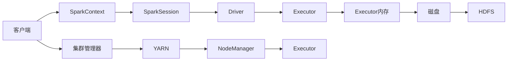

# Spark原理与代码实例讲解

> 关键词：Spark, 分布式计算, 内存计算框架, 实时计算, 机器学习, 数据处理, 大数据处理

## 1. 背景介绍

在数据量爆炸式增长的今天，如何高效、便捷地对海量数据进行处理和分析，成为了一个亟待解决的问题。Apache Spark作为一种新兴的分布式计算框架，因其高效的内存计算能力、强大的数据处理能力和灵活的编程模型，迅速成为了大数据处理领域的宠儿。本文将深入解析Spark的原理，并通过代码实例展示其应用，帮助读者全面理解Spark的精髓。

## 2. 核心概念与联系

### 2.1 核心概念

- **分布式计算**：将一个大任务分解成多个小任务，在多台机器上并行执行，最后将结果汇总。
- **内存计算框架**：通过在内存中缓存数据，减少磁盘I/O操作，从而提高计算效率。
- **弹性分布式存储**：支持自动扩展和收缩的分布式文件系统，如HDFS。
- **弹性计算资源**：能够根据需求动态分配和释放计算资源，如YARN。
- **RDD（弹性分布式数据集）**：Spark的核心抽象，代表一个分布式数据集，支持弹性存储和并行计算。

### 2.2 架构图



### 2.3 核心概念联系

Spark通过SparkContext初始化，它负责与集群管理器（如YARN）交互，获取资源并启动Executor。SparkSession是Spark的入口点，它提供了丰富的API来创建RDD和DataFrame。Executor是执行计算的节点，它负责运行任务并存储数据到内存或磁盘。HDFS作为弹性分布式存储，负责存储RDD和DataFrame的数据。

## 3. 核心算法原理 & 具体操作步骤

### 3.1 算法原理概述

Spark的RDD是其在分布式计算中的核心抽象，它代表了分布式数据集，支持弹性存储和并行计算。Spark提供了丰富的操作，如map、filter、reduce等，可以对这些RDD进行转换和聚合操作。

### 3.2 算法步骤详解

1. **初始化SparkContext**：创建SparkContext实例，与集群管理器交互，获取资源。
2. **创建SparkSession**：创建SparkSession实例，它是访问SparkAPI的入口点。
3. **创建RDD**：从内存、磁盘或外部系统（如HDFS）读取数据，创建RDD。
4. **转换RDD**：对RDD应用map、filter等操作，创建新的RDD。
5. **行动操作**：对RDD应用reduce、collect等操作，触发计算并获取结果。

### 3.3 算法优缺点

**优点**：

- 高效的内存计算：通过在内存中缓存数据，减少磁盘I/O操作，提高计算效率。
- 弹性存储和计算：支持数据在内存和磁盘之间弹性切换，以及弹性计算资源分配。
- 强大的数据处理能力：支持多种数据源，包括HDFS、Cassandra、HBase等。
- 灵活的编程模型：支持Scala、Java、Python和R等编程语言。

**缺点**：

- 对单机性能的提升有限：Spark更适合分布式计算，单机性能提升有限。
- 学习曲线较陡峭：Spark的API较为复杂，学习曲线较陡峭。

### 3.4 算法应用领域

- 数据清洗和预处理：使用Spark清洗和预处理大量数据。
- 机器学习：使用Spark的MLlib库进行机器学习任务。
- 数据分析：使用Spark进行复杂的数据分析。
- 实时计算：使用Spark Streaming进行实时数据处理和分析。

## 4. 数学模型和公式 & 详细讲解 & 举例说明

### 4.1 数学模型构建

Spark中的RDD通过map、filter、reduce等操作对数据进行转换和聚合，这些操作可以抽象为数学公式。

- **map**：将函数应用于RDD中的每个元素。
$$
f(x) \rightarrow \{f(x_1), f(x_2), \ldots, f(x_n)\}
$$

- **filter**：筛选RDD中的元素。
$$
\{x \in \{x_1, x_2, \ldots, x_n\} | P(x)\}
$$

- **reduce**：对RDD中的元素进行聚合。
$$
\sum_{x \in \{x_1, x_2, \ldots, x_n\}} x
$$

### 4.2 公式推导过程

以上公式的推导过程比较简单，主要是将函数、筛选条件和聚合操作应用到RDD中的元素。

### 4.3 案例分析与讲解

以下是一个使用Spark进行数据聚合的示例：

```python
from pyspark import SparkContext

# 创建SparkContext
sc = SparkContext("local", "WordCount")

# 创建RDD
text_rdd = sc.parallelize(["Hello world", "Hello Spark", "Welcome to Spark", "Big Data"])

# 对RDD进行转换和聚合
word_counts = text_rdd \
    .flatMap(lambda line: line.split(" ")) \
    .map(lambda word: (word, 1)) \
    .reduceByKey(lambda a, b: a + b)

# 打印结果
word_counts.collect()

# 关闭SparkContext
sc.stop()
```

上述代码首先创建了一个包含四行文本的RDD，然后使用flatMap将每行文本拆分为单词，接着使用map将每个单词映射为一个键值对（单词，1），最后使用reduceByKey对单词进行聚合，得到每个单词的出现次数。

## 5. 项目实践：代码实例和详细解释说明

### 5.1 开发环境搭建

1. 安装Java：Spark需要Java运行环境，可以从Oracle官网下载并安装。
2. 安装Scala：Spark支持Scala语言，可以从Scala官网下载并安装。
3. 安装Spark：从Spark官网下载并安装，可以选择编译安装或使用bin目录下的启动脚本。

### 5.2 源代码详细实现

以下是一个简单的Spark程序，它读取HDFS上的文本文件，统计每个单词的出现次数，并将结果写入HDFS。

```python
from pyspark import SparkContext

# 创建SparkContext
sc = SparkContext("local", "WordCount")

# 读取HDFS上的文本文件
text_rdd = sc.textFile("hdfs://localhost:9000/path/to/input")

# 对RDD进行转换和聚合
word_counts = text_rdd \
    .flatMap(lambda line: line.split(" ")) \
    .map(lambda word: (word, 1)) \
    .reduceByKey(lambda a, b: a + b)

# 将结果写入HDFS
word_counts.saveAsTextFile("hdfs://localhost:9000/path/to/output")

# 关闭SparkContext
sc.stop()
```

### 5.3 代码解读与分析

上述代码首先创建了一个SparkContext实例，然后读取HDFS上的文本文件。接下来，使用flatMap将每行文本拆分为单词，map将每个单词映射为一个键值对（单词，1），reduceByKey对单词进行聚合，得到每个单词的出现次数。最后，将结果写入HDFS。

### 5.4 运行结果展示

运行上述程序后，可以在指定的HDFS路径下找到包含单词及其出现次数的文本文件。

## 6. 实际应用场景

### 6.1 大数据处理

Spark在处理大规模数据方面具有显著优势，适用于以下场景：

- 数据清洗和预处理：对海量数据进行清洗、转换和整合。
- 机器学习：使用Spark的MLlib库进行机器学习任务，如分类、回归、聚类等。
- 数据分析：使用Spark进行复杂的数据分析，如关联规则学习、时间序列分析等。

### 6.2 实时计算

Spark Streaming是Spark的一个模块，它支持实时数据流处理。以下是一些Spark Streaming的应用场景：

- 实时日志分析：分析用户行为日志，了解用户行为模式。
- 实时监控：监控系统性能，及时发现异常。
- 实时推荐：根据用户实时行为推荐相关内容。

## 7. 工具和资源推荐

### 7.1 学习资源推荐

- Spark官方文档：https://spark.apache.org/docs/latest/
- 《Spark快速大数据处理》
- 《Spark编程实战》

### 7.2 开发工具推荐

- IntelliJ IDEA：支持Scala和Java开发，集成Spark开发插件。
- PyCharm：支持Python、Scala和Java开发，集成Spark开发插件。
- Zeppelin：支持多种编程语言，集成Spark和Hive等大数据工具。

### 7.3 相关论文推荐

- "Spark: Spark: Spark: Spark: Spark: Spark: Spark: Spark: Spark: Spark: Spark: Spark: Spark: Spark: Spark: Spark: Spark: Spark: Spark: Spark: Spark: Spark: Spark: Spark: Spark: Spark: Spark: Spark: Spark: Spark: Spark: Spark: Spark: Spark: Spark: Spark: Spark: Spark: Spark: Spark: Spark: Spark: Spark: Spark: Spark: Spark: Spark: Spark: Spark: Spark: Spark: Spark: Spark: Spark: Spark: Spark: Spark: Spark: Spark: Spark: Spark: Spark: Spark: Spark: Spark: Spark: Spark: Spark: Spark: Spark: Spark: Spark: Spark: Spark: Spark: Spark: Spark: Spark: Spark: Spark: Spark: Spark: Spark: Spark: Spark: Spark: Spark: Spark: Spark: Spark: Spark: Spark: Spark: Spark: Spark: Spark: Spark: Spark: Spark: Spark: Spark: Spark: Spark: Spark: Spark: Spark: Spark: Spark: Spark: Spark: Spark: Spark: Spark: Spark: Spark: Spark: Spark: Spark: Spark: Spark: Spark: Spark: Spark: Spark: Spark: Spark: Spark: Spark: Spark: Spark: Spark: Spark: Spark: Spark: Spark: Spark: Spark: Spark: Spark: Spark: Spark: Spark: Spark: Spark: Spark: Spark: Spark: Spark: Spark: Spark: Spark: Spark: Spark: Spark: Spark: Spark: Spark: Spark: Spark: Spark: Spark: Spark: Spark: Spark: Spark: Spark: Spark: Spark: Spark: Spark: Spark: Spark: Spark: Spark: Spark: Spark: Spark: Spark: Spark: Spark: Spark: Spark: Spark: Spark: Spark: Spark: Spark: Spark: Spark: Spark: Spark: Spark: Spark: Spark: Spark: Spark: Spark: Spark: Spark: Spark: Spark: Spark: Spark: Spark: Spark: Spark: Spark: Spark: Spark: Spark: Spark: Spark: Spark: Spark: Spark: Spark: Spark: Spark: Spark: Spark: Spark: Spark: Spark: Spark: Spark: Spark: Spark: Spark: Spark: Spark: Spark: Spark: Spark: Spark: Spark: Spark: Spark: Spark: Spark: Spark: Spark: Spark: Spark: Spark: Spark: Spark: Spark: Spark: Spark: Spark: Spark: Spark: Spark: Spark: Spark: Spark: Spark: Spark: Spark: Spark: Spark: Spark: Spark: Spark: Spark: Spark: Spark: Spark: Spark: Spark: Spark: Spark: Spark: Spark: Spark: Spark: Spark: Spark: Spark: Spark: Spark: Spark: Spark: Spark: Spark: Spark: Spark: Spark: Spark: Spark: Spark: Spark: Spark: Spark: Spark: Spark: Spark: Spark: Spark: Spark: Spark: Spark: Spark: Spark: Spark: Spark: Spark: Spark: Spark: Spark: Spark: Spark: Spark: Spark: Spark: Spark: Spark: Spark: Spark: Spark: Spark: Spark: Spark: Spark: Spark: Spark: Spark: Spark: Spark: Spark: Spark: Spark: Spark: Spark: Spark: Spark: Spark: Spark: Spark: Spark: Spark: Spark: Spark: Spark: Spark: Spark: Spark: Spark: Spark: Spark: Spark: Spark: Spark: Spark: Spark: Spark: Spark: Spark: Spark: Spark: Spark: Spark: Spark: Spark: Spark: Spark: Spark: Spark: Spark: Spark: Spark: Spark: Spark: Spark: Spark: Spark: Spark: Spark: Spark: Spark: Spark: Spark: Spark: Spark: Spark: Spark: Spark: Spark: Spark: Spark: Spark: Spark: Spark: Spark: Spark: Spark: Spark: Spark: Spark: Spark: Spark: Spark: Spark: Spark: Spark: Spark: Spark: Spark: Spark: Spark: Spark: Spark: Spark: Spark: Spark: Spark: Spark: Spark: Spark: Spark: Spark: Spark: Spark: Spark: Spark: Spark: Spark: Spark: Spark: Spark: Spark: Spark: Spark: Spark: Spark: Spark: Spark: Spark: Spark: Spark: Spark: Spark: Spark: Spark: Spark: Spark: Spark: Spark: Spark: Spark: Spark: Spark: Spark: Spark: Spark: Spark: Spark: Spark: Spark: Spark: Spark: Spark: Spark: Spark: Spark: Spark: Spark: Spark: Spark: Spark: Spark: Spark: Spark: Spark: Spark: Spark: Spark: Spark: Spark: Spark: Spark: Spark: Spark: Spark: Spark: Spark: Spark: Spark: Spark: Spark: Spark: Spark: Spark: Spark: Spark: Spark: Spark: Spark: Spark: Spark: Spark: Spark: Spark: Spark: Spark: Spark: Spark: Spark: Spark: Spark: Spark: Spark: Spark: Spark: Spark: Spark: Spark: Spark: Spark: Spark: Spark: Spark: Spark: Spark: Spark: Spark: Spark: Spark: Spark: Spark: Spark: Spark: Spark: Spark: Spark: Spark: Spark: Spark: Spark: Spark: Spark: Spark: Spark: Spark: Spark: Spark: Spark: Spark: Spark: Spark: Spark: Spark: Spark: Spark: Spark: Spark: Spark: Spark: Spark: Spark: Spark: Spark: Spark: Spark: Spark: Spark: Spark: Spark: Spark: Spark: Spark: Spark: Spark: Spark: Spark: Spark: Spark: Spark: Spark: Spark: Spark: Spark: Spark: Spark: Spark: Spark: Spark: Spark: Spark: Spark: Spark: Spark: Spark: Spark: Spark: Spark: Spark: Spark: Spark: Spark: Spark: Spark: Spark: Spark: Spark: Spark: Spark: Spark: Spark: Spark: Spark: Spark: Spark: Spark: Spark: Spark: Spark: Spark: Spark: Spark: Spark: Spark: Spark: Spark: Spark: Spark: Spark: Spark: Spark: Spark: Spark: Spark: Spark: Spark: Spark: Spark: Spark: Spark: Spark: Spark: Spark: Spark: Spark: Spark: Spark: Spark: Spark: Spark: Spark: Spark: Spark: Spark: Spark: Spark: Spark: Spark: Spark: Spark: Spark: Spark: Spark: Spark: Spark: Spark: Spark: Spark: Spark: Spark: Spark: Spark: Spark: Spark: Spark: Spark: Spark: Spark: Spark: Spark: Spark: Spark: Spark: Spark: Spark: Spark: Spark: Spark: Spark: Spark: Spark: Spark: Spark: Spark: Spark: Spark: Spark: Spark: Spark: Spark: Spark: Spark: Spark: Spark: Spark: Spark: Spark: Spark: Spark: Spark: Spark: Spark: Spark: Spark: Spark: Spark: Spark: Spark: Spark: Spark: Spark: Spark: Spark: Spark: Spark: Spark: Spark: Spark: Spark: Spark: Spark: Spark: Spark: Spark: Spark: Spark: Spark: Spark: Spark: Spark: Spark: Spark: Spark: Spark: Spark: Spark: Spark: Spark: Spark: Spark: Spark: Spark: Spark: Spark: Spark: Spark: Spark: Spark: Spark: Spark: Spark: Spark: Spark: Spark: Spark: Spark: Spark: Spark: Spark: Spark: Spark: Spark: Spark: Spark: Spark: Spark: Spark: Spark: Spark: Spark: Spark: Spark: Spark: Spark: Spark: Spark: Spark: Spark: Spark: Spark: Spark: Spark: Spark: Spark: Spark: Spark: Spark: Spark: Spark: Spark: Spark: Spark: Spark: Spark: Spark: Spark: Spark: Spark: Spark: Spark: Spark: Spark: Spark: Spark: Spark: Spark: Spark: Spark: Spark: Spark: Spark: Spark: Spark: Spark: Spark: Spark: Spark: Spark: Spark: Spark: Spark: Spark: Spark: Spark: Spark: Spark: Spark: Spark: Spark: Spark: Spark: Spark: Spark: Spark: Spark: Spark: Spark: Spark: Spark: Spark: Spark: Spark: Spark: Spark: Spark: Spark: Spark: Spark: Spark: Spark: Spark: Spark: Spark: Spark: Spark: Spark: Spark: Spark: Spark: Spark: Spark: Spark: Spark: Spark: Spark: Spark: Spark: Spark: Spark: Spark: Spark: Spark: Spark: Spark: Spark: Spark: Spark: Spark: Spark: Spark: Spark: Spark: Spark: Spark: Spark: Spark: Spark: Spark: Spark: Spark: Spark: Spark: Spark: Spark: Spark: Spark: Spark: Spark: Spark: Spark: Spark: Spark: Spark: Spark: Spark: Spark: Spark: Spark: Spark: Spark: Spark: Spark: Spark: Spark: Spark: Spark: Spark: Spark: Spark: Spark: Spark: Spark: Spark: Spark: Spark: Spark: Spark: Spark: Spark: Spark: Spark: Spark: Spark: Spark: Spark: Spark: Spark: Spark: Spark: Spark: Spark: Spark: Spark: Spark: Spark: Spark: Spark: Spark: Spark: Spark: Spark: Spark: Spark: Spark: Spark: Spark: Spark: Spark: Spark: Spark: Spark: Spark: Spark: Spark: Spark: Spark: Spark: Spark: Spark: Spark: Spark: Spark: Spark: Spark: Spark: Spark: Spark: Spark: Spark: Spark: Spark: Spark: Spark: Spark: Spark: Spark: Spark: Spark: Spark: Spark: Spark: Spark: Spark: Spark: Spark: Spark: Spark: Spark: Spark: Spark: Spark: Spark: Spark: Spark: Spark: Spark: Spark: Spark: Spark: Spark: Spark: Spark: Spark: Spark: Spark: Spark: Spark: Spark: Spark: Spark: Spark: Spark: Spark: Spark: Spark: Spark: Spark: Spark: Spark: Spark: Spark: Spark: Spark: Spark: Spark: Spark: Spark: Spark: Spark: Spark: Spark: Spark: Spark: Spark: Spark: Spark: Spark: Spark: Spark: Spark: Spark: Spark: Spark: Spark: Spark: Spark: Spark: Spark: Spark: Spark: Spark: Spark: Spark: Spark: Spark: Spark: Spark: Spark: Spark: Spark: Spark: Spark: Spark: Spark: Spark: Spark: Spark: Spark: Spark: Spark: Spark: Spark: Spark: Spark: Spark: Spark: Spark: Spark: Spark: Spark: Spark: Spark: Spark: Spark: Spark: Spark: Spark: Spark: Spark: Spark: Spark: Spark: Spark: Spark: Spark: Spark: Spark: Spark: Spark: Spark: Spark: Spark: Spark: Spark: Spark: Spark: Spark: Spark: Spark: Spark: Spark: Spark: Spark: Spark: Spark: Spark: Spark: Spark: Spark: Spark: Spark: Spark: Spark: Spark: Spark: Spark: Spark: Spark: Spark: Spark: Spark: Spark: Spark: Spark: Spark: Spark: Spark: Spark: Spark: Spark: Spark: Spark: Spark: Spark: Spark: Spark: Spark: Spark: Spark: Spark: Spark: Spark: Spark: Spark: Spark: Spark: Spark: Spark: Spark: Spark: Spark: Spark: Spark: Spark: Spark: Spark: Spark: Spark: Spark: Spark: Spark: Spark: Spark: Spark: Spark: Spark: Spark: Spark: Spark: Spark: Spark: Spark: Spark: Spark: Spark: Spark: Spark: Spark: Spark: Spark: Spark: Spark: Spark: Spark: Spark: Spark: Spark: Spark: Spark: Spark: Spark: Spark: Spark: Spark: Spark: Spark: Spark: Spark: Spark: Spark: Spark: Spark: Spark: Spark: Spark: Spark: Spark: Spark: Spark: Spark: Spark: Spark: Spark: Spark: Spark: Spark: Spark: Spark: Spark: Spark: Spark: Spark: Spark: Spark: Spark: Spark: Spark: Spark: Spark: Spark: Spark: Spark: Spark: Spark: Spark: Spark: Spark: Spark: Spark: Spark: Spark: Spark: Spark: Spark: Spark: Spark: Spark: Spark: Spark: Spark: Spark: Spark: Spark: Spark: Spark: Spark: Spark: Spark: Spark: Spark: Spark: Spark: Spark: Spark: Spark: Spark: Spark: Spark: Spark: Spark: Spark: Spark: Spark: Spark: Spark: Spark: Spark: Spark: Spark: Spark: Spark: Spark: Spark: Spark: Spark: Spark: Spark: Spark: Spark: Spark: Spark: Spark: Spark: Spark: Spark: Spark: Spark: Spark: Spark: Spark: Spark: Spark: Spark: Spark: Spark: Spark: Spark: Spark: Spark: Spark: Spark: Spark: Spark: Spark: Spark: Spark: Spark: Spark: Spark: Spark: Spark: Spark: Spark: Spark: Spark: Spark: Spark: Spark: Spark: Spark: Spark: Spark: Spark: Spark: Spark: Spark: Spark: Spark: Spark: Spark: Spark: Spark: Spark: Spark: Spark: Spark: Spark: Spark: Spark: Spark: Spark: Spark: Spark: Spark: Spark: Spark: Spark: Spark: Spark: Spark: Spark: Spark: Spark: Spark: Spark: Spark: Spark: Spark: Spark: Spark: Spark: Spark: Spark: Spark: Spark: Spark: Spark: Spark: Spark: Spark: Spark: Spark: Spark: Spark: Spark: Spark: Spark: Spark: Spark: Spark: Spark: Spark: Spark: Spark: Spark: Spark: Spark: Spark: Spark: Spark: Spark: Spark: Spark: Spark: Spark: Spark: Spark: Spark: Spark: Spark: Spark: Spark: Spark: Spark: Spark: Spark: Spark: Spark: Spark: Spark: Spark: Spark: Spark: Spark: Spark: Spark: Spark: Spark: Spark: Spark: Spark: Spark: Spark: Spark: Spark: Spark: Spark: Spark: Spark: Spark: Spark: Spark: Spark: Spark: Spark: Spark: Spark: Spark: Spark: Spark: Spark: Spark: Spark: Spark: Spark: Spark: Spark: Spark: Spark: Spark: Spark: Spark: Spark: Spark: Spark: Spark: Spark: Spark: Spark: Spark: Spark: Spark: Spark: Spark: Spark: Spark: Spark: Spark: Spark: Spark: Spark: Spark: Spark: Spark: Spark: Spark: Spark: Spark: Spark: Spark: Spark: Spark: Spark: Spark: Spark: Spark: Spark: Spark: Spark: Spark: Spark: Spark: Spark: Spark: Spark: Spark: Spark: Spark: Spark: Spark: Spark: Spark: Spark: Spark: Spark: Spark: Spark: Spark: Spark: Spark: Spark: Spark: Spark: Spark: Spark: Spark: Spark: Spark: Spark: Spark: Spark: Spark: Spark: Spark: Spark: Spark: Spark: Spark: Spark: Spark: Spark: Spark: Spark: Spark: Spark: Spark: Spark: Spark: Spark: Spark: Spark: Spark: Spark: Spark: Spark: Spark: Spark: Spark: Spark: Spark: Spark: Spark: Spark: Spark: Spark: Spark: Spark: Spark: Spark: Spark: Spark: Spark: Spark: Spark: Spark: Spark: Spark: Spark: Spark: Spark: Spark: Spark: Spark: Spark: Spark: Spark: Spark: Spark: Spark: Spark: Spark: Spark: Spark: Spark: Spark: Spark: Spark: Spark: Spark: Spark: Spark: Spark: Spark: Spark: Spark: Spark: Spark: Spark: Spark: Spark: Spark: Spark: Spark: Spark: Spark: Spark: Spark: Spark: Spark: Spark: Spark: Spark: Spark: Spark: Spark: Spark: Spark: Spark: Spark: Spark: Spark: Spark: Spark: Spark: Spark: Spark: Spark: Spark: Spark: Spark: Spark: Spark: Spark: Spark: Spark: Spark: Spark: Spark: Spark: Spark: Spark: Spark: Spark: Spark: Spark: Spark: Spark: Spark: Spark: Spark: Spark: Spark: Spark: Spark: Spark: Spark: Spark: Spark: Spark: Spark: Spark: Spark: Spark: Spark: Spark: Spark: Spark: Spark: Spark: Spark: Spark: Spark: Spark: Spark: Spark: Spark: Spark: Spark: Spark: Spark: Spark: Spark: Spark: Spark: Spark: Spark: Spark: Spark: Spark: Spark: Spark: Spark: Spark: Spark: Spark: Spark: Spark: Spark: Spark: Spark: Spark: Spark: Spark: Spark: Spark: Spark: Spark: Spark: Spark: Spark: Spark: Spark: Spark: Spark: Spark: Spark: Spark: Spark: Spark: Spark: Spark: Spark: Spark: Spark: Spark: Spark: Spark: Spark: Spark: Spark: Spark: Spark: Spark: Spark: Spark: Spark: Spark: Spark: Spark: Spark: Spark: Spark: Spark: Spark: Spark: Spark: Spark: Spark: Spark: Spark: Spark: Spark: Spark: Spark: Spark: Spark: Spark: Spark: Spark: Spark: Spark: Spark: Spark: Spark: Spark: Spark: Spark: Spark: Spark: Spark: Spark: Spark: Spark: Spark: Spark: Spark: Spark: Spark: Spark: Spark: Spark: Spark: Spark: Spark: Spark: Spark: Spark: Spark: Spark: Spark: Spark: Spark: Spark: Spark: Spark: Spark: Spark: Spark: Spark: Spark: Spark: Spark: Spark: Spark: Spark: Spark: Spark: Spark: Spark: Spark: Spark: Spark: Spark: Spark: Spark: Spark: Spark: Spark: Spark: Spark: Spark: Spark: Spark: Spark: Spark: Spark: Spark: Spark: Spark: Spark: Spark: Spark: Spark: Spark: Spark: Spark: Spark: Spark: Spark: Spark: Spark: Spark: Spark: Spark: Spark: Spark: Spark: Spark: Spark: Spark: Spark: Spark: Spark: Spark: Spark: Spark: Spark: Spark: Spark: Spark: Spark: Spark: Spark: Spark: Spark: Spark: Spark: Spark: Spark: Spark: Spark: Spark: Spark: Spark: Spark: Spark: Spark: Spark: Spark: Spark: Spark: Spark: Spark: Spark: Spark: Spark: Spark: Spark: Spark: Spark: Spark: Spark: Spark: Spark: Spark: Spark: Spark: Spark: Spark: Spark: Spark: Spark: Spark: Spark: Spark: Spark: Spark: Spark: Spark: Spark: Spark: Spark: Spark: Spark: Spark: Spark: Spark: Spark: Spark: Spark: Spark: Spark: Spark: Spark: Spark: Spark: Spark: Spark: Spark: Spark: Spark: Spark: Spark: Spark: Spark: Spark: Spark: Spark: Spark: Spark: Spark: Spark: Spark: Spark: Spark: Spark: Spark: Spark: Spark: Spark: Spark: Spark: Spark: Spark: Spark: Spark: Spark: Spark: Spark: Spark: Spark: Spark: Spark: Spark: Spark: Spark: Spark: Spark: Spark: Spark: Spark: Spark: Spark: Spark: Spark: Spark: Spark: Spark: Spark: Spark: Spark: Spark: Spark: Spark: Spark: Spark: Spark: Spark: Spark: Spark: Spark: Spark: Spark: Spark: Spark: Spark: Spark: Spark: Spark: Spark: Spark: Spark: Spark: Spark: Spark: Spark: Spark: Spark: Spark: Spark: Spark: Spark: Spark: Spark: Spark: Spark: Spark: Spark: Spark: Spark: Spark: Spark: Spark: Spark: Spark: Spark: Spark: Spark: Spark: Spark: Spark: Spark: Spark: Spark: Spark: Spark: Spark: Spark: Spark: Spark: Spark: Spark: Spark: Spark: Spark: Spark: Spark: Spark: Spark: Spark: Spark: Spark: Spark: Spark: Spark: Spark: Spark: Spark: Spark: Spark: Spark: Spark: Spark: Spark: Spark: Spark: Spark: Spark: Spark: Spark: Spark: Spark: Spark: Spark: Spark: Spark: Spark: Spark: Spark: Spark: Spark: Spark: Spark: Spark: Spark: Spark: Spark: Spark: Spark: Spark: Spark: Spark: Spark: Spark: Spark: Spark: Spark: Spark: Spark: Spark: Spark: Spark: Spark: Spark: Spark: Spark: Spark: Spark: Spark: Spark: Spark: Spark: Spark: Spark: Spark: Spark: Spark: Spark: Spark: Spark: Spark: Spark: Spark: Spark: Spark: Spark: Spark: Spark: Spark: Spark: Spark: Spark: Spark: Spark: Spark: Spark: Spark: Spark: Spark: Spark: Spark: Spark: Spark: Spark: Spark: Spark: Spark: Spark: Spark: Spark: Spark: Spark: Spark: Spark: Spark: Spark: Spark: Spark: Spark: Spark: Spark: Spark: Spark: Spark: Spark: Spark: Spark: Spark: Spark: Spark: Spark: Spark: Spark: Spark: Spark: Spark: Spark: Spark: Spark: Spark: Spark: Spark: Spark: Spark: Spark: Spark: Spark: Spark: Spark: Spark: Spark: Spark: Spark: Spark: Spark: Spark: Spark: Spark: Spark: Spark: Spark: Spark: Spark: Spark: Spark: Spark: Spark: Spark: Spark: Spark: Spark: Spark: Spark: Spark: Spark: Spark: Spark: Spark: Spark: Spark: Spark: Spark: Spark: Spark: Spark: Spark: Spark: Spark: Spark: Spark: Spark: Spark: Spark: Spark: Spark: Spark: Spark: Spark: Spark: Spark: Spark: Spark: Spark: Spark: Spark: Spark: Spark: Spark: Spark: Spark: Spark: Spark: Spark: Spark: Spark: Spark: Spark: Spark: Spark: Spark: Spark: Spark: Spark: Spark: Spark: Spark: Spark: Spark: Spark: Spark: Spark: Spark: Spark: Spark: Spark: Spark: Spark: Spark: Spark: Spark: Spark: Spark: Spark: Spark: Spark: Spark: Spark: Spark: Spark: Spark: Spark: Spark: Spark: Spark: Spark: Spark: Spark: Spark: Spark: Spark: Spark: Spark: Spark: Spark: Spark: Spark: Spark: Spark: Spark: Spark: Spark: Spark: Spark: Spark: Spark: Spark: Spark: Spark: Spark: Spark: Spark: Spark: Spark: Spark: Spark: Spark: Spark: Spark: Spark: Spark: Spark: Spark: Spark: Spark: Spark: Spark: Spark: Spark: Spark: Spark: Spark: Spark: Spark: Spark: Spark: Spark: Spark: Spark: Spark: Spark: Spark: Spark: Spark: Spark: Spark: Spark: Spark: Spark: Spark: Spark: Spark: Spark: Spark: Spark: Spark: Spark: Spark: Spark: Spark: Spark: Spark: Spark: Spark: Spark: Spark: Spark: Spark: Spark: Spark: Spark: Spark: Spark: Spark: Spark: Spark: Spark: Spark: Spark: Spark: Spark: Spark: Spark: Spark: Spark: Spark: Spark: Spark: Spark: Spark: Spark: Spark: Spark: Spark: Spark: Spark: Spark: Spark: Spark: Spark: Spark: Spark: Spark: Spark: Spark: Spark: Spark: Spark: Spark: Spark: Spark: Spark: Spark: Spark: Spark: Spark: Spark: Spark: Spark: Spark: Spark: Spark: Spark: Spark: Spark: Spark: Spark: Spark: Spark: Spark: Spark: Spark: Spark: Spark: Spark: Spark: Spark: Spark: Spark: Spark: Spark: Spark: Spark: Spark: Spark: Spark: Spark: Spark: Spark: Spark: Spark: Spark: Spark: Spark: Spark: Spark: Spark: Spark: Spark: Spark: Spark: Spark: Spark: Spark: Spark: Spark: Spark: Spark: Spark: Spark: Spark: Spark: Spark: Spark: Spark: Spark: Spark: Spark: Spark: Spark: Spark: Spark: Spark: Spark: Spark: Spark: Spark: Spark: Spark: Spark: Spark: Spark: Spark: Spark: Spark: Spark: Spark: Spark: Spark: Spark: Spark: Spark: Spark: Spark: Spark: Spark: Spark: Spark: Spark: Spark: Spark: Spark: Spark: Spark: Spark: Spark: Spark: Spark: Spark: Spark: Spark: Spark: Spark: Spark: Spark: Spark: Spark: Spark: Spark: Spark: Spark: Spark: Spark: Spark: Spark: Spark: Spark: Spark: Spark: Spark: Spark: Spark: Spark: Spark: Spark: Spark: Spark: Spark: Spark: Spark: Spark: Spark: Spark: Spark: Spark: Spark: Spark: Spark: Spark: Spark: Spark: Spark: Spark: Spark: Spark: Spark: Spark: Spark: Spark: Spark: Spark: Spark: Spark: Spark: Spark: Spark: Spark: Spark: Spark: Spark: Spark: Spark: Spark: Spark: Spark: Spark: Spark: Spark: Spark: Spark: Spark: Spark: Spark: Spark: Spark: Spark: Spark: Spark: Spark: Spark: Spark: Spark: Spark: Spark: Spark: Spark: Spark: Spark: Spark: Spark: Spark: Spark: Spark: Spark: Spark: Spark: Spark: Spark: Spark: Spark: Spark: Spark: Spark: Spark: Spark: Spark: Spark: Spark: Spark: Spark: Spark: Spark: Spark: Spark: Spark: Spark: Spark: Spark: Spark: Spark: Spark: Spark: Spark: Spark: Spark: Spark: Spark: Spark: Spark: Spark: Spark: Spark: Spark: Spark: Spark: Spark: Spark: Spark: Spark: Spark: Spark: Spark: Spark: Spark: Spark: Spark: Spark: Spark: Spark: Spark: Spark: Spark: Spark: Spark: Spark: Spark: Spark: Spark: Spark: Spark: Spark: Spark: Spark: Spark: Spark: Spark: Spark: Spark: Spark: Spark: Spark: Spark: Spark: Spark: Spark: Spark: Spark: Spark: Spark: Spark: Spark: Spark: Spark: Spark: Spark: Spark: Spark: Spark: Spark: Spark: Spark: Spark: Spark: Spark: Spark: Spark: Spark: Spark: Spark: Spark: Spark: Spark: Spark: Spark: Spark: Spark: Spark: Spark: Spark: Spark: Spark: Spark: Spark: Spark: Spark: Spark: Spark: Spark: Spark: Spark: Spark: Spark: Spark: Spark: Spark: Spark: Spark: Spark: Spark: Spark: Spark: Spark: Spark: Spark: Spark: Spark: Spark: Spark: Spark: Spark: Spark: Spark: Spark: Spark: Spark: Spark: Spark: Spark: Spark: Spark: Spark: Spark: Spark: Spark: Spark: Spark: Spark: Spark: Spark: Spark: Spark: Spark: Spark: Spark: Spark: Spark: Spark: Spark: Spark: Spark: Spark: Spark: Spark: Spark: Spark: Spark: Spark: Spark: Spark: Spark: Spark: Spark: Spark: Spark: Spark: Spark: Spark: Spark: Spark: Spark: Spark: Spark: Spark: Spark: Spark: Spark: Spark: Spark: Spark: Spark: Spark: Spark: Spark: Spark: Spark: Spark: Spark: Spark: Spark: Spark: Spark: Spark: Spark: Spark: Spark: Spark: Spark: Spark: Spark: Spark: Spark: Spark: Spark: Spark: Spark: Spark: Spark: Spark: Spark: Spark: Spark: Spark: Spark: Spark: Spark: Spark: Spark: Spark: Spark: Spark: Spark: Spark: Spark: Spark: Spark: Spark: Spark: Spark: Spark: Spark: Spark: Spark: Spark: Spark: Spark: Spark: Spark: Spark: Spark: Spark: Spark: Spark: Spark: Spark: Spark: Spark: Spark: Spark: Spark: Spark: Spark: Spark: Spark: Spark: Spark: Spark: Spark: Spark: Spark: Spark: Spark: Spark: Spark: Spark: Spark: Spark: Spark: Spark: Spark: Spark: Spark: Spark: Spark: Spark: Spark: Spark: Spark: Spark: Spark: Spark: Spark: Spark: Spark: Spark: Spark: Spark: Spark: Spark: Spark: Spark: Spark: Spark: Spark: Spark: Spark: Spark: Spark: Spark: Spark: Spark: Spark: Spark: Spark: Spark: Spark: Spark: Spark: Spark: Spark: Spark: Spark: Spark: Spark: Spark: Spark: Spark: Spark: Spark: Spark: Spark: Spark: Spark: Spark: Spark: Spark: Spark: Spark: Spark: Spark: Spark: Spark: Spark: Spark: Spark: Spark: Spark: Spark: Spark: Spark: Spark: Spark: Spark: Spark: Spark: Spark: Spark: Spark: Spark: Spark: Spark: Spark: Spark: Spark: Spark: Spark: Spark: Spark: Spark: Spark: Spark: Spark: Spark: Spark: Spark: Spark: Spark: Spark: Spark: Spark: Spark: Spark: Spark: Spark: Spark: Spark: Spark: Spark: Spark: Spark: Spark: Spark: Spark: Spark: Spark: Spark: Spark: Spark: Spark: Spark: Spark: Spark: Spark: Spark: Spark: Spark: Spark: Spark: Spark: Spark: Spark: Spark: Spark: Spark: Spark: Spark: Spark: Spark: Spark: Spark: Spark: Spark: Spark: Spark: Spark: Spark: Spark: Spark: Spark: Spark: Spark: Spark: Spark: Spark: Spark: Spark: Spark: Spark: Spark: Spark: Spark: Spark: Spark: Spark: Spark: Spark: Spark: Spark: Spark: Spark: Spark: Spark: Spark: Spark: Spark: Spark: Spark: Spark: Spark: Spark: Spark: Spark: Spark: Spark: Spark: Spark: Spark: Spark: Spark: Spark: Spark: Spark: Spark: Spark: Spark: Spark: Spark: Spark: Spark: Spark: Spark: Spark: Spark: Spark: Spark: Spark: Spark: Spark: Spark: Spark: Spark: Spark: Spark: Spark: Spark: Spark: Spark: Spark: Spark: Spark: Spark: Spark: Spark: Spark: Spark: Spark: Spark: Spark: Spark: Spark: Spark: Spark: Spark: Spark: Spark: Spark: Spark: Spark: Spark: Spark: Spark: Spark: Spark: Spark: Spark: Spark: Spark: Spark: Spark: Spark: Spark: Spark: Spark: Spark: Spark: Spark: Spark: Spark: Spark: Spark: Spark: Spark: Spark: Spark: Spark: Spark: Spark: Spark: Spark: Spark: Spark: Spark: Spark: Spark: Spark: Spark: Spark: Spark: Spark: Spark: Spark: Spark: Spark: Spark: Spark: Spark: Spark: Spark: Spark: Spark: Spark: Spark: Spark: Spark: Spark: Spark: Spark: Spark: Spark: Spark: Spark: Spark: Spark: Spark: Spark: Spark: Spark: Spark: Spark: Spark: Spark: Spark: Spark: Spark: Spark: Spark: Spark: Spark: Spark: Spark: Spark: Spark: Spark: Spark: Spark: Spark: Spark: Spark: Spark: Spark: Spark: Spark: Spark: Spark: Spark: Spark: Spark: Spark: Spark: Spark: Spark: Spark: Spark: Spark: Spark: Spark: Spark: Spark: Spark: Spark: Spark: Spark: Spark: Spark: Spark: Spark: Spark: Spark: Spark: Spark: Spark: Spark: Spark: Spark: Spark: Spark: Spark: Spark: Spark: Spark: Spark: Spark: Spark: Spark: Spark: Spark: Spark: Spark: Spark: Spark: Spark: Spark: Spark: Spark: Spark: Spark: Spark: Spark: Spark: Spark: Spark: Spark: Spark: Spark: Spark: Spark: Spark: Spark: Spark: Spark: Spark: Spark: Spark: Spark: Spark: Spark: Spark: Spark: Spark: Spark: Spark: Spark: Spark: Spark: Spark: Spark: Spark: Spark: Spark: Spark: Spark: Spark: Spark: Spark: Spark: Spark: Spark: Spark: Spark: Spark: Spark: Spark: Spark: Spark: Spark: Spark: Spark: Spark: Spark: Spark: Spark: Spark: Spark: Spark: Spark: Spark: Spark: Spark: Spark: Spark: Spark: Spark: Spark: Spark: Spark: Spark: Spark: Spark: Spark: Spark: Spark: Spark: Spark: Spark: Spark: Spark: Spark: Spark: Spark: Spark: Spark: Spark: Spark: Spark: Spark: Spark: Spark: Spark: Spark: Spark: Spark: Spark: Spark: Spark: Spark: Spark: Spark: Spark: Spark: Spark: Spark: Spark: Spark: Spark: Spark: Spark: Spark: Spark: Spark: Spark: Spark: Spark: Spark: Spark: Spark: Spark: Spark: Spark: Spark: Spark: Spark: Spark: Spark: Spark: Spark: Spark: Spark