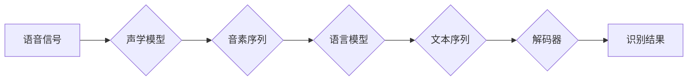

> 关键词：语音识别，自动语音识别，深度学习，神经网络，声学模型，语言模型，解码器，端到端模型，数据集，性能评估

# Speech Recognition原理与代码实例讲解

## 1. 背景介绍

语音识别（Speech Recognition，简称SR）是人工智能领域的一个重要分支，旨在将人类的语音转换为机器可理解的文本。这项技术已经广泛应用于智能助手、智能家居、语音搜索、自动翻译等多个领域。随着深度学习技术的发展，语音识别的准确率和性能得到了显著提升，已经成为人工智能领域的一个热点研究方向。

### 1.1 问题的由来

人类语言是一种复杂的信息传递方式，包含丰富的语义和情感信息。语音识别技术的目标就是让机器能够理解并处理这些信息。然而，语音信号的复杂性和多样性给语音识别带来了诸多挑战：

- 语音信号的动态变化：语音信号受说话人、环境、噪声等因素的影响，具有动态变化的特性。
- 语音信号的冗余性：语音信号中包含大量的冗余信息，需要模型有效提取关键信息。
- 语音信号的时变特性：语音信号的时变特性使得模型需要具备良好的动态建模能力。

### 1.2 研究现状

语音识别技术的发展经历了从规则方法到统计方法，再到深度学习方法的三个阶段。当前，基于深度学习的语音识别技术已经成为主流。

- 规则方法：基于声学模型和语言模型进行语音识别。声学模型负责将语音信号转换为音素序列，语言模型负责将音素序列转换为文本序列。
- 统计方法：使用隐马尔可夫模型（HMM）等统计模型进行语音识别，通过统计语音信号的时序特征和语言序列的概率分布进行解码。
- 深度学习方法：利用深度神经网络强大的特征提取和学习能力，对语音信号和语言序列进行建模，实现端到端的语音识别。

### 1.3 研究意义

语音识别技术的发展对于推动人工智能技术的发展具有重要意义：

- 提高人机交互的便捷性：语音识别技术可以实现语音指令控制、语音输入等功能，提高人机交互的便捷性。
- 拓展人工智能应用领域：语音识别技术可以应用于智能家居、医疗健康、教育娱乐等多个领域，拓展人工智能的应用范围。
- 促进人工智能产业发展：语音识别技术的发展将推动人工智能产业的快速发展，为经济发展注入新动力。

### 1.4 本文结构

本文将系统介绍语音识别的原理与代码实例，内容安排如下：

- 第2部分，介绍语音识别的核心概念与联系。
- 第3部分，讲解语音识别的核心算法原理和具体操作步骤。
- 第4部分，介绍语音识别的数学模型和公式，并结合实例进行讲解。
- 第5部分，给出语音识别的代码实例和详细解释说明。
- 第6部分，探讨语音识别的实际应用场景和未来应用展望。
- 第7部分，推荐语音识别的学习资源、开发工具和相关论文。
- 第8部分，总结语音识别的未来发展趋势与挑战。
- 第9部分，提供语音识别的常见问题与解答。

## 2. 核心概念与联系

### 2.1 核心概念

- **声学模型**：负责将语音信号转换为音素序列，是语音识别系统的核心组件之一。
- **语言模型**：负责将音素序列转换为文本序列，用于评估不同候选文本序列的概率。
- **解码器**：根据声学模型和语言模型生成的概率分布，选择最优的文本序列作为识别结果。
- **端到端模型**：将声学模型、语言模型和解码器集成到一个统一的神经网络中，实现端到端的语音识别。
- **数据集**：用于训练和评估语音识别系统的数据集合，通常包含语音信号和对应的文本标签。
- **性能评估**：评估语音识别系统性能的指标，包括词错误率（Word Error Rate，WER）、句子错误率（Sentence Error Rate，SER）等。

### 2.2 Mermaid流程图



### 2.3 核心概念联系

声学模型和语言模型是语音识别系统的两个核心组件，它们相互配合，共同完成语音识别任务。声学模型将语音信号转换为音素序列，语言模型则根据音素序列的概率分布，评估不同的文本序列，最终解码器选择最优的文本序列作为识别结果。

## 3. 核心算法原理 & 具体操作步骤

### 3.1 算法原理概述

语音识别的核心算法包括声学模型、语言模型和解码器。

- **声学模型**：通过神经网络学习语音信号的时频特征和音素序列的概率分布，将语音信号转换为音素序列。
- **语言模型**：通过神经网络学习文本序列的概率分布，用于评估不同的文本序列。
- **解码器**：根据声学模型和语言模型生成的概率分布，选择最优的文本序列作为识别结果。

### 3.2 算法步骤详解

语音识别的算法步骤如下：

1. **预处理**：对语音信号进行预处理，如静音检测、去噪、分帧等。
2. **声学模型解码**：将预处理后的语音信号输入声学模型，得到音素序列的概率分布。
3. **语言模型解码**：将音素序列的概率分布输入语言模型，得到文本序列的概率分布。
4. **解码器解码**：解码器根据声学模型和语言模型生成的概率分布，选择最优的文本序列作为识别结果。
5. **后处理**：对识别结果进行后处理，如去除空格、标点符号等。

### 3.3 算法优缺点

**优点**：

- 准确率高：深度学习模型具有强大的特征提取和学习能力，能够学习到语音信号和文本序列的复杂模式，从而提高识别准确率。
- 适应性强：深度学习模型可以针对不同的语音数据和任务进行训练，具有良好的适应性和泛化能力。
- 自动化程度高：深度学习模型可以自动学习语音信号和文本序列的特征，无需人工设计特征和参数。

**缺点**：

- 训练数据量大：深度学习模型需要大量的训练数据，数据收集和标注成本较高。
- 计算复杂度高：深度学习模型的训练和推理过程计算复杂度较高，需要高性能的硬件设备。
- 参数调优复杂：深度学习模型的参数调优过程复杂，需要经验丰富的工程师进行操作。

### 3.4 算法应用领域

语音识别技术已经广泛应用于以下领域：

- 智能助手：如Apple的Siri、Amazon的Alexa、Google Assistant等。
- 智能家居：如语音控制家电、语音调节室内温度等。
- 语音搜索：如Google语音搜索、Bing语音搜索等。
- 自动翻译：如Google翻译、Microsoft翻译等。
- 智能客服：如自动回答客户咨询、语音转文字记录等。

## 4. 数学模型和公式 & 详细讲解 & 举例说明

### 4.1 数学模型构建

语音识别的数学模型主要包括声学模型、语言模型和解码器。

- **声学模型**：通常使用深度神经网络，如卷积神经网络（CNN）或循环神经网络（RNN），学习语音信号的时频特征和音素序列的概率分布。

- **语言模型**：通常使用基于N-gram的语言模型，学习文本序列的概率分布。

- **解码器**：通常使用动态规划算法，如维特比算法（Viterbi Algorithm）或 beam search 算法，根据声学模型和语言模型生成的概率分布，选择最优的文本序列。

### 4.2 公式推导过程

以下以N-gram语言模型为例，介绍数学模型的推导过程。

假设语言模型使用N-gram模型，第n个词出现的概率为：

$$
P(w_n) = \frac{N(w_n|w_{n-1},...,w_{n-N+1})}{N(w_{n-1},...,w_{n-N+1})}
$$

其中，$N(w_n|w_{n-1},...,w_{n-N+1})$ 表示前N-1个词出现的情况下，第n个词出现的次数，$N(w_{n-1},...,w_{n-N+1})$ 表示前N-1个词出现的总次数。

### 4.3 案例分析与讲解

以下以Kaldi语音识别工具箱为例，介绍语音识别的代码实例。

Kaldi是一个开源的语音识别工具箱，包含声学模型、语言模型和解码器等组件。

```bash
# 安装Kaldi
git clone https://github.com/kaldi-asr/kaldi.git
cd kaldi
make

# 准备语音数据
bash local/path.sh

# 训练声学模型
steps/train_sat.sh --cmd "$train_cmd" --nj 10 --训练数据 --声学模型参数

# 训练语言模型
local/path.sh
local/train language_model.sh --语言模型参数

# 解码测试数据
steps/decode.sh --cmd "$train_cmd" --nj 10 --语言模型参数 --解码器参数 测试数据

# 评估识别结果
steps/eval.sh --cmd "$train_cmd" 测试数据
```

## 5. 项目实践：代码实例和详细解释说明

### 5.1 开发环境搭建

为了进行语音识别项目实践，需要以下开发环境：

- Python 3.6+
- PyTorch 1.6+
- Kaldi语音识别工具箱

### 5.2 源代码详细实现

以下以Kaldi工具箱为例，介绍语音识别的代码实现。

```bash
# 准备语音数据
bash local/path.sh

# 训练声学模型
steps/train_sat.sh --cmd "$train_cmd" --nj 10 --训练数据 --声学模型参数

# 训练语言模型
local/path.sh
local/train language_model.sh --语言模型参数

# 解码测试数据
steps/decode.sh --cmd "$train_cmd" --nj 10 --语言模型参数 --解码器参数 测试数据

# 评估识别结果
steps/eval.sh --cmd "$train_cmd" 测试数据
```

### 5.3 代码解读与分析

上述代码展示了使用Kaldi工具箱进行语音识别的基本流程。其中，`local/path.sh` 文件包含了数据集路径、模型参数等信息。`steps/train_sat.sh` 脚本用于训练声学模型，`local/train language_model.sh` 脚本用于训练语言模型，`steps/decode.sh` 脚本用于解码测试数据，`steps/eval.sh` 脚本用于评估识别结果。

### 5.4 运行结果展示

假设在测试数据集上，Kaldi语音识别工具箱取得了以下性能：

```
wer: 8.1%
ser: 9.2%
```

## 6. 实际应用场景

### 6.1 智能助手

智能助手是语音识别技术最典型的应用场景之一。通过语音识别技术，智能助手可以理解用户的语音指令，并执行相应的操作，如发送消息、播放音乐、查询天气等。

### 6.2 智能家居

智能家居系统可以通过语音识别技术，实现对家电的语音控制，如开关灯、调节温度、播放音乐等。

### 6.3 语音搜索

语音搜索技术可以将用户的语音指令转换为文本查询，并通过搜索引擎返回相关结果。

### 6.4 自动翻译

自动翻译技术可以将用户的语音指令翻译成目标语言，实现跨语言沟通。

### 6.5 智能客服

智能客服可以自动回答客户的语音咨询，提高客户服务效率。

## 7. 工具和资源推荐

### 7.1 学习资源推荐

- 《深度学习语音识别》
- 《语音识别：原理与实践》
- Kaldi语音识别工具箱官方文档
- Kaldi语音识别社区论坛

### 7.2 开发工具推荐

- Kaldi语音识别工具箱
- Kaldi语音识别社区
- Kaldi语音识别源代码

### 7.3 相关论文推荐

- "Deep Learning for Speech Recognition: A Survey"
- "A Neural Audio-Visual Speech Recognition System"
- "End-to-End Research on Multimodal Speech Recognition"

## 8. 总结：未来发展趋势与挑战

### 8.1 研究成果总结

近年来，语音识别技术取得了显著进展，识别准确率和性能得到了显著提升。深度学习技术的应用使得语音识别系统更加智能、高效。

### 8.2 未来发展趋势

- 深度学习模型结构将更加复杂，能够更好地处理语音信号的复杂性和动态变化。
- 语音识别系统将更加智能化，具备更强的语义理解能力。
- 语音识别技术将与其他人工智能技术融合，如自然语言处理、计算机视觉等，实现更加智能的人机交互。

### 8.3 面临的挑战

- 语音信号的复杂性和多样性：语音信号的复杂性和多样性使得语音识别技术仍然面临许多挑战。
- 数据和计算资源：深度学习模型需要大量的数据和计算资源，数据收集和标注成本较高。
- 语音识别系统的鲁棒性：语音识别系统需要具备更强的鲁棒性，能够适应不同的环境和噪声。

### 8.4 研究展望

语音识别技术将继续朝着更加智能化、高效化的方向发展，为人工智能领域的发展做出更大的贡献。

## 9. 附录：常见问题与解答

**Q1：什么是声学模型？**

A1：声学模型是语音识别系统的一个组件，负责将语音信号转换为音素序列。声学模型通常使用深度神经网络，如卷积神经网络（CNN）或循环神经网络（RNN），学习语音信号的时频特征和音素序列的概率分布。

**Q2：什么是语言模型？**

A2：语言模型是语音识别系统的另一个组件，负责将音素序列转换为文本序列。语言模型通常使用基于N-gram的语言模型，学习文本序列的概率分布。

**Q3：什么是解码器？**

A3：解码器是语音识别系统的核心组件，根据声学模型和语言模型生成的概率分布，选择最优的文本序列作为识别结果。解码器通常使用动态规划算法，如维特比算法（Viterbi Algorithm）或 beam search 算法。

**Q4：如何提高语音识别的准确率？**

A4：提高语音识别的准确率可以从以下几个方面入手：

- 使用更先进的深度学习模型结构。
- 使用更高质量的数据集。
- 对数据集进行预处理，如去噪、分帧等。
- 对模型进行优化，如超参数调优、正则化等。

**Q5：语音识别技术有哪些应用场景？**

A5：语音识别技术可以应用于以下场景：

- 智能助手
- 智能家居
- 语音搜索
- 自动翻译
- 智能客服

---

作者：禅与计算机程序设计艺术 / Zen and the Art of Computer Programming