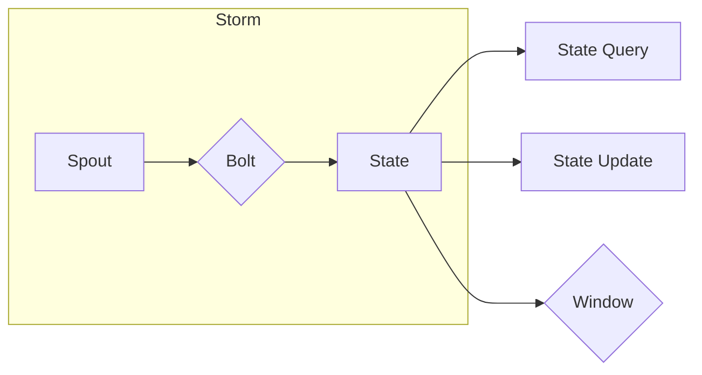

# Storm Trident原理与代码实例讲解

> 关键词：Storm, 分布式计算，实时处理，流处理，Trident API，窗口函数，状态管理，状态持久化，容错机制

## 1. 背景介绍

随着大数据时代的到来，对实时数据处理的需求日益增长。Apache Storm 是一个分布式、可靠、可扩展的实时大数据处理平台，广泛应用于金融、电商、物联网、社交网络等多个领域。Storm 的核心组件之一是 Trident，它提供了高级抽象来处理复杂的实时计算任务，如窗口函数、状态管理、状态持久化等。

### 1.1 问题的由来

在传统的 Storm 框架中，处理实时数据流通常需要用户自己管理状态和窗口操作，这增加了开发难度和维护成本。Trident API 的出现，正是为了解决这一问题，它为开发者提供了一套简单易用的接口，使得复杂的实时数据处理任务变得触手可及。

### 1.2 研究现状

Trident 自从引入以来，已经经历了多个版本的迭代，功能不断完善。它支持多种窗口函数，如滑动窗口、滚动窗口、会话窗口等，并提供了灵活的状态管理和持久化机制。此外，Trident 还具有强大的容错能力，确保系统在故障发生时能够快速恢复。

### 1.3 研究意义

掌握 Storm Trident 的原理和应用，对于开发者来说具有重要意义：

- 降低开发难度：Trident API 简化了实时数据处理任务的开发，使得开发者可以专注于业务逻辑。
- 提高系统可靠性：Trident 的状态管理和持久化机制，确保了数据处理的准确性和系统的稳定性。
- 增强系统可扩展性：Trident 支持水平扩展，能够处理大规模的数据流。

### 1.4 本文结构

本文将分为以下几个部分：

- 介绍 Storm 和 Trident 的核心概念与联系。
- 阐述 Trident 的原理和具体操作步骤。
- 分析数学模型和公式。
- 提供代码实例和详细解释。
- 探讨实际应用场景和未来发展趋势。
- 推荐学习资源和开发工具。
- 总结研究成果、未来发展趋势和挑战。

## 2. 核心概念与联系

### 2.1 核心概念

以下是一些与 Trident 相关的核心概念：

- **Tuple**: Storm 的数据单元，用于表示事件。
- **Spout**: 产生数据流的组件，类似于数据源。
- **Bolt**: 处理数据的组件，可以对数据进行过滤、转换等操作。
- **Trident Topology**: 由 Spout 和 Bolt 组成的拓扑结构。
- **Window**: 对时间窗口或计数窗口中事件的处理，如滑动窗口、滚动窗口等。
- **State**: 用于存储和检索实时数据的状态信息。
- **State Query**: 查询状态信息的操作。
- **State Update**: 更新状态信息的操作。

### 2.2 架构图

以下是 Trident 的架构图，展示了其核心组件之间的关系：



在这个架构图中，Spout 产生数据流，Bolt 对数据进行处理，同时与状态信息交互。状态信息可以通过状态查询和更新操作进行管理和检索。窗口函数负责对数据进行分组和聚合。

## 3. 核心算法原理 & 具体操作步骤

### 3.1 算法原理概述

Trident 的核心原理包括：

- **状态管理**：Trident 使用有界状态和无界状态来存储和检索实时数据。
- **窗口函数**：Trident 支持多种窗口函数，允许对时间窗口或计数窗口中的数据进行聚合和计算。
- **状态持久化**：Trident 允许将状态信息持久化到外部存储，如数据库，确保数据的安全性和系统的容错性。

### 3.2 算法步骤详解

以下是一个简单的 Trident 拓扑构建步骤：

1. **创建拓扑**：使用 Trident API 创建一个拓扑对象。
2. **添加 Spout**：将数据源添加到拓扑中。
3. **添加 Bolt**：将数据处理逻辑添加到拓扑中。
4. **定义窗口**：根据需要定义时间窗口或计数窗口。
5. **定义状态**：定义需要持久化的状态信息。
6. **提交拓扑**：将拓扑提交到 Storm 集群进行执行。

### 3.3 算法优缺点

**优点**：

- **简单易用**：Trident API 提供了简洁的接口，降低了实时数据处理任务的开发难度。
- **高可靠性**：状态管理和持久化机制确保了数据处理的准确性和系统的稳定性。
- **可扩展性**：Trident 支持水平扩展，能够处理大规模的数据流。

**缺点**：

- **学习曲线**：对于新手来说，Trident 的学习曲线相对较陡峭。
- **性能开销**：状态管理和持久化操作可能会引入一定的性能开销。

### 3.4 算法应用领域

Trident 在以下领域得到广泛应用：

- 实时分析：如实时网站流量分析、实时用户行为分析等。
- 实时监控：如实时系统监控、实时性能监控等。
- 实时推荐：如实时广告推荐、实时新闻推荐等。

## 4. 数学模型和公式 & 详细讲解 & 举例说明

### 4.1 数学模型构建

Trident 中的数学模型主要包括窗口函数和状态管理。

#### 窗口函数

窗口函数用于对时间窗口或计数窗口中的数据进行聚合和计算。以下是一个滑动窗口的数学模型：

$$
\text{Window}[T] = \{ (t, x) | t \in [t_0, t_0 + T] \}
$$

其中 $T$ 是窗口的大小，$t_0$ 是窗口的起始时间，$(t, x)$ 是窗口内的数据。

#### 状态管理

Trident 使用有界状态和无界状态来存储和检索实时数据。以下是一个状态管理的数学模型：

- **有界状态**：有界状态是存储在内存中的状态信息，具有固定的大小限制。
- **无界状态**：无界状态存储在持久化存储中，可以无限增长。

### 4.2 公式推导过程

窗口函数的推导过程通常依赖于具体的聚合函数和窗口类型。

### 4.3 案例分析与讲解

以下是一个使用滑动窗口计算实时流量的示例：

```java
windowBuilder = new SlidingWindow(new Duration(1, TimeUnit.MINUTES));
stream
    .groupByKey()
    .window(windowBuilder)
    .each(new Count(), new CountBolt());
```

在这个示例中，`groupByKey()` 将流中的数据按照键进行分组，`windowBuilder` 定义了一个滑动窗口，每分钟滑动一次。`each()` 方法将数据传递给 `CountBolt` Bolt，该 Bolt 计算每个窗口中数据的数量。

## 5. 项目实践：代码实例和详细解释说明

### 5.1 开发环境搭建

1. 安装 Java 开发环境。
2. 安装 Maven 或 Gradle 构建工具。
3. 安装 Apache Storm 和 Trident 库。

### 5.2 源代码详细实现

以下是一个简单的 Trident 拓扑示例：

```java
public class SimpleTridentToplogy {
    public static void main(String[] args) {
        Config config = new Config();
        config.setNumWorkers(2);
        config.setMaxSpoutPending(500);

        TopologyBuilder builder = new TopologyBuilder();
        builder.setSpout("spout", new SimpleSpout(), 3);

        builder.setBolt("bolt1", new SimpleBolt(), 4).shuffleGrouping("spout");

        StormSubmitter.submitTopology("simple-topology", config, builder.createTopology());
    }
}

public class SimpleSpout implements IRichSpout {
    private SpoutOutputCollector collector;
    private int[] nextTuple;

    public void open(Map conf, TopologyContext context, OutputCollector outputCollector) {
        collector = outputCollector;
        nextTuple = new int[100];
        for (int i = 0; i < 100; i++) {
            nextTuple[i] = (int) (Math.random() * 100);
        }
    }

    public void nextTuple() {
        int value = nextTuple[new Random().nextInt(nextTuple.length)];
        collector.emit(new Values(value));
    }

    public void ack(Object msg) {}

    public void fail(Object msg) {}

    public void close() {}
}

public class SimpleBolt implements IBolt {
    public void execute(Tuple input, OutputCollector collector) {
        int value = Integer.parseInt(input.getValue(0).toString());
        if (value % 2 == 0) {
            collector.emit(new Values(value, "even"));
        } else {
            collector.emit(new Values(value, "odd"));
        }
    }

    public void cleanup() {}
}
```

### 5.3 代码解读与分析

- `SimpleSpout` 类实现了 `IRichSpout` 接口，用于生成随机数据。
- `SimpleBolt` 类实现了 `IBolt` 接口，用于处理数据。
- 拓扑配置设置了工作节点和最大待处理批次的数量。
- 拓扑提交到 Storm 集群进行执行。

### 5.4 运行结果展示

运行上述代码，可以看到 `bolt1` Bolt 输出了所有偶数和奇数，并将其分类为 "even" 和 "odd"。

## 6. 实际应用场景

### 6.1 实时日志分析

在日志分析场景中，Trident 可以用于实时分析系统日志，提取关键信息，并生成实时报告。

### 6.2 实时推荐

在推荐系统场景中，Trident 可以用于实时分析用户行为，动态调整推荐策略。

### 6.3 实时监控

在实时监控场景中，Trident 可以用于实时监控系统性能，及时发现异常情况。

## 7. 工具和资源推荐

### 7.1 学习资源推荐

- Apache Storm 官方文档
- 《Storm High Performance Computing》
- 《Real-Time Data Processing with Apache Storm》

### 7.2 开发工具推荐

- IntelliJ IDEA 或 Eclipse
- Maven 或 Gradle

### 7.3 相关论文推荐

- "Storm: A Streaming Platform for Big Data" by Nathan Marz
- "Real-time analytics with Storm" by Nathan Marz

## 8. 总结：未来发展趋势与挑战

### 8.1 研究成果总结

本文介绍了 Storm Trident 的原理、算法、应用场景和代码实例，帮助读者全面了解和使用 Storm Trident。

### 8.2 未来发展趋势

- 优化状态管理和持久化机制，提高系统性能。
- 提供更多窗口函数和状态查询操作。
- 加强与其他大数据框架的集成。

### 8.3 面临的挑战

- 提高系统的可扩展性。
- 降低系统的复杂性和学习曲线。

### 8.4 研究展望

- 开发更加高效的状态管理和持久化机制。
- 探索新的实时数据处理算法和模型。

## 9. 附录：常见问题与解答

**Q1：Trident 与 Storm 框架的关系是什么？**

A: Trident 是 Storm 框架的一个扩展组件，提供了高级抽象来处理复杂的实时计算任务。

**Q2：Trident 的状态管理机制如何工作？**

A: Trident 使用有界状态和无界状态来存储和检索实时数据。有界状态存储在内存中，无界状态存储在外部存储中。

**Q3：如何使用 Trident 进行窗口函数操作？**

A: 使用 Trident API 中的 `windowBuilder` 定义窗口，然后在 Bolt 中使用 `each` 方法进行窗口内的数据处理。

**Q4：Trident 如何保证系统的容错性？**

A: Trident 通过状态持久化机制来保证系统的容错性。当发生故障时，可以从持久化存储中恢复状态信息。

作者：禅与计算机程序设计艺术 / Zen and the Art of Computer Programming