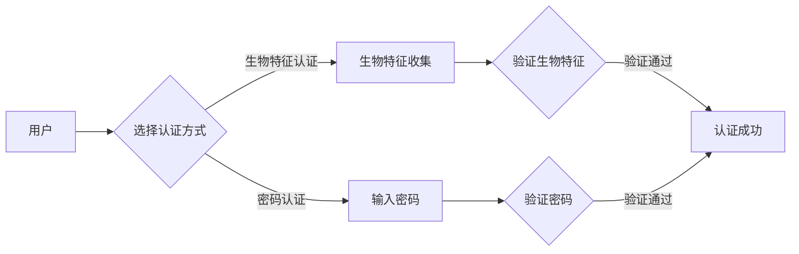

# WebAuthn 的生物特征识别

> 关键词：WebAuthn, 生物识别, 多因素认证, FIDO, 公钥基础设施, 安全认证, 用户体验

## 1. 背景介绍

随着互联网技术的飞速发展，网络安全问题日益凸显。传统的用户名密码认证方式由于易被破解、易忘记等问题，已经无法满足日益严格的网络安全需求。为了提高网络安全性和用户体验，生物特征识别技术应运而生。WebAuthn（Web Authentication Protocol）作为最新的网络认证标准，结合了生物特征识别技术，为用户提供了一种安全、便捷的认证方式。本文将深入探讨WebAuthn的生物特征识别原理、实现方法及其在实际应用中的价值。

## 2. 核心概念与联系

### 2.1 核心概念

#### 生物特征识别

生物特征识别是一种通过分析人类生物特征来识别个人身份的技术。常见的生物特征包括指纹、面部识别、虹膜识别、声纹识别、掌纹识别等。生物特征具有唯一性、稳定性、难以伪造等特点，因此被广泛应用于安全认证领域。

#### WebAuthn

WebAuthn是由FIDO（Fast IDentity Online）联盟提出的网络认证标准，旨在为Web应用提供一种安全、便捷的认证方式。WebAuthn支持多种认证方式，包括密码、密码短语、生物特征等。

#### FIDO

FIDO联盟是一个致力于推广安全、简便、统一的认证标准的非营利组织。FIDO联盟提出的FIDO2标准，包括WebAuthn、U2F（Universal 2nd Factor）等，旨在替代传统的用户名密码认证方式。

### 2.2 核心概念原理和架构 Mermaid 流程图



### 2.3 核心概念联系

WebAuthn结合了生物特征识别技术，为用户提供了一种安全、便捷的认证方式。用户可以选择使用生物特征识别进行认证，也可以选择使用传统密码认证。WebAuthn通过FIDO联盟的FIDO2标准，实现了不同设备和平台的互操作性。

## 3. 核心算法原理 & 具体操作步骤

### 3.1 算法原理概述

WebAuthn的生物特征识别基于公钥基础设施（PKI）和零知识证明（ZKP）技术。以下是WebAuthn生物特征识别的基本原理：

1. 用户在注册时，通过生物特征识别设备生成一对公钥和私钥。
2. 公钥上传至服务器，私钥存储在用户的生物特征识别设备中。
3. 认证时，用户使用生物特征识别设备生成签名，并通过网络发送给服务器。
4. 服务器使用公钥验证签名，验证用户身份。

### 3.2 算法步骤详解

1. **注册阶段**：
    - 用户在Web应用中选择生物特征识别认证方式。
    - 用户使用生物特征识别设备生成一对公钥和私钥。
    - 公钥通过安全的通道上传至服务器，私钥存储在用户的生物特征识别设备中。

2. **认证阶段**：
    - 用户在Web应用中进行认证操作。
    - 用户使用生物特征识别设备生成签名。
    - 签名通过安全的通道发送给服务器。
    - 服务器使用公钥验证签名。

3. **签名生成**：
    - 生物特征识别设备收集用户的生物特征。
    - 生物特征识别设备根据收集到的生物特征生成签名。
    - 签名包含用户的生物特征特征值、认证请求信息和服务器公钥等信息。

4. **签名验证**：
    - 服务器接收到签名后，使用用户的公钥进行验证。
    - 验证通过后，服务器认为用户身份验证成功。

### 3.3 算法优缺点

#### 优点：

- **安全性高**：基于PKI和ZKP技术，难以被破解和伪造。
- **便捷性高**：用户无需记住复杂的密码，使用生物特征即可完成认证。
- **跨平台性强**：WebAuthn支持多种设备和平台，方便用户在不同场景下使用。

#### 缺点：

- **成本较高**：生物特征识别设备成本较高，可能限制其普及。
- **隐私问题**：生物特征信息涉及用户隐私，需要妥善保护。

### 3.4 算法应用领域

WebAuthn的生物特征识别技术可应用于以下领域：

- **在线银行**：用户可以使用生物特征识别技术进行登录和交易确认。
- **电子商务**：用户可以使用生物特征识别技术进行支付和购物。
- **社交媒体**：用户可以使用生物特征识别技术进行登录和隐私保护。
- **企业内部系统**：用户可以使用生物特征识别技术进行身份验证和权限控制。

## 4. 数学模型和公式 & 详细讲解 & 举例说明

### 4.1 数学模型构建

WebAuthn的生物特征识别基于PKI和ZKP技术。以下是相关数学模型的构建：

#### 公钥基础设施（PKI）

- **私钥（Private Key）**：用于签名和加密，只有用户自己知道。
- **公钥（Public Key）**：用于验证签名和解密，公开共享。

#### 零知识证明（ZKP）

- **知识**：用户知道某个事实，但无法直接证明。
- **证明**：用户向他人证明自己知道某个事实，但不会泄露该事实。

### 4.2 公式推导过程

WebAuthn的生物特征识别过程涉及以下公式：

- **签名生成**：$S = H(M || A || P)$，其中 $H$ 为哈希函数，$M$ 为认证请求信息，$A$ 为算法信息，$P$ 为用户私钥。
- **签名验证**：$V = E(P, H(M || A || S))$，其中 $E$ 为加密函数，$D$ 为解密函数。

### 4.3 案例分析与讲解

以下是一个简单的WebAuthn生物特征识别案例：

1. 用户A在注册时，使用指纹识别设备生成一对公钥和私钥，公钥上传至服务器，私钥存储在指纹识别设备中。
2. 用户A在登录时，使用指纹识别设备生成签名，签名包含指纹特征值、认证请求信息和服务器公钥等信息。
3. 服务器接收到签名后，使用用户A的公钥进行验证，验证通过后，服务器认为用户A身份验证成功。

## 5. 项目实践：代码实例和详细解释说明

### 5.1 开发环境搭建

1. 安装Python 3.6及以上版本。
2. 安装FIDO2服务器库`pyfido2`：`pip install pyfido2`。

### 5.2 源代码详细实现

以下是一个简单的FIDO2服务器示例代码：

```python
import sys
from pyfido2 import FidoServer, UserNotRegisteredError

# 创建FIDO2服务器实例
server = FidoServer()

# 用户注册
try:
    # 添加用户
    server.register_user(
        rpid="your_rpid",
        name="user_name",
        user_id="user_id",
        attestation_type="none",
        user_display_name="user_display_name",
    )
except UserNotRegisteredError as e:
    print(e)

# 用户认证
try:
    # 认证用户
    server.authenticate(rpid="your_rpid", user_id="user_id")
except UserNotRegisteredError as e:
    print(e)

# 退出服务器
server.stop()
```

### 5.3 代码解读与分析

上述代码演示了FIDO2服务器的注册和认证过程。首先创建FIDO2服务器实例，然后添加用户和用户信息，最后进行用户认证。在用户注册过程中，可以设置不同的认证类型，如无证书、带证书等。在用户认证过程中，服务器会根据用户提供的认证请求和私钥信息进行验证。

### 5.4 运行结果展示

在命令行运行上述代码后，服务器将启动并等待用户注册和认证请求。注册成功后，用户可以使用指纹识别设备进行认证。认证成功后，服务器将输出认证结果。

## 6. 实际应用场景

WebAuthn的生物特征识别技术可应用于以下实际场景：

- **移动端应用**：用户可以使用生物特征识别技术进行移动应用的登录和支付。
- **桌面端应用**：用户可以使用生物特征识别技术进行桌面应用的登录和权限控制。
- **物联网设备**：用户可以使用生物特征识别技术进行物联网设备的登录和控制。

## 7. 工具和资源推荐

### 7.1 学习资源推荐

- FIDO官方网站：https://fidoalliance.org/
- WebAuthn官方文档：https://www.w3.org/TR/webauthn-1/
- pyfido2官方文档：https://pyfido2.readthedocs.io/en/latest/

### 7.2 开发工具推荐

- FIDO2服务器库`pyfido2`：https://github.com/SimonSapin/python-fido2
- FIDO2认证库`fido2`：https://github.com/justinkfrankel/fido2

### 7.3 相关论文推荐

- **"The FIDO2 Protocol: Specifications and Implementations"**：FIDO2协议的官方文档。
- **"WebAuthn: An Introduction"**：WebAuthn简介。

## 8. 总结：未来发展趋势与挑战

### 8.1 研究成果总结

WebAuthn的生物特征识别技术结合了生物特征识别技术和PKI技术，为用户提供了一种安全、便捷的认证方式。该技术已在多个领域得到应用，并取得了良好的效果。

### 8.2 未来发展趋势

1. 生物特征识别技术的普及：随着生物特征识别技术的不断成熟，越来越多的设备和平台将支持生物特征识别认证。
2. 跨平台认证：WebAuthn将实现不同设备和平台的互操作性，为用户提供更加便捷的认证体验。
3. 硬件设备的支持：越来越多的硬件设备将内置生物特征识别功能，为用户提供更加安全的认证保障。

### 8.3 面临的挑战

1. 生物特征识别技术的安全性：如何保证生物特征识别技术的安全性，防止信息泄露和伪造，是未来研究的重点。
2. 用户隐私保护：如何保护用户的生物特征信息，防止其被滥用，是未来研究的难点。
3. 硬件设备的普及：生物特征识别技术的普及需要大量硬件设备的支持，如何降低成本、提高性能，是未来研究的挑战。

### 8.4 研究展望

未来，WebAuthn的生物特征识别技术将在以下方面取得突破：

1. 生物特征识别技术的安全性：研究更加安全的生物特征识别算法，提高抗攻击能力。
2. 用户隐私保护：研究隐私保护技术，如差分隐私、同态加密等，保护用户隐私。
3. 跨平台认证：推动WebAuthn标准在更多设备和平台的落地，实现真正的跨平台认证。

相信在学术界和产业界的共同努力下，WebAuthn的生物特征识别技术将会在未来发挥更加重要的作用，为构建更加安全的网络环境贡献力量。

## 9. 附录：常见问题与解答

**Q1：WebAuthn的认证过程是否安全？**

A：WebAuthn的认证过程基于PKI和ZKP技术，具有较高的安全性。用户的生物特征信息不会在网络中传输，而是存储在用户的生物特征识别设备中，从而有效防止了信息泄露。

**Q2：WebAuthn是否支持多种生物特征识别方式？**

A：WebAuthn支持多种生物特征识别方式，包括指纹、面部识别、虹膜识别等。用户可以根据自己的需求选择合适的生物特征识别方式。

**Q3：WebAuthn的认证过程是否便捷？**

A：WebAuthn的认证过程非常便捷。用户只需要使用生物特征识别设备进行认证，无需记住复杂的密码，即可快速完成认证。

**Q4：WebAuthn的认证过程是否通用？**

A：WebAuthn支持多种设备和平台，具有较高的通用性。用户可以在不同的设备和平台上进行认证，无需重新注册和配置。

**Q5：WebAuthn的认证过程是否需要额外的硬件设备？**

A：WebAuthn的认证过程需要生物特征识别设备，如指纹识别仪、面部识别摄像头等。这些设备可以集成到手机、电脑等设备中，也可以作为独立设备使用。

作者：禅与计算机程序设计艺术 / Zen and the Art of Computer Programming