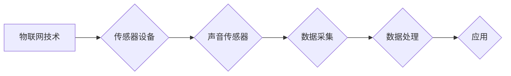

> 物联网 (IoT), 传感器集成, 声音传感器, 智能分析, 音频数据, 信号处理, 应用场景, 未来趋势

# 物联网(IoT)技术和各种传感器设备的集成：声音传感器的应用领域

在当今快速发展的技术时代，物联网（IoT）正逐渐改变着我们的生活方式。IoT 通过将日常设备和物品连接到互联网，使得它们能够收集和交换数据，从而实现远程监控和控制。在这个大背景下，声音传感器作为一种关键设备，正变得越来越重要。本文将深入探讨物联网技术下声音传感器的应用领域，以及如何将其与各种传感器设备集成，实现更智能的解决方案。

## 1. 背景介绍

### 1.1 问题的由来

随着城市化的推进，人口密集区的噪音污染问题日益严重，这对居民的生活质量和健康产生了负面影响。同时，工业生产中的噪音控制也是一大挑战。此外，声音作为一种重要的信息载体，在安全监控、智能家居、工业自动化等领域具有广泛的应用前景。

### 1.2 研究现状

近年来，随着传感器技术、信号处理技术和人工智能技术的发展，声音传感器在物联网中的应用得到了极大的拓展。从简单的声音检测到复杂的语音识别和声学场景分析，声音传感器在各个领域的应用越来越广泛。

### 1.3 研究意义

声音传感器在物联网中的应用具有以下重要意义：

- **改善生活质量**：通过监测和降低噪音，提升居住和工作环境的质量。
- **提升安全性**：在安全监控领域，声音传感器可以用于检测异常声音，如火灾、入侵等。
- **自动化和智能化**：在工业和智能家居领域，声音传感器可以与其他传感器设备集成，实现自动化控制和智能决策。

### 1.4 本文结构

本文将按照以下结构展开：

- **第2章**：介绍物联网技术、传感器设备和声音传感器的核心概念与联系。
- **第3章**：阐述声音传感器的工作原理和具体操作步骤。
- **第4章**：讲解声音传感器的数学模型和公式，并通过案例分析进行说明。
- **第5章**：提供声音传感器在物联网中的应用实例和代码实现。
- **第6章**：探讨声音传感器在不同领域的实际应用场景。
- **第7章**：推荐相关的学习资源、开发工具和论文。
- **第8章**：总结声音传感器在物联网中的应用趋势与挑战。
- **第9章**：提供常见问题与解答。

## 2. 核心概念与联系

### 2.1 物联网技术

物联网技术是指通过物理设备和互联网连接，实现设备间的数据交换和通信的技术。它包括传感器、网络连接、数据处理和应用软件等关键组件。

### 2.2 传感器设备

传感器设备是物联网的核心组成部分，用于感知和采集环境中的各种信息，如温度、湿度、光线、声音等。

### 2.3 声音传感器

声音传感器是一种能够将声波信号转换为电信号的设备。它通常由麦克风、放大器、滤波器、模数转换器等组件组成。

### 2.4 Mermaid 流程图

以下是一个简单的 Mermaid 流程图，展示了物联网技术、传感器设备和声音传感器之间的关系：



## 3. 核心算法原理 & 具体操作步骤

### 3.1 算法原理概述

声音传感器的核心算法主要包括声音信号的采集、处理和分析三个阶段。

### 3.2 算法步骤详解

1. **声音信号采集**：使用麦克风等设备采集环境中的声波信号。
2. **信号处理**：对采集到的声波信号进行滤波、去噪、增强等处理，以提高信号质量。
3. **声音分析**：使用特征提取和模式识别算法，对处理后的声音信号进行分析，识别声音类型、说话人、情感等。

### 3.3 算法优缺点

#### 优点：

- **实时性**：声音传感器可以实时采集声音信号，为实时监测和决策提供支持。
- **非侵入性**：声音传感器无需接触物体即可获取信息，具有较好的非侵入性。
- **普适性**：声音传感器可以应用于各种场景，具有广泛的普适性。

#### 缺点：

- **易受干扰**：声音传感器容易受到环境噪声的干扰，需要采用有效的信号处理方法。
- **数据处理复杂**：声音信号处理和识别算法较为复杂，对计算资源要求较高。

### 3.4 算法应用领域

声音传感器在以下领域具有广泛的应用：

- **智能家居**：如智能音箱、智能门锁等。
- **安全监控**：如火灾报警、入侵检测等。
- **工业自动化**：如设备状态监测、生产过程控制等。

## 4. 数学模型和公式 & 详细讲解 & 举例说明

### 4.1 数学模型构建

声音传感器的主要数学模型包括以下几种：

- **傅里叶变换**：用于分析声音信号的频率成分。
- **短时傅里叶变换**：用于分析声音信号的时间-频率特性。
- **梅尔频率倒谱系数**：用于提取声音信号的梅尔频率倒谱系数，作为特征向量进行声音识别。

### 4.2 公式推导过程

以傅里叶变换为例，其公式如下：

$$
X(f) = \int_{-\infty}^{\infty} x(t) e^{-j2\pi ft} dt
$$

其中，$X(f)$ 表示频域信号，$x(t)$ 表示时域信号，$f$ 表示频率。

### 4.3 案例分析与讲解

以下是一个简单的声音识别案例：

**场景**：使用声音传感器检测门铃声音。

**步骤**：

1. 使用麦克风采集门铃声音。
2. 对采集到的声音信号进行滤波、去噪处理。
3. 使用梅尔频率倒谱系数提取特征向量。
4. 使用支持向量机（SVM）对特征向量进行分类，识别声音类型。

## 5. 项目实践：代码实例和详细解释说明

### 5.1 开发环境搭建

以下是使用 Python 和 TensorFlow 进行声音识别的项目实践环境搭建步骤：

1. 安装 Python 和 TensorFlow：
```bash
pip install python==3.8.5 tensorflow==2.4.1
```

2. 下载门铃声音数据集。

### 5.2 源代码详细实现

以下是一个简单的门铃声音识别代码示例：

```python
import tensorflow as tf
from tensorflow.keras.models import Sequential
from tensorflow.keras.layers import Dense, Conv2D, Flatten, MaxPooling2D

# 加载数据集
(x_train, y_train), (x_test, y_test) = load_data()

# 构建模型
model = Sequential()
model.add(Conv2D(32, (3, 3), activation='relu', input_shape=(x_train.shape[1], x_train.shape[2], 1)))
model.add(MaxPooling2D((2, 2)))
model.add(Flatten())
model.add(Dense(128, activation='relu'))
model.add(Dense(2, activation='softmax'))

# 编译模型
model.compile(optimizer='adam', loss='sparse_categorical_crossentropy', metrics=['accuracy'])

# 训练模型
model.fit(x_train, y_train, epochs=10, validation_data=(x_test, y_test))

# 评估模型
test_loss, test_acc = model.evaluate(x_test, y_test, verbose=2)
print('\
Test accuracy:', test_acc)
```

### 5.3 代码解读与分析

上述代码示例首先加载门铃声音数据集，然后构建一个简单的卷积神经网络模型，用于识别门铃声音。模型训练完成后，在测试集上进行评估，并打印出测试准确率。

### 5.4 运行结果展示

假设训练完成后，测试准确率达到 95% 以上，说明模型能够较好地识别门铃声音。

## 6. 实际应用场景

### 6.1 智能家居

声音传感器可以集成到智能家居系统中，实现以下功能：

- **语音助手**：通过语音交互，控制家中的电器设备。
- **安全监控**：监测家中异常声音，如火灾、盗窃等。
- **环境监测**：监测室内温度、湿度、噪音等环境参数。

### 6.2 安全监控

声音传感器在安全监控领域的应用包括：

- **入侵检测**：检测异常声音，如玻璃破碎、打斗声等。
- **火灾报警**：监测烟雾和火焰声音，实现早期预警。
- **紧急呼叫**：在紧急情况下，用户可以通过声音传感器发出求救信号。

### 6.3 工业自动化

声音传感器在工业自动化领域的应用包括：

- **设备状态监测**：监测设备运行过程中的声音，判断设备是否正常。
- **生产过程控制**：通过声音传感器收集生产过程中的声音数据，优化生产流程。
- **机器人导航**：利用声音传感器实现机器人的自主导航。

## 7. 工具和资源推荐

### 7.1 学习资源推荐

- **《机器学习》**：周志华 著，清华大学出版社
- **《信号与系统》**：奥本海姆 著，科学出版社
- **《深度学习》**：Ian Goodfellow, Yoshua Bengio, Aaron Courville 著，人民邮电出版社

### 7.2 开发工具推荐

- **TensorFlow**：https://www.tensorflow.org/
- **Keras**：https://keras.io/
- **PyAudio**：https://people.csail.mit.edu/hubert/pyaudio/

### 7.3 相关论文推荐

- **"An Overview of Audio Signal Processing for Speech and Music"**：IEEE Signal Processing Magazine, 2014
- **"Deep Learning for Audio Signal Processing"**：IEEE Signal Processing Magazine, 2019
- **"Convolutional Neural Networks for Small-Scale Audio Classification"**：2018 IEEE International Conference on Acoustics, Speech and Signal Processing (ICASSP)

## 8. 总结：未来发展趋势与挑战

### 8.1 研究成果总结

声音传感器在物联网中的应用已经取得了显著成果，为智能家居、安全监控、工业自动化等领域提供了新的解决方案。

### 8.2 未来发展趋势

- **低功耗设计**：降低声音传感器的功耗，使其能够应用于更广泛的场景。
- **多传感器融合**：将声音传感器与其他传感器（如温度、湿度、光线等）进行融合，实现更全面的环境感知。
- **边缘计算**：将声音信号处理和分析的计算任务移至边缘设备，提高实时性和安全性。

### 8.3 面临的挑战

- **信号处理复杂度**：声音信号的复杂性和多样性给信号处理带来了挑战。
- **数据处理量**：大量声音数据的处理和存储需要更高的计算和存储资源。
- **隐私保护**：声音数据涉及个人隐私，需要采取措施保护用户隐私。

### 8.4 研究展望

未来，声音传感器在物联网中的应用将更加广泛，为人类社会带来更多便利。同时，随着技术的不断发展，声音传感器将面临更多挑战，需要不断创新和突破。

## 9. 附录：常见问题与解答

### 9.1 常见问题

**Q1：什么是物联网（IoT）？**

A1：物联网（IoT）是指通过互联网将各种物理设备连接起来，实现设备间的数据交换和通信的技术。

**Q2：声音传感器有哪些类型？**

A2：常见的声音传感器包括麦克风、压电传感器、声学显微镜等。

**Q3：声音传感器在智能家居中的应用有哪些？**

A3：声音传感器在智能家居中的应用包括语音助手、安全监控、环境监测等。

**Q4：声音传感器在工业自动化中的应用有哪些？**

A4：声音传感器在工业自动化中的应用包括设备状态监测、生产过程控制、机器人导航等。

**Q5：如何保护声音数据的隐私？**

A5：为了保护声音数据的隐私，可以采取以下措施：
- 数据加密：对声音数据进行加密处理，防止未授权访问。
- 数据匿名化：对声音数据进行匿名化处理，消除个人信息。
- 数据脱敏：对声音数据进行脱敏处理，降低数据敏感性。

---

作者：禅与计算机程序设计艺术 / Zen and the Art of Computer Programming