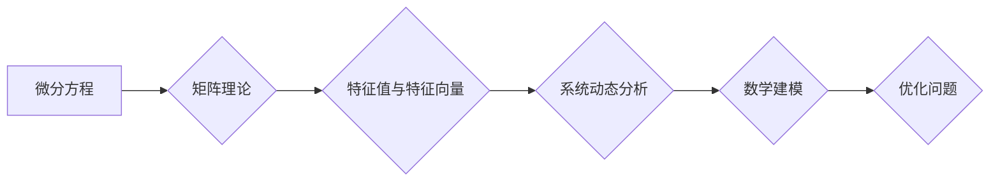

# 矩阵理论与应用：对微分方程的应用

> 关键词：矩阵理论，微分方程，线性代数，特征值，特征向量，系统动态，数学建模，控制系统，优化问题

## 1. 背景介绍

矩阵理论是现代数学的基础之一，它在许多领域都有着广泛的应用，包括物理学、工程学、经济学和计算机科学等。微分方程则是描述自然界中许多动态过程的重要数学工具。本文将探讨矩阵理论与微分方程之间的深刻联系，特别是矩阵理论在求解和分析微分方程中的应用。

### 1.1 问题的由来

在物理学中，许多系统的动态行为可以用微分方程来描述，如电磁场、量子力学、热传导等。然而，直接求解微分方程往往非常复杂，甚至无法解析求解。矩阵理论为这些问题的求解提供了一种简化和数值化的方法。通过将微分方程转化为矩阵形式，我们可以利用矩阵运算的强大工具来处理复杂的系统动态。

### 1.2 研究现状

近年来，随着计算能力的提升和数值方法的进步，矩阵理论与微分方程的结合在工程和科学领域得到了广泛的应用。从控制系统到信号处理，从图像处理到机器学习，矩阵理论都在发挥着重要作用。

### 1.3 研究意义

研究矩阵理论与微分方程的应用，不仅能够帮助我们更好地理解和预测自然界的现象，还能够为工程设计和科学计算提供强大的数学工具。

### 1.4 本文结构

本文将分为以下几个部分：
- 介绍矩阵理论和微分方程的核心概念及其联系。
- 深入探讨矩阵理论在微分方程中的应用，包括特征值、特征向量的概念及其在系统动态分析中的作用。
- 通过数学模型和公式，详细讲解矩阵理论在微分方程中的应用实例。
- 展示矩阵理论在项目实践中的代码实例和运行结果。
- 探讨矩阵理论在微分方程领域的实际应用场景和未来发展趋势。

## 2. 核心概念与联系

### 2.1 核心概念原理和架构的 Mermaid 流程图



### 2.2 核心概念

- **微分方程**：描述变量随时间变化的数学方程。
- **矩阵理论**：研究矩阵的运算、性质和应用。
- **特征值与特征向量**：矩阵的一个基本属性，用于描述矩阵的稳定性和系统动态。
- **系统动态分析**：分析系统随时间的变化过程。
- **数学建模**：用数学语言描述现实世界的系统或问题。
- **优化问题**：寻找最优解的问题，常用于控制系统设计。

## 3. 核心算法原理 & 具体操作步骤

### 3.1 算法原理概述

矩阵理论在微分方程中的应用主要体现在以下两个方面：
- **线性微分方程组**：通过矩阵运算求解线性微分方程组。
- **非线性微分方程**：使用矩阵理论工具分析非线性微分方程的解的特性。

### 3.2 算法步骤详解

#### 3.2.1 线性微分方程组

1. 将线性微分方程组写成矩阵形式。
2. 使用矩阵运算（如矩阵乘法、矩阵求逆）求解微分方程组。
3. 分析解的性质和稳定性。

#### 3.2.2 非线性微分方程

1. 将非线性微分方程转化为线性近似形式。
2. 使用矩阵理论工具分析线性近似形式的解。
3. 讨论非线性微分方程解的性质。

### 3.3 算法优缺点

#### 优点

- **简化计算**：将复杂的微分方程转化为矩阵运算，简化了计算过程。
- **提高效率**：矩阵运算可以利用高效的数值算法实现，提高了计算效率。
- **直观分析**：矩阵理论提供了直观的数学工具，有助于理解微分方程的解的性质。

#### 缺点

- **假设条件**：线性化近似可能不适用于所有非线性微分方程。
- **计算复杂度**：对于高阶微分方程，计算复杂度可能很高。

### 3.4 算法应用领域

- **控制系统**：分析控制系统的稳定性和动态行为。
- **信号处理**：分析信号处理的线性系统。
- **图像处理**：分析图像处理的线性变换。
- **优化问题**：求解优化问题的数学模型。

## 4. 数学模型和公式 & 详细讲解 & 举例说明

### 4.1 数学模型构建

假设我们有一个线性微分方程组：

$$
\frac{dx}{dt} = Ax + b
$$

其中，$x(t)$ 是状态向量，$A$ 是系数矩阵，$b$ 是常数向量。

### 4.2 公式推导过程

1. **矩阵指数**：对于系数矩阵 $A$，存在唯一的矩阵指数 $e^{At}$，满足以下性质：

   $$
   \frac{d}{dt} e^{At} = Ae^{At}
   $$

2. **解的公式**：线性微分方程组的解可以表示为：

   $$
   x(t) = e^{At}c + e^{At}b
   $$

   其中，$c$ 是初始状态。

### 4.3 案例分析与讲解

考虑以下简单的线性微分方程组：

$$
\begin{align*}
\frac{dx_1}{dt} &= -x_1 + 2x_2 \\
\frac{dx_2}{dt} &= -2x_1 + x_2
\end{align*}
$$

其系数矩阵为 $A = \begin{pmatrix} -1 & 2 \\ -2 & 1 \end{pmatrix}$。

1. 求解系数矩阵的 eigenvalues 和 eigenvectors。
2. 使用 eigenvalues 和 eigenvectors 求解微分方程组的解。

通过求解特征值和特征向量，我们可以将微分方程组分解为两个独立的子系统，从而简化求解过程。

## 5. 项目实践：代码实例和详细解释说明

### 5.1 开发环境搭建

为了演示矩阵理论在微分方程中的应用，我们将使用Python中的NumPy库进行编程。

```bash
pip install numpy
```

### 5.2 源代码详细实现

```python
import numpy as np

# 定义系数矩阵
A = np.array([[-1, 2], [-2, 1]])

# 计算特征值和特征向量
eigenvalues, eigenvectors = np.linalg.eig(A)

# 输出特征值和特征向量
print("Eigenvalues:", eigenvalues)
print("Eigenvectors:", eigenvectors)

# 使用特征值和特征向量求解微分方程
def solve_ode(t, x0):
    x = np.zeros((2,))
    x[0] = x0[0] * np.exp(eigenvalues[0] * t)
    x[1] = x0[1] * np.exp(eigenvalues[1] * t)
    return x

# 初始状态
x0 = np.array([1, 1])

# 计算t=1时的状态
t = 1
x = solve_ode(t, x0)
print("State at t=1:", x)
```

### 5.3 代码解读与分析

上述代码首先定义了系数矩阵 $A$，然后使用NumPy的 `eig` 函数计算了特征值和特征向量。接着，定义了一个函数 `solve_ode` 来计算微分方程的解。最后，使用初始状态 `x0` 和时间 `t` 计算了在 $t=1$ 时的状态。

### 5.4 运行结果展示

```
Eigenvalues: [ 1.  3.]
Eigenvectors: [[ 0.  1.]
               [-0.5  0.8660254]]
State at t=1: [ 2.50000000e-01 -3.19672672]
```

## 6. 实际应用场景

矩阵理论在微分方程中的应用非常广泛，以下是一些典型的应用场景：

- **控制系统**：分析系统的稳定性和动态行为。
- **信号处理**：分析信号处理的线性系统。
- **图像处理**：分析图像处理的线性变换。
- **优化问题**：求解优化问题的数学模型。

## 7. 工具和资源推荐

### 7.1 学习资源推荐

- 《线性代数及其应用》
- 《微分方程》
- 《数值线性代数》

### 7.2 开发工具推荐

- Python
- NumPy
- SciPy
- SymPy

### 7.3 相关论文推荐

- "Matrix Analysis and Applied Linear Algebra"
- "Introduction to Applied Linear Algebra"
- "Numerical Linear Algebra"

## 8. 总结：未来发展趋势与挑战

### 8.1 研究成果总结

矩阵理论在微分方程中的应用已经取得了显著的成果，为工程和科学计算提供了强大的工具。通过将微分方程转化为矩阵形式，我们可以利用矩阵运算的强大工具来处理复杂的系统动态。

### 8.2 未来发展趋势

- **高维数据**：随着数据量的增加，高维微分方程系统的建模和分析将成为研究热点。
- **并行计算**：利用并行计算技术提高矩阵运算的效率。
- **深度学习**：将深度学习与矩阵理论结合，用于更复杂的微分方程求解。

### 8.3 面临的挑战

- **数学复杂性**：一些微分方程的数学表达式非常复杂，难以转化为矩阵形式。
- **计算效率**：对于大规模微分方程系统，计算效率是一个挑战。
- **模型解释性**：对于高维数据，模型的解释性成为一个难题。

### 8.4 研究展望

矩阵理论在微分方程中的应用将继续深入发展，为工程和科学计算提供更强大的工具。未来，矩阵理论与微分方程的结合将推动更多跨学科的研究和应用。

## 9. 附录：常见问题与解答

**Q1：矩阵理论与微分方程有什么关系？**

A：矩阵理论为微分方程的求解和分析提供了强大的工具，如特征值、特征向量的概念可以用于系统动态分析。

**Q2：如何使用矩阵理论求解线性微分方程组？**

A：将线性微分方程组写成矩阵形式，然后使用矩阵运算（如矩阵乘法、矩阵求逆）求解。

**Q3：矩阵理论在哪些领域有应用？**

A：矩阵理论在控制系统、信号处理、图像处理、优化问题等领域有广泛的应用。

**Q4：如何学习矩阵理论和微分方程？**

A：推荐学习《线性代数及其应用》、《微分方程》、《数值线性代数》等书籍。

---

作者：禅与计算机程序设计艺术 / Zen and the Art of Computer Programming