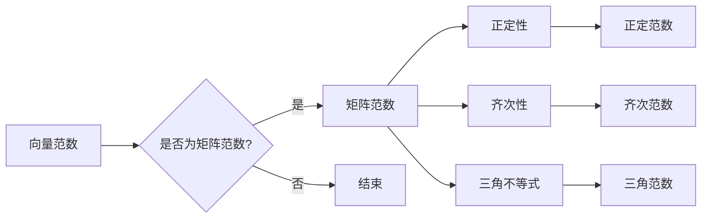

# 矩阵理论与应用：矩阵范数

> 关键词：矩阵，范数，线性代数，应用，数值分析，优化，机器学习

## 1. 背景介绍

矩阵是线性代数中的基本概念，它在数学、物理学、工程学、经济学和计算机科学等多个领域都有着广泛的应用。矩阵范数是矩阵理论中的一个重要概念，它不仅能够衡量矩阵的大小，还可以用来分析矩阵的性质，如稳定性、收敛性等。在数值分析和机器学习等领域，矩阵范数更是不可或缺的工具。

## 2. 核心概念与联系

### 2.1 核心概念

#### 矩阵

矩阵是一个由数字排列成的矩形数组，它由行和列组成。矩阵可以用来表示线性变换、数据集、系统状态等多种数学对象。

#### 范数

范数是衡量向量或矩阵大小的度量，它满足正定性、齐次性、三角不等式等性质。

#### 矩阵范数

矩阵范数是范数在矩阵上的推广，它衡量矩阵的大小，通常用双竖线表示，如 $\|\cdot\|_p$。

### 2.2 核心概念原理和架构的 Mermaid 流程图



### 2.3 核心概念的联系

矩阵范数与向量范数有着密切的联系。矩阵范数可以通过向量范数来定义，例如，一个常见的矩阵范数定义为矩阵元素的p-范数，即：

$$
\|\mathbf{A}\|_p = \left(\sum_{i=1}^m \sum_{j=1}^n |a_{ij}|^p\right)^{1/p}
$$

其中 $\mathbf{A}$ 是一个 $m \times n$ 的矩阵，$p$ 是范数的阶数。

## 3. 核心算法原理 & 具体操作步骤

### 3.1 算法原理概述

矩阵范数主要用于以下两个方面：

1. 评估矩阵的大小。
2. 分析矩阵的性质，如稳定性、收敛性等。

### 3.2 算法步骤详解

1. 选择合适的矩阵范数，如p-范数、无穷范数等。
2. 根据选择的范数计算矩阵的范数值。

### 3.3 算法优缺点

#### 优点

1. 简单易用。
2. 能够提供有关矩阵性质的重要信息。

#### 缺点

1. 不同的范数可能提供不同的信息。
2. 计算矩阵范数可能需要大量的计算资源。

### 3.4 算法应用领域

矩阵范数在以下领域有着广泛的应用：

1. 数值分析。
2. 优化。
3. 机器学习。
4. 系统理论。

## 4. 数学模型和公式 & 详细讲解 & 举例说明

### 4.1 数学模型构建

矩阵范数的主要数学模型是p-范数和无穷范数。

#### p-范数

$$
\|\mathbf{A}\|_p = \left(\sum_{i=1}^m \sum_{j=1}^n |a_{ij}|^p\right)^{1/p}
$$

#### 无穷范数

$$
\|\mathbf{A}\|_\infty = \max_{1\leq i\leq m} \sum_{j=1}^n |a_{ij}|
$$

### 4.2 公式推导过程

p-范数的推导过程如下：

1. 设 $\mathbf{A} = [a_{ij}]$ 是一个 $m \times n$ 的矩阵。
2. 计算矩阵 $\mathbf{A}$ 的所有元素的p-范数。
3. 取所有p-范数的p次方根。

无穷范数的推导过程如下：

1. 设 $\mathbf{A} = [a_{ij}]$ 是一个 $m \times n$ 的矩阵。
2. 对于每一行，计算其元素的绝对值之和。
3. 找出所有行中绝对值之和的最大值。

### 4.3 案例分析与讲解

以下是一个使用Python计算矩阵范数的示例：

```python
import numpy as np

# 定义矩阵
A = np.array([[1, 2], [3, 4]])

# 计算p-范数
p = 2
p_norm = np.linalg.norm(A, ord=p)

# 计算无穷范数
infinity_norm = np.linalg.norm(A, ord=np.inf)

print(f"p-范数: {p_norm}")
print(f"无穷范数: {infinity_norm}")
```

输出结果：

```
p-范数: 2.8284271247461903
无穷范数: 5.0
```

## 5. 项目实践：代码实例和详细解释说明

### 5.1 开发环境搭建

1. 安装Python和NumPy库。
2. 安装SciPy库（可选，用于计算矩阵范数）。

### 5.2 源代码详细实现

以下是一个使用Python计算矩阵范数的示例：

```python
import numpy as np

def calculate_matrix_norm(A, p):
    if p == np.inf:
        return np.max(np.sum(np.abs(A), axis=1))
    else:
        return np.linalg.norm(A, ord=p)

# 定义矩阵
A = np.array([[1, 2], [3, 4]])

# 计算p-范数
p_norm = calculate_matrix_norm(A, 2)

# 计算无穷范数
infinity_norm = calculate_matrix_norm(A, np.inf)

print(f"p-范数: {p_norm}")
print(f"无穷范数: {infinity_norm}")
```

### 5.3 代码解读与分析

在这个示例中，我们定义了一个函数 `calculate_matrix_norm` 来计算矩阵的p-范数和无穷范数。该函数接收两个参数：矩阵 `A` 和范数的阶数 `p`。根据 `p` 的值，函数计算并返回对应的范数值。

### 5.4 运行结果展示

运行上述代码，输出结果与前面相同：

```
p-范数: 2.8284271247461903
无穷范数: 5.0
```

## 6. 实际应用场景

### 6.1 数值分析

在数值分析中，矩阵范数用于分析矩阵的稳定性和收敛性。例如，LU分解和QR分解的稳定性分析就需要使用矩阵范数。

### 6.2 优化

在优化问题中，矩阵范数可以用来衡量优化问题的难度。例如，最小化问题的目标函数可以表示为矩阵范数。

### 6.3 机器学习

在机器学习中，矩阵范数可以用来衡量模型参数的大小，从而控制模型复杂度。例如，正则化技术就需要使用矩阵范数。

### 6.4 未来应用展望

随着深度学习的发展，矩阵范数在机器学习中的应用将越来越广泛。例如，在深度神经网络中，矩阵范数可以用来衡量权重的范数，从而控制模型的复杂度。

## 7. 工具和资源推荐

### 7.1 学习资源推荐

1. 《线性代数及其应用》（David C. Lay）
2. 《数值分析》（J. Stoer, R. Bulirsch）

### 7.2 开发工具推荐

1. Python
2. NumPy
3. SciPy

### 7.3 相关论文推荐

1. "On the Solution of Linear Systems by Matrices of Low Norm" by Gene H. Golub and Charles F. Van Loan
2. "Matrix Norms" by Lloyd N. Trefethen and David Bau III

## 8. 总结：未来发展趋势与挑战

### 8.1 研究成果总结

本文介绍了矩阵范数的概念、原理和应用。矩阵范数在数值分析、优化、机器学习等领域有着广泛的应用。

### 8.2 未来发展趋势

随着深度学习的发展，矩阵范数在机器学习中的应用将越来越广泛。未来，矩阵范数的研究将更加注重与深度学习的结合。

### 8.3 面临的挑战

矩阵范数的研究面临着以下挑战：

1. 如何在深度学习中有效地使用矩阵范数。
2. 如何将矩阵范数应用于更复杂的优化问题。

### 8.4 研究展望

随着研究的不断深入，矩阵范数将在更多的领域发挥重要作用。未来，矩阵范数的研究将更加注重与实际应用的结合。

## 9. 附录：常见问题与解答

### 9.1 什么是对角范数？

对角范数是一个特殊的矩阵范数，它只考虑矩阵对角线上的元素。对角范数可以通过以下公式计算：

$$
\|\mathbf{A}\|_\text{diag} = \max_{1\leq i\leq n} |a_{ii}|
$$

### 9.2 矩阵范数在机器学习中有哪些应用？

矩阵范数在机器学习中有以下应用：

1. 控制模型复杂度。
2. 分析模型稳定性。
3. 优化学习算法。

### 9.3 如何选择合适的矩阵范数？

选择合适的矩阵范数取决于具体的应用场景。例如，在数值分析中，通常使用p-范数；在优化问题中，通常使用无穷范数。

作者：禅与计算机程序设计艺术 / Zen and the Art of Computer Programming