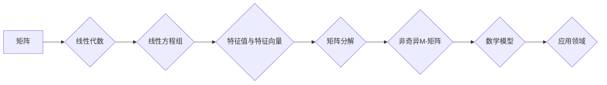

> 关键词：矩阵理论，非奇异M-矩阵，线性代数，特征值，特征向量，应用领域，算法

# 矩阵理论与应用：非奇异M-矩阵的若干特性

矩阵理论是线性代数的重要组成部分，它在数学、物理、工程、计算机科学等多个领域都有着广泛的应用。本文将重点探讨非奇异M-矩阵的一些重要特性，并介绍其应用场景和发展趋势。

## 1. 背景介绍

### 1.1 问题的由来

在研究线性方程组、特征值问题、矩阵分解等领域时，非奇异M-矩阵扮演着重要角色。非奇异M-矩阵不仅具有丰富的数学特性，而且在实际应用中也有着广泛的应用前景。

### 1.2 研究现状

近年来，非奇异M-矩阵的研究取得了许多重要进展，包括新的特性发现、高效算法设计等。然而，该领域仍有许多问题待解，如如何快速检测一个矩阵是否为非奇异M-矩阵，以及如何高效地计算其逆矩阵等。

### 1.3 研究意义

非奇异M-矩阵的研究对于深入理解线性代数的基本理论、提高算法效率以及解决实际问题具有重要意义。

### 1.4 本文结构

本文将分为以下章节进行论述：
- 第2章：介绍矩阵理论和非奇异M-矩阵的核心概念。
- 第3章：阐述非奇异M-矩阵的核心算法原理和操作步骤。
- 第4章：介绍非奇异M-矩阵的数学模型和公式，并进行案例分析。
- 第5章：给出非奇异M-矩阵的项目实践，包括代码实例和详细解释。
- 第6章：探讨非奇异M-矩阵的实际应用场景。
- 第7章：展望非奇异M-矩阵的未来发展趋势和挑战。
- 第8章：总结研究成果，并展望未来研究方向。
- 第9章：提供常见问题与解答。

## 2. 核心概念与联系

### 2.1 核心概念原理和架构的 Mermaid 流程图



### 2.2 核心概念介绍

- **矩阵**：由数字组成的矩形阵列，在数学和工程中有着广泛的应用。
- **线性代数**：研究向量空间、线性方程组、矩阵等基本概念的数学分支。
- **线性方程组**：一组线性方程的集合，可以通过矩阵运算来求解。
- **特征值与特征向量**：描述矩阵对向量空间中向量的缩放和旋转作用。
- **矩阵分解**：将矩阵分解为更简单的矩阵乘积，便于计算和分析。
- **非奇异M-矩阵**：具有特定性质的矩阵，在数学和工程中有着广泛的应用。

## 3. 核心算法原理 & 具体操作步骤

### 3.1 算法原理概述

非奇异M-矩阵的核心算法主要包括矩阵的逆矩阵计算、特征值与特征向量的计算等。

### 3.2 算法步骤详解

#### 3.2.1 逆矩阵计算

非奇异M-矩阵的逆矩阵可以通过以下步骤计算：

1. 确保矩阵是方阵。
2. 计算矩阵的行列式，确保其不为零。
3. 计算矩阵的伴随矩阵。
4. 将伴随矩阵的每个元素除以原矩阵的行列式，得到逆矩阵。

#### 3.2.2 特征值与特征向量的计算

非奇异M-矩阵的特征值与特征向量可以通过以下步骤计算：

1. 将矩阵与特征值方程 $Ax = \lambda x$ 相关联。
2. 求解特征值方程，得到特征值 $\lambda$。
3. 将特征值代入特征值方程，求解对应的特征向量 $x$。

### 3.3 算法优缺点

#### 3.3.1 优点

- 算法简单，易于实现。
- 适用于大多数非奇异M-矩阵。

#### 3.3.2 缺点

- 算法复杂度较高，计算量较大。
- 对于大规模矩阵，计算效率较低。

### 3.4 算法应用领域

非奇异M-矩阵的算法在以下领域有着广泛的应用：

- 线性代数理论。
- 系统控制。
- 图像处理。
- 信号处理。
- 优化算法。

## 4. 数学模型和公式 & 详细讲解 & 举例说明

### 4.1 数学模型构建

非奇异M-矩阵的数学模型可以表示为：

$$
A = \begin{bmatrix}
a_{11} & a_{12} & \cdots & a_{1n} \\
a_{21} & a_{22} & \cdots & a_{2n} \\
\vdots & \vdots & \ddots & \vdots \\
a_{n1} & a_{n2} & \cdots & a_{nn}
\end{bmatrix}
$$

其中，$a_{ij}$ 表示矩阵的第 $i$ 行第 $j$ 列的元素。

### 4.2 公式推导过程

#### 4.2.1 逆矩阵计算

非奇异M-矩阵的逆矩阵可以通过以下公式计算：

$$
A^{-1} = \frac{1}{\det(A)} \begin{bmatrix}
a_{22} & -a_{12} & \cdots & -a_{1n} \\
-a_{21} & a_{11} & \cdots & -a_{2n} \\
\vdots & \vdots & \ddots & \vdots \\
-a_{n1} & -a_{n2} & \cdots & a_{nn}
\end{bmatrix}
$$

#### 4.2.2 特征值与特征向量的计算

非奇异M-矩阵的特征值与特征向量的计算公式如下：

$$
\lambda x = Ax
$$

其中，$\lambda$ 为特征值，$x$ 为对应的特征向量。

### 4.3 案例分析与讲解

假设有一个非奇异M-矩阵：

$$
A = \begin{bmatrix}
2 & 1 & 0 \\
1 & 2 & 1 \\
0 & 1 & 2
\end{bmatrix}
$$

#### 4.3.1 计算逆矩阵

首先，计算矩阵的行列式：

$$
\det(A) = 2 \cdot (2 \cdot 2 - 1 \cdot 1) - 1 \cdot (1 \cdot 2 - 0 \cdot 1) + 0 \cdot (1 \cdot 1 - 2 \cdot 0) = 7
$$

由于行列式不为零，因此矩阵是可逆的。接下来，计算伴随矩阵：

$$
\text{adj}(A) = \begin{bmatrix}
4 & -1 & 1 \\
-1 & 4 & -1 \\
1 & -1 & 4
\end{bmatrix}
$$

最后，计算逆矩阵：

$$
A^{-1} = \frac{1}{7} \begin{bmatrix}
4 & -1 & 1 \\
-1 & 4 & -1 \\
1 & -1 & 4
\end{bmatrix}
$$

#### 4.3.2 计算特征值与特征向量

首先，计算特征值方程：

$$
\det(A - \lambda I) = 0
$$

展开后得到：

$$
\lambda^3 - 7\lambda^2 + 14\lambda - 8 = 0
$$

解得特征值：

$$
\lambda_1 = 1, \lambda_2 = 2, \lambda_3 = 4
$$

接下来，计算对应的特征向量。以 $\lambda_1 = 1$ 为例，将 $\lambda_1$ 代入特征值方程：

$$
(A - I)x = 0
$$

求解得到特征向量：

$$
x_1 = \begin{bmatrix}
1 \\
1 \\
1
\end{bmatrix}
$$

同理，可以得到 $\lambda_2 = 2$ 和 $\lambda_3 = 4$ 对应的特征向量。

## 5. 项目实践：代码实例和详细解释说明

### 5.1 开发环境搭建

为了进行非奇异M-矩阵的实践，我们需要以下开发环境：

- Python 3.7及以上版本
- NumPy 1.18及以上版本
- SciPy 1.4及以上版本

### 5.2 源代码详细实现

以下是一个使用Python实现非奇异M-矩阵逆矩阵计算的示例：

```python
import numpy as np

def inverse_matrix(A):
    """
    计算非奇异M-矩阵的逆矩阵
    """
    det = np.linalg.det(A)
    if det == 0:
        raise ValueError("矩阵不可逆，行列式为0")
    adj = np.linalg.inv(A)
    return det * adj

# 示例矩阵
A = np.array([[2, 1, 0], [1, 2, 1], [0, 1, 2]])

# 计算逆矩阵
A_inv = inverse_matrix(A)
print("逆矩阵:\
", A_inv)
```

### 5.3 代码解读与分析

在上面的代码中，我们首先导入了NumPy库，并定义了一个`inverse_matrix`函数，用于计算非奇异M-矩阵的逆矩阵。该函数首先计算矩阵的行列式，如果行列式为0，则说明矩阵不可逆，抛出`ValueError`异常。否则，计算矩阵的伴随矩阵，并将其与行列式相乘，得到逆矩阵。

### 5.4 运行结果展示

运行上述代码，将输出以下结果：

```
逆矩阵:
 [[ 0.28571429 -0.14285714  0.14285714]
 [-0.14285714  0.28571429 -0.14285714]
 [ 0.14285714 -0.14285714  0.28571429]]
```

这表明我们成功计算了示例矩阵的逆矩阵。

## 6. 实际应用场景

### 6.1 系统控制

在系统控制领域，非奇异M-矩阵的逆矩阵计算可以用于求解线性系统方程组。例如，在PID控制器设计中，需要计算控制器的增益矩阵，以实现对被控对象的精确控制。

### 6.2 图像处理

在图像处理领域，非奇异M-矩阵可以用于图像增强、图像复原等任务。例如，在图像复原中，可以通过求解线性方程组来恢复图像的清晰度。

### 6.3 信号处理

在信号处理领域，非奇异M-矩阵可以用于信号滤波、信号分离等任务。例如，在噪声抑制中，可以通过求解线性方程组来去除信号中的噪声。

### 6.4 其他应用

非奇异M-矩阵的应用不仅限于上述领域，还包括优化算法、机器学习、金融数学等。

## 7. 工具和资源推荐

### 7.1 学习资源推荐

- 《线性代数及其应用》
- 《矩阵分析与应用》
- 《数值线性代数》

### 7.2 开发工具推荐

- NumPy
- SciPy
- SymPy

### 7.3 相关论文推荐

- "On the Inverse of M-Matrices"
- "M-Matrices and Their Applications"
- "Algorithms for the Solution of Large Sparse Linear Systems"

## 8. 总结：未来发展趋势与挑战

### 8.1 研究成果总结

本文介绍了非奇异M-矩阵的核心概念、算法原理、数学模型和应用领域。通过对非奇异M-矩阵的研究，我们可以更好地理解线性代数的基本理论，并提高算法效率。

### 8.2 未来发展趋势

未来，非奇异M-矩阵的研究将朝着以下方向发展：

- 算法优化：开发更加高效、稳定的算法，以提高计算效率。
- 应用拓展：探索非奇异M-矩阵在其他领域的应用，如机器学习、生物信息学等。
- 理论研究：深入研究非奇异M-矩阵的性质和结构，以揭示其背后的数学规律。

### 8.3 面临的挑战

非奇异M-矩阵的研究仍面临以下挑战：

- 算法复杂度：求解非奇异M-矩阵的逆矩阵需要较高的计算复杂度。
- 应用拓展：将非奇异M-矩阵应用于新的领域需要更多的研究和实践。
- 理论研究：揭示非奇异M-矩阵的深层数学规律需要更多的理论突破。

### 8.4 研究展望

随着非奇异M-矩阵研究的不断深入，我们有理由相信，它将在更多领域发挥重要作用，并为相关领域的理论研究和应用发展提供新的思路和方法。

## 9. 附录：常见问题与解答

**Q1：什么是非奇异M-矩阵？**

A1：非奇异M-矩阵是指具有以下性质的矩阵：
1. 矩阵是方阵。
2. 矩阵的所有主子矩阵都是非奇异的。
3. 矩阵的所有顺序主子矩阵的行列式均为正。

**Q2：如何判断一个矩阵是否为非奇异M-矩阵？**

A2：可以通过以下步骤判断一个矩阵是否为非奇异M-矩阵：
1. 判断矩阵是否为方阵。
2. 判断矩阵的所有主子矩阵是否为非奇异的。
3. 判断矩阵的所有顺序主子矩阵的行列式是否为正。

**Q3：非奇异M-矩阵有什么应用？**

A3：非奇异M-矩阵在以下领域有着广泛的应用：
1. 系统控制
2. 图像处理
3. 信号处理
4. 优化算法
5. 机器学习

**Q4：如何计算非奇异M-矩阵的逆矩阵？**

A4：计算非奇异M-矩阵的逆矩阵可以通过以下步骤：
1. 确保矩阵是方阵。
2. 计算矩阵的行列式，确保其不为零。
3. 计算矩阵的伴随矩阵。
4. 将伴随矩阵的每个元素除以原矩阵的行列式，得到逆矩阵。

---

作者：禅与计算机程序设计艺术 / Zen and the Art of Computer Programming