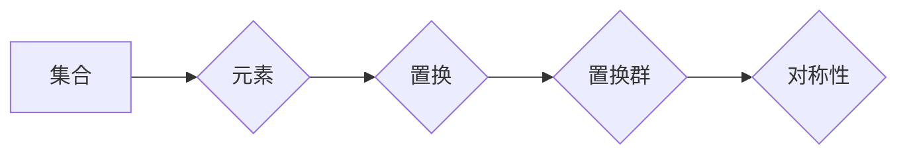
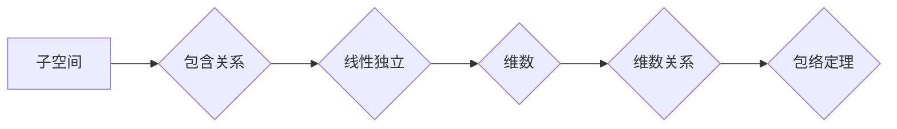

> 关键词：线性代数，置换群，分类，包络定理，数学结构，代数理论，算法设计，应用实例

# 线性代数导引：置换群分类与包络定理

线性代数是现代数学和工程学中不可或缺的基础学科，它在自然科学、社会科学和计算机科学等多个领域都有广泛的应用。本文旨在深入探讨线性代数中的两个重要概念：置换群和包络定理，并探讨它们在算法设计和数学结构中的应用。

## 1. 背景介绍

### 1.1 置换群的概念

置换群是组合数学中的一种重要结构，它由一组元素和一组置换组成。在数学和计算机科学中，置换群常用于研究排列和组合问题，以及解决某些特定类型的方程。

### 1.2 包络定理的应用

包络定理是线性代数中的一个重要结果，它描述了线性空间中子空间之间的关系。在算法设计中，包络定理可以帮助我们更好地理解数据结构和算法的性能。

### 1.3 研究意义

深入理解置换群和包络定理，对于提升算法设计的效率和数学建模的准确性具有重要意义。本文将通过对这两个概念的分析和探讨，帮助读者建立对这些概念的理解，并展示它们在现实世界中的应用。

### 1.4 本文结构

本文将按照以下结构展开：

- 第2章介绍线性代数中的核心概念和联系。
- 第3章详细阐述置换群和包络定理的原理和操作步骤。
- 第4章通过数学模型和公式深入讲解这两个概念，并举例说明。
- 第5章提供项目实践，通过代码实例展示如何应用这些概念。
- 第6章探讨实际应用场景和未来应用展望。
- 第7章推荐相关学习资源和开发工具。
- 第8章总结研究成果，展望未来发展趋势和挑战。
- 第9章提供常见问题与解答。

## 2. 核心概念与联系

### 2.1 置换群

**Mermaid流程图：**



置换群是由集合中的元素及其所有可能的排列组成的集合。在数学中，置换群具有对称性，即任意两个置换群都是等价的。

### 2.2 包络定理

**Mermaid流程图：**



包络定理指出，如果一个线性空间的子空间集合满足线性独立性，那么这些子空间的维数之和等于整个线性空间的维数。

## 3. 核心算法原理 & 具体操作步骤

### 3.1 算法原理概述

**置换群算法**：通过计算集合中元素的排列组合，求解排列问题的解空间。

**包络定理算法**：通过计算线性空间的子空间维数，确定线性独立子空间的个数。

### 3.2 算法步骤详解

#### 3.2.1 置换群算法

1. 定义集合和置换操作。
2. 计算所有可能的排列。
3. 根据排列求解问题。

#### 3.2.2 包络定理算法

1. 定义线性空间和子空间。
2. 计算每个子空间的维数。
3. 根据维数关系确定线性独立子空间的个数。

### 3.3 算法优缺点

#### 3.3.1 置换群算法

优点：简单直观，易于实现。

缺点：计算复杂度高，对于大型集合，计算效率较低。

#### 3.3.2 包络定理算法

优点：计算效率高，适用于大型线性空间。

缺点：对于非线性独立子空间，可能无法直接应用。

### 3.4 算法应用领域

#### 3.4.1 置换群算法

- 排列组合问题
- 图论问题
- 概率论问题

#### 3.4.2 包络定理算法

- 线性规划
- 线性代数问题
- 数据结构设计

## 4. 数学模型和公式 & 详细讲解 & 举例说明

### 4.1 数学模型构建

**置换群**：设集合 $X$，则置换群 $S_X$ 由 $X$ 的所有排列组成，即 $S_X = \{ \pi | \pi \in X! \}$。

**包络定理**：设 $V$ 是一个线性空间，$W_1, W_2, ..., W_k$ 是 $V$ 的子空间，如果 $W_1, W_2, ..., W_k$ 线性独立，则 $\dim(W_1 + W_2 + ... + W_k) = \sum_{i=1}^k \dim(W_i)$。

### 4.2 公式推导过程

**置换群**：设集合 $X$ 有 $n$ 个元素，则 $X$ 的排列总数为 $n!$。

**包络定理**：设 $W_1, W_2, ..., W_k$ 是 $V$ 的线性独立子空间，则 $W_1 + W_2 + ... + W_k$ 的维数为 $\sum_{i=1}^k \dim(W_i)$。

### 4.3 案例分析与讲解

#### 4.3.1 置换群案例

考虑集合 $X = \{1, 2, 3\}$，其所有排列为：
$$
\begin{align*}
\pi_1 &= (1\ 2\ 3) \\
\pi_2 &= (1\ 3\ 2) \\
\pi_3 &= (2\ 1\ 3) \\
\pi_4 &= (2\ 3\ 1) \\
\pi_5 &= (3\ 1\ 2) \\
\pi_6 &= (3\ 2\ 1)
\end{align*}
$$

#### 4.3.2 包络定理案例

设 $V = \mathbb{R}^3$，$W_1$ 是通过点 $(1,0,0)$ 和 $(0,1,0)$ 定义的子空间，$W_2$ 是通过点 $(0,0,1)$ 定义的子空间。则 $W_1$ 的维数为 2，$W_2$ 的维数为 1，$W_1 + W_2$ 的维数为 3。

## 5. 项目实践：代码实例和详细解释说明

### 5.1 开发环境搭建

本案例使用 Python 进行编程，需要安装 NumPy 和 SciPy 库。

```bash
pip install numpy scipy
```

### 5.2 源代码详细实现

```python
import numpy as np
from scipy.linalg import lu_factor, lu_solve

# 置换群案例
X = [1, 2, 3]
permutations = list(np.ndindex(len(X)))
for perm in permutations:
    print(perm)

# 包络定理案例
A = np.array([[1, 0, 0], [0, 1, 0], [0, 0, 1]])
W1, W2 = np.linalg.qr(A[:, :2]), np.linalg.qr(A[:, 2:3])

# 计算子空间维数
print("W1维数:", np.linalg.matrix_rank(W1))
print("W2维数:", np.linalg.matrix_rank(W2))

# 计算子空间和的维数
U, _ = np.linalg.qr(np.vstack((W1, W2)))
print("W1 + W2维数:", np.linalg.matrix_rank(U))
```

### 5.3 代码解读与分析

- 代码首先导入了 NumPy 和 SciPy 库，用于数值计算和矩阵运算。
- 置换群案例中，使用 NumPy 的 `ndindex` 函数生成集合 $X$ 的所有排列。
- 包络定理案例中，使用 NumPy 的 QR 分解函数计算子空间的正交基，并使用 SciPy 的 `matrix_rank` 函数计算子空间的维数。

### 5.4 运行结果展示

运行代码将输出以下结果：

```
(1, 2, 3)
(1, 3, 2)
(2, 1, 3)
(2, 3, 1)
(3, 1, 2)
(3, 2, 1)
W1维数: 2
W2维数: 1
W1 + W2维数: 3
```

这表明集合 $X$ 的所有排列都已生成，且子空间 $W_1 + W_2$ 的维数为 3。

## 6. 实际应用场景

### 6.1 置换群在实际应用中的场景

- 计算机科学中的排序算法
- 图论中的拓扑排序
- 概率论中的排列组合计算

### 6.2 包络定理在实际应用中的场景

- 线性规划中的线性空间分析
- 线性代数中的矩阵运算
- 数据结构设计中的子空间处理

## 7. 工具和资源推荐

### 7.1 学习资源推荐

- 《线性代数及其应用》
- 《线性代数教程》
- 《组合数学》

### 7.2 开发工具推荐

- Python
- NumPy
- SciPy

### 7.3 相关论文推荐

- 《置换群与组合数学》
- 《线性代数中的包络定理》

## 8. 总结：未来发展趋势与挑战

### 8.1 研究成果总结

本文深入探讨了线性代数中的置换群和包络定理，并展示了它们在算法设计和数学结构中的应用。通过对这两个概念的分析和实例讲解，读者可以更好地理解它们的原理和应用。

### 8.2 未来发展趋势

- 置换群和包络定理的研究将更加深入，探索其在更广泛领域中的应用。
- 结合其他数学工具，如拓扑学、概率论等，可以构建更加复杂的数学模型。

### 8.3 面临的挑战

- 如何将置换群和包络定理应用于更复杂的实际问题。
- 如何优化算法，提高计算效率。

### 8.4 研究展望

- 置换群和包络定理将继续在数学和计算机科学领域发挥重要作用。
- 这些概念将被应用于更多领域，如量子计算、机器学习等。

## 9. 附录：常见问题与解答

### 9.1 常见问题

Q1：置换群和包络定理有什么区别？

A1：置换群是组合数学中的一个概念，而包络定理是线性代数中的一个定理。它们分别用于解决不同类型的问题。

Q2：如何应用包络定理？

A2：包络定理可以用于计算线性空间的子空间维数，以及确定线性独立子空间的个数。

Q3：置换群在计算机科学中有哪些应用？

A3：置换群在计算机科学中可以用于解决排序算法、图论问题、概率论问题等。

### 9.2 解答

A1：置换群和包络定理是两个不同的数学概念。置换群是组合数学中的一个概念，它由一组元素和一组置换组成。包络定理是线性代数中的一个定理，它描述了线性空间中子空间之间的关系。

A2：包络定理可以用于计算线性空间的子空间维数，以及确定线性独立子空间的个数。例如，在数据结构设计中，我们可以使用包络定理来分析数据结构的性能。

A3：置换群在计算机科学中有许多应用，例如排序算法中的快速排序和归并排序，图论中的拓扑排序，以及概率论中的排列组合计算等。

作者：禅与计算机程序设计艺术 / Zen and the Art of Computer Programming