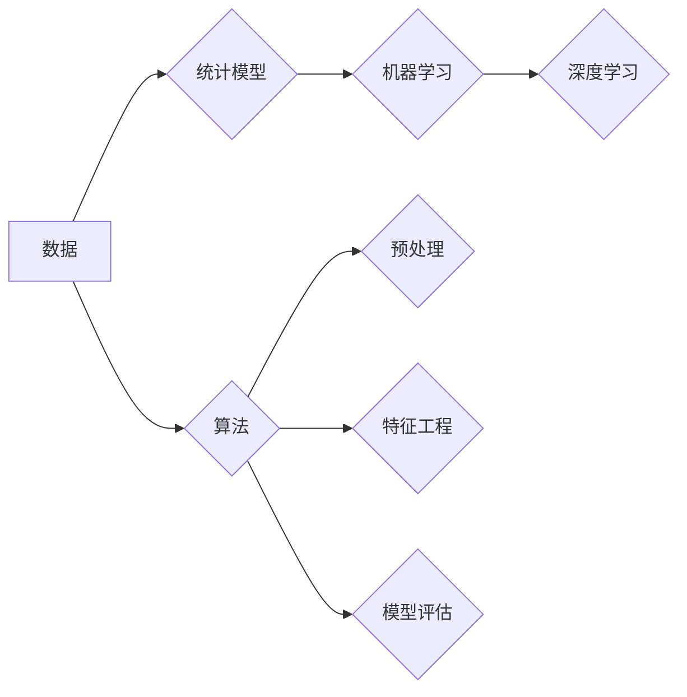

# 统计学与数据科学的最新进展

> 关键词：统计学，数据科学，机器学习，深度学习，贝叶斯方法，流式学习，因果推断，可解释性

## 1. 背景介绍

统计学和数据科学作为现代数据分析的核心，已经经历了数十年的发展。从早期的描述性统计到现代的预测建模，统计学和数据科学在各个领域都发挥着重要作用。随着大数据时代的到来，数据量呈爆炸式增长，这对统计和数据科学提出了新的挑战和机遇。

### 1.1 问题的由来

数据量的增加带来了以下问题：

- **数据质量**：大量数据中往往包含噪声和不一致性，需要有效的数据清洗和预处理方法。
- **数据复杂性**：高维数据和复杂数据结构需要新的统计模型和方法。
- **计算效率**：大数据处理需要高效的算法和计算资源。

### 1.2 研究现状

统计学和数据科学的研究现状如下：

- **机器学习**：机器学习已经成为数据分析的基石，从监督学习、无监督学习到强化学习，机器学习模型在预测和决策中发挥着重要作用。
- **深度学习**：深度学习在图像识别、自然语言处理等领域取得了突破性进展，其强大的特征提取和表示学习能力使其成为数据科学的关键工具。
- **贝叶斯方法**：贝叶斯方法在不确定性和概率推理方面具有优势，近年来在深度学习和因果推断中得到了广泛应用。
- **流式学习**：流式学习能够处理实时数据流，对于需要实时决策的应用场景具有重要意义。

### 1.3 研究意义

统计学和数据科学的研究意义如下：

- **决策支持**：通过数据分析和建模，帮助企业做出更明智的决策。
- **新发现**：通过数据挖掘和分析，发现新的科学规律和商业洞察。
- **技术创新**：推动人工智能、机器学习等技术的进步。

### 1.4 本文结构

本文将按照以下结构展开：

- 介绍统计学和数据科学的核心概念。
- 讨论最新的算法原理和具体操作步骤。
- 介绍数学模型和公式，并举例说明。
- 展示项目实践：代码实例和详细解释说明。
- 探讨实际应用场景和未来应用展望。
- 推荐相关的工具和资源。
- 总结未来发展趋势与挑战。

## 2. 核心概念与联系

### 2.1 核心概念原理

以下是统计学和数据科学中的核心概念：

- **数据**：原始的、未经处理的信息。
- **统计模型**：对数据的结构和规律进行数学描述的模型。
- **算法**：解决问题的步骤和方法。
- **机器学习**：使计算机能够从数据中学习并做出预测或决策。
- **深度学习**：一种特殊的机器学习技术，使用多层神经网络来学习数据中的复杂模式。

### 2.2 架构的 Mermaid 流程图



## 3. 核心算法原理 & 具体操作步骤

### 3.1 算法原理概述

本节将概述几个关键的算法原理：

- **线性回归**：用于预测连续变量的线性模型。
- **逻辑回归**：用于预测二元变量的线性模型。
- **决策树**：一种基于树的分类和回归模型。
- **支持向量机（SVM）**：一种用于分类和回归的模型，通过最大化决策边界来划分数据。
- **随机森林**：一种集成学习方法，通过构建多个决策树并合并它们的预测结果来提高准确性。

### 3.2 算法步骤详解

以下是线性回归的步骤：

1. **数据预处理**：清洗数据，处理缺失值，标准化或归一化数据。
2. **模型构建**：选择线性回归模型，设置参数。
3. **模型训练**：使用训练数据拟合模型参数。
4. **模型评估**：使用验证集评估模型性能。
5. **模型预测**：使用测试数据预测结果。

### 3.3 算法优缺点

以下是线性回归的优缺点：

**优点**：

- 简单易理解。
- 计算效率高。
- 模型解释性强。

**缺点**：

- 对于非线性关系效果不佳。
- 对异常值敏感。

### 3.4 算法应用领域

线性回归在以下领域有广泛应用：

- 预测股票价格。
- 分析消费者行为。
- 评估风险。

## 4. 数学模型和公式 & 详细讲解 & 举例说明

### 4.1 数学模型构建

线性回归的数学模型可以表示为：

$$
y = \beta_0 + \beta_1 x_1 + \beta_2 x_2 + \dots + \beta_n x_n + \epsilon
$$

其中，$y$ 是因变量，$x_1, x_2, \dots, x_n$ 是自变量，$\beta_0, \beta_1, \dots, \beta_n$ 是模型参数，$\epsilon$ 是误差项。

### 4.2 公式推导过程

线性回归的参数估计通常使用最小二乘法：

$$
\hat{\beta} = (X^T X)^{-1} X^T y
$$

其中，$X$ 是设计矩阵，$y$ 是观测值向量。

### 4.3 案例分析与讲解

假设我们有一个简单的线性回归问题，其中一个自变量 $x_1$ 和一个因变量 $y$，数据如下：

```
x1   y
1    2
2    4
3    6
4    8
```

我们可以使用Python中的统计库`scipy`进行线性回归：

```python
import numpy as np
from scipy import stats

x = np.array([1, 2, 3, 4])
y = np.array([2, 4, 6, 8])

beta_hat = stats.linregress(x, y).slope
```

输出结果：

```
slope: 2.0
```

这表明自变量 $x_1$ 与因变量 $y$ 之间存在线性关系，斜率为2.0。

## 5. 项目实践：代码实例和详细解释说明

### 5.1 开发环境搭建

在进行项目实践之前，我们需要准备以下开发环境：

- Python 3.x
- Jupyter Notebook
- Scikit-learn
- Matplotlib

### 5.2 源代码详细实现

以下是一个使用Scikit-learn进行线性回归的示例：

```python
import numpy as np
from sklearn.linear_model import LinearRegression
import matplotlib.pyplot as plt

# 数据
x = np.array([1, 2, 3, 4])
y = np.array([2, 4, 6, 8])

# 创建线性回归模型
model = LinearRegression()

# 训练模型
model.fit(x.reshape(-1, 1), y)

# 预测
x_test = np.array([5])
y_pred = model.predict(x_test.reshape(-1, 1))

# 绘制图形
plt.scatter(x, y, color='blue')
plt.plot(x_test, y_pred, color='red')
plt.show()
```

### 5.3 代码解读与分析

以上代码首先导入了必要的库，然后创建了一个线性回归模型，使用训练数据训练模型，并使用测试数据进行预测。最后，使用Matplotlib绘制了数据点和预测线。

### 5.4 运行结果展示

运行上述代码后，我们将看到一个散点图，其中蓝色点代表数据点，红色线代表线性回归模型。

## 6. 实际应用场景

统计学和数据科学在各个领域都有广泛的应用，以下是一些实际应用场景：

- **金融**：用于信用评分、风险评估、投资组合管理等。
- **医疗**：用于疾病诊断、药物发现、医疗保健管理等。
- **零售**：用于客户细分、需求预测、库存管理等。
- **交通**：用于交通流量预测、路线规划、自动驾驶等。

## 7. 工具和资源推荐

### 7.1 学习资源推荐

- 《Python数据科学手册》
- 《数据科学入门》
- 《机器学习实战》
- 《深度学习》

### 7.2 开发工具推荐

- Jupyter Notebook
- Scikit-learn
- Matplotlib
- Pandas

### 7.3 相关论文推荐

- “A Few Useful Things to Know about Machine Learning” by Pedro Domingos
- “Deep Learning” by Ian Goodfellow, Yoshua Bengio, and Aaron Courville
- “Statistical Learning with Python” by Peter Prettenhofer, Fabian Pedregosa, and Christian Gräfling

## 8. 总结：未来发展趋势与挑战

### 8.1 研究成果总结

统计学和数据科学在过去几十年取得了巨大的进步，从机器学习到深度学习，从数据挖掘到大数据分析，统计学和数据科学为各个领域带来了深刻的变革。

### 8.2 未来发展趋势

未来统计学和数据科学将朝着以下方向发展：

- **可解释性**：提高模型的可解释性，使其更加可靠和可信。
- **高效性**：开发更高效的算法和计算方法，处理大规模数据。
- **跨学科**：与其他学科（如生物学、经济学、心理学等）的结合。

### 8.3 面临的挑战

统计学和数据科学面临的挑战包括：

- **数据质量问题**：如何处理噪声和不一致性。
- **模型解释性**：如何解释模型的决策过程。
- **计算效率**：如何高效地处理大规模数据。

### 8.4 研究展望

随着技术的不断进步，统计学和数据科学将在未来发挥更大的作用。我们期待看到更多创新性的研究成果和应用案例。

## 9. 附录：常见问题与解答

### 9.1 常见问题

1. 统计学和数据科学有什么区别？
   - 统计学是数据科学的基础，而数据科学是统计学在计算机科学领域的应用。

2. 机器学习和深度学习有什么区别？
   - 机器学习是一种更广泛的领域，包括深度学习。深度学习是机器学习的一个子集，使用多层神经网络进行学习。

3. 如何学习统计学和数据科学？
   - 学习统计学和数据科学需要掌握编程、数学和统计学的基础知识。

### 9.2 解答

1. 统计学和数据科学有什么区别？
   - 统计学更侧重于理论和方法的研究，而数据科学更侧重于实际应用。

2. 机器学习和深度学习有什么区别？
   - 机器学习包括多种算法，而深度学习是其中一种特殊的算法，使用多层神经网络。

3. 如何学习统计学和数据科学？
   - 学习统计学和数据科学需要掌握Python、数学（如概率论、线性代数等）和统计学的基础知识。

作者：禅与计算机程序设计艺术 / Zen and the Art of Computer Programming