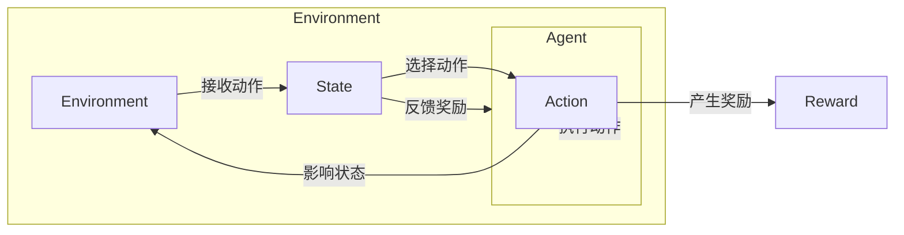

# 自主智能模型的强化学习

> 关键词：强化学习，自主智能，马尔可夫决策过程，Q学习，深度Q网络，策略梯度，多智能体强化学习，环境交互

## 1. 背景介绍

随着人工智能技术的不断发展，强化学习（Reinforcement Learning, RL）作为一种重要的机器学习范式，已经在游戏、机器人、自动驾驶、推荐系统等领域取得了显著的成果。强化学习通过智能体与环境交互，学习在给定环境中做出最优决策，以实现长期的累积奖励最大化。然而，传统的强化学习模型在面对复杂环境和大规模决策时，往往面临着计算效率低、收敛速度慢、可解释性差等问题。为了解决这些问题，研究者们提出了自主智能模型（Autonomous Intelligence Models），通过融合深度学习、多智能体强化学习等技术，提升强化学习模型的性能和应用范围。

## 2. 核心概念与联系

### 2.1 核心概念

**强化学习（Reinforcement Learning）**：强化学习是一种通过与环境交互，学习如何在给定的环境中做出最优决策，以实现长期累积奖励最大化的机器学习范式。它由智能体（Agent）、环境（Environment）、状态（State）、动作（Action）和奖励（Reward）五个核心要素组成。

- **智能体（Agent）**：执行动作并从环境中接收奖励的学习实体。
- **环境（Environment）**：与智能体交互并提供反馈的实体。
- **状态（State）**：描述环境当前状态的集合。
- **动作（Action）**：智能体能够执行的操作。
- **奖励（Reward）**：环境对智能体动作的反馈，通常用于指导智能体的学习过程。

**马尔可夫决策过程（Markov Decision Process, MDP）**：描述强化学习环境的一种数学模型，它假设当前状态仅由当前动作和下一状态决定，与智能体的历史动作无关。

**Q学习（Q-Learning）**：一种无模型强化学习方法，通过学习Q值（动作在特定状态下带来的期望奖励）来指导智能体选择最优动作。

**深度Q网络（Deep Q-Network, DQN）**：结合了深度学习和Q学习的强化学习方法，使用神经网络来近似Q值函数。

**策略梯度（Policy Gradient）**：一种基于策略的强化学习方法，直接学习最优策略，而不是Q值函数。

**多智能体强化学习（Multi-Agent Reinforcement Learning）**：研究多个智能体如何通过协同或竞争在复杂环境中实现共同目标的方法。

### 2.2 架构的 Mermaid 流程图



## 3. 核心算法原理 & 具体操作步骤

### 3.1 算法原理概述

强化学习的基本原理是通过与环境交互，不断学习状态-动作值函数（Q值）或最优策略，以实现累积奖励最大化。以下是一些常见的强化学习算法：

- **Q学习**：通过更新Q值来学习最优策略。
- **策略梯度**：直接学习最优策略，而不是Q值函数。
- **深度Q网络（DQN）**：使用神经网络近似Q值函数，结合了深度学习和Q学习。
- **深度确定性策略梯度（Deep Deterministic Policy Gradient, DDPG）**：使用神经网络近似策略，结合了策略梯度和actor-critic方法。

### 3.2 算法步骤详解

1. **初始化**：设置智能体、环境和奖励函数。
2. **选择动作**：智能体根据当前状态选择动作。
3. **与环境交互**：智能体执行动作，并从环境中接收下一个状态和奖励。
4. **更新策略**：根据接收到的奖励和下一状态，更新智能体的策略或Q值函数。
5. **重复步骤2-4**：不断与环境交互，直到达到终止条件。

### 3.3 算法优缺点

**Q学习**：

- 优点：简单易懂，易于实现。
- 缺点：容易陷入局部最优，收敛速度慢。

**策略梯度**：

- 优点：直接学习最优策略，无需存储Q值函数。
- 缺点：梯度不稳定，难以优化。

**DQN**：

- 优点：结合了深度学习和Q学习，可以处理高维状态空间。
- 缺点：需要大量探索，容易过拟合。

**DDPG**：

- 优点：结合了策略梯度和actor-critic方法，可以处理连续动作空间。
- 缺点：收敛速度慢，需要大量训练数据。

### 3.4 算法应用领域

强化学习在各个领域都有广泛的应用，以下是一些典型的应用场景：

- **游戏**：如Atari、Go、围棋等。
- **机器人**：如无人机、自动驾驶、机器人控制等。
- **推荐系统**：如新闻推荐、商品推荐等。
- **资源分配**：如云计算资源分配、交通流量控制等。

## 4. 数学模型和公式 & 详细讲解 & 举例说明

### 4.1 数学模型构建

强化学习的数学模型可以表示为马尔可夫决策过程（MDP）：

$$
\begin{align*}
\text{MDP} &= \langle S, A, P, R, \gamma \rangle \\
S &= \{s_1, s_2, ..., s_n\} & \text{状态空间} \\
A &= \{a_1, a_2, ..., a_m\} & \text{动作空间} \\
P &= P(s_{t+1}|s_t, a_t) & \text{状态转移概率} \\
R &= R(s_t, a_t) & \text{奖励函数} \\
\gamma &= \text{折扣因子} & \text{用于计算未来奖励的折现}
\end{align*}
$$

### 4.2 公式推导过程

以下以Q学习为例，推导Q值函数的更新公式：

假设初始Q值函数为 $Q(s,a)$，则更新公式为：

$$
Q(s,a) \leftarrow Q(s,a) + \alpha [R(s,a) + \gamma \max_{a'} Q(s',a') - Q(s,a)]
$$

其中 $\alpha$ 为学习率，$R(s,a)$ 为智能体在状态 $s$ 执行动作 $a$ 收到的奖励，$\max_{a'} Q(s',a')$ 为在状态 $s'$ 下，执行动作 $a'$ 的最大Q值。

### 4.3 案例分析与讲解

以下以经典的Atari游戏Pong为例，说明强化学习在游戏中的应用。

**环境**：Pong游戏环境，包含球、挡板和分数等元素。

**状态**：游戏画面中的像素值。

**动作**：挡板上下移动。

**奖励**：根据球是否触碰到挡板以及得分情况给予奖励。

**策略**：使用Q学习算法训练智能体，学习在给定状态下选择最优动作。

通过不断与环境交互，智能体学习到在特定状态下如何调整挡板位置，以获得更高的得分。

## 5. 项目实践：代码实例和详细解释说明

### 5.1 开发环境搭建

以下是使用Python和TensorFlow搭建Pong游戏强化学习开发环境的步骤：

1. 安装TensorFlow：
```bash
pip install tensorflow
```

2. 安装OpenAI Gym：
```bash
pip install gym
```

### 5.2 源代码详细实现

以下是一个使用Q学习算法训练Pong游戏智能体的Python代码示例：

```python
import gym
import tensorflow as tf

# 创建Pong游戏环境
env = gym.make('Pong-v0')

# 设置训练参数
alpha = 0.01
gamma = 0.99
epsilon = 0.1

# 创建Q值函数网络
class QNetwork(tf.keras.Model):
    def __init__(self, state_dim, action_dim):
        super(QNetwork, self).__init__()
        self.fc1 = tf.keras.layers.Dense(256, activation='relu')
        self.fc2 = tf.keras.layers.Dense(action_dim)

    def call(self, state):
        x = self.fc1(state)
        return self.fc2(x)

# 创建Q值函数网络实例
q_network = QNetwork(env.observation_space.shape[0], env.action_space.n)

# 创建优化器
optimizer = tf.keras.optimizers.Adam(learning_rate=alpha)

# 训练过程
def train_q_network():
    for episode in range(1000):
        state = env.reset()
        done = False
        while not done:
            if np.random.rand() < epsilon:
                action = env.action_space.sample()
            else:
                action = np.argmax(q_network(state))
            next_state, reward, done, _ = env.step(action)
            target = reward + gamma * np.max(q_network(next_state))
            with tf.GradientTape() as tape:
                q_values = q_network(state)
                target_f = tf.stop_gradient(target)
                loss = tf.reduce_mean(tf.square(q_values - target_f))
            gradients = tape.gradient(loss, q_network.trainable_variables)
            optimizer.apply_gradients(zip(gradients, q_network.trainable_variables))
            state = next_state

# 训练Q值函数网络
train_q_network()

# 测试Q值函数网络
for episode in range(10):
    state = env.reset()
    done = False
    while not done:
        action = np.argmax(q_network(state))
        next_state, reward, done, _ = env.step(action)
        state = next_state
        env.render()
```

### 5.3 代码解读与分析

1. **导入库**：首先导入必要的库，包括gym、tensorflow等。

2. **创建Pong游戏环境**：使用gym库创建Pong游戏环境。

3. **设置训练参数**：设置学习率、折扣因子、探索率等参数。

4. **创建Q值函数网络**：使用TensorFlow创建Q值函数网络，包括两个全连接层，分别用于提取特征和输出动作值。

5. **创建优化器**：使用Adam优化器优化Q值函数网络。

6. **训练过程**：使用Q学习算法训练Q值函数网络。在每个episode中，智能体根据当前状态选择动作，与环境交互，并更新Q值函数。

7. **测试Q值函数网络**：使用训练好的Q值函数网络在Pong游戏环境中进行测试。

### 5.4 运行结果展示

通过运行上述代码，可以看到智能体在Pong游戏环境中逐渐学会了控制挡板，以获得更高的得分。

## 6. 实际应用场景

强化学习在各个领域都有广泛的应用，以下是一些典型的应用场景：

- **游戏**：如Atari、Go、围棋等。
- **机器人**：如无人机、自动驾驶、机器人控制等。
- **推荐系统**：如新闻推荐、商品推荐等。
- **资源分配**：如云计算资源分配、交通流量控制等。

## 7. 工具和资源推荐

### 7.1 学习资源推荐

1. 《Reinforcement Learning: An Introduction》
2. 《Deep Reinforcement Learning》
3. 《Reinforcement Learning and Optimal Control》
4. 《Deep Reinforcement Learning with Python》

### 7.2 开发工具推荐

1. TensorFlow
2. PyTorch
3. OpenAI Gym
4. Stable Baselines

### 7.3 相关论文推荐

1. "Deep Reinforcement Learning with Double Q-learning" (Sutton, Barto, and McAllester, 1999)
2. "Human-level control through deep reinforcement learning" (Silver et al., 2016)
3. "Asynchronous Advantage Actor-Critic" (Mnih et al., 2016)
4. "Proximal Policy Optimization" (Schulman et al., 2017)

## 8. 总结：未来发展趋势与挑战

### 8.1 研究成果总结

强化学习作为一种重要的机器学习范式，在各个领域都取得了显著的成果。自主智能模型通过融合深度学习、多智能体强化学习等技术，进一步提升了强化学习模型的性能和应用范围。

### 8.2 未来发展趋势

1. **模型的可解释性和安全性**：提高强化学习模型的可解释性和安全性，使其更好地应用于高风险领域。
2. **强化学习与深度学习的融合**：探索强化学习与深度学习的更深层次融合，提升模型的学习能力和泛化能力。
3. **多智能体强化学习**：研究多智能体强化学习在复杂环境中的应用，实现协同和竞争策略。
4. **强化学习与知识表示的融合**：将知识表示技术引入强化学习，提升模型对知识的利用能力。

### 8.3 面临的挑战

1. **计算效率**：提高强化学习模型的计算效率，使其适用于大规模环境和实时应用。
2. **收敛速度**：提高强化学习模型的收敛速度，缩短训练时间。
3. **可解释性**：提高强化学习模型的可解释性，使其更容易被人类理解和使用。
4. **安全性**：确保强化学习模型在应用于高风险领域时，能够保证安全性和可靠性。

### 8.4 研究展望

随着研究的不断深入，强化学习将在更多领域发挥重要作用。未来，我们将继续探索强化学习的新方法、新算法和新应用，推动人工智能技术的发展。

## 9. 附录：常见问题与解答

**Q1：强化学习与监督学习有什么区别？**

A：强化学习与监督学习都是机器学习的重要范式，但它们的目标和任务不同。监督学习通过学习输入和输出之间的映射关系，将输入数据映射到正确的输出；而强化学习通过与环境交互，学习在给定环境中做出最优决策。

**Q2：如何选择合适的强化学习算法？**

A：选择合适的强化学习算法需要根据具体任务的特点进行。例如，对于连续动作空间的任务，可以选择DDPG、PPO等算法；对于离散动作空间的任务，可以选择Q学习、Deep Q Network等算法。

**Q3：如何解决强化学习中的收敛速度慢的问题？**

A：解决强化学习中的收敛速度慢的问题可以从以下几个方面入手：
1. 选择合适的算法：不同的算法收敛速度不同，选择合适的算法可以加快收敛速度。
2. 使用探索策略：增加探索，让智能体在环境中进行更多的尝试，有助于提高收敛速度。
3. 使用优先级队列：使用优先级队列存储经验，优先更新具有高奖励的经验，可以加快收敛速度。
4. 使用多智能体强化学习：使用多智能体强化学习可以加快学习过程，提高收敛速度。

**Q4：强化学习在哪些领域有应用？**

A：强化学习在各个领域都有广泛的应用，包括游戏、机器人、自动驾驶、推荐系统、资源分配等。

**Q5：如何评估强化学习模型的性能？**

A：评估强化学习模型的性能可以从以下几个方面入手：
1. 收敛速度：评估模型在训练过程中收敛的速度。
2. 最终性能：评估模型在测试环境中的最终性能。
3. 可解释性：评估模型的决策过程是否具有可解释性。
4. 安全性：评估模型在应用于高风险领域时，是否能够保证安全性和可靠性。

作者：禅与计算机程序设计艺术 / Zen and the Art of Computer Programming