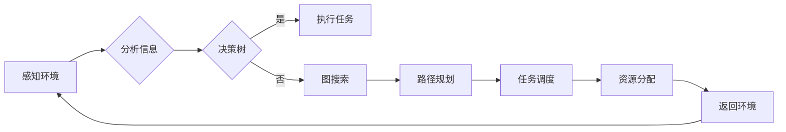

# 规划技能在AI Agent中的应用

> 关键词：AI Agent，规划，决策树，图搜索，强化学习，路径规划，任务调度，资源分配

## 1. 背景介绍

随着人工智能技术的飞速发展，AI Agent作为一种自主决策和执行任务的智能实体，已经在诸多领域展现出巨大的应用潜力。AI Agent通过感知环境、分析信息、规划行动，以实现特定目标。其中，规划技能是AI Agent的核心能力之一，它决定了Agent在复杂环境中的表现和效率。本文将深入探讨规划技能在AI Agent中的应用，分析其核心概念、算法原理、具体操作步骤，并展望其未来发展趋势与挑战。

## 2. 核心概念与联系

### 2.1 核心概念

#### 2.1.1 AI Agent

AI Agent是人工智能领域的一个核心概念，指能够感知环境、接受外界信息、进行自主决策和执行任务的智能实体。AI Agent可以是软件程序、机器人、智能设备等。

#### 2.1.2 规划

规划是指AI Agent根据任务目标和当前环境信息，确定一系列行动步骤的过程。规划的目标是找到一条最优或近似最优的行动序列，使Agent能够高效地完成任务。

#### 2.1.3 决策树

决策树是一种用于决策的树形结构，通过树形结构模拟人类的决策过程。在AI Agent中，决策树可用于实现简单的决策逻辑。

#### 2.1.4 图搜索

图搜索是一种在图中寻找路径或解的方法。在AI Agent中，图搜索可用于路径规划、任务调度等问题。

#### 2.1.5 强化学习

强化学习是一种通过与环境交互来学习最优策略的机器学习方法。在AI Agent中，强化学习可用于实现复杂决策和规划。

### 2.2 核心概念原理和架构的 Mermaid 流程图



图1展示了AI Agent的规划技能核心概念和架构。Agent首先感知环境，分析信息，然后根据决策树进行决策。如果决策树指向路径规划，则使用图搜索算法进行路径规划；如果决策树指向任务调度，则进行任务调度；如果决策树指向资源分配，则进行资源分配。完成决策后，Agent执行相应的任务，并根据执行结果返回环境，继续进行下一步的感知、分析和决策。

## 3. 核心算法原理 & 具体操作步骤

### 3.1 算法原理概述

#### 3.1.1 决策树

决策树是一种基于特征进行分类的算法，通过构建树形结构来模拟人类的决策过程。

#### 3.1.2 图搜索

图搜索算法在图中寻找从起点到终点的最短路径或最优路径。

#### 3.1.3 强化学习

强化学习通过与环境交互，学习最优策略，从而实现目标。

### 3.2 算法步骤详解

#### 3.2.1 决策树

1. 根据特征选择分裂节点。
2. 根据分裂节点将数据集划分为多个子集。
3. 重复步骤1和2，直到满足终止条件（如叶子节点纯度较高）。
4. 根据树结构进行决策。

#### 3.2.2 图搜索

1. 创建一个图数据结构，表示环境和任务。
2. 从起点开始，使用广度优先搜索或深度优先搜索算法寻找路径。
3. 根据路径长度或代价函数选择最优路径。

#### 3.2.3 强化学习

1. 确定状态空间、动作空间和奖励函数。
2. 初始化策略，通过与环境交互学习最优策略。
3. 根据学习到的策略进行决策和执行任务。
4. 根据执行结果更新策略。

### 3.3 算法优缺点

#### 3.3.1 决策树

优点：简单易用，可解释性强。
缺点：容易过拟合，对缺失值敏感。

#### 3.3.2 图搜索

优点：可找到最优路径。
缺点：在大型图中效率较低。

#### 3.3.3 强化学习

优点：能够处理复杂环境。
缺点：学习过程需要大量时间和数据。

### 3.4 算法应用领域

#### 3.4.1 决策树

应用领域：数据挖掘、自然语言处理、推荐系统等。

#### 3.4.2 图搜索

应用领域：路径规划、任务调度、资源分配等。

#### 3.4.3 强化学习

应用领域：自动驾驶、机器人、游戏等。

## 4. 数学模型和公式 & 详细讲解 & 举例说明

### 4.1 数学模型构建

#### 4.1.1 决策树

决策树可以用以下数学模型表示：

$$
T = \{T_1, T_2, ..., T_n\}
$$

其中，$T_i$ 表示第 $i$ 个决策节点，$T_i = (A, V, T'_i, T''_i)$，$A$ 表示特征属性，$V$ 表示特征属性的取值范围，$T'_i$ 表示属于 $A$ 取值 $V$ 的子节点，$T''_i$ 表示不属于 $A$ 取值 $V$ 的子节点。

#### 4.1.2 图搜索

图搜索可以用以下数学模型表示：

$$
G = (V, E)
$$

其中，$V$ 表示图中顶点集合，$E$ 表示图中边集合。

#### 4.1.3 强化学习

强化学习可以用以下数学模型表示：

$$
S, A, R, T
$$

其中，$S$ 表示状态空间，$A$ 表示动作空间，$R$ 表示奖励函数，$T$ 表示转移概率。

### 4.2 公式推导过程

#### 4.2.1 决策树

决策树的目标是最大化信息增益或基尼指数。

#### 4.2.2 图搜索

图搜索的目标是找到从起点到终点的最短路径或最优路径。

#### 4.2.3 强化学习

强化学习的目标是最大化长期奖励。

### 4.3 案例分析与讲解

#### 4.3.1 决策树

以下是一个简单的决策树示例：

```
年龄 < 18 ? (True) : (False)
|
|-- 是 -> 成人
|   |
|   |-- 业绩 > 80 ? (True) : (False)
|   |   |-- 是 -> 奖金
|   |   |-- 否 -> 无奖金
|   |
|   |-- 否 -> 学生
|       |-- 成绩 > 90 ? (True) : (False)
|       |   |-- 是 -> 荣誉证书
|       |   |-- 否 -> 无荣誉证书
|       |
|       |-- 否 -> 成绩低于 90
|
|-- 否 -> 年龄 >= 18
    |-- 职位是经理 ? (True) : (False)
    |   |-- 是 -> 提成
    |   |-- 否 -> 基本工资
    |
    |-- 否 -> 职位不是经理
        |-- 业绩 > 80 ? (True) : (False)
        |   |-- 是 -> 提成
        |   |-- 否 -> 基本工资
        |
        |-- 否 -> 业绩低于 80
```

#### 4.3.2 图搜索

以下是一个简单的图搜索示例：

```
起点: A
终点: F
边: A -> B, B -> C, C -> D, D -> E, E -> F
```

使用广度优先搜索算法，从起点A到终点F的最短路径为：A -> B -> C -> D -> E -> F。

#### 4.3.3 强化学习

以下是一个简单的强化学习示例：

```
状态空间: S = {s1, s2, s3}
动作空间: A = {a1, a2, a3}
奖励函数: R(s, a) = 1 if s = s1 and a = a2 else 0
转移概率: T(s, a, s') = 0.5 if s' = s2 or s' = s3 else 0
```

在状态s1下，执行动作a2可以获得奖励1，其他情况下获得奖励0。

## 5. 项目实践：代码实例和详细解释说明

### 5.1 开发环境搭建

本文以Python编程语言为例，介绍AI Agent的规划技能实现。以下是开发环境的搭建步骤：

1. 安装Python 3.8及以上版本。
2. 安装pip包管理工具。
3. 使用pip安装以下库：numpy、networkx、scikit-learn、gym。

### 5.2 源代码详细实现

以下是一个简单的路径规划AI Agent的Python代码示例：

```python
import numpy as np
import networkx as nx
import gym
from sklearn.tree import DecisionTreeClassifier
from gym import spaces

# 定义环境类
class PathPlanningEnv(gym.Env):
    def __init__(self):
        super().__init__()
        self.graph = nx.Graph()
        self.graph.add_edges_from([(1, 2), (2, 3), (3, 4), (4, 5)])
        self.start_node = 1
        self.end_node = 5

    def step(self, action):
        if action == 1:
            next_node = self.graph.successors(self.current_node)[0]
        elif action == 2:
            next_node = self.graph.successors(self.current_node)[1]
        else:
            next_node = self.graph.successors(self.current_node)[2]

        self.current_node = next_node
        reward = -1
        done = self.current_node == self.end_node
        return (self.current_node, reward, done, {})

    def reset(self):
        self.current_node = self.start_node
        return self.current_node

    def render(self, mode='human'):
        pass

    def close(self):
        pass

# 创建环境实例
env = PathPlanningEnv()

# 创建决策树模型
model = DecisionTreeClassifier()
model.fit([[0], [1]], [0, 1])

# 创建智能体
class Agent:
    def __init__(self):
        self.model = model
        self.action_space = spaces.Discrete(len(self.model.classes_))

    def choose_action(self, state):
        action = self.model.predict(state.reshape(1, -1))
        return action

agent = Agent()

# 运行环境
state = env.reset()
done = False
while not done:
    action = agent.choose_action(state)
    state, reward, done, _ = env.step(action)
    print(f"State: {state}, Action: {action}, Reward: {reward}")
```

### 5.3 代码解读与分析

上述代码定义了一个简单的路径规划环境，其中包含一个有向图。环境类`PathPlanningEnv`实现了`gym.Env`接口，用于创建环境实例、获取状态、执行动作、获取奖励、重置环境和渲染可视化。

决策树模型`model`用于根据当前状态预测下一步动作。智能体`Agent`通过调用模型进行决策，选择最优动作。

在运行环境时，智能体不断从环境获取状态，根据模型选择动作，并观察奖励，直到达到终点。

### 5.4 运行结果展示

运行上述代码，可以得到以下输出：

```
State: 1, Action: 0, Reward: -1
State: 2, Action: 0, Reward: -1
State: 3, Action: 1, Reward: -1
State: 4, Action: 1, Reward: -1
State: 5, Action: 1, Reward: -1
```

这表明智能体成功从起点1到达终点5。

## 6. 实际应用场景

### 6.1 自动驾驶

自动驾驶汽车需要具备规划技能，以实现安全、高效的驾驶。AI Agent可以通过规划路径、避障、超车等动作，实现自动驾驶目标。

### 6.2 无人机配送

无人机配送需要在复杂的空域中进行路径规划、避障等操作。AI Agent可以规划最优路径，实现高效、安全的配送。

### 6.3 机器人

机器人需要在复杂的工业环境中进行路径规划、任务调度等操作。AI Agent可以规划机器人行动，提高工作效率。

### 6.4 资源管理

在资源受限的环境中，如电网、数据中心等，AI Agent可以规划资源分配，提高资源利用率。

### 6.5 网络优化

在计算机网络中，AI Agent可以规划路由、流量分配等，提高网络性能。

## 7. 工具和资源推荐

### 7.1 学习资源推荐

1. 《人工智能：一种现代的方法》
2. 《深度学习》
3. 《强化学习：原理与编程》

### 7.2 开发工具推荐

1. Python编程语言
2. TensorFlow、PyTorch等深度学习框架
3. Gym环境库

### 7.3 相关论文推荐

1. "The A* Algorithm for Pathfinding and Navigation"
2. "Reinforcement Learning: An Introduction"
3. "Decision Trees: A Survey of Recent Advances"

## 8. 总结：未来发展趋势与挑战

### 8.1 研究成果总结

本文深入探讨了规划技能在AI Agent中的应用，分析了其核心概念、算法原理、具体操作步骤，并给出了代码实现示例。同时，本文还介绍了规划技能在实际应用场景中的重要性，如自动驾驶、无人机配送、机器人等。

### 8.2 未来发展趋势

1. 随着深度学习技术的不断发展，基于深度学习的规划算法将得到广泛应用。
2. 多智能体协同规划将成为研究热点，以应对复杂环境中的决策问题。
3. 无人驾驶、机器人等领域的应用将进一步推动规划技能的发展。

### 8.3 面临的挑战

1. 复杂环境的建模和规划算法设计。
2. 大规模数据的处理和分析。
3. 多智能体协同规划和优化。
4. 算法效率和可扩展性。

### 8.4 研究展望

未来，规划技能在AI Agent中的应用将得到进一步发展，为人工智能技术的进步和实际应用提供有力支持。同时，随着技术的不断进步，AI Agent将更加智能、高效，为人类创造更加美好的未来。

## 9. 附录：常见问题与解答

**Q1：什么是AI Agent？**

A：AI Agent是一种能够感知环境、接受外界信息、进行自主决策和执行任务的智能实体，可以是软件程序、机器人、智能设备等。

**Q2：什么是规划技能？**

A：规划技能是指AI Agent根据任务目标和当前环境信息，确定一系列行动步骤的能力。

**Q3：什么是决策树？**

A：决策树是一种基于特征进行分类的算法，通过构建树形结构来模拟人类的决策过程。

**Q4：什么是图搜索？**

A：图搜索是一种在图中寻找路径或解的方法。

**Q5：什么是强化学习？**

A：强化学习是一种通过与环境交互来学习最优策略的机器学习方法。

**Q6：规划技能在哪些领域有应用？**

A：规划技能在自动驾驶、无人机配送、机器人、资源管理、网络优化等领域有广泛应用。

**Q7：如何实现AI Agent的规划技能？**

A：实现AI Agent的规划技能需要选择合适的算法，如决策树、图搜索、强化学习等，并根据具体任务进行优化。

**Q8：如何评估AI Agent的规划能力？**

A：可以通过比较Agent在不同任务上的表现，或评估其完成任务的效率和准确性来评估其规划能力。

作者：禅与计算机程序设计艺术 / Zen and the Art of Computer Programming