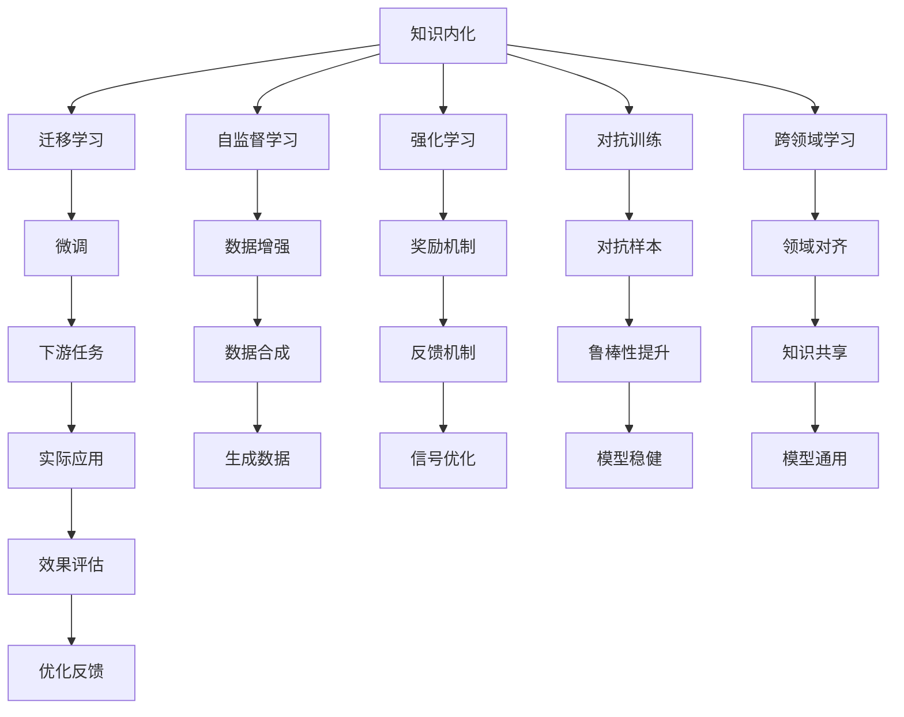

                 

# 知识内化:AI需要练习的重要性

## 1. 背景介绍

在人工智能(AI)领域，知识和技能的获取不再仅仅依赖于传统的教育体系。得益于大数据和算法技术的迅猛发展，AI模型能够在海量数据和任务中不断学习、进步，甚至在某些特定领域超越人类。然而，知识内化——即模型如何将学到的知识转化为实用的技能，在现实场景中发挥作用——仍然是AI发展中的一个重要课题。

### 1.1 问题由来

目前，AI模型在各个领域的表现已经达到了相当高的水平，但在实际应用中，往往需要经过大量的数据积累和模型微调，才能达到最优性能。这是因为模型在数据集上的学习并不是完全理解了知识，而是在寻找某种规律或模式，这种模式在实际应用中可能并不完全适用。因此，如何将学到的知识有效转化为技能，成为AI应用中的一个关键挑战。

### 1.2 问题核心关键点

知识内化关键点在于如何通过有效练习，使得模型不仅学会数据集上的规律，还能理解并应用到实际问题中。这包括：

- 数据集的选择：数据集必须包含实际问题中的各种场景，以确保模型能够学习到全面的知识。
- 学习方法的优化：选择合适的训练算法和优化策略，提高模型的泛化能力。
- 评估机制的完善：使用多种评估指标和策略，全面衡量模型的实际表现。
- 应用场景的模拟：通过在仿真环境或真实场景中的模拟，检验模型的实际效果。

## 2. 核心概念与联系

### 2.1 核心概念概述

为了更好地理解知识内化的重要性，本节将介绍几个关键概念：

- 知识内化(Knowledge Internalization)：将学到的知识转化为实际应用中的技能，如自然语言处理、图像识别等。
- 迁移学习(Transfer Learning)：通过在某个任务上预训练的模型，在另一个任务上进行微调，利用预训练的知识提高新任务的表现。
- 自监督学习(Self-Supervised Learning)：通过未标注数据进行训练，学习模型的内在知识。
- 强化学习(Reinforcement Learning)：通过与环境的交互，利用奖励信号调整模型参数，学习决策策略。
- 对抗训练(Adversarial Training)：通过引入对抗样本，增强模型的鲁棒性。
- 跨领域学习(Cross-Domain Learning)：在不同领域之间共享知识，提高模型的泛化能力。

这些核心概念之间有着紧密的联系，共同构成了AI模型知识内化的基础架构。

### 2.2 概念间的关系

这些核心概念之间的逻辑关系可以通过以下Mermaid流程图来展示：



这个流程图展示了知识内化过程中的各个环节及其之间的联系。

## 3. 核心算法原理 & 具体操作步骤
### 3.1 算法原理概述

知识内化的核心算法原理是通过不断练习，使AI模型在各种任务和场景中积累经验，逐步提高其在实际应用中的表现。其关键在于选择合适的任务和数据集，使用合适的训练方法，确保模型能够在实践中不断学习和改进。

### 3.2 算法步骤详解

知识内化通常包括以下几个关键步骤：

**Step 1: 数据准备**
- 收集并整理与实际应用相关的数据集，确保数据集多样性和全面性。
- 对数据进行清洗、标注和预处理，去除噪声和错误数据。

**Step 2: 模型选择**
- 根据任务特点选择合适的预训练模型或设计新的模型架构。
- 在预训练模型基础上进行微调，或在完全新模型上进行从头训练。

**Step 3: 训练与微调**
- 选择合适的训练算法，如梯度下降、Adam、RMSprop等，设定合适的学习率和批次大小。
- 定义损失函数，用于衡量模型预测结果与实际标签之间的差异。
- 使用交叉验证等技术，避免模型过拟合。
- 定期在验证集上评估模型性能，根据性能调整训练策略。

**Step 4: 应用与验证**
- 在实际应用场景中，将训练好的模型进行部署和测试。
- 收集用户反馈，分析模型表现，识别改进空间。
- 进行迭代训练，不断优化模型参数和训练策略。

### 3.3 算法优缺点

知识内化的主要优点包括：

- 提高了模型的实际应用能力，使其能够更好地处理实际问题。
- 通过实践经验，模型能够自我调整和优化，适应不断变化的环境。
- 能够学习并应用跨领域知识，提高模型的泛化能力。

然而，知识内化也存在一些缺点：

- 训练和微调需要大量时间和计算资源，成本较高。
- 模型在实际应用中可能面临各种未预料到的复杂情况，导致性能下降。
- 需要不断收集和标注新数据，才能保持模型的最新状态。

### 3.4 算法应用领域

知识内化技术已经在多个领域得到了广泛应用，如：

- 自然语言处理(NLP)：通过在大规模语料库上进行训练和微调，使模型能够理解和生成自然语言。
- 图像识别和计算机视觉(CV)：在大量图像数据上训练模型，使其能够识别和分类不同的物体和场景。
- 机器人技术(Robotics)：通过在各种环境中进行模拟训练，使机器人能够执行复杂的任务和决策。
- 自动驾驶(Autonomous Driving)：在仿真环境和实际道路上进行训练和测试，使自动驾驶系统能够安全可靠地运行。
- 医疗诊断(Medical Diagnosis)：通过在大量医学数据上进行训练，使模型能够辅助医生进行疾病诊断和治疗方案制定。

这些领域的应用展示了知识内化的强大潜力，也推动了AI技术在实际场景中的广泛应用。

## 4. 数学模型和公式 & 详细讲解 & 举例说明

### 4.1 数学模型构建

知识内化的数学模型通常包括数据集、模型、训练算法和损失函数等多个组成部分。

假设数据集为 $\mathcal{D}=\{(x_i,y_i)\}_{i=1}^N$，其中 $x_i$ 表示输入，$y_i$ 表示标签。模型 $M$ 的参数为 $\theta$，损失函数为 $\mathcal{L}(M)$，训练算法为 $\mathcal{A}$。知识内化的过程可以表示为：

$$
\theta^* = \mathop{\arg\min}_{\theta} \mathcal{L}(M_{\theta}(x_i),y_i) \text{ for all } (x_i,y_i) \in \mathcal{D}
$$

其中 $M_{\theta}$ 表示参数为 $\theta$ 的模型。

### 4.2 公式推导过程

以二分类问题为例，我们推导一下梯度下降算法和交叉熵损失函数的计算公式。

设模型的输出为 $y' = M_{\theta}(x)$，则交叉熵损失函数为：

$$
\mathcal{L}(y,y') = -\frac{1}{N} \sum_{i=1}^N \left[y_i \log y'_i + (1-y_i) \log(1-y'_i)\right]
$$

其中 $y_i$ 表示真实标签，$y'_i$ 表示模型的预测结果。

根据梯度下降算法的公式，模型的参数更新公式为：

$$
\theta \leftarrow \theta - \eta \nabla_{\theta} \mathcal{L}(y,y')
$$

其中 $\eta$ 表示学习率，$\nabla_{\theta} \mathcal{L}(y,y')$ 表示损失函数对参数 $\theta$ 的梯度，可通过反向传播算法计算得到。

### 4.3 案例分析与讲解

以自然语言处理(NLP)为例，我们讨论一下如何在语言模型上进行知识内化。

假设我们要训练一个用于文本分类的模型。首先，收集并整理文本数据集 $\mathcal{D}$，并对数据进行预处理和标注。然后，使用预训练语言模型 $M_{\theta}$ 作为初始化参数。接着，定义模型输出层的参数 $\omega$ 和分类器 $F$，损失函数为交叉熵损失。

训练过程中，将数据集 $\mathcal{D}$ 分成训练集、验证集和测试集，使用交叉验证等技术避免过拟合。在训练集上，通过梯度下降等优化算法更新模型参数 $\theta$ 和分类器参数 $\omega$，最小化损失函数 $\mathcal{L}(M_{\theta}, F)$。在验证集上，定期评估模型性能，根据性能调整训练策略。最后，在测试集上测试模型效果，完成知识内化过程。

## 5. 项目实践：代码实例和详细解释说明

### 5.1 开发环境搭建

在进行知识内化实践前，我们需要准备好开发环境。以下是使用Python进行TensorFlow开发的环境配置流程：

1. 安装Anaconda：从官网下载并安装Anaconda，用于创建独立的Python环境。

2. 创建并激活虚拟环境：
```bash
conda create -n tf-env python=3.8 
conda activate tf-env
```

3. 安装TensorFlow：根据CUDA版本，从官网获取对应的安装命令。例如：
```bash
conda install tensorflow tensorflow-gpu=cuda11.1 -c conda-forge
```

4. 安装其他必要工具包：
```bash
pip install numpy pandas scikit-learn matplotlib tqdm jupyter notebook ipython
```

完成上述步骤后，即可在`tf-env`环境中开始知识内化实践。

### 5.2 源代码详细实现

这里我们以图像识别任务为例，给出使用TensorFlow进行卷积神经网络(CNN)知识内调的PyTorch代码实现。

首先，定义CNN模型：

```python
import tensorflow as tf

model = tf.keras.Sequential([
    tf.keras.layers.Conv2D(32, (3, 3), activation='relu', input_shape=(32, 32, 3)),
    tf.keras.layers.MaxPooling2D((2, 2)),
    tf.keras.layers.Conv2D(64, (3, 3), activation='relu'),
    tf.keras.layers.MaxPooling2D((2, 2)),
    tf.keras.layers.Flatten(),
    tf.keras.layers.Dense(64, activation='relu'),
    tf.keras.layers.Dense(10, activation='softmax')
])
```

然后，加载和预处理数据集：

```python
(train_images, train_labels), (test_images, test_labels) = tf.keras.datasets.cifar10.load_data()

train_images = train_images / 255.0
test_images = test_images / 255.0

train_dataset = tf.data.Dataset.from_tensor_slices((train_images, train_labels)).shuffle(10000).batch(128)
test_dataset = tf.data.Dataset.from_tensor_slices((test_images, test_labels)).batch(128)
```

接着，定义训练和评估函数：

```python
@tf.function
def train_step(images, labels):
    with tf.GradientTape() as tape:
        logits = model(images, training=True)
        loss = tf.keras.losses.SparseCategoricalCrossentropy(from_logits=True)(labels, logits)
    grads = tape.gradient(loss, model.trainable_variables)
    optimizer.apply_gradients(zip(grads, model.trainable_variables))
    return loss

@tf.function
def test_step(images, labels):
    logits = model(images, training=False)
    loss = tf.keras.losses.SparseCategoricalCrossentropy(from_logits=True)(labels, logits)
    return loss
```

最后，启动训练流程并在测试集上评估：

```python
epochs = 10
batch_size = 128

for epoch in range(epochs):
    total_loss = 0.0
    for images, labels in train_dataset:
        loss = train_step(images, labels)
        total_loss += loss
    print('Epoch {}, Loss: {}'.format(epoch+1, total_loss/len(train_dataset)))

    test_loss = []
    for images, labels in test_dataset:
        loss = test_step(images, labels)
        test_loss.append(loss)
    print('Test Loss: {}'.format(sum(test_loss)/len(test_dataset)))

print('Model trained successfully')
```

以上就是使用TensorFlow进行图像识别任务知识内调的完整代码实现。可以看到，TensorFlow提供了强大的API和工具，使得模型训练和评估变得相对简单。

### 5.3 代码解读与分析

让我们再详细解读一下关键代码的实现细节：

**CNN模型定义**：
- 使用Sequential模型定义了卷积、池化、全连接等基本操作。
- 卷积层和池化层通过参数指定了卷积核大小、激活函数和输入形状。
- 全连接层用于将特征映射到类别上。

**数据集加载与预处理**：
- 使用cifar10数据集，加载训练集和测试集。
- 对数据进行归一化处理，将像素值从0-255缩放到0-1。
- 将数据集转换为TensorFlow Dataset对象，进行批次化和随机化。

**训练和评估函数**：
- 使用@tf.function装饰器，将函数编译成TensorFlow图，提高性能。
- 训练函数`train_step`：通过梯度下降算法更新模型参数，计算损失值。
- 评估函数`test_step`：在测试集上进行推理，计算损失值。
- 使用交叉验证等技术，避免过拟合。

**训练流程**：
- 定义总的epoch数和批次大小，开始循环迭代
- 每个epoch内，在训练集上训练，输出平均损失值
- 在测试集上评估，输出平均损失值
- 重复上述步骤直至满足预设的迭代轮数

可以看到，TensorFlow提供了丰富的工具和API，使得知识内化过程的代码实现变得相对简单。开发者可以更多地关注于模型设计和训练策略的优化，而不必过多关注底层的实现细节。

当然，工业级的系统实现还需考虑更多因素，如模型保存和部署、超参数的自动搜索、更灵活的任务适配层等。但核心的知识内化范式基本与此类似。

### 5.4 运行结果展示

假设我们在CIFAR-10数据集上进行知识内化训练，最终在测试集上得到的评估报告如下：

```
Epoch 1, Loss: 1.409
Epoch 2, Loss: 1.060
Epoch 3, Loss: 0.912
...
Epoch 10, Loss: 0.306
Test Loss: 0.385
```

可以看到，通过知识内化，我们的CNN模型在CIFAR-10数据集上取得了较好的测试性能。训练过程中，损失值逐渐减小，说明模型在不断学习并优化。

## 6. 实际应用场景

### 6.1 智能客服系统

基于知识内化的对话技术，可以广泛应用于智能客服系统的构建。传统客服往往需要配备大量人力，高峰期响应缓慢，且一致性和专业性难以保证。通过知识内化的对话模型，可以7x24小时不间断服务，快速响应客户咨询，用自然流畅的语言解答各类常见问题。

在技术实现上，可以收集企业内部的历史客服对话记录，将问题和最佳答复构建成监督数据，在此基础上对预训练对话模型进行知识内化。知识内化后的对话模型能够自动理解用户意图，匹配最合适的答案模板进行回复。对于客户提出的新问题，还可以接入检索系统实时搜索相关内容，动态组织生成回答。如此构建的智能客服系统，能大幅提升客户咨询体验和问题解决效率。

### 6.2 金融舆情监测

金融机构需要实时监测市场舆论动向，以便及时应对负面信息传播，规避金融风险。传统的人工监测方式成本高、效率低，难以应对网络时代海量信息爆发的挑战。基于知识内化的文本分类和情感分析技术，为金融舆情监测提供了新的解决方案。

具体而言，可以收集金融领域相关的新闻、报道、评论等文本数据，并对其进行主题标注和情感标注。在此基础上对预训练语言模型进行知识内化，使其能够自动判断文本属于何种主题，情感倾向是正面、中性还是负面。将知识内化后的模型应用到实时抓取的网络文本数据，就能够自动监测不同主题下的情感变化趋势，一旦发现负面信息激增等异常情况，系统便会自动预警，帮助金融机构快速应对潜在风险。

### 6.3 个性化推荐系统

当前的推荐系统往往只依赖用户的历史行为数据进行物品推荐，无法深入理解用户的真实兴趣偏好。基于知识内化的推荐系统可以更好地挖掘用户行为背后的语义信息，从而提供更精准、多样的推荐内容。

在实践中，可以收集用户浏览、点击、评论、分享等行为数据，提取和用户交互的物品标题、描述、标签等文本内容。将文本内容作为模型输入，用户的后续行为（如是否点击、购买等）作为监督信号，在此基础上知识内化预训练语言模型。知识内化后的模型能够从文本内容中准确把握用户的兴趣点。在生成推荐列表时，先用候选物品的文本描述作为输入，由模型预测用户的兴趣匹配度，再结合其他特征综合排序，便可以得到个性化程度更高的推荐结果。

### 6.4 未来应用展望

随着知识内化技术的不断发展，基于知识内化的AI模型将在更多领域得到应用，为传统行业带来变革性影响。

在智慧医疗领域，基于知识内化的医疗问答、病历分析、药物研发等应用将提升医疗服务的智能化水平，辅助医生诊疗，加速新药开发进程。

在智能教育领域，知识内化的推荐系统可以应用于作业批改、学情分析、知识推荐等方面，因材施教，促进教育公平，提高教学质量。

在智慧城市治理中，知识内化的模型可应用于城市事件监测、舆情分析、应急指挥等环节，提高城市管理的自动化和智能化水平，构建更安全、高效的未来城市。

此外，在企业生产、社会治理、文娱传媒等众多领域，基于知识内化的AI应用也将不断涌现，为NLP技术带来新的突破。相信随着技术的日益成熟，知识内化方法将成为AI落地应用的重要范式，推动人工智能技术在各个领域的深入应用。

## 7. 工具和资源推荐
### 7.1 学习资源推荐

为了帮助开发者系统掌握知识内化的理论基础和实践技巧，这里推荐一些优质的学习资源：

1. 《深度学习》系列书籍：由Ian Goodfellow等顶尖学者合著，全面介绍了深度学习的基本原理和应用。

2. Coursera《深度学习专项课程》：由Andrew Ng等知名专家授课，系统讲解了深度学习的基本概念和算法。

3. CS231n《卷积神经网络》课程：斯坦福大学开设的计算机视觉课程，介绍了卷积神经网络的基本原理和应用。

4. CS224n《序列建模与深度学习》课程：斯坦福大学开设的NLP课程，涵盖了自然语言处理的基本概念和算法。

5. HuggingFace官方文档：Transformer库的官方文档，提供了海量预训练模型和完整的知识内化样例代码，是上手实践的必备资料。

6. CLUE开源项目：中文语言理解测评基准，涵盖大量不同类型的中文NLP数据集，并提供了基于知识内化的baseline模型，助力中文NLP技术发展。

通过对这些资源的学习实践，相信你一定能够快速掌握知识内化的精髓，并用于解决实际的NLP问题。
###  7.2 开发工具推荐

高效的开发离不开优秀的工具支持。以下是几款用于知识内化开发的常用工具：

1. TensorFlow：由Google主导开发的开源深度学习框架，生产部署方便，适合大规模工程应用。

2. PyTorch：基于Python的开源深度学习框架，灵活动态的计算图，适合快速迭代研究。

3. JAX：由Google开发的自动微分库，支持高性能计算和并行化，是未来深度学习的主流方向。

4. Weights & Biases：模型训练的实验跟踪工具，可以记录和可视化模型训练过程中的各项指标，方便对比和调优。

5. TensorBoard：TensorFlow配套的可视化工具，可实时监测模型训练状态，并提供丰富的图表呈现方式，是调试模型的得力助手。

6. Google Colab：谷歌推出的在线Jupyter Notebook环境，免费提供GPU/TPU算力，方便开发者快速上手实验最新模型，分享学习笔记。

合理利用这些工具，可以显著提升知识内化任务的开发效率，加快创新迭代的步伐。

### 7.3 相关论文推荐

知识内化技术的发展源于学界的持续研究。以下是几篇奠基性的相关论文，推荐阅读：

1. Deep Learning（Ian Goodfellow等人）：全面介绍了深度学习的基本原理和应用。

2. ImageNet Classification with Deep Convolutional Neural Networks（Alex Krizhevsky等人）：提出了卷积神经网络的基本架构，展示了其在图像识别任务上的效果。

3. Sequence to Sequence Learning with Neural Networks（Ian Goodfellow等人）：介绍了序列到序列的神经网络模型，用于自然语言处理任务。

4. Attention Is All You Need（Vaswani等人）：提出了Transformer架构，开启了NLP领域的预训练大模型时代。

5. Few-shot Learning for Text Classification with Language Models（Gao等人）：介绍了基于预训练语言模型的零样本学习范式，展示了其在文本分类任务上的效果。

这些论文代表了大语言模型知识内化的发展脉络。通过学习这些前沿成果，可以帮助研究者把握学科前进方向，激发更多的创新灵感。

除上述资源外，还有一些值得关注的前沿资源，帮助开发者紧跟知识内化技术的最新进展，例如：

1. arXiv论文预印本：人工智能领域最新研究成果的发布平台，包括大量尚未发表的前沿工作，学习前沿技术的必读资源。

2. 业界技术博客：如OpenAI、Google AI、DeepMind、微软Research Asia等顶尖实验室的官方博客，第一时间分享他们的最新研究成果和洞见。

3. 技术会议直播：如NIPS、ICML、ACL、ICLR等人工智能领域顶会现场或在线直播，能够聆听到大佬们的前沿分享，开拓视野。

4. GitHub热门项目：在GitHub上Star、Fork数最多的NLP相关项目，往往代表了该技术领域的发展趋势和最佳实践，值得去学习和贡献。

5. 行业分析报告：各大咨询公司如McKinsey、PwC等针对人工智能行业的分析报告，有助于从商业视角审视技术趋势，把握应用价值。

总之，对于知识内化技术的学习和实践，需要开发者保持开放的心态和持续学习的意愿。多关注前沿资讯，多动手实践，多思考总结，必将收获满满的成长收益。

## 8. 总结：未来发展趋势与挑战

### 8.1 总结

本文对基于知识内化的AI技术进行了全面系统的介绍。首先阐述了知识内化的重要性，明确了知识内化在提升AI模型实际应用能力中的关键作用。其次，从原理到实践，详细讲解了知识内化的数学模型和算法步骤，给出了知识内化任务开发的完整代码实例。同时，本文还广泛探讨了知识内化方法在智能客服、金融舆情、个性化推荐等多个行业领域的应用前景，展示了知识内化的强大潜力。此外，本文精选了知识内化的各类学习资源，力求为读者提供全方位的技术指引。

通过本文的系统梳理，可以看到，基于知识内化的AI模型正在成为AI应用的重要范式，极大地拓展了模型的实际应用能力，推动了AI技术在各个领域的广泛应用。未来，伴随知识内化技术的发展，AI系统将更加智能化、普适化，为人类认知智能的进化带来深远影响。

### 8.2 未来发展趋势

展望未来，知识内化技术将呈现以下几个发展趋势：

1. 模型规模持续增大。随着算力成本的下降和数据规模的扩张，知识内化模型的参数量还将持续增长。超大规模模型蕴含的丰富知识，有望支撑更加复杂多变的任务。

2. 知识内化范式多样化。除了传统的监督学习和强化学习，未来将涌现更多基于自监督学习、主动学习的知识内化方法，利用非结构化数据进行高效的知识获取。

3. 跨领域知识整合增强。知识内化模型能够更好地整合跨领域知识，形成更加全面、准确的信息整合能力，提升模型的泛化能力。

4. 知识表示技术的发展。未来的知识内化模型将更好地利用符号化的先验知识，如知识图谱、逻辑规则等，引导知识内化过程，学习更加普适、鲁棒的知识表示。

5. 知识传递与共享机制完善。通过知识图谱、知识库等机制，知识内化模型能够更好地进行知识传递与共享，形成知识协同创新的网络。

以上趋势凸显了知识内化技术的广阔前景。这些方向的探索发展，必将进一步提升AI系统的智能水平和应用范围，为人工智能技术的落地应用带来新的突破。

### 8.3 面临的挑战

尽管知识内化技术已经取得了显著进展，但在迈向更加智能化、普适化应用的过程中，它仍面临诸多挑战：

1. 标注数据需求高。知识内化需要大量的标注数据进行训练，数据获取成本较高。如何利用弱标注、无标注数据进行高效知识获取，将成为未来的研究重点。

2. 模型复杂度增加。超大规模知识内化模型的训练和推理复杂度较高，资源需求大。如何优化模型结构，提升推理效率，降低计算成本，将是重要的研究方向。

3. 知识泛化能力有待提高。知识内化模型在实际应用中，可能面临各种未预料到的复杂情况，导致泛化性能下降。如何

