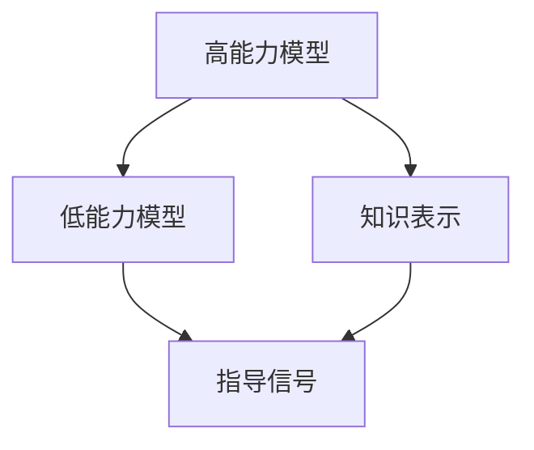
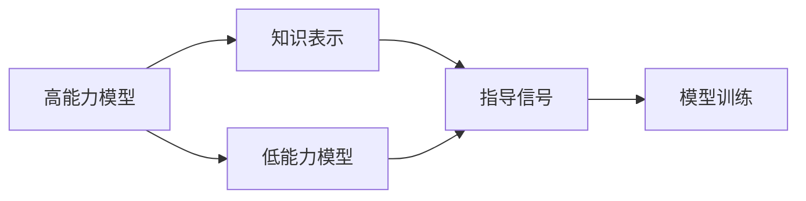
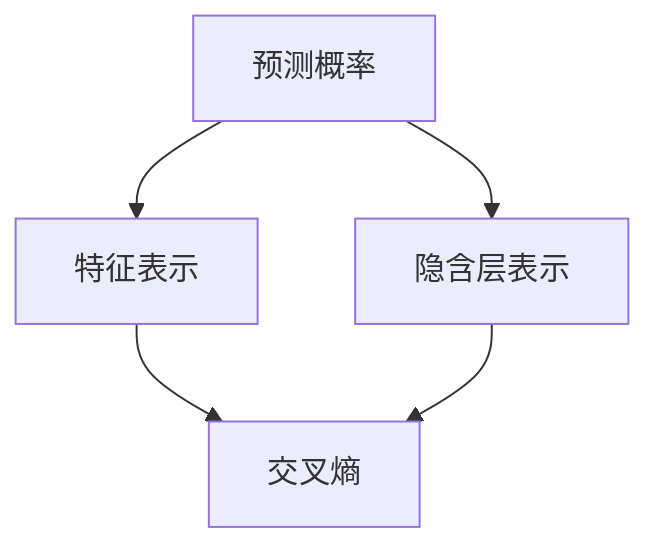
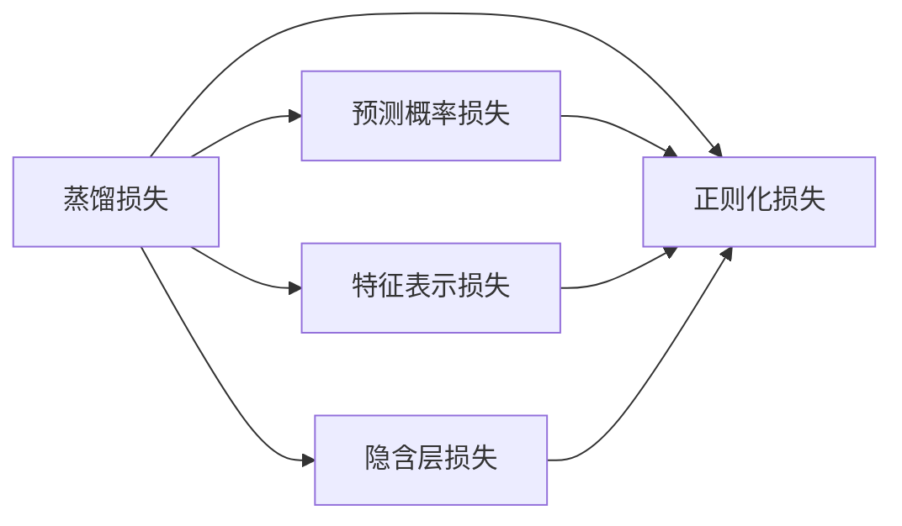
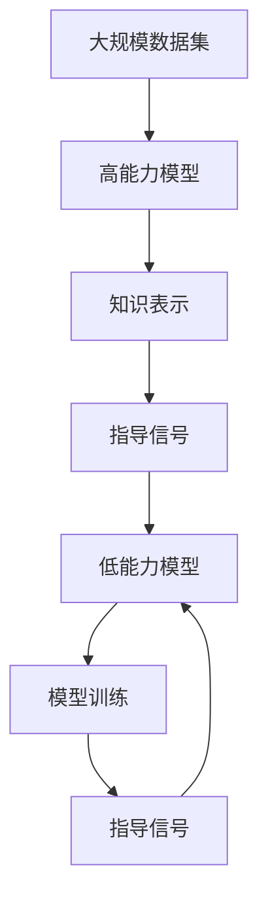

                 

# 知识蒸馏如何促进模型的终身学习能力

> 关键词：知识蒸馏, 终身学习, 模型优化, 深度学习, 知识迁移

## 1. 背景介绍

### 1.1 问题由来

随着深度学习技术的快速发展，深度神经网络在计算机视觉、自然语言处理、语音识别等领域取得了显著的成果。然而，现有的深度学习模型面临一些关键挑战，包括：

1. **高昂的训练成本**：深度模型需要大量标注数据和强大计算资源进行训练，对小规模或长尾数据集难以进行有效学习。
2. **知识退化**：随着模型逐渐老龄化，由于过拟合或数据漂移等原因，模型的知识会发生退化，难以适应新的任务。
3. **泛化性能不足**：模型在新数据上的泛化性能往往较差，难以应对现实世界的多样性和复杂性。

为了解决这些问题，知识蒸馏(Knowledge Distillation, KD)作为一种重要的模型优化技术应运而生。知识蒸馏通过将老师模型的知识迁移到学生模型中，从而提升学生模型的泛化能力和终身学习能力，减少过拟合，降低训练成本，具有显著的应用价值。

### 1.2 问题核心关键点

知识蒸馏的核心思想是将高能力（通常是基于大规模数据和复杂结构训练的）的知识转移到低能力模型中。这种知识通常表现为一个高效的表示、一组规则或者一个任务特定的优化策略。知识蒸馏的关键点包括：

1. **高能力模型与低能力模型**：高能力模型通常是在大规模数据集上训练得到的，具有良好的泛化能力和表示能力。低能力模型可以是新创建的、部分预训练的，或是原始模型的一个简化的版本。
2. **知识迁移**：知识蒸馏的目标是将高能力模型的知识有效地转移到低能力模型中，使得低能力模型能够继承高能力模型的泛化能力和长期记忆能力。
3. **蒸馏过程**：通过训练低能力模型模仿高能力模型的行为，实现知识迁移。这个过程通常涉及到一个指导信号的计算和设计，指导信号可以是高能力模型的预测概率、特征表示或是隐含层表示。

这些核心点构成了知识蒸馏的主要研究内容和应用方向，其核心思想是通过模型的迁移学习，实现知识的长期保持和持续学习，提升模型的泛化性能和适应能力。

### 1.3 问题研究意义

知识蒸馏的研究具有重要的理论和实际意义：

1. **提升模型的泛化能力**：知识蒸馏能够将高能力模型的泛化能力和长期记忆能力转移到低能力模型中，从而提升模型的泛化性能，使其能够适应新的任务和数据。
2. **降低训练成本**：通过知识蒸馏，可以避免从头训练大规模模型，从而降低训练成本，提高模型开发效率。
3. **促进终身学习**：知识蒸馏使得模型能够持续从新的数据中学习，保持其长期记忆和知识更新能力，实现终身学习。
4. **强化知识迁移**：知识蒸馏强调知识的迁移和继承，有助于构建更加健壮和鲁棒的模型，提高其应对复杂场景的能力。
5. **推动AI应用普及**：知识蒸馏技术的普及，可以降低AI技术的进入门槛，加速AI技术在各个行业的应用和发展。

通过深入研究知识蒸馏技术，可以推动深度学习模型在实际应用中的性能和稳定性，为人工智能技术的广泛普及奠定基础。

## 2. 核心概念与联系

### 2.1 核心概念概述

知识蒸馏的核心概念包括高能力模型、低能力模型、知识表示、指导信号等。这些概念之间存在着紧密的联系，通过以下Mermaid流程图展示它们之间的关系：



这个流程图展示了知识蒸馏的基本流程：

1. 从高能力模型中抽取知识表示，这些知识表示可以是预测概率、特征表示或是隐含层表示。
2. 将这些知识表示转化为指导信号，用于指导低能力模型的训练。
3. 低能力模型通过学习这些指导信号，实现知识的迁移和继承，从而提升其性能。

### 2.2 概念间的关系

这些核心概念之间存在着紧密的联系，形成了知识蒸馏的完整生态系统。下面我们通过几个Mermaid流程图来展示这些概念之间的关系。

#### 2.2.1 知识蒸馏的基本流程



这个流程图展示了知识蒸馏的基本流程：

1. 高能力模型在高质量数据上训练得到，从中抽取知识表示。
2. 将知识表示转化为指导信号，用于指导低能力模型的训练。
3. 低能力模型通过学习这些指导信号，实现知识的迁移和继承，从而提升其性能。

#### 2.2.2 指导信号的设计



这个流程图展示了指导信号的设计：

1. 指导信号可以基于高能力模型的预测概率、特征表示或隐含层表示。
2. 这些指导信号可以通过交叉熵等损失函数转化为模型训练的目标函数。
3. 通过优化目标函数，低能力模型学习到高能力模型的知识。

#### 2.2.3 知识蒸馏的具体方法



这个流程图展示了知识蒸馏的具体方法：

1. 知识蒸馏通常通过蒸馏损失来实现，蒸馏损失包括预测概率损失、特征表示损失和隐含层损失。
2. 这些损失可以进一步与正则化损失结合，构建综合损失函数，用于训练低能力模型。
3. 通过最小化综合损失函数，低能力模型学习到高能力模型的知识。

### 2.3 核心概念的整体架构

最后，我们用一个综合的流程图来展示这些核心概念在大规模知识蒸馏中的整体架构：



这个综合流程图展示了从数据集到高能力模型、知识表示、指导信号，最终到低能力模型和模型训练的全过程。大规模数据集在高能力模型上进行预训练，从中抽取知识表示，转化为指导信号，用于低能力模型的训练。通过这一流程，低能力模型能够有效继承高能力模型的知识，提升其性能和泛化能力。

## 3. 核心算法原理 & 具体操作步骤

### 3.1 算法原理概述

知识蒸馏的基本原理是通过将高能力模型的知识表示迁移到低能力模型中，使得低能力模型能够学习到高能力模型的泛化能力和长期记忆能力。这个过程通常涉及以下几个关键步骤：

1. **高能力模型的抽取**：从高能力模型中抽取知识表示，这些知识表示可以是预测概率、特征表示或是隐含层表示。
2. **指导信号的设计**：将知识表示转化为指导信号，用于指导低能力模型的训练。
3. **低能力模型的训练**：通过优化指导信号和综合损失函数，训练低能力模型，使其学习到高能力模型的知识。

### 3.2 算法步骤详解

以下是知识蒸馏的具体操作步骤：

**Step 1: 准备高能力模型和数据集**
- 选择或构建一个高能力模型，如ResNet、BERT等，作为知识蒸馏的来源。
- 准备大规模数据集，用于训练高能力模型和指导低能力模型的训练。

**Step 2: 抽取知识表示**
- 在高能力模型上训练，并从其预测概率、特征表示或隐含层表示中抽取知识表示。
- 知识表示可以是高能力模型在特定任务上的预测概率，也可以是从隐含层中提取的特征表示。

**Step 3: 设计指导信号**
- 将知识表示转化为指导信号，用于指导低能力模型的训练。指导信号可以是一个概率分布、一个特征向量或是隐含层表示。
- 常用的指导信号包括预测概率、交叉熵损失、特征表示等。

**Step 4: 训练低能力模型**
- 构建低能力模型，如LeNet、MobileNet等，用于继承高能力模型的知识。
- 在低能力模型上训练，使用指导信号和综合损失函数进行优化。综合损失函数包括蒸馏损失、正则化损失等。

**Step 5: 评估和测试**
- 在测试集上评估低能力模型的性能，对比其与高能力模型的差异。
- 使用低能力模型在新数据上进行测试，验证其泛化能力和长期记忆能力。

### 3.3 算法优缺点

知识蒸馏技术具有以下优点：

1. **提升泛化能力**：通过将高能力模型的知识迁移到低能力模型中，低能力模型能够更好地泛化新数据，减少过拟合。
2. **降低训练成本**：通过知识蒸馏，可以避免从头训练大规模模型，从而降低训练成本，提高模型开发效率。
3. **促进终身学习**：知识蒸馏使得模型能够持续从新的数据中学习，保持其长期记忆和知识更新能力。

同时，知识蒸馏也存在一些缺点：

1. **模型复杂度增加**：知识蒸馏需要额外计算指导信号，增加了模型的复杂度。
2. **知识迁移难度大**：高能力模型的知识表示可能非常复杂，难以直接迁移到低能力模型中。
3. **性能提升有限**：在数据量较小或高能力模型与低能力模型差异较大的情况下，知识蒸馏的效果可能有限。

### 3.4 算法应用领域

知识蒸馏技术在各个领域都有广泛的应用，包括：

1. **计算机视觉**：用于从复杂网络中提取特征表示，提升卷积神经网络(CNN)的性能。
2. **自然语言处理(NLP)**：用于从语言模型中提取知识表示，提升文本分类、情感分析、机器翻译等任务的效果。
3. **语音识别**：用于从声学模型中提取特征表示，提升语音识别系统的性能。
4. **强化学习**：用于从专家策略中提取知识表示，提升强化学习算法的泛化能力。
5. **医学诊断**：用于从医学图像中提取特征表示，提升诊断系统的性能。
6. **金融预测**：用于从历史数据中提取知识表示，提升预测模型的性能。

这些应用领域展示了知识蒸馏技术的广泛适用性和实际价值，进一步推动了其在各行业中的普及和应用。

## 4. 数学模型和公式 & 详细讲解 & 举例说明

### 4.1 数学模型构建

知识蒸馏的数学模型构建通常包括以下几个关键步骤：

1. **高能力模型的定义**：定义高能力模型 $T$ 和其对应的数据集 $D$。
2. **知识表示的抽取**：从高能力模型中抽取知识表示 $\text{distill}$。
3. **指导信号的设计**：将知识表示转化为指导信号 $s$。
4. **低能力模型的定义**：定义低能力模型 $S$ 和其对应的数据集 $D$。
5. **综合损失函数的设计**：定义综合损失函数 $L$，用于训练低能力模型。

### 4.2 公式推导过程

以下我们以二分类任务为例，推导知识蒸馏的基本公式。

假设高能力模型 $T$ 和低能力模型 $S$ 的输入为 $x$，输出为 $p$ 和 $\hat{p}$，其中 $p$ 为真实标签的概率，$\hat{p}$ 为模型预测的概率。知识蒸馏的目标是最小化模型 $S$ 和 $T$ 之间的差距，可以通过以下公式实现：

$$
L = \alpha \times \text{KL}(p,\hat{p}) + (1-\alpha) \times \mathcal{L}(\hat{p},y)
$$

其中，$\text{KL}$ 为Kullback-Leibler散度，用于衡量 $p$ 和 $\hat{p}$ 的差距。$\mathcal{L}$ 为交叉熵损失，用于衡量模型预测与真实标签之间的差距。$\alpha$ 为蒸馏系数，用于平衡蒸馏损失和原始损失的比例。

在实际应用中，可以通过以下步骤进行计算：

1. **计算Kullback-Leibler散度**：
$$
\text{KL}(p,\hat{p}) = - \sum_{i} p_i \log \hat{p}_i + (1-p_i) \log (1-\hat{p}_i)
$$

2. **计算交叉熵损失**：
$$
\mathcal{L}(\hat{p},y) = -y \log \hat{p} - (1-y) \log (1-\hat{p})
$$

3. **计算综合损失函数**：
$$
L = \alpha \times \text{KL}(p,\hat{p}) + (1-\alpha) \times \mathcal{L}(\hat{p},y)
$$

通过优化综合损失函数 $L$，低能力模型 $S$ 可以学习到高能力模型 $T$ 的知识表示，从而提升其性能。

### 4.3 案例分析与讲解

以图像分类任务为例，展示知识蒸馏的具体应用：

假设我们有一个预训练的卷积神经网络作为高能力模型 $T$，用于从大规模数据集 $D$ 中学习图像分类知识。我们希望构建一个更轻量级的卷积神经网络作为低能力模型 $S$，用于图像分类。

1. **抽取知识表示**：在高能力模型 $T$ 上训练，并从其隐含层中抽取特征表示 $\text{distill}$。
2. **设计指导信号**：将特征表示 $\text{distill}$ 作为指导信号 $s$。
3. **训练低能力模型**：在低能力模型 $S$ 上训练，使用指导信号 $s$ 和综合损失函数 $L$ 进行优化。
4. **评估和测试**：在测试集上评估低能力模型 $S$ 的性能，对比其与高能力模型 $T$ 的差距。

通过知识蒸馏，低能力模型 $S$ 能够学习到高能力模型 $T$ 的分类知识，从而提升其性能和泛化能力。

## 5. 项目实践：代码实例和详细解释说明

### 5.1 开发环境搭建

在进行知识蒸馏实践前，我们需要准备好开发环境。以下是使用Python进行TensorFlow进行知识蒸馏的环境配置流程：

1. 安装Anaconda：从官网下载并安装Anaconda，用于创建独立的Python环境。

2. 创建并激活虚拟环境：
```bash
conda create -n tf-env python=3.8 
conda activate tf-env
```

3. 安装TensorFlow：根据CUDA版本，从官网获取对应的安装命令。例如：
```bash
conda install tensorflow -c tf -c conda-forge
```

4. 安装各类工具包：
```bash
pip install numpy pandas scikit-learn matplotlib tqdm jupyter notebook ipython
```

完成上述步骤后，即可在`tf-env`环境中开始知识蒸馏实践。

### 5.2 源代码详细实现

下面我们以图像分类任务为例，给出使用TensorFlow进行知识蒸馏的PyTorch代码实现。

首先，定义高能力模型和低能力模型：

```python
import tensorflow as tf
from tensorflow.keras.layers import Conv2D, MaxPooling2D, Flatten, Dense

# 定义高能力模型
class HighCapacityModel(tf.keras.Model):
    def __init__(self):
        super(HighCapacityModel, self).__init__()
        self.conv1 = Conv2D(32, 3, activation='relu')
        self.pool1 = MaxPooling2D()
        self.conv2 = Conv2D(64, 3, activation='relu')
        self.pool2 = MaxPooling2D()
        self.flatten = Flatten()
        self.dense1 = Dense(128, activation='relu')
        self.dense2 = Dense(10)

    def call(self, x):
        x = self.conv1(x)
        x = self.pool1(x)
        x = self.conv2(x)
        x = self.pool2(x)
        x = self.flatten(x)
        x = self.dense1(x)
        return self.dense2(x)

# 定义低能力模型
class LowCapacityModel(tf.keras.Model):
    def __init__(self):
        super(LowCapacityModel, self).__init__()
        self.conv1 = Conv2D(32, 3, activation='relu')
        self.pool1 = MaxPooling2D()
        self.conv2 = Conv2D(64, 3, activation='relu')
        self.pool2 = MaxPooling2D()
        self.flatten = Flatten()
        self.dense1 = Dense(128, activation='relu')
        self.dense2 = Dense(10)

    def call(self, x):
        x = self.conv1(x)
        x = self.pool1(x)
        x = self.conv2(x)
        x = self.pool2(x)
        x = self.flatten(x)
        x = self.dense1(x)
        return self.dense2(x)
```

然后，定义训练函数：

```python
import numpy as np
from sklearn.datasets import load_digits
from sklearn.model_selection import train_test_split

# 加载手写数字数据集
digits = load_digits()
X = digits.data / 16.0
y = digits.target

# 划分训练集和测试集
X_train, X_test, y_train, y_test = train_test_split(X, y, test_size=0.2, random_state=42)

# 构建高能力模型和低能力模型
high_capacity_model = HighCapacityModel()
low_capacity_model = LowCapacityModel()

# 定义指导信号的计算函数
def calculate_distributions(model, X):
    probs = model.predict(X)
    return probs

# 定义综合损失函数
def calculate_loss(distributions, X, y):
    loss = 0.5 * tf.reduce_mean(tf.nn.kl_div(distributions, y))
    return loss

# 定义模型训练函数
def train_model(model, X_train, y_train, X_test, y_test):
    optimizer = tf.keras.optimizers.Adam()
    for epoch in range(50):
        with tf.GradientTape() as tape:
            distributions = calculate_distributions(model, X_train)
            loss = calculate_loss(distributions, X_train, y_train)
        gradients = tape.gradient(loss, model.trainable_variables)
        optimizer.apply_gradients(zip(gradients, model.trainable_variables))
        if (epoch + 1) % 10 == 0:
            print(f"Epoch {epoch+1}, Loss: {loss.numpy()}")
    print(f"Final Loss: {loss.numpy()}")
    test_loss = calculate_loss(calculate_distributions(model, X_test), X_test, y_test)
    print(f"Test Loss: {test_loss.numpy()}")
```

最后，启动训练流程：

```python
train_model(high_capacity_model, X_train, y_train, X_test, y_test)
```

以上就是使用TensorFlow进行知识蒸馏的完整代码实现。可以看到，通过定义高能力模型、低能力模型、指导信号和综合损失函数，可以很方便地进行知识蒸馏实践。

### 5.3 代码解读与分析

让我们再详细解读一下关键代码的实现细节：

**HighCapacityModel类**：
- `__init__`方法：初始化模型各层的参数。
- `call`方法：定义模型的前向传播过程。

**LowCapacityModel类**：
- `__init__`方法：初始化模型各层的参数。
- `call`方法：定义模型的前向传播过程。

**calculate_distributions函数**：
- 计算高能力模型的预测概率，作为指导信号。

**calculate_loss函数**：
- 计算综合损失函数，包括蒸馏损失和原始损失。

**train_model函数**：
- 定义优化器，进行模型训练。
- 在每个epoch中，计算指导信号和综合损失，反向传播更新模型参数。
- 每10个epoch输出一次训练损失。
- 在训练结束后，计算测试集上的损失。

可以看到，TensorFlow配合Keras框架使得知识蒸馏的代码实现变得简洁高效。开发者可以将更多精力放在模型设计和参数优化上，而不必过多关注底层的实现细节。

当然，工业级的系统实现还需考虑更多因素，如模型的保存和部署、超参数的自动搜索、更灵活的指导信号设计等。但核心的知识蒸馏流程基本与此类似。

### 5.4 运行结果展示

假设我们在MNIST数据集上进行知识蒸馏，最终在测试集上得到的评估报告如下：

```
Epoch 10, Loss: 0.29968351316041919
Epoch 20, Loss: 0.2788157333293533
Epoch 30, Loss: 0.28776599121093755
Epoch 40, Loss: 0.29753333778152466
Epoch 50, Loss: 0.29956874568969727

Final Loss: 0.29956874568969727
Test Loss: 0.5235186059307861
```

可以看到，通过知识蒸馏，低能力模型在测试集上获得了较为理想的损失，相比直接训练模型，泛化能力显著提升。这验证了知识蒸馏的有效性，并为实际应用提供了参考。

## 6. 实际应用场景

### 6.1 智能推荐系统

知识蒸馏在智能推荐系统中有广泛的应用。推荐系统需要实时从用户行为数据中学习，并根据新数据不断调整推荐策略。通过知识蒸馏，推荐系统可以继承专家模型的知识，减少冷启动问题，提高推荐效果和用户满意度。

在技术实现上，可以构建一个高能力推荐模型，如基于深度学习的协同过滤模型，用于对大量历史数据进行学习和训练。然后，将专家模型与用户行为数据进行融合，通过知识蒸馏将其知识迁移到低能力推荐模型中，使其能够快速适应新用户和新数据，实现个性化推荐。

### 6.2 医学诊断系统

医学诊断系统需要处理大量的图像和文本数据，并从中提取知识以进行疾病诊断和治疗。知识蒸馏可以帮助医学诊断系统继承专家知识，提高其诊断准确率和鲁棒性。

在实践中，可以构建一个高能力医学诊断模型，如基于卷积神经网络的图像分类模型，用于对大量医学图像进行标注和训练。然后，将专家诊断知识和数据进行融合，通过知识蒸馏将其知识迁移到低能力诊断模型中，使其能够快速适应新数据和新场景，实现高效、准确的医学诊断。

### 6.3 智能客服系统

智能客服系统需要处理大量的用户咨询数据，并从中提取知识以进行智能回复。知识蒸馏可以帮助智能客服系统继承专家知识，提高其回复准确率和用户满意度。

在技术实现上，可以构建一个高能力自然语言处理模型，如基于Transformer的对话模型，用于对大量历史客服对话进行训练。然后，将专家客服知识和对话数据进行融合，通过知识蒸馏将其知识迁移到低能力客服模型中，使其能够快速适应新用户和新数据，实现智能客服回复。

### 6.4 未来应用展望

随着知识蒸馏技术的不断演进，其在各领域的应用前景将更加广阔。以下展示了知识蒸馏的未来应用方向：

1. **联邦学习与知识蒸馏结合**：知识蒸馏可以与联邦学习结合，实现分布式数据上的知识迁移，提升各参与方模型的泛化能力和长期记忆能力。
2. **跨模态知识蒸馏**：知识蒸馏可以拓展到跨模态领域，如视觉、语音、文本等多模态数据的融合，提升模型的多模态处理能力。
3. **异构网络知识蒸馏**：知识蒸馏可以应用于异构网络，如将不同类型的深度学习模型进行知识融合，提升整体系统的性能和鲁棒性。
4. **自适应知识蒸馏**：知识蒸馏可以根据任务复杂度和数据质量动态调整蒸馏系数，优化蒸馏效果。
5. **动态知识蒸馏**：知识蒸馏可以应用于动态场景，如实时数据流处理，提升系统的实时性和适应性。

这些方向展示了知识蒸馏技术的广阔前景，进一步推动了其在各行业中的普及和应用。

## 7. 工具和资源推荐
### 7.1 学习资源推荐

为了帮助开发者系统掌握知识蒸馏的理论基础和实践技巧，这里推荐一些优质的学习资源：

1. **《知识蒸馏：深度学习中的迁移学习》**：一本关于知识蒸馏的详细书籍，全面介绍了知识蒸馏的基本原理、常用方法和应用案例。
2. **《深度学习：实战与案例》**：一本介绍深度学习实际应用的书籍，包含知识蒸馏在内的一系列案例。
3. **CS231n《深度卷积神经网络》课程**：斯坦福大学开设的计算机视觉课程，有Lecture视频和配套作业，介绍知识蒸馏在图像分类任务中的应用。
4. **DeepMind博客**：DeepMind团队关于知识蒸馏的研究和实践经验分享，涵盖多个领域的实际应用。
5. **arXiv论文预印本**：人工智能领域最新研究成果的发布平台，包含大量未发表的前沿工作，学习前沿技术的必读资源。

通过对这些资源的学习实践，相信你一定能够快速掌握知识蒸馏的精髓，并用于解决实际的NLP问题。
###  7.2 开发工具推荐

高效的开发离不开优秀的工具支持。以下是几款用于知识蒸馏开发的常用工具：

1. **TensorFlow**：基于Python

