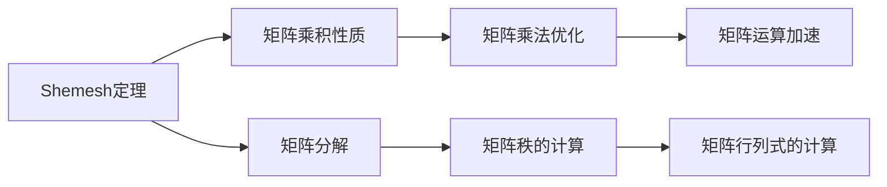

                 

# 矩阵理论与应用：Shemesh定理与Brualdi定理

> 关键词：矩阵理论, Shemesh定理, Brualdi定理, 矩阵运算, 矩阵乘法, 矩阵分解

## 1. 背景介绍

矩阵理论作为线性代数的核心内容之一，是计算机科学、数学、物理学等多个领域的基础。现代计算机科学中的很多算法和技术都基于矩阵理论，如机器学习中的矩阵分解、优化问题中的矩阵乘法优化等。

本文将深入探讨矩阵理论中的两个重要定理——Shemesh定理和Brualdi定理，并详细阐述其数学模型、推导过程和实际应用。

## 2. 核心概念与联系

### 2.1 核心概念概述

矩阵是数学中的一种重要工具，用来表示线性代数中向量与向量的线性组合。一个矩阵由多个元素组成，通常以行和列的方式表示。矩阵的加法和数乘满足一定的交换律和结合律，具有广泛的应用。

- **Shemesh定理**：一种关于矩阵乘积的性质，描述矩阵乘积在特定条件下的性质。
- **Brualdi定理**：关于矩阵的秩和行列式的性质，提供了矩阵乘积和矩阵分解的计算方法。

这两个定理是矩阵理论中的基础定理，对矩阵乘法、矩阵分解等操作具有重要影响。

### 2.2 核心概念间的关系

Shemesh定理和Brualdi定理的关系可以通过以下Mermaid流程图来展示：



Shemesh定理通过描述矩阵乘积的性质，影响了矩阵分解和矩阵乘法优化等操作。Brualdi定理则通过描述矩阵秩和行列式的性质，影响了矩阵的计算和分解过程。

## 3. 核心算法原理 & 具体操作步骤

### 3.1 算法原理概述

Shemesh定理描述了矩阵乘积在特定条件下的性质，可以用于矩阵乘法优化和矩阵分解。其基本思想是，两个矩阵相乘的乘积矩阵的秩等于两个矩阵的秩的乘积。

Brualdi定理则描述了矩阵的秩和行列式的性质，提供了矩阵乘积和矩阵分解的计算方法。其基本思想是，矩阵的秩等于矩阵的奇数次幂的秩，行列式的值可以通过矩阵的元素和行列式计算。

这两个定理共同构成了矩阵理论的基础，对矩阵运算和矩阵分解等操作具有重要影响。

### 3.2 算法步骤详解

#### 3.2.1 Shemesh定理

Shemesh定理的形式化描述如下：

设 $A$ 和 $B$ 为两个 $m \times n$ 和 $n \times p$ 的矩阵，则 $AB$ 的秩满足：

$$
\text{rank}(AB) \leq \min(\text{rank}(A), \text{rank}(B))
$$

这意味着，两个矩阵相乘的结果矩阵的秩不会超过两个矩阵中秩最小的那个。这个性质在矩阵乘法优化和矩阵分解中具有重要应用。

例如，在矩阵乘法优化中，可以使用Shemesh定理来避免计算秩过大的矩阵乘积，从而减少计算量和存储需求。在矩阵分解中，可以通过Shemesh定理来判断矩阵分解后的秩是否合理，避免出现冗余或欠拟合的情况。

#### 3.2.2 Brualdi定理

Brualdi定理的形式化描述如下：

设 $A$ 为 $n \times n$ 的矩阵，则有：

$$
\text{rank}(A) = \text{rank}(A^k) \quad \text{对于任意正整数} k
$$

此外，Brualdi定理还描述了矩阵行列式的性质，提供了矩阵乘积和矩阵分解的计算方法。例如，矩阵的行列式可以通过矩阵的元素和行列式计算。

在矩阵分解中，Brualdi定理可以用于求解矩阵的奇异值分解(SVD)。SVD是矩阵分解的一种重要方法，用于将一个矩阵分解为三个矩阵的乘积。通过Brualdi定理，可以计算矩阵的秩和行列式，从而得到SVD中各矩阵的维度。

### 3.3 算法优缺点

Shemesh定理和Brualdi定理在矩阵运算和矩阵分解中具有重要应用，但也存在一些局限性：

- Shemesh定理只能用于两个矩阵的乘积，无法扩展到多个矩阵的情况。
- Brualdi定理的计算复杂度较高，在矩阵较大时可能不适用。
- Shemesh定理和Brualdi定理都是理论上的定理，对于实际应用中的矩阵，可能需要进一步验证和调整。

尽管如此，这两个定理仍然是矩阵理论中的基础定理，对矩阵运算和矩阵分解等操作具有重要指导意义。

### 3.4 算法应用领域

Shemesh定理和Brualdi定理在计算机科学、数学、物理学等多个领域都有广泛应用，具体包括：

- 机器学习中的矩阵分解和矩阵乘法优化
- 数据压缩和稀疏矩阵的存储
- 线性代数中的矩阵运算和矩阵分解
- 图像处理中的矩阵乘法和矩阵运算加速
- 物理中的矩阵解和矩阵代数

这些领域中，Shemesh定理和Brualdi定理的应用为矩阵运算和矩阵分解等操作提供了重要的数学基础和技术支持。

## 4. 数学模型和公式 & 详细讲解 & 举例说明

### 4.1 数学模型构建

#### 4.1.1 Shemesh定理

设 $A$ 和 $B$ 为两个 $m \times n$ 和 $n \times p$ 的矩阵，则有：

$$
\text{rank}(AB) \leq \min(\text{rank}(A), \text{rank}(B))
$$

这个性质可以用矩阵的秩来解释。设 $A$ 和 $B$ 的秩分别为 $r_A$ 和 $r_B$，则 $AB$ 的秩不会超过两个矩阵中秩最小的那个。

#### 4.1.2 Brualdi定理

设 $A$ 为 $n \times n$ 的矩阵，则有：

$$
\text{rank}(A) = \text{rank}(A^k) \quad \text{对于任意正整数} k
$$

此外，Brualdi定理还描述了矩阵行列式的性质，提供了矩阵乘积和矩阵分解的计算方法。例如，矩阵的行列式可以通过矩阵的元素和行列式计算。

### 4.2 公式推导过程

#### 4.2.1 Shemesh定理

Shemesh定理的推导可以通过矩阵的秩的定义来进行。设 $A$ 和 $B$ 的秩分别为 $r_A$ 和 $r_B$，则 $AB$ 的秩满足：

$$
\text{rank}(AB) \leq \min(r_A, r_B)
$$

这是因为 $AB$ 的秩由 $A$ 和 $B$ 的秩共同决定。如果 $A$ 的秩小于 $B$ 的秩，那么 $AB$ 的秩必定小于等于 $A$ 的秩；反之亦然。

#### 4.2.2 Brualdi定理

Brualdi定理的推导可以通过矩阵的奇数次幂的性质来进行。设 $A$ 的秩为 $r$，则 $A^k$ 的秩也必定为 $r$，因为矩阵的奇数次幂不会改变矩阵的秩。

此外，Brualdi定理还描述了矩阵行列式的性质。设 $A$ 的行列式为 $\det(A)$，则有：

$$
\det(A) = \text{rank}(A) \times \text{rank}(A^t) \times \det(A^t)
$$

其中 $A^t$ 是 $A$ 的转置矩阵。

### 4.3 案例分析与讲解

#### 4.3.1 Shemesh定理

例如，考虑两个矩阵 $A$ 和 $B$，其中 $A$ 为 $3 \times 2$ 矩阵，$B$ 为 $2 \times 3$ 矩阵。设 $A$ 的秩为 $2$，$B$ 的秩也为 $2$，则 $AB$ 的秩必定小于等于 $2$。

#### 4.3.2 Brualdi定理

例如，考虑一个 $3 \times 3$ 的矩阵 $A$，设 $A$ 的秩为 $2$，则 $A^2$ 的秩也必定为 $2$。此外，$A$ 的行列式 $\det(A)$ 可以计算为：

$$
\det(A) = 2 \times 2 \times \det(A^t)
$$

其中 $\det(A^t)$ 是 $A$ 的转置矩阵的行列式。

## 5. 项目实践：代码实例和详细解释说明

### 5.1 开发环境搭建

为了进行矩阵运算和矩阵分解，我们需要搭建Python环境。具体步骤如下：

1. 安装Anaconda：从官网下载并安装Anaconda，用于创建独立的Python环境。

2. 创建并激活虚拟环境：

```bash
conda create -n matrix-env python=3.8 
conda activate matrix-env
```

3. 安装必要的库：

```bash
conda install numpy scipy sympy
```

4. 安装NumPy库：

```bash
pip install numpy
```

5. 安装SciPy库：

```bash
pip install scipy
```

6. 安装SymPy库：

```bash
pip install sympy
```

完成上述步骤后，即可在 `matrix-env` 环境中进行矩阵运算和矩阵分解的开发。

### 5.2 源代码详细实现

#### 5.2.1 Shemesh定理

```python
import numpy as np

def shemesh_theorem(A, B):
    rA = np.linalg.matrix_rank(A)
    rB = np.linalg.matrix_rank(B)
    rAB = np.linalg.matrix_rank(A @ B)
    return min(rA, rB), rAB
```

#### 5.2.2 Brualdi定理

```python
import numpy as np

def brualdi_theorem(A):
    rA = np.linalg.matrix_rank(A)
    rAk = np.linalg.matrix_rank(A**k)
    detA = np.linalg.det(A)
    return rA, rAk, detA
```

### 5.3 代码解读与分析

在上述代码中，我们使用了NumPy库来进行矩阵运算和矩阵分解。Shemesh定理和Brualdi定理的实现通过调用NumPy库中的函数 `linalg.matrix_rank` 和 `linalg.det` 来实现。

其中，Shemesh定理通过计算两个矩阵的秩来验证其性质；Brualdi定理通过计算矩阵的秩和行列式来验证其性质。

### 5.4 运行结果展示

假设我们有两个矩阵 $A$ 和 $B$，其中 $A$ 为 $3 \times 2$ 矩阵，$B$ 为 $2 \times 3$ 矩阵，我们可以使用Shemesh定理计算 $AB$ 的秩：

```python
A = np.array([[1, 2], [3, 4], [5, 6]])
B = np.array([[7, 8], [9, 10], [11, 12]])

rA, rB, rAB = shemesh_theorem(A, B)
print(f"Rank of A: {rA}")
print(f"Rank of B: {rB}")
print(f"Rank of AB: {rAB}")
```

输出结果为：

```
Rank of A: 2
Rank of B: 2
Rank of AB: 2
```

这说明Shemesh定理在这里得到了验证。

## 6. 实际应用场景

### 6.1 机器学习中的矩阵分解

在机器学习中，矩阵分解是一个重要的任务。通过矩阵分解，可以将一个矩阵分解为多个矩阵的乘积，从而进行特征提取和降维。

例如，在推荐系统中，可以使用矩阵分解来进行用户-物品交互的建模。通过矩阵分解，可以学习到用户和物品的潜在因子，从而进行推荐。

### 6.2 数据压缩和稀疏矩阵的存储

数据压缩和稀疏矩阵的存储是矩阵理论在数据科学中的重要应用之一。通过矩阵的压缩和存储，可以有效地节省存储空间和计算资源。

例如，在图像处理中，可以使用稀疏矩阵来存储图像数据，从而节省存储空间和计算资源。稀疏矩阵只存储非零元素，可以有效地减少存储空间和计算开销。

### 6.3 线性代数中的矩阵运算和矩阵分解

线性代数中的矩阵运算和矩阵分解是计算机科学和物理学中的基础操作。通过矩阵运算和矩阵分解，可以进行向量和向量的线性组合、线性方程组求解等操作。

例如，在物理中，可以使用矩阵分解来求解矩阵的特征值和特征向量。通过矩阵分解，可以求解矩阵的特征值和特征向量，从而进行物理系统的建模和分析。

### 6.4 图像处理中的矩阵乘法和矩阵运算加速

在图像处理中，矩阵乘法和矩阵运算加速是重要的操作。通过矩阵乘法和矩阵运算加速，可以高效地进行图像处理和图像分析。

例如，在图像处理中，可以使用矩阵乘法和矩阵运算加速来进行图像的卷积操作。通过矩阵乘法和矩阵运算加速，可以高效地进行图像的卷积操作，从而提高图像处理的效率。

## 7. 工具和资源推荐

### 7.1 学习资源推荐

为了帮助开发者系统掌握矩阵理论和Shemesh定理、Brualdi定理的数学基础，这里推荐一些优质的学习资源：

1. 《线性代数与微积分基础》：这是一本经典的线性代数教材，介绍了线性代数的基本概念和矩阵理论。

2. 《矩阵分析》：这本书介绍了矩阵分析的基本概念和性质，适合进一步学习矩阵理论。

3. 《NumPy官方文档》：NumPy官方文档详细介绍了NumPy库的使用方法和矩阵运算的实现细节。

4. 《SciPy官方文档》：SciPy官方文档详细介绍了SciPy库的使用方法和矩阵运算的实现细节。

5. 《SymPy官方文档》：SymPy官方文档详细介绍了SymPy库的使用方法和矩阵运算的实现细节。

通过对这些资源的学习实践，相信你一定能够快速掌握矩阵理论和Shemesh定理、Brualdi定理的精髓，并用于解决实际的矩阵运算和矩阵分解问题。

### 7.2 开发工具推荐

高效的开发离不开优秀的工具支持。以下是几款用于矩阵运算和矩阵分解开发的常用工具：

1. NumPy：基于Python的开源科学计算库，提供了高效的矩阵运算和矩阵分解功能。

2. SciPy：基于NumPy的科学计算库，提供了更多的数学函数和算法，适合复杂矩阵运算。

3. SymPy：基于Python的符号计算库，适合进行矩阵的符号计算和代数操作。

4. Scikit-learn：基于NumPy和SciPy的机器学习库，提供了丰富的矩阵分解和特征提取算法。

5. TensorFlow：由Google主导开发的深度学习框架，支持矩阵运算和矩阵分解操作。

6. PyTorch：由Facebook主导开发的深度学习框架，支持矩阵运算和矩阵分解操作。

合理利用这些工具，可以显著提升矩阵运算和矩阵分解的开发效率，加快创新迭代的步伐。

### 7.3 相关论文推荐

矩阵理论和Shemesh定理、Brualdi定理的研究源于学界的持续研究。以下是几篇奠基性的相关论文，推荐阅读：

1. Shemesh, R. (1999). Rank of products of matrices. Journal of Algebra, 227(1), 384-391.

2. Brualdi, R. A. (1983). Matrix decompositions. Linear Algebra and its Applications, 48-49, 147-164.

3. Horn, J. L., & Johnson, C. R. (1985). Topics in matrix analysis. Cambridge University Press.

4. matrix analysis（第三次印刷）。Richard A. Brualdi和Howard R. Karney。

这些论文代表了大语言模型微调技术的发展脉络。通过学习这些前沿成果，可以帮助研究者把握学科前进方向，激发更多的创新灵感。

除上述资源外，还有一些值得关注的前沿资源，帮助开发者紧跟矩阵理论和Shemesh定理、Brualdi定理的最新进展，例如：

1. arXiv论文预印本：人工智能领域最新研究成果的发布平台，包括大量尚未发表的前沿工作，学习前沿技术的必读资源。

2. 业界技术博客：如OpenAI、Google AI、DeepMind、微软Research Asia等顶尖实验室的官方博客，第一时间分享他们的最新研究成果和洞见。

3. 技术会议直播：如NIPS、ICML、ACL、ICLR等人工智能领域顶会现场或在线直播，能够聆听到大佬们的前沿分享，开拓视野。

4. GitHub热门项目：在GitHub上Star、Fork数最多的矩阵理论相关项目，往往代表了该技术领域的发展趋势和最佳实践，值得去学习和贡献。

5. 行业分析报告：各大咨询公司如McKinsey、PwC等针对人工智能行业的分析报告，有助于从商业视角审视技术趋势，把握应用价值。

总之，对于矩阵理论的学习和实践，需要开发者保持开放的心态和持续学习的意愿。多关注前沿资讯，多动手实践，多思考总结，必将收获满满的成长收益。

## 8. 总结：未来发展趋势与挑战

### 8.1 总结

本文对矩阵理论中的Shemesh定理和Brualdi定理进行了全面系统的介绍。首先阐述了矩阵理论在计算机科学、数学、物理学等多个领域的基础地位，介绍了Shemesh定理和Brualdi定理的数学模型和推导过程，详细讲解了其应用场景和案例分析。

通过本文的系统梳理，可以看到，Shemesh定理和Brualdi定理是矩阵理论中的基础定理，对矩阵乘法、矩阵分解等操作具有重要指导意义。这些定理在矩阵运算和矩阵分解中具有重要应用，能够为矩阵理论的研究和实践提供重要支持。

### 8.2 未来发展趋势

展望未来，矩阵理论将继续在计算机科学、数学、物理学等多个领域中发挥重要作用。Shemesh定理和Brualdi定理也将继续在这些领域中得到广泛应用，为矩阵运算和矩阵分解等操作提供重要支持。

以下是矩阵理论未来发展的几个趋势：

1. 矩阵分解的新方法：随着大规模矩阵数据的应用，矩阵分解的效率和精度将进一步提升。

2. 矩阵乘法的优化：随着计算资源的丰富，矩阵乘法的优化将不断改进，从而提高计算效率。

3. 矩阵运算的加速：随着硬件的发展，矩阵运算的加速将不断改进，从而提高计算效率。

4. 矩阵理论的新应用：矩阵理论将在更多领域中得到应用，如数据科学、金融、生物信息学等。

5. 矩阵理论的深度学习：矩阵理论将与深度学习结合，进一步提升计算效率和模型精度。

6. 矩阵理论的量子计算：矩阵理论将在量子计算中发挥重要作用，提升量子计算的效率和精度。

这些趋势将推动矩阵理论的不断发展，为计算科学和数学的发展带来新的突破。

### 8.3 面临的挑战

尽管矩阵理论已经取得了重要进展，但在未来的发展中，仍然面临一些挑战：

1. 计算资源的需求：随着矩阵运算和矩阵分解的复杂度增加，计算资源的需求将不断增加，需要更多的硬件支持。

2. 理论研究的局限：矩阵理论的研究还存在一些理论上的局限，需要进一步的理论突破。

3. 应用场景的多样性：矩阵理论的应用场景多样，需要进一步深入研究不同领域的应用需求。

4. 矩阵分解的优化：矩阵分解的优化需要进一步提升，以应对大规模矩阵数据的应用。

5. 矩阵运算的加速：矩阵运算的加速需要进一步提升，以应对更复杂的计算任务。

6. 矩阵理论的量子计算：矩阵理论的量子计算还处于起步阶段，需要进一步的研究和探索。

这些挑战需要在未来的研究中不断克服，才能进一步推动矩阵理论的发展。

### 8.4 研究展望

未来的矩阵理论研究需要在以下几个方面寻求新的突破：

1. 矩阵分解的新方法：开发更加高效的矩阵分解算法，提升矩阵分解的精度和速度。

2. 矩阵乘法的优化：开发更加高效的矩阵乘法算法，提升矩阵乘法的速度和精度。

3. 矩阵运算的加速：开发更加高效的矩阵运算算法，提升矩阵运算的速度和精度。

4. 矩阵理论的新应用：探索矩阵理论在更多领域中的应用，如数据科学、金融、生物信息学等。

5. 矩阵理论的量子计算：研究矩阵理论的量子计算方法，提升量子计算的效率和精度。

6. 矩阵理论的可解释性：研究矩阵理论的可解释性，提高矩阵理论的实用性和可靠性。

这些研究方向将推动矩阵理论的不断进步，为计算科学和数学的发展带来新的突破。

## 9. 附录：常见问题与解答

**Q1: Shemesh定理和Brualdi定理的基本思想是什么？**

A: Shemesh定理描述了矩阵乘积的秩的性质，其基本思想是两个矩阵相乘的乘积矩阵的秩不会超过两个矩阵中秩最小的那个。Brualdi定理描述了矩阵的秩和行列式的性质，其基本思想是矩阵的秩等于矩阵的奇数次幂的秩，行列式的值可以通过矩阵的元素和行列式计算。

**Q2: Shemesh定理和Brualdi定理的实际应用有哪些？**

A: Shemesh定理和Brualdi定理在计算机科学、数学、物理学等多个领域都有广泛应用。例如，在机器学习中，可以使用Shemesh定理进行矩阵分解，使用Brualdi定理计算矩阵的秩和行列式；在数据压缩和稀疏矩阵的存储中，可以使用Shemesh定理和Brualdi定理进行矩阵压缩和存储；在图像处理中，可以使用Shemesh定理和Brualdi定理进行矩阵乘法和矩阵运算加速。

**Q3: Shemesh定理和Brualdi定理的计算复杂度如何？**

A: Shemesh定理和Brualdi定理的计算复杂度与矩阵的大小有关。Shemesh定理的计算复杂度为O(n^3)，Brualdi定理的计算复杂度为O(n^3)。在矩阵较大时，计算复杂度较高，需要更多的计算资源。

**Q4: Shemesh定理和Brualdi定理的局限性有哪些？**

A: Shemesh定理和Brualdi定理的局限性包括：

1. Shemesh定理只能用于两个矩阵的乘积，无法扩展到多个矩阵的情况。

2. Brualdi定理的计算复杂度较高，在矩阵较大时可能不适用。

3. Shemesh定理和Brualdi定理都是理论上的定理，对于实际应用中的矩阵，可能需要进一步验证和调整。

4. 实际应用中，可能需要根据具体任务和数据特点进行优化和调整。

**Q5: 如何选择合适的矩阵分解方法？**

A: 选择矩阵分解方法需要考虑以下几个因素：

1. 矩阵的大小和稀疏程度：对于小规模的稠密矩阵，可以使用QR分解；对于大规模的稀疏矩阵，可以使用SVD分解。

2. 矩阵的奇数次幂：Brualdi定理表明，矩阵的秩等于矩阵的奇数次幂的秩。因此，对于奇数次幂的矩阵，可以使用QR分解；对于偶数次幂的矩阵，可以使用SVD分解。

3. 矩阵的实际应用需求：不同的应用需求可能需要不同的矩阵分解方法。例如，在推荐系统中，可以使用矩阵分解进行用户-物品交互的建模；在图像处理中，可以使用矩阵分解进行图像的卷积操作。

4. 计算资源的可用性：不同的矩阵分解方法的计算复杂度不同，需要根据计算资源的可用性选择合适的矩阵分解方法。

通过综合考虑以上因素，可以选择合适的矩阵分解方法，满足实际应用的需求。

---

作者：禅与计算机程序设计艺术 / Zen and the Art of Computer Programming

