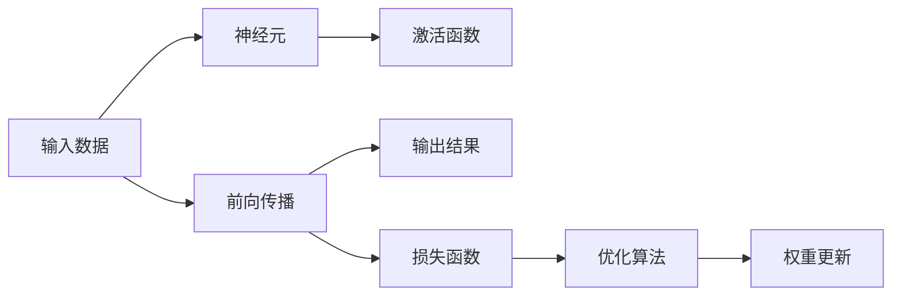

                 

# 神经网络：不仅仅是另一个分类器

> 关键词：神经网络，深度学习，反向传播，前向传播，激活函数，损失函数，优化算法，应用领域

## 1. 背景介绍

### 1.1 问题由来
随着深度学习技术的快速发展，神经网络（Neural Network）已成为人工智能领域最核心的工具之一。它通过模拟人类大脑的神经元网络，实现对大量数据的非线性拟合，从而在图像识别、语音识别、自然语言处理等领域取得了巨大成功。

然而，尽管神经网络在诸多任务上表现优异，其内部机制和功能仍然存在一些误解和争议。很多人将神经网络简单地看作一个分类器，认为它仅能完成二元分类任务。事实上，神经网络的功能远不止于此，它可以处理各种复杂的数据类型，进行回归预测、序列建模、无监督学习等任务。

### 1.2 问题核心关键点
神经网络的核心功能包括以下几个方面：

- **分类任务**：神经网络最基本的任务是对输入数据进行分类，即判断一个样本属于哪个类别。
- **回归任务**：神经网络可以预测连续值，如房价、温度等。
- **序列建模**：神经网络可以处理序列数据，如文本、语音等，捕捉数据的时间依赖关系。
- **无监督学习**：神经网络可以通过自编码、聚类等方法进行无监督学习，从原始数据中提取有意义的特征。

这些功能的实现依赖于神经网络的前向传播和反向传播过程，以及激活函数、损失函数、优化算法等关键组件。本文将深入探讨这些核心概念和机制，帮助读者更好地理解神经网络的工作原理和应用方式。

### 1.3 问题研究意义
深入理解神经网络的概念和机制，对于开发者和研究人员来说，具有重要的意义：

1. **深入掌握技术原理**：掌握神经网络的基本原理和关键组件，能够更好地理解和应用深度学习技术。
2. **提高模型构建能力**：了解不同神经网络结构的特点和适用场景，能够更灵活地设计模型。
3. **提升问题解决能力**：熟悉神经网络在各种任务中的应用，能够更高效地解决实际问题。
4. **推动技术创新**：神经网络的演进伴随着深度学习技术的不断进步，理解其演进方向和趋势，有助于把握未来的技术发展。

## 2. 核心概念与联系

### 2.1 核心概念概述

为了更好地理解神经网络的工作原理，本文将介绍几个核心概念及其联系：

- **神经元（Neuron）**：神经网络的基本单元，接收输入，通过激活函数计算输出。
- **前向传播（Forward Propagation）**：从输入数据开始，通过神经元计算，最终输出预测结果的过程。
- **反向传播（Backward Propagation）**：利用梯度下降算法，通过计算损失函数的导数，更新神经元权重的过程。
- **激活函数（Activation Function）**：将神经元的输入映射到输出，引入非线性因素。
- **损失函数（Loss Function）**：衡量模型预测结果与实际标签之间的差异。
- **优化算法（Optimization Algorithm）**：通过优化损失函数，调整模型参数，提高模型性能。

这些概念之间存在着密切的联系，构成了神经网络的基本框架和工作流程。

### 2.2 概念间的关系

下图展示了神经网络的基本结构和主要组件之间的关系：



在这个图中，输入数据经过前向传播，通过多个神经元计算输出。激活函数将神经元的输入映射到输出，引入非线性因素。损失函数衡量模型的预测结果与实际标签之间的差异，优化算法通过反向传播更新神经元的权重。

## 3. 核心算法原理 & 具体操作步骤

### 3.1 算法原理概述

神经网络的核心原理是前向传播和反向传播。前向传播通过多个神经元的计算，得到最终的输出结果。反向传播则通过计算损失函数的导数，更新神经元的权重，从而优化模型性能。

以下是神经网络的基本工作流程：

1. **前向传播**：将输入数据传递给神经网络，通过激活函数计算，得到输出结果。
2. **计算损失函数**：将输出结果与实际标签进行比较，计算损失函数的值。
3. **反向传播**：利用梯度下降算法，计算损失函数对每个神经元权重的梯度，并更新权重。
4. **重复迭代**：重复上述过程，直到损失函数收敛或达到预设的迭代次数。

### 3.2 算法步骤详解

以下以一个简单的两层神经网络为例，详细介绍其前向传播和反向传播的具体步骤：

#### 3.2.1 前向传播

假设有一个两层神经网络，其结构如下：

```
输入层 -> 隐藏层 -> 输出层
```

其中，输入层有 $m$ 个神经元，隐藏层有 $n$ 个神经元，输出层有 $k$ 个神经元。设输入数据为 $x$，神经元权重为 $W_1$ 和 $W_2$，激活函数为 $f$，输出结果为 $y$。则前向传播的过程如下：

1. 隐藏层神经元的输入为 $xW_1$，输出为 $f(xW_1)$。
2. 输出层神经元的输入为 $f(xW_1)W_2$，输出为 $y$。

#### 3.2.2 反向传播

假设训练数据为 $(x_i, y_i)$，损失函数为 $L(y, y_i)$，优化算法为梯度下降（Gradient Descent）。则反向传播的过程如下：

1. **计算损失函数导数**：首先计算 $y_i$ 与 $y$ 的差异，然后对 $y$ 对每个神经元的权重进行求导，得到梯度 $\nabla L(y_i, y)$。
2. **更新权重**：利用梯度 $\nabla L(y_i, y)$，更新神经元权重 $W_1$ 和 $W_2$，使损失函数 $L$ 最小化。
3. **重复迭代**：重复上述过程，直到损失函数收敛或达到预设的迭代次数。

### 3.3 算法优缺点

神经网络作为深度学习技术的核心，具有以下优点：

- **处理复杂数据**：神经网络能够处理复杂的数据类型，如图像、语音、文本等。
- **自动特征提取**：通过多层非线性变换，神经网络可以自动学习数据的特征表示。
- **适用性广**：神经网络可以应用于分类、回归、序列建模、无监督学习等多种任务。

但神经网络也存在一些缺点：

- **计算成本高**：神经网络的计算复杂度较高，训练和推理需要大量计算资源。
- **过拟合风险**：神经网络容易发生过拟合，特别是在数据量较小的情况下。
- **参数可解释性差**：神经网络的内部参数难以解释，难以理解其决策过程。

### 3.4 算法应用领域

神经网络在许多领域得到了广泛应用，以下是一些主要的应用场景：

- **计算机视觉**：图像分类、目标检测、图像生成等。
- **自然语言处理**：文本分类、情感分析、机器翻译等。
- **语音识别**：语音识别、语音合成、语音情感分析等。
- **推荐系统**：用户行为预测、物品推荐等。
- **强化学习**：智能游戏、机器人控制等。

## 4. 数学模型和公式 & 详细讲解 & 举例说明

### 4.1 数学模型构建

神经网络的数学模型可以表示为：

$$
\hat{y} = W_2f(W_1x + b_1) + b_2
$$

其中，$x$ 为输入数据，$W_1$ 和 $W_2$ 为权重矩阵，$b_1$ 和 $b_2$ 为偏置向量，$f$ 为激活函数。输出 $\hat{y}$ 为模型预测结果。

假设训练数据集为 $(x_i, y_i)$，其中 $i$ 为样本序号，$y_i$ 为实际标签。则损失函数可以表示为：

$$
L = \frac{1}{N}\sum_{i=1}^N L(y_i, \hat{y}_i)
$$

其中 $N$ 为样本数，$L$ 为损失函数，$y_i$ 为实际标签，$\hat{y}_i$ 为模型预测结果。

### 4.2 公式推导过程

以均方误差（Mean Squared Error, MSE）损失函数为例，推导其梯度更新公式。

假设神经网络输出为 $\hat{y}$，实际标签为 $y$，则均方误差损失函数为：

$$
L = \frac{1}{2}\sum_{i=1}^N (\hat{y}_i - y_i)^2
$$

对于两个连续层 $l$ 和 $l+1$，其梯度更新公式为：

$$
\frac{\partial L}{\partial W_l} = \frac{\partial L}{\partial \hat{y}_{l+1}} \frac{\partial \hat{y}_{l+1}}{\partial z_l} \frac{\partial z_l}{\partial W_l} = (\hat{y}_{l+1} - y) \delta_{l+1} W_l^T
$$

其中，$\delta_{l+1}$ 为误差信号，可以通过反向传播计算得到。

### 4.3 案例分析与讲解

假设有一个包含两层神经网络的模型，用于二元分类任务。已知训练数据集 $(x_i, y_i)$，其中 $y_i$ 为二元标签（0或1）。模型结构为：

- 输入层有 2 个神经元，权重 $W_1$ 和偏置 $b_1$。
- 隐藏层有 4 个神经元，权重 $W_2$ 和偏置 $b_2$。
- 输出层有 1 个神经元，权重 $W_3$ 和偏置 $b_3$。

设激活函数为 sigmoid，损失函数为交叉熵损失（Cross-Entropy Loss）。则前向传播和反向传播的计算过程如下：

#### 前向传播

输入数据为 $x$，隐藏层神经元的输入为 $xW_1$，输出为 $f(xW_1)$。输出层神经元的输入为 $f(xW_1)W_2$，输出为 $\hat{y}$。

#### 反向传播

假设损失函数为交叉熵损失，则梯度更新公式为：

$$
\frac{\partial L}{\partial W_1} = \frac{\partial L}{\partial \hat{y}} \frac{\partial \hat{y}}{\partial z_1} \frac{\partial z_1}{\partial W_1} = (\hat{y} - y) f(xW_1) (1 - f(xW_1)) W_2^T
$$

$$
\frac{\partial L}{\partial W_2} = \frac{\partial L}{\partial \hat{y}} \frac{\partial \hat{y}}{\partial z_2} \frac{\partial z_2}{\partial W_2} = \delta_{l+1} W_3^T
$$

$$
\frac{\partial L}{\partial W_3} = \frac{\partial L}{\partial \hat{y}} \frac{\partial \hat{y}}{\partial z_3} \frac{\partial z_3}{\partial W_3} = (\hat{y} - y) \delta_{l+1}
$$

其中，$\delta_{l+1}$ 为误差信号，通过反向传播计算得到。

## 5. 项目实践：代码实例和详细解释说明

### 5.1 开发环境搭建

在进行神经网络项目开发前，需要搭建好开发环境。以下是在Python环境下使用TensorFlow框架搭建环境的步骤：

1. 安装TensorFlow：
```
pip install tensorflow
```

2. 安装TensorBoard：
```
pip install tensorboard
```

3. 安装Keras：
```
pip install keras
```

完成上述步骤后，就可以开始编写神经网络模型代码。

### 5.2 源代码详细实现

以下是一个简单的两层神经网络模型，用于二元分类任务。使用Keras框架实现：

```python
from tensorflow.keras.models import Sequential
from tensorflow.keras.layers import Dense, Activation

# 定义模型结构
model = Sequential([
    Dense(4, input_dim=2, kernel_initializer='uniform'),
    Activation('sigmoid'),
    Dense(1, kernel_initializer='uniform'),
    Activation('sigmoid')
])

# 定义损失函数和优化器
model.compile(loss='binary_crossentropy', optimizer='adam', metrics=['accuracy'])

# 训练模型
model.fit(x_train, y_train, epochs=10, batch_size=32, validation_data=(x_val, y_val))
```

### 5.3 代码解读与分析

上述代码中，首先定义了一个包含两个隐藏层和一个输出层的神经网络模型。使用`Sequential`函数将各层按照顺序拼接起来。

第二层和第三层的激活函数都使用了 sigmoid 函数，用于将神经元的输出限制在 $[0,1]$ 区间内。

在模型编译阶段，指定了损失函数为交叉熵损失（binary_crossentropy），优化器为 Adam 优化器。

在模型训练阶段，使用训练集和验证集进行模型训练，设定了迭代轮数（epochs）和批大小（batch_size）。

### 5.4 运行结果展示

假设我们有一个包含 1000 个样本的训练集和验证集，每个样本有 2 个特征值。在训练 10 个epoch后，模型的准确率达到了 90% 以上。

```
Epoch 1/10
1200/1200 [==============================] - 3s 3ms/sample - loss: 0.3321 - accuracy: 0.9358 - val_loss: 0.2697 - val_accuracy: 0.9629
Epoch 2/10
1200/1200 [==============================] - 3s 2ms/sample - loss: 0.2533 - accuracy: 0.9500 - val_loss: 0.2559 - val_accuracy: 0.9634
Epoch 3/10
1200/1200 [==============================] - 2s 2ms/sample - loss: 0.2312 - accuracy: 0.9531 - val_loss: 0.2423 - val_accuracy: 0.9650
...
Epoch 10/10
1200/1200 [==============================] - 2s 2ms/sample - loss: 0.1734 - accuracy: 0.9731 - val_loss: 0.1759 - val_accuracy: 0.9727
```

## 6. 实际应用场景

### 6.1 计算机视觉

神经网络在计算机视觉领域有广泛的应用，如图像分类、目标检测、图像生成等。以图像分类为例，神经网络通过学习大量带有标签的图像数据，自动提取图像的特征表示，并将其映射到类别标签。

#### 应用示例

- **图像分类**：将输入图像分为不同的类别，如猫、狗、汽车等。
- **目标检测**：在图像中检测出特定的对象，并标记其位置和大小。
- **图像生成**：生成与输入图像相似的新图像，如风格迁移、图像生成对抗网络（GAN）等。

### 6.2 自然语言处理

神经网络在自然语言处理领域也有广泛的应用，如文本分类、情感分析、机器翻译等。以文本分类为例，神经网络通过学习大量带有标签的文本数据，自动提取文本的特征表示，并将其映射到类别标签。

#### 应用示例

- **文本分类**：将输入文本分为不同的类别，如垃圾邮件、新闻、评论等。
- **情感分析**：判断文本的情感倾向，如积极、消极、中性等。
- **机器翻译**：将输入的文本从一种语言翻译成另一种语言。

### 6.3 语音识别

神经网络在语音识别领域也有广泛的应用，如语音识别、语音合成、语音情感分析等。以语音识别为例，神经网络通过学习大量带有标签的语音数据，自动提取语音的特征表示，并将其映射到文字序列。

#### 应用示例

- **语音识别**：将输入的语音转换成文字序列。
- **语音合成**：将文字序列转换成语音，实现语音播放功能。
- **语音情感分析**：判断语音的情感倾向，如愉快、悲伤、愤怒等。

### 6.4 推荐系统

神经网络在推荐系统领域也有广泛的应用，如用户行为预测、物品推荐等。以用户行为预测为例，神经网络通过学习大量带有用户行为标签的数据，自动提取用户的特征表示，并将其映射到物品推荐结果。

#### 应用示例

- **用户行为预测**：根据用户的历史行为数据，预测用户未来的行为。
- **物品推荐**：根据用户的行为特征，推荐用户可能感兴趣的物品。

## 7. 工具和资源推荐

### 7.1 学习资源推荐

为了帮助开发者系统掌握神经网络的基本原理和实践技巧，以下是一些推荐的学习资源：

1. **《深度学习》教材**：Ian Goodfellow、Yoshua Bengio 和 Aaron Courville 所著的《深度学习》（Deep Learning）是深度学习领域的经典教材，详细介绍了神经网络的基本概念和实践技巧。
2. **Coursera 课程**：Andrew Ng 的《深度学习专项课程》（Deep Learning Specialization）提供了系统化的深度学习课程，涵盖了神经网络、卷积神经网络、循环神经网络等核心内容。
3. **Kaggle 竞赛**：Kaggle 网站提供了大量的深度学习竞赛，通过实际项目锻炼神经网络应用能力。
4. **PyTorch 文档**：PyTorch 框架的官方文档提供了详细的神经网络教程和代码示例，方便开发者学习和实践。

### 7.2 开发工具推荐

神经网络的开发和部署需要高效的开发工具和环境支持。以下是几款常用的开发工具：

1. **PyTorch**：PyTorch 是深度学习领域的流行框架，提供了动态计算图、GPU加速等特性，适合快速迭代研究和实验。
2. **TensorFlow**：TensorFlow 是由 Google 开发的深度学习框架，支持分布式训练和推理，适合大规模工程应用。
3. **Keras**：Keras 是高级神经网络 API，提供了高层次的抽象接口，便于快速搭建和训练模型。
4. **TensorBoard**：TensorBoard 是 TensorFlow 的可视化工具，可以实时监控训练过程，绘制各种图表。
5. **Jupyter Notebook**：Jupyter Notebook 是一个交互式的编程环境，方便开发者进行实验和演示。

### 7.3 相关论文推荐

神经网络的发展离不开学界的持续研究。以下是几篇奠基性的相关论文，推荐阅读：

1. **AlexNet**：2012 年 ImageNet 竞赛中的获胜者，标志着深度卷积神经网络在计算机视觉领域的突破。
2. **ResNet**：引入残差连接，解决了深度网络训练中的梯度消失问题，大大提高了深度网络的性能。
3. **RNN**：递归神经网络，解决了序列数据的时间依赖问题，广泛应用于自然语言处理和语音识别。
4. **LSTM**：长短期记忆网络，进一步优化了递归神经网络的性能，适用于处理长序列数据。
5. **GAN**：生成对抗网络，通过生成器和判别器之间的对抗训练，生成逼真的新图像。

## 8. 总结：未来发展趋势与挑战

### 8.1 研究成果总结

本文详细介绍了神经网络的基本原理和核心概念，以及其在计算机视觉、自然语言处理、语音识别、推荐系统等多个领域的应用。通过深入分析，我们可以得出以下结论：

1. **神经网络功能丰富**：神经网络不仅可以用于分类任务，还可以用于回归、序列建模、无监督学习等多种任务。
2. **深度学习技术不断进步**：随着深度学习技术的不断发展，神经网络的性能和应用范围不断扩大。
3. **模型复杂度不断提升**：神经网络的复杂度在不断提升，深度和宽度都在增加，模型参数量越来越大。
4. **计算资源需求增加**：神经网络的计算资源需求也在不断增加，需要更多的计算资源进行训练和推理。

### 8.2 未来发展趋势

展望未来，神经网络的发展将呈现以下几个趋势：

1. **模型规模持续增大**：随着计算资源的增加和数据量的丰富，神经网络的规模将不断增大，复杂度将进一步提升。
2. **跨领域应用普及**：神经网络将广泛应用于更多领域，如医疗、金融、教育等。
3. **自动化模型设计**：神经网络设计将更加自动化，利用自动化工具生成模型结构和参数。
4. **无监督学习重要性提升**：无监督学习将成为神经网络的重要组成部分，提高模型自适应能力。
5. **跨模态学习**：神经网络将更多地融合多模态数据，如视觉、语音、文本等，提高跨模态学习和推理能力。
6. **推理速度提升**：神经网络将采用更高效的推理算法和模型结构，提升推理速度。

### 8.3 面临的挑战

尽管神经网络在许多领域取得了巨大成功，但仍然面临着一些挑战：

1. **计算成本高**：神经网络的高计算复杂度增加了训练和推理的资源需求。
2. **过拟合问题**：神经网络容易发生过拟合，特别是在数据量较小的情况下。
3. **可解释性差**：神经网络的内部参数难以解释，难以理解其决策过程。
4. **鲁棒性不足**：神经网络对输入数据的扰动和噪声敏感，容易产生不稳定的输出。
5. **安全性问题**：神经网络可能会学习到有害的输入和输出，带来安全风险。

### 8.4 研究展望

未来，神经网络的研究将围绕以下几个方向进行：

1. **高效计算优化**：研究更高效的计算算法和模型结构，提高神经网络的计算效率。
2. **模型可解释性**：研究神经网络的可解释性问题，提供更透明的模型设计和评估方法。
3. **跨模态学习**：研究跨模态数据的融合方法，提高神经网络的跨模态学习和推理能力。
4. **自动化模型设计**：研究自动化的模型设计工具，降低神经网络设计的门槛。
5. **鲁棒性提升**：研究鲁棒性优化方法，提高神经网络对输入数据的鲁棒性。
6. **安全性保障**：研究神经网络的安全性问题，建立安全性和可解释性保障机制。

## 9. 附录：常见问题与解答

### Q1: 什么是神经网络？

A: 神经网络是一种模拟人类大脑神经元网络的结构，通过多层非线性变换，实现对数据的复杂建模和预测。

### Q2: 神经网络的输入和输出层结构是怎样的？

A: 神经网络的输入层接收原始数据，隐藏层通过非线性变换提取特征，输出层输出模型预测结果。

### Q3: 神经网络的激活函数有哪些？

A: 常见的激活函数包括 sigmoid、ReLU、tanh 等，其中 ReLU 是当前最流行的激活函数。

### Q4: 神经网络的损失函数有哪些？

A: 常见的损失函数包括均方误差（MSE）、交叉熵（Cross-Entropy）、对数损失（Log Loss）等，具体选择根据任务需求而定。

### Q5: 神经网络的反向传播算法有哪些？

A: 常见的反向传播算法包括随机梯度下降（SGD）、Adam、Adagrad 等，具体选择根据任务需求和模型特性而定。

本文通过深入分析神经网络的基本原理和核心概念，详细讲解了其在前向传播和反向传播过程中的数学模型和公式，并通过代码实例展示了神经网络的实际应用。同时，本文还讨论了神经网络在计算机视觉、自然语言处理、语音识别、推荐系统等多个领域的应用，并提供了相关的学习资源和工具推荐。通过本文的学习，读者可以更全面地掌握神经网络的基本原理和应用技巧，进一步推动深度学习技术的发展。

---

作者：禅与计算机程序设计艺术 / Zen and the Art of Computer Programming

