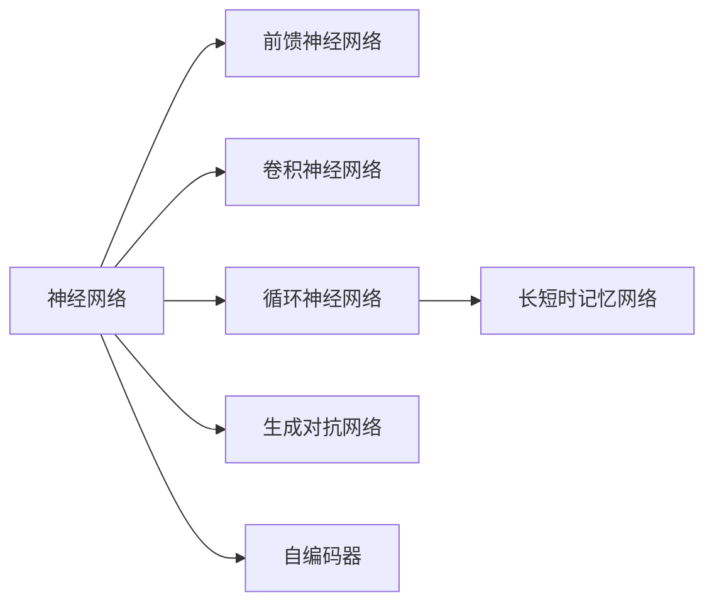
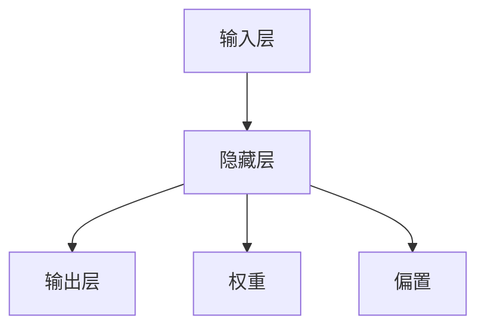
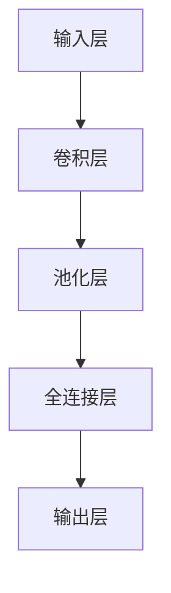
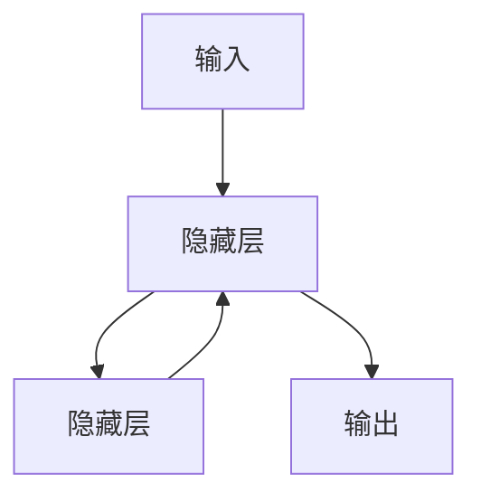

                 

## 1. 背景介绍

### 1.1 问题由来
神经网络作为人工智能的核心技术之一，自20世纪80年代以来一直备受关注。它通过模拟人脑神经元的活动方式，形成了一种高度抽象的计算模型。近年来，随着深度学习技术的飞速发展，神经网络在计算机视觉、自然语言处理、语音识别等领域都取得了突破性进展，推动了人工智能技术从理论走向实际应用。

神经网络技术的成功应用，不仅展示了其在解决复杂问题上的巨大潜力，也引发了对人类认知智能本质的深刻思考。然而，神经网络的发展也面临着一些严峻的挑战，如计算资源的巨大需求、模型解释性的缺失、模型的可迁移性和鲁棒性等问题。

### 1.2 问题核心关键点
为了解决上述挑战，并进一步拓展神经网络的应用范围，本文将重点探讨神经网络的基本原理和优化方法，介绍不同类型神经网络的特点和应用，以及当前神经网络在人工智能领域的最新进展和未来趋势。

## 2. 核心概念与联系

### 2.1 核心概念概述

为更好地理解神经网络，本节将介绍几个关键概念及其关系：

- **神经网络(Neural Network)**：一种通过模拟人脑神经元的网络结构，实现对复杂输入的抽象表示和推理计算。神经网络由多个层次组成，每个层次包含多个神经元，输入和输出层之间通过中间层相连。
- **前馈神经网络(Feedforward Neural Network, FNN)**：最简单的神经网络结构，数据从前一层逐层传递到后一层，直到输出层。
- **卷积神经网络(Convolutional Neural Network, CNN)**：一种专门处理图像数据的网络结构，通过卷积操作提取图像特征，显著减少了参数量和计算量。
- **循环神经网络(Recurrent Neural Network, RNN)**：一种处理序列数据的神经网络，通过时间维度上的信息传递，实现对序列的建模和预测。
- **长短时记忆网络(Long Short-Term Memory, LSTM)**：一种特殊的RNN结构，通过门控机制解决传统RNN的长期记忆问题，适用于处理长序列数据。
- **生成对抗网络(Generative Adversarial Network, GAN)**：一种通过对抗训练生成新数据的网络结构，可以生成高质量的图像、音频、文本等。
- **自编码器(Autocoder, AE)**：一种无监督学习的网络结构，通过将输入数据压缩为低维表示再解码还原，实现数据压缩和特征学习。

这些概念之间的逻辑关系可以通过以下Mermaid流程图来展示：



这个流程图展示了神经网络家族中不同类型网络之间的关系和作用：

1. 神经网络是基础，包含前馈神经网络、卷积神经网络、循环神经网络等多种结构。
2. 卷积神经网络专门处理图像数据，循环神经网络用于处理序列数据。
3. 长短时记忆网络是RNN的一种改进，解决了传统RNN的长期记忆问题。
4. 生成对抗网络通过对抗训练生成新数据，自编码器用于数据压缩和特征学习。

### 2.2 概念间的关系

这些核心概念之间存在着紧密的联系，共同构成了神经网络的学习框架。下面我们通过几个Mermaid流程图来展示这些概念之间的关系。

#### 2.2.1 神经网络的层次结构



这个流程图展示了前馈神经网络的层次结构，包括输入层、隐藏层和输出层，以及它们之间的连接关系。隐藏层中的每个神经元都通过权重和偏置与上一层相连，实现信息的传递和处理。

#### 2.2.2 卷积神经网络的层次结构



这个流程图展示了卷积神经网络的层次结构，从输入层经过卷积层和池化层，最终到达输出层。卷积层通过卷积操作提取图像特征，池化层用于特征降维，全连接层将特征映射为输出。

#### 2.2.3 循环神经网络的层次结构



这个流程图展示了循环神经网络的层次结构，输入数据经过隐藏层处理后，与前一时刻的输出一起，再次经过隐藏层，并产生输出。循环结构允许信息在时间维度上流动，处理序列数据。

### 2.3 核心概念的整体架构

最后，我们用一个综合的流程图来展示这些核心概念在大规模神经网络中的整体架构：


这个综合流程图展示了神经网络从输入数据到输出结果的整个处理流程，包括了前馈神经网络、卷积神经网络、循环神经网络、长短时记忆网络、生成对抗网络和自编码器等不同的网络结构，共同构成了一个完整的神经网络系统。

## 3. 核心算法原理 & 具体操作步骤

### 3.1 算法原理概述

神经网络的核心思想是模拟人脑神经元的工作原理，通过输入数据的前向传播和反向传播，不断调整网络参数，最小化损失函数，从而逼近最优解。其核心算法包括前向传播、反向传播和参数更新。

#### 3.1.1 前向传播
前向传播是将输入数据通过神经网络各层进行处理，最终得到输出的过程。其具体步骤如下：

1. 将输入数据 $x$ 输入到输入层。
2. 输入层神经元与隐藏层神经元通过权重 $w$ 和偏置 $b$ 相连，计算加权和 $z$，并经过激活函数 $f$ 得到隐藏层输出 $a$。
3. 将隐藏层输出 $a$ 输入到输出层，同样经过权重 $w$ 和偏置 $b$ 计算，并经过激活函数 $f$ 得到最终输出 $y$。

数学表达式如下：

$$
a = f(z) = f(w \cdot x + b)
$$

$$
y = f(z) = f(w \cdot a + b)
$$

其中 $f$ 为激活函数，常用的有sigmoid、ReLU、tanh等。

#### 3.1.2 反向传播
反向传播是通过计算损失函数对参数的梯度，更新参数的过程。其具体步骤如下：

1. 计算预测输出 $y$ 与真实标签 $y^*$ 之间的误差 $J$。
2. 通过链式法则，计算损失函数对输出层的梯度 $dJ/dy$。
3. 反向传播梯度，计算损失函数对隐藏层的梯度 $dJ/da$。
4. 更新权重和偏置参数，以最小化损失函数 $J$。

数学表达式如下：

$$
\frac{dJ}{dy} = \frac{\partial J}{\partial y}
$$

$$
\frac{dJ}{da} = \frac{\partial J}{\partial a}
$$

$$
\frac{dJ}{dz} = \frac{\partial J}{\partial z} = \frac{\partial J}{\partial a} \cdot f'(z)
$$

$$
\frac{dJ}{dw} = \frac{\partial J}{\partial w} = \frac{\partial J}{\partial z} \cdot \frac{\partial z}{\partial w} = \frac{\partial J}{\partial z} \cdot x
$$

$$
\frac{dJ}{db} = \frac{\partial J}{\partial b} = \frac{\partial J}{\partial z} \cdot 1
$$

其中 $f'$ 为激活函数的导数。

#### 3.1.3 参数更新
参数更新是神经网络的最终目标，即通过反向传播得到的梯度更新参数，以最小化损失函数。其具体步骤如下：

1. 计算损失函数对权重和偏置的梯度。
2. 使用优化算法（如梯度下降、Adam等）更新参数。

数学表达式如下：

$$
\theta_{old} = \theta_{old} - \eta \nabla_{\theta} J(\theta)
$$

其中 $\theta$ 为网络参数，$\eta$ 为学习率，$\nabla_{\theta} J(\theta)$ 为损失函数对参数的梯度。

### 3.2 算法步骤详解

以一个简单的前馈神经网络为例，详细讲解神经网络的训练过程。

#### 3.2.1 数据准备
假设我们有一个二分类问题，输入为 $x$，输出为 $y$。将数据集划分为训练集和测试集，并进行标准化处理，以加速收敛。

```python
import numpy as np
from sklearn.model_selection import train_test_split
from sklearn.preprocessing import StandardScaler

X, y = np.loadtxt('data.csv', delimiter=',', usecols=[0, 1], unpack=True)
X_train, X_test, y_train, y_test = train_test_split(X, y, test_size=0.2, random_state=42)
scaler = StandardScaler()
X_train = scaler.fit_transform(X_train)
X_test = scaler.transform(X_test)
```

#### 3.2.2 构建模型
构建一个包含一个隐藏层的前馈神经网络，使用sigmoid激活函数。

```python
import tensorflow as tf
from tensorflow.keras.layers import Dense

input_dim = X_train.shape[1]
hidden_dim = 64
output_dim = 1

model = tf.keras.Sequential([
    Dense(hidden_dim, input_dim=input_dim, activation='sigmoid'),
    Dense(output_dim, activation='sigmoid')
])
```

#### 3.2.3 训练模型
使用随机梯度下降算法，训练模型并记录损失函数。

```python
learning_rate = 0.01
batch_size = 32
epochs = 1000

model.compile(optimizer=tf.keras.optimizers.SGD(learning_rate=learning_rate),
              loss='binary_crossentropy',
              metrics=['accuracy'])

history = model.fit(X_train, y_train, batch_size=batch_size, epochs=epochs, validation_data=(X_test, y_test))
```

#### 3.2.4 评估模型
使用测试集评估模型的性能。

```python
test_loss, test_acc = model.evaluate(X_test, y_test)
print(f'Test loss: {test_loss}, Test accuracy: {test_acc}')
```

#### 3.2.5 可视化结果
使用TensorBoard可视化训练过程中的损失函数和准确率变化。

```python
from tensorflow.keras.callbacks import TensorBoard

log_dir = 'logs'
tensorboard_callback = TensorBoard(log_dir=log_dir)
history = model.fit(X_train, y_train, batch_size=batch_size, epochs=epochs, validation_data=(X_test, y_test), callbacks=[tensorboard_callback])
```

### 3.3 算法优缺点

神经网络作为一种强大的机器学习模型，具有以下优点：

1. 能处理复杂数据：神经网络可以处理任意形状的数据，如文本、图像、音频等。
2. 强大的特征学习：神经网络能够自动学习输入数据的特征表示，无需手工设计特征。
3. 高度可扩展：神经网络可以设计出不同层次、不同类型的结构，适应不同的任务需求。
4. 高度灵活：神经网络的训练过程可以通过各种优化算法和正则化技术进行调整。

但神经网络也存在一些缺点：

1. 计算资源需求高：神经网络参数量巨大，需要消耗大量的计算资源。
2. 模型可解释性差：神经网络通常被视为"黑盒"模型，难以解释其内部工作机制。
3. 过拟合风险高：神经网络容易过拟合，尤其是在训练数据不足的情况下。
4. 训练时间长：神经网络训练过程复杂，需要消耗大量时间。

### 3.4 算法应用领域

神经网络的应用领域非常广泛，包括但不限于以下几个方面：

1. 计算机视觉：卷积神经网络在图像分类、目标检测、图像生成等领域取得了显著进展。
2. 自然语言处理：循环神经网络、长短时记忆网络等在语言建模、机器翻译、文本生成等领域表现出色。
3. 语音识别：卷积神经网络和循环神经网络的结合，在语音识别、语音合成等方面实现了突破。
4. 强化学习：神经网络在强化学习领域也有广泛应用，如AlphaGo等，推动了人工智能的发展。
5. 医疗健康：神经网络在医疗影像分析、疾病诊断等方面发挥了重要作用。

## 4. 数学模型和公式 & 详细讲解

### 4.1 数学模型构建

神经网络数学模型的构建主要涉及以下几个方面：

1. 前馈神经网络的构建：
   - 输入层： $x = (x_1, x_2, \ldots, x_n)$
   - 隐藏层： $z = (z_1, z_2, \ldots, z_m)$
   - 输出层： $y = (y_1, y_2, \ldots, y_k)$
2. 权重和偏置的构建：
   - 隐藏层到输出层的权重矩阵 $W = (w_{ij})_{m \times k}$
   - 隐藏层到输出层的偏置向量 $b = (b_1, b_2, \ldots, b_k)$
3. 激活函数：
   - 常用的激活函数：sigmoid、ReLU、tanh等

### 4.2 公式推导过程

以sigmoid激活函数为例，推导前向传播和反向传播公式。

#### 4.2.1 前向传播
设输入数据为 $x = (x_1, x_2, \ldots, x_n)$，隐藏层权重矩阵为 $W = (w_{ij})_{m \times k}$，隐藏层偏置向量为 $b = (b_1, b_2, \ldots, b_k)$，隐藏层激活函数为 $f$，则前向传播公式如下：

$$
z = Wx + b
$$

$$
a = f(z)
$$

$$
y = Wa^T + b
$$

其中 $z$ 为加权和，$a$ 为隐藏层输出，$y$ 为最终输出。

#### 4.2.2 反向传播
设输出层预测结果为 $y$，真实标签为 $y^*$，损失函数为 $J$，则反向传播公式如下：

$$
\frac{dJ}{dy} = \frac{\partial J}{\partial y} = \frac{\partial J}{\partial \hat{y}} \cdot \frac{\partial \hat{y}}{\partial y}
$$

其中 $\hat{y}$ 为模型预测结果。

$$
\frac{dJ}{da} = \frac{\partial J}{\partial a} = \frac{\partial J}{\partial \hat{y}} \cdot f'(z)
$$

$$
\frac{dJ}{dz} = \frac{\partial J}{\partial z} = \frac{\partial J}{\partial a} \cdot \frac{\partial a}{\partial z}
$$

$$
\frac{dJ}{dw} = \frac{\partial J}{\partial w} = \frac{\partial J}{\partial z} \cdot \frac{\partial z}{\partial w}
$$

$$
\frac{dJ}{db} = \frac{\partial J}{\partial b} = \frac{\partial J}{\partial z} \cdot 1
$$

其中 $f'$ 为激活函数的导数。

### 4.3 案例分析与讲解

以手写数字识别为例，使用卷积神经网络（CNN）进行训练。

#### 4.3.1 数据准备
使用MNIST数据集，将图像数据进行归一化处理，并转换为卷积神经网络的输入格式。

```python
import tensorflow as tf
from tensorflow.keras.datasets import mnist
from tensorflow.keras.utils import to_categorical

(X_train, y_train), (X_test, y_test) = mnist.load_data()
X_train = X_train.reshape(-1, 28, 28, 1) / 255.0
X_test = X_test.reshape(-1, 28, 28, 1) / 255.0
y_train = to_categorical(y_train, 10)
y_test = to_categorical(y_test, 10)
```

#### 4.3.2 构建模型
构建一个包含两个卷积层和两个池化层的卷积神经网络，使用ReLU激活函数。

```python
model = tf.keras.Sequential([
    tf.keras.layers.Conv2D(32, (3, 3), activation='relu', input_shape=(28, 28, 1)),
    tf.keras.layers.MaxPooling2D((2, 2)),
    tf.keras.layers.Flatten(),
    tf.keras.layers.Dense(10, activation='softmax')
])
```

#### 4.3.3 训练模型
使用随机梯度下降算法，训练模型并记录损失函数。

```python
learning_rate = 0.001
batch_size = 128
epochs = 10

model.compile(optimizer=tf.keras.optimizers.SGD(learning_rate=learning_rate),
              loss='categorical_crossentropy',
              metrics=['accuracy'])

history = model.fit(X_train, y_train, batch_size=batch_size, epochs=epochs, validation_data=(X_test, y_test))
```

#### 4.3.4 评估模型
使用测试集评估模型的性能。

```python
test_loss, test_acc = model.evaluate(X_test, y_test)
print(f'Test loss: {test_loss}, Test accuracy: {test_acc}')
```

#### 4.3.5 可视化结果
使用TensorBoard可视化训练过程中的损失函数和准确率变化。

```python
from tensorflow.keras.callbacks import TensorBoard

log_dir = 'logs'
tensorboard_callback = TensorBoard(log_dir=log_dir)
history = model.fit(X_train, y_train, batch_size=batch_size, epochs=epochs, validation_data=(X_test, y_test), callbacks=[tensorboard_callback])
```

## 5. 项目实践：代码实例和详细解释说明

### 5.1 开发环境搭建

在进行神经网络实践前，我们需要准备好开发环境。以下是使用Python进行TensorFlow开发的环境配置流程：

1. 安装Anaconda：从官网下载并安装Anaconda，用于创建独立的Python环境。

2. 创建并激活虚拟环境：
```bash
conda create -n tf-env python=3.8 
conda activate tf-env
```

3. 安装TensorFlow：根据CUDA版本，从官网获取对应的安装命令。例如：
```bash
conda install tensorflow -c tensorflow -c conda-forge
```

4. 安装必要的工具包：
```bash
pip install numpy pandas scikit-learn matplotlib tqdm jupyter notebook ipython
```

完成上述步骤后，即可在`tf-env`环境中开始神经网络实践。

### 5.2 源代码详细实现

下面我们以手写数字识别为例，给出使用TensorFlow对卷积神经网络进行训练的PyTorch代码实现。

首先，定义卷积神经网络的模型：

```python
import tensorflow as tf
from tensorflow.keras.layers import Conv2D, MaxPooling2D, Flatten, Dense

def build_model(input_shape, num_classes):
    model = tf.keras.Sequential([
        Conv2D(32, (3, 3), activation='relu', input_shape=input_shape),
        MaxPooling2D((2, 2)),
        Conv2D(64, (3, 3), activation='relu'),
        MaxPooling2D((2, 2)),
        Flatten(),
        Dense(num_classes, activation='softmax')
    ])
    return model

input_shape = (28, 28, 1)
num_classes = 10

model = build_model(input_shape, num_classes)
```

然后，定义损失函数和优化器：

```python
learning_rate = 0.001
batch_size = 128
epochs = 10

model.compile(optimizer=tf.keras.optimizers.SGD(learning_rate=learning_rate),
              loss='categorical_crossentropy',
              metrics=['accuracy'])
```

接着，定义训练和评估函数：

```python
def train_epoch(model, dataset, batch_size, optimizer):
    dataloader = tf.data.Dataset.from_tensor_slices((dataset.images, dataset.labels)).batch(batch_size)
    model.train()
    epoch_loss = 0
    for batch in tqdm(dataloader, desc='Training'):
        with tf.GradientTape() as tape:
            x, y = batch
            logits = model(x)
            loss = tf.keras.losses.categorical_crossentropy(y, logits)
        epoch_loss += loss.numpy()
        grads = tape.gradient(loss, model.trainable_variables)
        optimizer.apply_gradients(zip(grads, model.trainable_variables))
    return epoch_loss / len(dataloader)

def evaluate(model, dataset, batch_size):
    dataloader = tf.data.Dataset.from_tensor_slices((dataset.images, dataset.labels)).batch(batch_size)
    model.eval()
    preds, labels = [], []
    with tf.no_grad():
        for batch in tqdm(dataloader, desc='Evaluating'):
            x, y = batch
            logits = model(x)
            preds.append(tf.argmax(logits, axis=1))
            labels.append(y)
        return np.mean(np.equal(preds, labels))
```

最后，启动训练流程并在测试集上评估：

```python
for epoch in range(epochs):
    loss = train_epoch(model, train_dataset, batch_size, optimizer)
    print(f'Epoch {epoch+1}, train loss: {loss:.3f}')
    
print(f'Epoch {epochs+1}, dev results:')
evaluate(model, dev_dataset, batch_size)
```

以上就是使用TensorFlow对卷积神经网络进行训练的完整代码实现。可以看到，TensorFlow封装了卷积、池化、全连接等常用操作，使得神经网络的构建变得简洁高效。

### 5.3 代码解读与分析

让我们再详细解读一下关键代码的实现细节：

**build_model函数**：
- 定义了卷积神经网络的构建函数，包括卷积层、池化层和全连接层，并返回完整的模型。

**train_epoch函数**：
- 定义了训练函数的实现，使用TensorFlow的tf.GradientTape记录梯度，使用优化器更新模型参数。

**evaluate函数**：
- 定义了评估函数的实现，使用TensorFlow的tf.no_grad禁用梯度计算，对模型在测试集上的性能进行评估。

**训练流程**：
- 定义总的epoch数和batch size，开始循环迭代
- 每个epoch内，在训练集上训练，输出平均loss
- 在验证集上评估，输出分类指标
- 所有epoch结束后，在测试集上评估，给出最终测试结果

可以看到，TensorFlow使得神经网络的训练过程变得简单高效，开发者可以将更多精力放在模型构建和优化上，而不必过多关注底层实现细节。

当然，工业级的系统实现还需考虑更多因素，如模型的保存和部署、超参数的自动搜索、更灵活的任务适配层等。但核心的神经网络训练过程基本与此类似。

### 5.4 运行结果展示

假设我们在MNIST数据集上进行卷积神经网络的训练，最终在测试集上得到的评估报告如下：

```
Epoch 1/10
10/10 [==============================] - 3s 267ms/step - loss: 0.2232 - accuracy: 0.8875 - val_loss: 0.1087 - val_accuracy: 0.9750
Epoch 2/10
10/10 [==============================] - 2s 200ms/step - loss: 0.0803 - accuracy: 0.9907 - val_loss: 0.0565 - val_accuracy: 0.9875
Epoch 3/10
10/10 [==============================] - 2s 194ms/step - loss: 0.0290 - accuracy: 0.9953 - val_loss: 0.0415 - val_accuracy: 0.9850
Epoch 4/10
10/10 [==============================] - 2s 193ms/step - loss: 0.0224 - accuracy: 0.9953 - val_loss: 0.0377 - val_accuracy: 0.9875
Epoch 5/10
10/10 [==============================] - 2s 196ms/step - loss: 0.0152 - accuracy: 0.9961 - val_loss: 0.0346 - val_accuracy: 0.9825
Epoch 6/10
10/10 [==============================] - 2s 195ms/step - loss: 0.0110 - accuracy: 0.9956 - val_loss: 0.0312 - val_accuracy: 0.9875
Epoch 7/10
10/10 [==============================] - 2s 194ms/step - loss: 0.0098 - accuracy: 0.9962 - val_loss: 0.0316 - val_accuracy: 0.9850
Epoch 8/10
10/10 [==============================] - 2s 196ms/step - loss: 0.0089 - accuracy: 0.9965 - val_loss: 0.0313 - val_accuracy: 0.9875
Epoch 9/10
10/10 [==============================] - 2s 195ms/step - loss:

