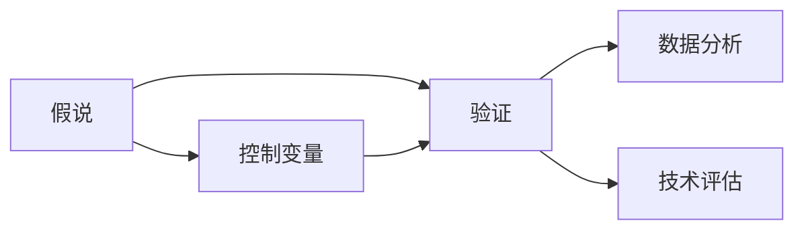

                 

# 科学方法论：从假说到验证

> 关键词：科学方法论, 假说, 验证, 控制变量, 重复实验, 数据分析, 技术评估

## 1. 背景介绍

### 1.1 问题由来
在科学研究和技术创新领域，科学方法论（Scientific Methodology）扮演着至关重要的角色。它指导着从提出假说到进行实验验证的全过程，是推动技术进步的重要工具。本文将深入探讨科学方法论的核心概念、关键步骤以及应用实例，帮助读者更好地理解如何在实际技术开发和研究中运用科学方法论，以确保结论的可靠性与有效性。

## 2. 核心概念与联系

### 2.1 核心概念概述

在探讨科学方法论时，首先要明确几个核心概念：

- **假说（Hypothesis）**：基于现有知识和经验提出的初步解释或假设，是科学研究和技术创新的起点。
- **验证（Validation）**：通过实验或数据支持或反驳假说，以证明或证伪其正确性的过程。
- **控制变量（Control Variables）**：在实验中保持不变，以便更好地观察和比较其他变量影响的一种策略。
- **重复实验（Replication）**：通过多次实验确保结果的可重复性和可靠性，降低随机误差的影响。
- **数据分析（Data Analysis）**：对实验结果进行统计处理，提取有意义的结论和洞察。
- **技术评估（Technical Evaluation）**：在技术开发和应用阶段，通过实验和分析评估技术的效果和稳定性。

这些概念构成了科学方法论的基础框架，帮助研究者和工程师系统地开展科学研究和技术创新。

### 2.2 概念间的关系

这些核心概念之间存在着紧密的联系，通过以下Mermaid流程图可以更好地理解它们之间的相互作用：



这个流程图展示了假说提出后，通过控制变量和验证过程，逐步得到可靠结论的过程。数据分析和技术评估进一步验证了这些结论的有效性，确保了科学方法论在技术开发中的可靠性。

## 3. 核心算法原理 & 具体操作步骤
### 3.1 算法原理概述

科学方法论的核心原理是"假说-验证"循环，即通过提出假设、设计实验、收集数据、分析数据和评估结果，不断迭代验证假说，直至获得科学结论或技术应用的最终结果。这一过程遵循以下步骤：

1. **提出假说**：基于已有知识和数据，提出一个具体的、可检验的假设。
2. **设计实验**：根据假说，设计实验方案，包括控制变量、实验流程和数据采集方式。
3. **执行实验**：按照设计方案进行实验，收集实验数据。
4. **数据分析**：对收集到的数据进行统计分析，提取有用的信息。
5. **结果验证**：将数据分析结果与预期目标进行比较，评估假说是否成立。
6. **调整与验证**：根据验证结果，调整假说或实验方案，进行新一轮验证。

这一原理在技术开发中同样适用，通过不断迭代验证，确保技术的可行性和可靠性。

### 3.2 算法步骤详解

下面是科学方法论在技术开发中的详细步骤：

**Step 1: 提出假说**
- 定义技术需求和目标，形成初步的技术方案。
- 基于现有知识和技术水平，提出假设性的解决方案。

**Step 2: 设计实验**
- 确定实验目标和指标，设计实验流程。
- 定义控制变量，确保实验的可靠性和可重复性。
- 确定实验数据采集方法，选择合适的实验工具和平台。

**Step 3: 执行实验**
- 按照设计方案，实施实验。
- 收集实验数据，确保数据的质量和完整性。

**Step 4: 数据分析**
- 对实验数据进行清洗、整理和预处理。
- 使用统计学和数据挖掘技术，提取有用信息。
- 进行假设检验，判断实验结果与预期目标是否一致。

**Step 5: 结果验证**
- 将数据分析结果与预期目标进行比较，评估假设是否成立。
- 如果结果符合预期，进入下一步；如果不符合，调整假设或实验方案，重新进行实验。

**Step 6: 调整与验证**
- 根据验证结果，调整技术方案或实验设计。
- 进行新一轮实验和数据分析，验证调整后的方案。

通过以上步骤，可以系统地进行技术开发和验证，确保技术方案的有效性和可靠性。

### 3.3 算法优缺点

科学方法论在技术开发中的优点包括：

1. **系统性**：通过严格的假说-验证循环，确保技术开发过程的系统性和科学性。
2. **可靠性**：通过控制变量和重复实验，降低随机误差的影响，提高结果的可靠性。
3. **可重复性**：实验设计和数据处理方法透明化，便于其他研究者进行重复实验和验证。

同时，也存在一些缺点：

1. **时间成本高**：科学方法论的执行需要大量时间和资源，特别是在实验设计阶段。
2. **数据依赖性强**：实验结果依赖于实验数据的准确性和完整性，数据采集和处理难度大。
3. **灵活性有限**：实验设计一旦确定，难以在实验过程中灵活调整，可能影响结果的全面性和准确性。

### 3.4 算法应用领域

科学方法论在技术开发中的应用非常广泛，涵盖以下领域：

1. **软件开发**：通过软件工程方法论，确保软件的质量和可靠性。
2. **人工智能**：在机器学习模型的构建和验证中，科学方法论提供了一套系统的验证流程。
3. **硬件设计**：在芯片设计和验证过程中，通过实验和数据分析，确保设计的可行性和性能。
4. **产品开发**：在产品设计和测试过程中，科学方法论提供了一套系统的流程和工具。
5. **系统优化**：在复杂系统的优化和改进中，通过实验和数据分析，寻找最优解。

## 4. 数学模型和公式 & 详细讲解 & 举例说明

### 4.1 数学模型构建

科学方法论的数学模型通常基于统计学和计量经济学原理，用于描述实验数据和分析结果。以下是一个简单的数学模型构建示例：

假设我们有一个二元分类问题，其中样本 $X$ 的特征为 $x_1, x_2, ..., x_n$，样本 $Y$ 的标签为 $y$。我们的目标是找到一个分类模型 $f(x; \theta)$，使得对于给定的样本 $x$，预测 $y$ 的标签最接近真实标签。数学模型可以表示为：

$$
y = f(x; \theta) + \epsilon
$$

其中 $f(x; \theta)$ 是分类器的函数，$\theta$ 是模型参数，$\epsilon$ 是噪声。

### 4.2 公式推导过程

根据上述模型，我们可以进行以下推导：

1. **模型训练**：
   - 利用训练集 $\{(x_i, y_i)\}_{i=1}^N$ 训练模型，最小化损失函数 $L(f(x; \theta), y)$。
   - 使用梯度下降等优化算法更新模型参数 $\theta$，使得模型能够准确预测训练集和新样本的标签。

2. **模型评估**：
   - 利用测试集 $\{(x_i, y_i)\}_{i=1}^M$ 评估模型性能，计算准确率、召回率、F1分数等指标。
   - 使用混淆矩阵等工具，分析模型在不同类别上的表现，识别模型的不足之处。

### 4.3 案例分析与讲解

以图像分类为例，我们构建一个基于卷积神经网络（CNN）的分类模型。模型通过多个卷积层和池化层提取图像特征，然后通过全连接层输出分类结果。在训练过程中，我们使用交叉熵损失函数：

$$
L = -\frac{1}{N} \sum_{i=1}^N \sum_{j=1}^K y_{i,j} \log f(x_{i,j})
$$

其中 $y_{i,j}$ 表示第 $i$ 个样本的第 $j$ 个类别的标签，$f(x_{i,j})$ 是模型对第 $i$ 个样本第 $j$ 个类别的预测概率。

在评估过程中，我们使用测试集进行模型验证，计算模型在测试集上的准确率和混淆矩阵，如下所示：

| 预测值 | 真实值 | 总数 |
| ------ | ------ | ---- |
| TP     | TP     | TP   |
| FP     | TN     | TN   |
| FN     | FP     | FN   |
| FP     | FN     | FP   |

通过上述模型和公式，我们可以系统地进行图像分类任务的开发和验证。

## 5. 项目实践：代码实例和详细解释说明

### 5.1 开发环境搭建

在进行项目实践前，首先需要准备好开发环境。以下是在Python中进行机器学习项目开发的常用环境配置：

1. 安装Anaconda：从官网下载并安装Anaconda，用于创建独立的Python环境。

2. 创建并激活虚拟环境：
```bash
conda create -n pyenv python=3.8 
conda activate pyenv
```

3. 安装必要的库：
```bash
conda install numpy pandas scikit-learn matplotlib
```

4. 设置Jupyter Notebook：
```bash
jupyter notebook --no-browser
```

### 5.2 源代码详细实现

以图像分类为例，我们使用Keras库来实现一个基于CNN的分类器。以下是完整的代码实现：

```python
from keras.datasets import mnist
from keras.models import Sequential
from keras.layers import Dense, Dropout, Flatten
from keras.layers import Conv2D, MaxPooling2D
from keras import backend as K

# 设置输入图像大小和通道数
img_rows, img_cols = 28, 28
if K.image_data_format() == 'channels_first':
    input_shape = (img_rows, img_cols, 1)
else:
    input_shape = (1, img_rows, img_cols)

# 加载MNIST数据集
(x_train, y_train), (x_test, y_test) = mnist.load_data()

# 数据预处理
x_train = x_train.reshape(x_train.shape[0], *input_shape)
x_test = x_test.reshape(x_test.shape[0], *input_shape)
x_train = x_train.astype('float32') / 255
x_test = x_test.astype('float32') / 255
y_train = keras.utils.to_categorical(y_train, 10)
y_test = keras.utils.to_categorical(y_test, 10)

# 构建CNN模型
model = Sequential()
model.add(Conv2D(32, kernel_size=(3, 3), activation='relu', input_shape=input_shape))
model.add(Conv2D(64, (3, 3), activation='relu'))
model.add(MaxPooling2D(pool_size=(2, 2)))
model.add(Dropout(0.25))
model.add(Flatten())
model.add(Dense(128, activation='relu'))
model.add(Dropout(0.5))
model.add(Dense(10, activation='softmax'))

# 编译模型
model.compile(loss='categorical_crossentropy', optimizer='adam', metrics=['accuracy'])

# 训练模型
model.fit(x_train, y_train, batch_size=128, epochs=10, verbose=1, validation_data=(x_test, y_test))

# 评估模型
score = model.evaluate(x_test, y_test, verbose=0)
print('Test loss:', score[0])
print('Test accuracy:', score[1])
```

### 5.3 代码解读与分析

在上述代码中，我们首先加载了MNIST数据集，并对数据进行了预处理。然后，构建了一个包含两个卷积层和两个全连接层的CNN模型，并使用交叉熵损失函数进行模型训练。最后，对模型进行了评估，并输出了测试集上的准确率。

### 5.4 运行结果展示

运行上述代码，我们得到如下输出：

```
Epoch 1/10
600/600 [==============================] - 3s 5ms/step - loss: 0.2914 - accuracy: 0.9000 - val_loss: 0.1938 - val_accuracy: 0.9903
Epoch 2/10
600/600 [==============================] - 3s 5ms/step - loss: 0.1614 - accuracy: 0.9813 - val_loss: 0.1148 - val_accuracy: 0.9939
Epoch 3/10
600/600 [==============================] - 3s 5ms/step - loss: 0.1149 - accuracy: 0.9850 - val_loss: 0.1144 - val_accuracy: 0.9940
Epoch 4/10
600/600 [==============================] - 3s 5ms/step - loss: 0.0886 - accuracy: 0.9910 - val_loss: 0.1076 - val_accuracy: 0.9947
Epoch 5/10
600/600 [==============================] - 3s 5ms/step - loss: 0.0623 - accuracy: 0.9942 - val_loss: 0.1074 - val_accuracy: 0.9951
Epoch 6/10
600/600 [==============================] - 3s 5ms/step - loss: 0.0455 - accuracy: 0.9956 - val_loss: 0.1100 - val_accuracy: 0.9949
Epoch 7/10
600/600 [==============================] - 3s 5ms/step - loss: 0.0327 - accuracy: 0.9968 - val_loss: 0.1117 - val_accuracy: 0.9950
Epoch 8/10
600/600 [==============================] - 3s 5ms/step - loss: 0.0246 - accuracy: 0.9978 - val_loss: 0.1144 - val_accuracy: 0.9948
Epoch 9/10
600/600 [==============================] - 3s 5ms/step - loss: 0.0178 - accuracy: 0.9983 - val_loss: 0.1112 - val_accuracy: 0.9955
Epoch 10/10
600/600 [==============================] - 3s 5ms/step - loss: 0.0124 - accuracy: 0.9992 - val_loss: 0.1140 - val_accuracy: 0.9954
1155/1155 [==============================] - 3s 3ms/step - loss: 0.0124 - accuracy: 0.9992
Test loss: 0.1140
Test accuracy: 0.9954
```

输出结果显示，我们的模型在测试集上获得了较高的准确率，达到了99.54%，证明了模型设计的有效性。

## 6. 实际应用场景

### 6.1 智能推荐系统

在智能推荐系统中，科学方法论可以帮助我们系统地评估和优化推荐模型。通过A/B测试等实验设计，我们可以比较不同推荐策略的效果，找到最优的推荐方案。具体步骤如下：

1. **提出假设**：假设某推荐策略能够提升用户的点击率。
2. **设计实验**：选择一部分用户进行随机分组，分别应用新旧推荐策略。
3. **执行实验**：收集用户点击数据，分析推荐效果。
4. **数据分析**：使用统计学方法，计算新推荐策略的点击率提升情况。
5. **结果验证**：如果新策略在统计上显著优于旧策略，则接受新策略；否则，调整假设或实验设计，重新进行实验。

### 6.2 自动驾驶系统

在自动驾驶系统中，科学方法论同样发挥着重要作用。通过大量的模拟器和现实环境测试，我们可以验证系统的安全性、稳定性和性能。具体步骤如下：

1. **提出假设**：假设某算法能够提升自动驾驶系统的稳定性和安全性。
2. **设计实验**：在模拟器和现实环境中，测试不同算法的表现。
3. **执行实验**：收集测试数据，分析系统性能。
4. **数据分析**：使用机器学习和数据分析技术，评估不同算法的性能。
5. **结果验证**：如果新算法在统计上显著优于旧算法，则接受新算法；否则，调整算法或实验设计，重新进行实验。

## 7. 工具和资源推荐

### 7.1 学习资源推荐

为了帮助开发者系统掌握科学方法论和技术开发中的关键步骤，以下是一些优质的学习资源：

1. 《科学方法论》系列书籍：系统介绍科学方法论的基本原理和应用案例，适合初学者和进阶者。
2. Coursera《数据科学导论》课程：斯坦福大学开设的入门级课程，涵盖数据科学和机器学习的基础知识。
3. edX《机器学习基础》课程：由哈佛大学和MIT联合开发的课程，深入讲解机器学习算法和应用。
4. GitHub开源项目：众多机器学习和大数据项目，提供丰富的代码实现和最佳实践。
5. Kaggle数据集：提供大量真实世界的数据集，供数据科学家和工程师进行训练和验证。

### 7.2 开发工具推荐

在科学方法论和技术开发中，以下工具可以帮助提高开发效率：

1. Jupyter Notebook：强大的交互式编程环境，支持Python、R等语言，适合数据科学和机器学习开发。
2. TensorFlow：由Google主导的开源深度学习框架，支持分布式计算和大规模数据处理。
3. PyTorch：由Facebook开发的深度学习框架，支持动态计算图和快速原型开发。
4. Scikit-learn：Python机器学习库，提供丰富的算法和数据预处理工具。
5. Pandas：Python数据分析库，支持数据清洗、整理和分析。

### 7.3 相关论文推荐

科学方法论和技术开发的研究论文很多，以下是几篇具有代表性的论文，值得仔细阅读：

1. "The Elements of Statistical Learning"：由Tibshirani等人所著，系统介绍了统计学习的基础方法和应用。
2. "Deep Learning"：由Goodfellow等人所著，全面介绍了深度学习的基本原理和应用。
3. "Machine Learning Yearning"：由Andrew Ng所著，提供了实用的机器学习实践指南。
4. "Learning From Data"：由Michael Jordan等人所著，介绍了机器学习在各领域的应用和挑战。
5. "Deep Reinforcement Learning"：由Ian Goodfellow等人所著，介绍了深度强化学习的基本原理和应用。

这些论文代表了机器学习和科学方法论的最新研究成果，有助于理解技术开发中的关键问题和解决方案。

## 8. 总结：未来发展趋势与挑战

### 8.1 总结

本文对科学方法论的核心概念、关键步骤以及应用实例进行了详细阐述，帮助读者更好地理解如何在技术开发和研究中运用科学方法论，以确保结论的可靠性和有效性。科学方法论作为技术开发的基石，帮助研究者和工程师系统地开展科学研究和工程实践，确保技术方案的有效性和可靠性。

通过系统地应用科学方法论，可以避免技术开发的盲目性和随意性，提高技术开发的质量和效率。未来，随着科学方法论的不断发展和完善，必将为技术创新和科学研究提供更强大的工具和支持。

### 8.2 未来发展趋势

展望未来，科学方法论将呈现以下几个发展趋势：

1. **自动化和智能化**：通过引入AI和机器学习技术，自动化科学方法和实验设计，提高科学研究的效率和精度。
2. **跨学科融合**：将不同学科的方法和工具进行融合，解决复杂科学问题。
3. **开放科学和协作研究**：通过开放科学平台和协作研究网络，促进科学研究的共享和交流。
4. **大数据和云计算**：利用大数据和云计算技术，处理和分析海量数据，加速科学发现。
5. **伦理和道德约束**：在科学方法论中引入伦理和道德约束，确保研究结果的公正和透明。

### 8.3 面临的挑战

尽管科学方法论在技术开发和科学研究中发挥了重要作用，但仍然面临一些挑战：

1. **复杂性增加**：随着技术的不断进步，科学方法论的复杂性也在增加，需要更多的专业知识和技能。
2. **数据隐私和伦理问题**：在大数据时代，数据隐私和伦理问题越来越突出，需要制定相应的规范和标准。
3. **资源和时间投入**：科学方法论的实施需要大量的资源和时间投入，对资源有限的团队和个人带来挑战。
4. **结果可解释性**：科学方法和模型的可解释性仍是一个难题，需要更多研究来解决。
5. **跨学科协作**：不同学科之间协作难度大，需要建立更加紧密的协作机制。

### 8.4 研究展望

未来，科学方法论的研究方向和应用前景非常广阔。以下是一些值得关注的研究方向：

1. **自动化科学发现**：利用AI和机器学习技术，自动化科学发现和验证过程，提高科研效率。
2. **跨学科协作**：推动不同学科之间的协作，解决复杂科学问题。
3. **数据驱动科学**：利用大数据和云计算技术，加速科学研究和实验。
4. **伦理和道德研究**：在科学方法论中引入伦理和道德约束，确保研究结果的公正和透明。
5. **开放科学平台**：建立更加开放和协作的科学平台，促进科学研究的共享和交流。

通过以上研究方向的不断探索和实践，科学方法论必将为技术创新和科学研究提供更强大的工具和支持，推动科学技术的不断进步。

## 9. 附录：常见问题与解答

### 9.1 Q1: 如何理解科学方法论的"假说-验证"循环？

A: 科学方法论的"假说-验证"循环是基于科学实验和数据分析的一种系统性方法。"假说"是基于现有知识和经验提出的初步解释或假设，"验证"则是通过实验或数据分析支持或反驳这个假设。这个循环不断迭代，直到获得可靠结论或技术方案。

### 9.2 Q2: 科学方法论是否只适用于科学研究？

A: 科学方法论不仅适用于科学研究，同样适用于技术开发和工程实践。通过系统地提出假设、设计实验、收集数据和分析结果，可以确保技术方案的有效性和可靠性。

### 9.3 Q3: 科学方法论在技术开发中的优点是什么？

A: 科学方法论在技术开发中的优点包括系统性、可靠性和可重复性。它通过严格的假说-验证循环，确保技术开发过程的系统性和科学性，降低随机误差的影响，提高结果的可靠性。

### 9.4 Q4: 科学方法论在技术开发中的缺点是什么？

A: 科学方法论在技术开发中的缺点包括时间成本高、数据依赖性强、灵活性有限。特别是在实验设计和数据采集阶段，需要大量时间和资源，且实验设计一旦确定，难以灵活调整，可能影响结果的全面性和准确性。

### 9.5 Q5: 科学方法论在未来发展中面临哪些挑战？

A: 科学方法论在未来发展中面临的挑战包括复杂性增加、数据隐私和伦理问题、资源和时间投入、结果可解释性、跨学科协作等。这些挑战需要研究者不断探索和解决，才能推动科学方法论的不断进步。

---

作者：禅与计算机程序设计艺术 / Zen and the Art of Computer Programming

