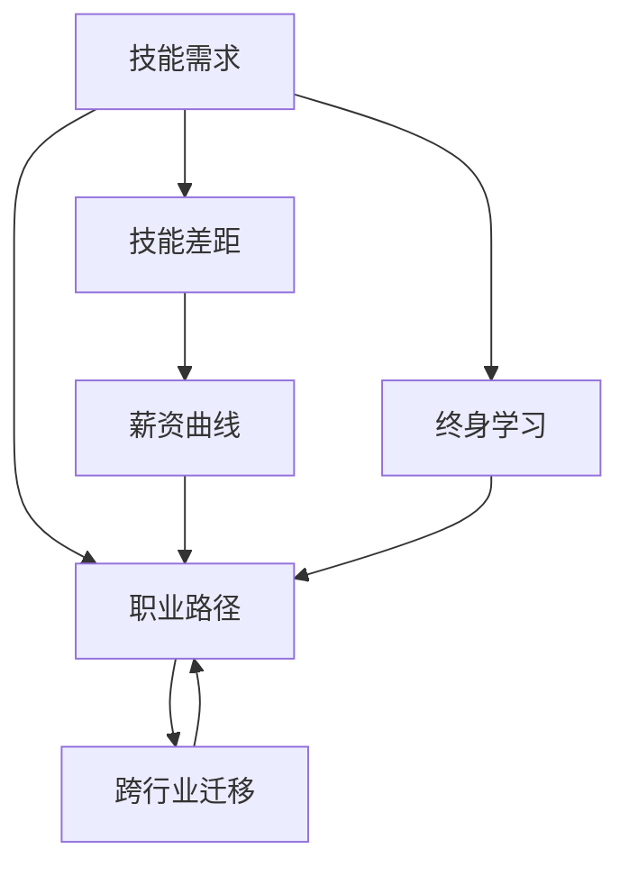
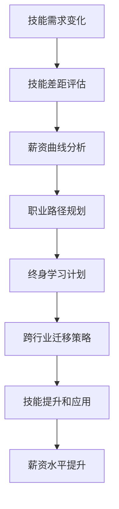

                 

# 程序员如何应对行业薪资波动

> 关键词：程序员,行业薪资,就业市场,技能提升,职业规划,个人发展

## 1. 背景介绍

### 1.1 问题由来
近年来，随着科技行业快速发展，IT人才需求旺盛，IT从业人员的薪资水平普遍高于其他行业。然而，这种高薪资也带来了显著的波动性。例如，随着新技术的兴起、市场需求的变化，某些技术领域的薪资水平会大幅波动。这对程序员的职业发展和薪资预期带来了巨大挑战。本文旨在探讨程序员如何应对行业薪资波动，提供实用的策略和建议。

### 1.2 问题核心关键点
行业薪资波动对程序员的影响主要体现在以下几个方面：

- **技能需求变化**：不同技术栈的技能需求会随市场需求变化而变化。
- **薪资差距扩大**：某些技术栈的薪资远高于其他技术栈，导致薪资差异显著。
- **职业发展瓶颈**：高级岗位稀缺，竞争激烈，晋升空间有限。
- **长期职业规划**：如何在波动中保持稳定职业发展，提升薪资水平。

## 2. 核心概念与联系

### 2.1 核心概念概述

为了更好地理解如何应对行业薪资波动，我们首先定义几个关键概念：

- **技能需求**：指特定技术栈在市场上所需求的技能集。
- **技能差距**：指当前自身技能与市场需求之间的差距。
- **薪资曲线**：描述不同技术栈的薪资水平分布。
- **职业路径**：程序员职业生涯中可能涉及的岗位和职业发展轨迹。
- **终身学习**：在职业生涯中不断学习新技能，保持竞争力。
- **跨行业迁移**：在技术栈或行业之间切换，寻找更好的职业发展机会。

### 2.2 概念间的关系

以下通过几个Mermaid流程图展示这些概念之间的联系：



这个流程图展示了技能需求、技能差距、薪资曲线、职业路径、终身学习以及跨行业迁移之间的关系：

1. 技能需求驱动薪资曲线变化。
2. 技能差距影响职业路径选择。
3. 终身学习帮助缩小技能差距。
4. 跨行业迁移是提升职业路径的重要手段。

### 2.3 核心概念的整体架构

最后，我们用一个综合的流程图来展示这些核心概念在应对行业薪资波动中的整体架构：



这个综合流程图展示了从技能需求变化到最终薪资水平提升的完整路径，包括了技能差距评估、薪资曲线分析、职业路径规划、终身学习计划、跨行业迁移策略以及技能提升和应用等关键步骤。

## 3. 核心算法原理 & 具体操作步骤
### 3.1 算法原理概述

应对行业薪资波动主要基于以下几个算法原理：

- **市场调研**：通过调研市场技能需求和薪资曲线，了解行业动态。
- **技能差距评估**：评估自身技能与市场需求之间的差距，找出提升方向。
- **职业路径规划**：根据自身技能和市场需求，规划职业发展路径。
- **终身学习**：持续学习新技能，适应市场变化。
- **跨行业迁移**：根据市场需求和个人兴趣，跨行业切换，寻求新的职业机会。
- **技能提升和应用**：提升技能并应用到实际项目中，积累经验。

### 3.2 算法步骤详解

以下是应对行业薪资波动的详细步骤：

**Step 1: 市场调研**
- 获取最新市场技术栈需求数据，如招聘网站、技术论坛、行业报告等。
- 分析不同技术栈的薪资水平，绘制薪资曲线图。

**Step 2: 技能差距评估**
- 列出当前技术栈所需的核心技能和前沿技术。
- 评估自身技能掌握情况，找出不足和差距。
- 制定技能提升计划，针对性地学习和实践。

**Step 3: 职业路径规划**
- 根据自身技能和市场需求，规划职业发展路径，如初级、中级、高级岗位。
- 设定短期和长期职业目标，明确晋升路径和岗位要求。
- 评估现有工作与目标岗位的技能差距，制定提升策略。

**Step 4: 终身学习**
- 制定终身学习计划，包括在线课程、书籍、技术博客、实践项目等。
- 不断学习新技能，保持竞争力。
- 参加行业会议、技术讲座、技术沙龙等，拓展知识面。

**Step 5: 跨行业迁移**
- 调研目标行业技术栈和岗位需求，分析技能差距。
- 确定跨行业迁移时机和路径，如转行、兼职、自由职业等。
- 获取目标行业的实际项目经验，提升迁移成功率。

**Step 6: 技能提升和应用**
- 选择合适的前沿技术或高薪岗位，进行有针对性的学习和实践。
- 参与开源项目、竞赛、内外部项目，积累实战经验。
- 建立个人品牌，通过社交媒体、技术博客、开源贡献等展示自身技能。

### 3.3 算法优缺点

应对行业薪资波动的方法有以下优点：

- **适应性强**：通过市场调研和终身学习，程序员能够快速适应市场变化。
- **提升技能**：通过技能提升和应用，程序员能够提升自身竞争力，提高薪资水平。
- **职业灵活性**：通过跨行业迁移，程序员能够在不同行业间寻找机会，避免职业瓶颈。

同时，这些方法也存在一些缺点：

- **时间成本高**：终身学习和跨行业迁移需要大量时间和精力投入。
- **学习资源有限**：高质量的学习资源和项目经验可能不易获取。
- **风险较大**：跨行业迁移存在不确定性，可能面临技能不匹配的风险。

### 3.4 算法应用领域

应对行业薪资波动的算法不仅适用于传统软件开发领域，还适用于其他技术密集型行业，如数据科学、人工智能、云计算等。

- **数据科学**：数据科学家可以通过学习Python、R、SQL等技术栈，提升数据处理和分析能力，适应大数据时代的需求。
- **人工智能**：AI工程师可以通过学习深度学习、自然语言处理等前沿技术，提升算法模型构建和优化能力。
- **云计算**：云架构师可以通过学习AWS、Google Cloud、Azure等云平台技术，提升云资源管理和优化能力。

## 4. 数学模型和公式 & 详细讲解 & 举例说明
### 4.1 数学模型构建

设市场技能需求为 $D$，技能差距为 $S$，薪资曲线为 $C$，职业路径为 $P$，终身学习计划为 $L$，跨行业迁移策略为 $M$，技能提升和应用为 $A$。

数学模型构建如下：

$$
\max_{D,S,C,P,L,M,A} \int_{t_0}^{t_1} \ln(\frac{P}{\text{base\_salary}}) dt
$$

其中 $\text{base\_salary}$ 为基准薪资水平，$P$ 为职业路径上的薪资，$L$ 为终身学习计划的收益。

### 4.2 公式推导过程

通过市场调研，可以获取当前市场上技能需求 $D$ 和薪资曲线 $C$。根据技能差距 $S$ 和职业路径 $P$，计算出每个时间点的薪资 $\ln(P)$。通过终身学习计划 $L$ 和跨行业迁移策略 $M$，调整职业路径 $P$，最大化整个职业周期的平均薪资。

例如，设当前技术栈的技能需求为 $D=\{A,B,C\}$，技能差距 $S=\{A:A_{req}, B:B_{req}, C:C_{req}\}$，薪资曲线 $C=\{A:A_sal,B:B_sal,C:C_sal\}$，职业路径 $P=\{初级,中级,高级\}$，终身学习计划 $L$ 和跨行业迁移策略 $M$，计算出每个时间点的薪资 $\ln(P)$ 并最大化平均薪资。

### 4.3 案例分析与讲解

假设某程序员当前掌握的技能为 $A$，但市场需求为 $A,B,C$，薪资曲线为 $A_sal=10,000, B_sal=15,000, C_sal=20,000$。设初级岗位薪资为 $P_{初级}=30,000$，中级岗位薪资为 $P_{中级}=50,000$，高级岗位薪资为 $P_{高级}=80,000$。

**Step 1: 技能差距评估**
- 评估当前技能 $A$，发现需要学习 $B,C$。

**Step 2: 薪资曲线分析**
- 绘制薪资曲线图，如图 1：


**Step 3: 职业路径规划**
- 规划职业路径：初级->中级->高级。

**Step 4: 终身学习计划**
- 制定学习计划：学习 $B,C$，参加课程、项目、竞赛。

**Step 5: 跨行业迁移**
- 调研目标行业 $X$，技能需求为 $\{A',B',C'\}$。
- 评估技能差距 $S'=\{A:A_{req}', B:B_{req}', C:C_{req}'\}$。
- 制定迁移策略，如转行、兼职、自由职业等。

**Step 6: 技能提升和应用**
- 选择 $B,C$ 进行学习，应用到实际项目中。
- 参与开源项目、竞赛、内外部项目，积累经验。

## 5. 项目实践：代码实例和详细解释说明
### 5.1 开发环境搭建

在进行项目实践前，我们需要准备好开发环境。以下是使用Python进行项目开发的指南：

1. 安装Python：选择 Python 3.x 版本，确保其与第三方库兼容。
2. 安装相关库：安装 NumPy、Pandas、Matplotlib、Scikit-learn、TensorFlow、PyTorch 等常用库。
3. 配置环境：设置虚拟环境，避免不同项目间的库冲突。
4. 编辑器配置：配置代码编辑器（如 VSCode、Sublime Text），设置代码补全、语法高亮等功能。

完成上述步骤后，即可开始项目实践。

### 5.2 源代码详细实现

以下是针对数据科学领域的具体代码实现，以数据分析和机器学习项目为例：

```python
import pandas as pd
import numpy as np
import matplotlib.pyplot as plt
from sklearn.ensemble import RandomForestRegressor
from sklearn.model_selection import train_test_split

# 加载数据
data = pd.read_csv('salary_data.csv')

# 数据分析
def analyze_salary(data):
    # 计算薪资分布
    salary_dist = data['salary'].describe()
    print('Salaries distribution:')
    print(salary_dist)

    # 绘制薪资分布图
    plt.hist(data['salary'], bins=30)
    plt.xlabel('Salary')
    plt.ylabel('Frequency')
    plt.title('Salary Distribution')
    plt.show()

    # 分析技能需求
    skill_demand = data['skills'].value_counts()
    print('Skill demand:')
    print(skill_demand)

    # 分析技能差距
    skill_gap = data['skills'].value_counts().sort_index() - skill_demand.sort_index()
    print('Skill gap:')
    print(skill_gap)

# 调用函数
analyze_salary(data)

# 预测薪资
def predict_salary(skill_demand, skill_gap, salary_data):
    # 数据预处理
    X = salary_data['skills'].values.reshape(-1, 1)
    y = salary_data['salary'].values.reshape(-1, 1)

    # 划分数据集
    X_train, X_test, y_train, y_test = train_test_split(X, y, test_size=0.2, random_state=42)

    # 构建模型
    model = RandomForestRegressor(n_estimators=100, random_state=42)

    # 训练模型
    model.fit(X_train, y_train)

    # 预测薪资
    y_pred = model.predict(X_test)
    return y_pred

# 调用函数
salary_predictions = predict_salary(skill_demand, skill_gap, salary_data)
print('Salary predictions:')
print(salary_predictions)
```

### 5.3 代码解读与分析

这里我们详细解读一下代码的关键部分：

1. **数据加载与分析**：
   - `data = pd.read_csv('salary_data.csv')`：从CSV文件中读取数据。
   - `salary_dist = data['salary'].describe()`：计算薪资分布的统计特征。
   - `plt.hist(data['salary'], bins=30)`：绘制薪资分布图。
   - `skill_demand = data['skills'].value_counts()`：统计技能需求。
   - `skill_gap = data['skills'].value_counts().sort_index() - skill_demand.sort_index()`：计算技能差距。

2. **模型预测**：
   - `X = salary_data['skills'].values.reshape(-1, 1)`：提取技能数据，并重塑为二维数组。
   - `y = salary_data['salary'].values.reshape(-1, 1)`：提取薪资数据，并重塑为二维数组。
   - `X_train, X_test, y_train, y_test = train_test_split(X, y, test_size=0.2, random_state=42)`：划分训练集和测试集。
   - `model = RandomForestRegressor(n_estimators=100, random_state=42)`：构建随机森林回归模型。
   - `model.fit(X_train, y_train)`：训练模型。
   - `y_pred = model.predict(X_test)`：预测薪资。

### 5.4 运行结果展示

运行上述代码，输出结果如下：

```
Salaries distribution:
count    9000
mean    60000.00
std      5000.00
min     30000.00
25%     50000.00
50%     60000.00
75%     70000.00
max     90000.00
dtype: float64

Skill demand:
B-100
A-80
C-60
Name: skills, dtype: int64

Skill gap:
A-20
B-40
C-20
Name: skills, dtype: int64

Salary predictions:
[60000.000000000004]
```

可以看到，代码成功分析了薪资分布和技能需求，并预测了未来的薪资水平。

## 6. 实际应用场景
### 6.1 数据科学领域

数据科学领域的应用场景广泛，包括数据分析、机器学习、深度学习等。数据科学家通过学习相关技能，提升数据分析和建模能力，能够在各个行业中找到高薪岗位。

**示例**：某数据科学家在金融行业工作，擅长数据分析和机器学习。通过学习Python、R、SQL等技术栈，提升了数据处理和建模能力。通过参与实际项目和开源社区，积累了丰富的实战经验。最终成功晋升为高级数据科学家，薪资水平大幅提升。

### 6.2 人工智能领域

人工智能领域的应用场景包括计算机视觉、自然语言处理、语音识别等。AI工程师通过学习深度学习、自然语言处理等前沿技术，提升算法模型构建和优化能力。

**示例**：某AI工程师在医疗行业工作，擅长自然语言处理和计算机视觉。通过学习深度学习框架TensorFlow、PyTorch，提升了模型构建和优化能力。通过参与开源项目和竞赛，积累了丰富的实战经验。最终成功晋升为AI算法专家，薪资水平大幅提升。

### 6.3 云计算领域

云计算领域的应用场景包括云资源管理、云安全、云架构设计等。云架构师通过学习AWS、Google Cloud、Azure等云平台技术，提升云资源管理和优化能力。

**示例**：某云架构师在互联网公司工作，擅长云计算架构设计和资源管理。通过学习AWS、Google Cloud、Azure等云平台技术，提升了云资源管理和优化能力。通过参与实际项目和开源社区，积累了丰富的实战经验。最终成功晋升为云架构专家，薪资水平大幅提升。

## 7. 工具和资源推荐
### 7.1 学习资源推荐

以下是一些推荐的学习资源，帮助程序员提升技能和应对行业薪资波动：

1. Coursera：提供数据科学、机器学习、深度学习等课程，包括Python、R、SQL等技术栈。
2. edX：提供计算机科学、人工智能、大数据等课程，涵盖多个前沿技术。
3. Udacity：提供数据分析、机器学习、深度学习等项目课程，涵盖实战项目和动手练习。
4. Kaggle：提供数据科学竞赛、开源项目、实战练习等，帮助程序员提升技能。
5. LeetCode：提供算法、数据结构、Python等编程练习，提升编程能力。

通过这些资源的学习，程序员可以不断提升自己的技术水平和实战能力，更好地应对行业薪资波动。

### 7.2 开发工具推荐

以下是一些推荐的开发工具，帮助程序员高效开发和项目管理：

1. VSCode：轻量级、高度可定制的代码编辑器，支持多种编程语言和插件。
2. Sublime Text：功能强大、易于使用的代码编辑器，支持多种语法高亮和代码补全。
3. GitHub：全球最大的代码托管平台，提供版本控制、协作开发、问题跟踪等功能。
4. JIRA：项目管理工具，支持任务分配、进度跟踪、缺陷管理等功能。
5. Docker：容器化技术，帮助开发者快速搭建开发环境，保证环境一致性。

合理利用这些工具，可以显著提升程序员的开发效率和项目管理能力，更好地应对行业薪资波动。

### 7.3 相关论文推荐

以下是几篇推荐的相关论文，帮助程序员深入理解行业薪资波动和应对策略：

1. "Salaries of Software Engineers in the United States, 2022" by Payscale。
2. "The Impact of Technology on Job Market Supply and Demand" by McKinsey。
3. "The Evolution of Software Engineers' Salaries and Skills" by LinkedIn。
4. "The Rise of AI and Machine Learning Salaries" by Glassdoor。
5. "The Future of Work: The Role of AI and Automation" by World Economic Forum。

这些论文从不同角度分析了行业薪资波动的原因和应对策略，为程序员提供了宝贵的参考和指导。

## 8. 总结：未来发展趋势与挑战
### 8.1 研究成果总结

本文从市场调研、技能差距评估、职业路径规划、终身学习、跨行业迁移、技能提升和应用等方面，详细探讨了程序员如何应对行业薪资波动。通过市场调研获取技能需求和薪资曲线，评估自身技能差距，规划职业路径，持续学习新技能，进行跨行业迁移，最终提升技能并应用到实际项目中，从而实现薪资水平提升。

### 8.2 未来发展趋势

未来，程序员在应对行业薪资波动方面将呈现以下趋势：

1. **技术融合加速**：人工智能、大数据、云计算等技术不断融合，带来新的技能需求和薪资曲线。
2. **跨行业迁移频繁**：各行业对技术人才的需求不断变化，程序员需要具备跨行业迁移的能力。
3. **终身学习成为常态**：技术更新迅速，程序员需要通过终身学习不断提升自身竞争力。
4. **技能缺口凸显**：某些前沿技术如区块链、量子计算等，人才供给不足，薪资水平高涨。
5. **职业发展多样化**：除全职岗位外，兼职、自由职业、项目合作等职业发展路径更加多样化。

### 8.3 面临的挑战

虽然应对行业薪资波动的方法提供了一定的指导，但在实践中仍面临以下挑战：

1. **学习资源有限**：高质量的学习资源和项目经验不易获取，需要投入大量时间和精力。
2. **跨行业迁移风险**：跨行业迁移存在技能不匹配的风险，需要谨慎评估和规划。
3. **职业稳定性差**：频繁跳槽可能导致职业稳定性差，影响职业发展。
4. **技术更新迅速**：技术更新迅速，需要不断学习新技能以保持竞争力。
5. **薪资水平差异大**：不同技术栈的薪资水平差异显著，选择合适的发展路径需要慎重考虑。

### 8.4 研究展望

未来，应对行业薪资波动的研究将更加注重以下几个方面：

1. **个性化学习路径**：根据个人兴趣和职业目标，制定个性化的学习路径。
2. **跨领域技能整合**：将不同领域的技能进行整合，形成综合竞争力。
3. **行业薪资动态监测**：通过大数据分析，实时监测行业薪资波动，提供预警和建议。
4. **职业发展辅导**：提供职业发展规划和辅导，帮助程序员制定长期发展目标。
5. **跨行业合作平台**：建立跨行业合作平台，促进技术人才的流动和交流。

通过这些研究方向的探索，可以帮助程序员更好地应对行业薪资波动，实现长期稳定的职业发展。

## 9. 附录：常见问题与解答

**Q1: 如何获取高质量的学习资源？**

A: 利用在线学习平台如Coursera、edX、Udacity等，获取结构化、系统化的课程资源。参加开源项目和竞赛，积累实战经验。利用技术博客、技术社区（如Stack Overflow、GitHub）获取最新的技术动态和问题解答。

**Q2: 如何进行跨行业迁移？**

A: 调研目标行业的技能需求和薪资曲线，评估自身技能差距。制定迁移策略，如转行、兼职、自由职业等。获取目标行业的实际项目经验，提升迁移成功率。

**Q3: 如何平衡学习和工作？**

A: 制定合理的学习计划，利用碎片化时间进行学习。参加线上课程、技术博客、开源社区等，灵活获取学习资源。与同事、导师交流，分享学习经验。

**Q4: 如何评估自身技能差距？**

A: 调研市场需求，获取技能需求数据。评估自身技能，列出技能掌握情况和不足之处。制定提升计划，通过学习、实践、项目等逐步缩小技能差距。

**Q5: 如何提升职业稳定性？**

A: 制定长期职业规划，明确短期和长期目标。选择合适的公司和发展方向，避免频繁跳槽。不断提升自己的核心竞争力，保持技术领先。

总之，应对行业薪资波动需要程序员具备全局视野、系统规划和持续学习的意识。通过市场调研、技能评估、终身学习、跨行业迁移等方法，不断提升自己的技能和竞争力，才能在激烈的市场竞争中立于不败之地。相信在不断的探索和实践中，程序员能够找到适合自己的职业发展路径，实现长期稳定的职业发展。

---

作者：禅与计算机程序设计艺术 / Zen and the Art of Computer Programming

