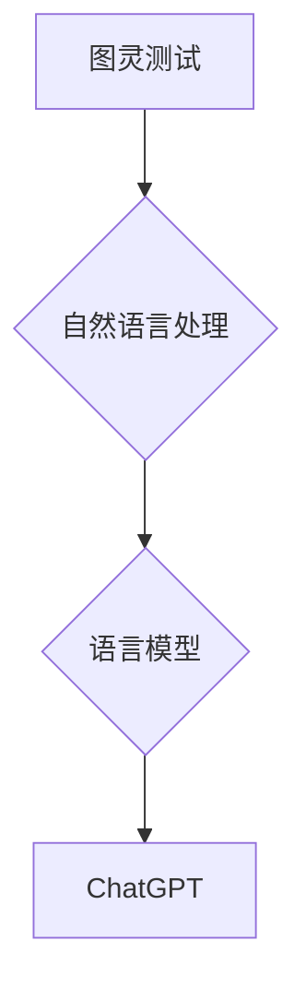

## AIGC从入门到实战：ChatGPT 是否认为自己通过了图灵测试？

> 关键词：AIGC, ChatGPT, 图灵测试, 自然语言处理, 语言模型, 算法原理, 实际应用

## 1. 背景介绍

近年来，人工智能（AI）技术取得了飞速发展，特别是生成式人工智能（AIGC）领域，涌现出许多令人惊叹的应用，例如文本生成、图像生成、代码生成等。其中，ChatGPT作为一款基于Transformer架构的强大语言模型，凭借其出色的文本生成能力和自然流畅的对话风格，迅速成为了公众关注的焦点。

ChatGPT的出现引发了人们对人工智能是否已经具备“智能”的思考。图灵测试作为衡量人工智能是否具有智能的经典标准，也再次被推到了风口浪尖。那么，ChatGPT是否通过了图灵测试呢？

## 2. 核心概念与联系

### 2.1 图灵测试

图灵测试由英国数学家艾伦·图灵于1950年提出，旨在评估机器是否能够表现出与人类相似的智能。测试的规则是：

* 一个人类评估者与一个机器和另一个人类进行文本对话，彼此身份隐藏。
* 如果评估者无法区分机器和人类，则认为机器通过了图灵测试。

### 2.2 自然语言处理（NLP）

自然语言处理（NLP）是人工智能的一个分支，致力于使计算机能够理解、处理和生成人类语言。NLP技术在ChatGPT的开发中扮演着至关重要的角色，它赋予了ChatGPT理解人类语言、生成自然流畅的文本的能力。

### 2.3 语言模型

语言模型是一种能够预测文本序列中下一个词的统计模型。它通过学习大量的文本数据，建立了单词之间的概率关系，从而能够生成新的文本。ChatGPT基于Transformer架构的语言模型，拥有强大的文本生成能力和上下文理解能力。

**核心概念与联系流程图**

## 3. 核心算法原理 & 具体操作步骤

### 3.1 算法原理概述

ChatGPT的核心算法是基于Transformer架构的语言模型，它利用了注意力机制来捕捉文本序列中的长距离依赖关系。

注意力机制允许模型在处理文本时，对不同位置的词赋予不同的权重，从而更好地理解上下文信息。

### 3.2 算法步骤详解

1. **输入文本序列:** 将用户输入的文本序列作为模型的输入。
2. **词嵌入:** 将每个词转换为一个向量表示，以便模型能够理解词的语义信息。
3. **多头注意力:** 利用多头注意力机制，捕捉文本序列中不同词之间的关系。
4. **前馈神经网络:** 对每个词的注意力权重进行加权求和，并将其输入到前馈神经网络中进行处理。
5. **输出预测:** 根据模型的训练数据，预测下一个词的概率分布。
6. **文本生成:** 根据预测的概率分布，选择最可能的词作为下一个词，并重复步骤5，直到生成完整的文本序列。

### 3.3 算法优缺点

**优点:**

* 能够捕捉长距离依赖关系，生成更流畅的文本。
* 训练效率高，能够处理大量的文本数据。
* 泛化能力强，能够应用于多种自然语言处理任务。

**缺点:**

* 计算复杂度高，需要强大的计算资源。
* 训练数据量大，需要大量的标注数据。
* 容易受到训练数据中的偏差影响。

### 3.4 算法应用领域

* 文本生成：小说、诗歌、剧本、新闻报道等。
* 机器翻译：将一种语言翻译成另一种语言。
* 对话系统：聊天机器人、虚拟助手等。
* 文本摘要：生成文本的简短摘要。
* 代码生成：自动生成代码。

## 4. 数学模型和公式 & 详细讲解 & 举例说明

### 4.1 数学模型构建

ChatGPT的数学模型基于Transformer架构，其核心是注意力机制。注意力机制可以表示为以下公式：

$$
Attention(Q, K, V) = softmax(\frac{QK^T}{\sqrt{d_k}})V
$$

其中：

* $Q$：查询矩阵
* $K$：键矩阵
* $V$：值矩阵
* $d_k$：键向量的维度
* $softmax$：softmax函数

### 4.2 公式推导过程

注意力机制的目的是计算每个词与其他词之间的相关性，并根据相关性赋予不同的权重。

公式中，$QK^T$计算了查询矩阵和键矩阵之间的点积，表示每个词与其他词之间的相似度。

然后，通过softmax函数将点积转换为概率分布，表示每个词对其他词的注意力权重。

最后，将注意力权重与值矩阵相乘，得到每个词的加权和，作为最终的输出。

### 4.3 案例分析与讲解

假设我们有一个句子：“我爱学习编程”。

在使用注意力机制时，每个词都会被转换为一个向量表示。

当模型处理“学习”这个词时，它会计算“学习”与其他词之间的相似度，例如“我”，“爱”，“编程”等。

通过注意力机制，模型会发现“学习”与“编程”之间的关系最为密切，因此会赋予“编程”更高的注意力权重。

最终，模型会根据所有词的注意力权重，生成更流畅、更合理的文本。

## 5. 项目实践：代码实例和详细解释说明

### 5.1 开发环境搭建

ChatGPT的开发环境需要Python语言环境，以及一些深度学习框架，例如TensorFlow或PyTorch。

具体步骤可以参考官方文档或相关教程。

### 5.2 源代码详细实现

ChatGPT的源代码开源，可以从GitHub等平台下载。

具体实现细节可以参考官方文档或开源代码。

### 5.3 代码解读与分析

ChatGPT的代码主要包含以下部分：

* 数据预处理：将文本数据转换为模型可以理解的格式。
* 模型定义：定义Transformer架构的语言模型。
* 模型训练：使用训练数据训练模型。
* 模型评估：使用测试数据评估模型的性能。
* 文本生成：使用训练好的模型生成新的文本。

### 5.4 运行结果展示

ChatGPT的运行结果可以是文本、代码、图像等多种形式。

具体结果取决于模型的训练数据和用户的输入。

## 6. 实际应用场景

### 6.1 文本生成

ChatGPT可以用于生成各种类型的文本，例如：

* 小说、诗歌、剧本
* 新闻报道、博客文章
* 邮件、短信

### 6.2 机器翻译

ChatGPT可以用于将一种语言翻译成另一种语言。

### 6.3 对话系统

ChatGPT可以用于构建聊天机器人和虚拟助手。

### 6.4 未来应用展望

ChatGPT的未来应用前景广阔，例如：

* 个性化教育：根据学生的学习情况生成个性化的学习内容。
* 自动写作辅助：帮助作家克服写作瓶颈，提高写作效率。
* 创意内容生成：帮助艺术家、设计师等创意工作者生成新的创意内容。

## 7. 工具和资源推荐

### 7.1 学习资源推荐

* **书籍:**

    * 《深度学习》
    * 《自然语言处理》

* **在线课程:**

    * Coursera
    * edX

* **博客和论坛:**

    * Towards Data Science
    * Reddit

### 7.2 开发工具推荐

* **Python:** 

    * TensorFlow
    * PyTorch

* **开发环境:**

    * Jupyter Notebook
    * Google Colab

### 7.3 相关论文推荐

* **Attention Is All You Need**
* **BERT: Pre-training of Deep Bidirectional Transformers for Language Understanding**

## 8. 总结：未来发展趋势与挑战

### 8.1 研究成果总结

ChatGPT的出现标志着人工智能在自然语言处理领域的重大突破。

它展示了Transformer架构的强大能力，以及注意力机制在理解文本语义方面的有效性。

### 8.2 未来发展趋势

未来，ChatGPT和类似的语言模型将会朝着以下方向发展：

* 更强大的文本生成能力：能够生成更流畅、更自然、更具创造性的文本。
* 更强的理解能力：能够更好地理解复杂的文本语义和上下文信息。
* 更广泛的应用场景：能够应用于更多领域，例如教育、医疗、法律等。

### 8.3 面临的挑战

ChatGPT也面临着一些挑战：

* 数据偏差：训练数据中的偏差可能会导致模型生成带有偏见或歧视性的文本。
* 可解释性：模型的决策过程难以解释，这可能会导致人们对模型的信任度降低。
* 安全性：模型可能被用于生成恶意内容，例如虚假新闻、网络攻击等。

### 8.4 研究展望

未来研究需要关注以下几个方面：

* 减少数据偏差，提高模型的公平性和公正性。
* 提高模型的可解释性，让模型的决策过程更加透明。
* 加强模型的安全性和可靠性，防止模型被用于恶意目的。

## 9. 附录：常见问题与解答

### 9.1 ChatGPT是否真的“智能”？

ChatGPT是一个强大的语言模型，能够表现出与人类相似的智能，但它并不是真正的“智能”。

它只是通过学习大量的文本数据，掌握了语言的规则和模式，并能够根据这些规则生成新的文本。

它没有人类的意识、情感和思考能力。

### 9.2 ChatGPT如何避免生成虚假信息？

ChatGPT的训练数据包含大量的真实信息，但也可能包含一些虚假信息。

为了减少虚假信息的生成，研究人员正在探索多种方法，例如：

* 使用更可靠的数据集进行训练。
* 开发新的算法，能够识别和过滤虚假信息。
* 让用户能够对模型的输出进行审核和反馈。

### 9.3 ChatGPT的未来发展方向？

ChatGPT的未来发展方向包括：

* 更强大的文本生成能力。
* 更强的理解能力。
* 更广泛的应用场景。
* 提高模型的可解释性和安全性。

作者：禅与计算机程序设计艺术 / Zen and the Art of Computer Programming

