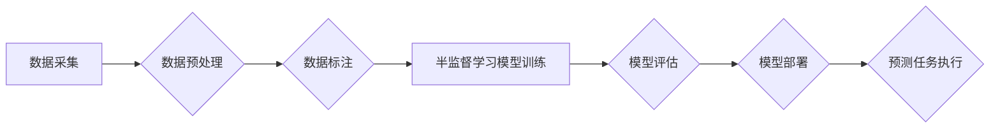

## AI人工智能 Agent：使用半监督学习进行预测

> 关键词：人工智能 Agent, 半监督学习, 预测,  机器学习,  数据标注,  迁移学习,  模型训练

## 1. 背景介绍

在当今数据爆炸的时代，人工智能 (AI) 已经渗透到生活的方方面面。从智能语音助手到自动驾驶汽车，AI 正在改变着我们的世界。其中，预测是 AI 应用的核心之一，它能够帮助我们预见未来趋势，做出更明智的决策。传统的监督学习方法依赖于大量标注数据，但现实中获取高质量标注数据往往成本高昂且耗时费力。因此，半监督学习 (Semi-Supervised Learning) 作为一种介于监督学习和无监督学习之间的学习方法，逐渐成为研究热点。

半监督学习利用少量标注数据和大量未标注数据进行模型训练，能够有效降低数据标注成本，同时提高模型预测精度。本文将深入探讨如何使用半监督学习构建 AI 人工智能 Agent，并进行预测任务。

## 2. 核心概念与联系

### 2.1 半监督学习

半监督学习是一种机器学习方法，它利用少量标注数据和大量未标注数据进行模型训练。与监督学习相比，半监督学习不需要大量的标注数据，能够有效降低数据标注成本。与无监督学习相比，半监督学习利用了部分标注数据的指导信息，能够提高模型的预测精度。

### 2.2 AI 人工智能 Agent

AI 人工智能 Agent 是能够感知环境、做出决策并执行动作的智能体。它通常由以下几个部分组成：

* **感知模块:** 用于获取环境信息，例如传感器数据、文本信息等。
* **决策模块:** 用于根据环境信息做出决策，例如选择动作、制定策略等。
* **执行模块:** 用于执行决策，例如控制机器人运动、发送网络请求等。

### 2.3 预测任务

预测任务是指根据历史数据预测未来事件或趋势。例如，预测股票价格、天气预报、用户行为等。

**半监督学习与 AI 人工智能 Agent 预测任务的联系:**

半监督学习可以帮助我们构建更强大的 AI 人工智能 Agent，使其能够更准确地进行预测任务。

**Mermaid 流程图:**



## 3. 核心算法原理 & 具体操作步骤

### 3.1 算法原理概述

半监督学习算法的核心思想是利用未标注数据的结构信息来辅助模型训练。常见的半监督学习算法包括：

* **自训练 (Self-Training):** 利用模型对未标注数据的预测结果作为新的标注数据，并将其用于模型进一步训练。
* **混合标记 (Co-Training):** 利用多个视图的数据进行训练，每个视图都有其独特的特征，通过相互学习来提高模型的预测精度。
* **图嵌入 (Graph Embedding):** 将数据表示为图结构，并利用图嵌入算法学习数据的表示，从而提高模型的预测精度。

### 3.2 算法步骤详解

以自训练算法为例，其具体操作步骤如下：

1. **数据预处理:** 对原始数据进行清洗、转换、特征工程等操作，使其适合模型训练。
2. **初始模型训练:** 利用少量标注数据训练一个初始模型。
3. **未标注数据预测:** 将初始模型应用于未标注数据，并预测其类别标签。
4. **高置信度样本选择:** 从预测结果中选择置信度较高的样本作为新的标注数据。
5. **模型更新:** 利用新的标注数据和原始标注数据对模型进行更新训练。
6. **重复步骤 3-5:** 重复上述步骤，直到模型性能达到预期的水平。

### 3.3 算法优缺点

**优点:**

* 降低数据标注成本
* 提高模型预测精度

**缺点:**

* 容易陷入局部最优解
* 对数据质量要求较高

### 3.4 算法应用领域

半监督学习算法广泛应用于以下领域:

* **图像识别:** 利用少量标注图像进行模型训练，提高图像识别精度。
* **自然语言处理:** 利用少量标注文本进行模型训练，提高文本分类、情感分析等任务的性能。
* **语音识别:** 利用少量标注语音数据进行模型训练，提高语音识别准确率。

## 4. 数学模型和公式 & 详细讲解 & 举例说明

### 4.1 数学模型构建

假设我们有一个包含 $N$ 个样本的数据集 $D = \{x_1, x_2,..., x_N\}$, 其中 $x_i$ 是第 $i$ 个样本。其中，有 $M$ 个样本被标注为 $y_i \in \{1, 2,..., K\}$, 剩余的 $N-M$ 个样本未被标注。

我们的目标是学习一个模型 $f(x)$，能够将输入样本 $x$ 映射到类别标签 $y$.

### 4.2 公式推导过程

自训练算法的目标是最大化以下目标函数:

$$
L(f) = -\sum_{i=1}^{M} \log p(y_i|x_i; f) - \lambda \sum_{i=M+1}^{N} \log p(y_i|x_i; f)
$$

其中，$p(y_i|x_i; f)$ 是模型 $f$ 在给定样本 $x_i$ 的情况下预测类别标签 $y_i$ 的概率。$\lambda$ 是一个超参数，用于控制未标注数据的影响。

### 4.3 案例分析与讲解

假设我们有一个图像分类任务，需要将图像分类为猫和狗两类。我们有 100 张图像，其中 20 张被标注为猫，80 张未被标注。

我们可以使用自训练算法进行模型训练。首先，我们利用 20 张标注图像训练一个初始模型。然后，我们将初始模型应用于 80 张未标注图像，并预测其类别标签。选择置信度最高的 10 张图像作为新的标注数据，并将其用于模型更新训练。重复上述步骤，直到模型性能达到预期的水平。

## 5. 项目实践：代码实例和详细解释说明

### 5.1 开发环境搭建

* Python 3.6+
* TensorFlow 2.0+
* PyTorch 1.0+
* 其他必要的库，例如 NumPy, Pandas, Matplotlib 等。

### 5.2 源代码详细实现

```python
# 导入必要的库
import tensorflow as tf

# 定义模型
model = tf.keras.models.Sequential([
    tf.keras.layers.Conv2D(32, (3, 3), activation='relu', input_shape=(28, 28, 1)),
    tf.keras.layers.MaxPooling2D((2, 2)),
    tf.keras.layers.Conv2D(64, (3, 3), activation='relu'),
    tf.keras.layers.MaxPooling2D((2, 2)),
    tf.keras.layers.Flatten(),
    tf.keras.layers.Dense(10, activation='softmax')
])

# 定义损失函数和优化器
loss_fn = tf.keras.losses.SparseCategoricalCrossentropy()
optimizer = tf.keras.optimizers.Adam()

# 定义训练步骤
def train_step(images, labels):
    with tf.GradientTape() as tape:
        predictions = model(images)
        loss = loss_fn(labels, predictions)
    gradients = tape.gradient(loss, model.trainable_variables)
    optimizer.apply_gradients(zip(gradients, model.trainable_variables))
    return loss

# 训练模型
epochs = 10
batch_size = 32
for epoch in range(epochs):
    for batch in range(len(train_data) // batch_size):
        loss = train_step(train_data[batch * batch_size:(batch + 1) * batch_size], train_labels[batch * batch_size:(batch + 1) * batch_size])
        print(f'Epoch {epoch+1}, Batch {batch+1}, Loss: {loss.numpy()}')

# 保存模型
model.save('model.h5')
```

### 5.3 代码解读与分析

* 代码首先导入必要的库。
* 然后定义一个简单的卷积神经网络模型。
* 定义损失函数和优化器。
* 定义训练步骤函数，用于计算损失和更新模型参数。
* 训练模型，并打印每个批次的损失值。
* 最后保存训练好的模型。

### 5.4 运行结果展示

训练完成后，我们可以使用保存的模型对新的图像进行预测。

## 6. 实际应用场景

半监督学习在许多实际应用场景中发挥着重要作用，例如：

* **医疗诊断:** 利用少量标注病历数据进行模型训练，提高疾病诊断的准确率。
* **金融风险评估:** 利用少量标注交易数据进行模型训练，识别潜在的金融风险。
* **网络安全:** 利用少量标注恶意代码进行模型训练，提高网络安全威胁检测的效率。

### 6.4 未来应用展望

随着半监督学习算法的不断发展，其应用场景将会更加广泛。例如，

* **个性化推荐:** 利用用户行为数据进行模型训练，提供更精准的个性化推荐。
* **自动驾驶:** 利用少量标注驾驶数据进行模型训练，提高自动驾驶系统的安全性。
* **机器人控制:** 利用少量标注环境数据进行模型训练，提高机器人的自主学习能力。

## 7. 工具和资源推荐

### 7.1 学习资源推荐

* **书籍:**
    * 半监督学习 (Semi-Supervised Learning)
    * 深度学习 (Deep Learning)
* **在线课程:**
    * Coursera: 深度学习
    * Udacity: 机器学习工程师
* **博客:**
    * Towards Data Science
    * Machine Learning Mastery

### 7.2 开发工具推荐

* **TensorFlow:** 开源机器学习框架
* **PyTorch:** 开源机器学习框架
* **Scikit-learn:** Python 机器学习库

### 7.3 相关论文推荐

* **Semi-Supervised Learning** by Chapelle, Schölkopf, Zien, and Smola
* **Graph Embedding for Translational Language Modeling** by Mikolov, Chen, Corrado, and Dean

## 8. 总结：未来发展趋势与挑战

### 8.1 研究成果总结

半监督学习在近年来取得了显著进展，能够有效降低数据标注成本，提高模型预测精度。

### 8.2 未来发展趋势

* **算法创新:** 研究更有效的半监督学习算法，提高模型性能。
* **数据增强:** 利用数据增强技术生成更多未标注数据，提高模型训练效果。
* **迁移学习:** 利用预训练模型进行迁移学习，提高模型在不同领域应用的泛化能力。

### 8.3 面临的挑战

* **数据质量:** 半监督学习算法对数据质量要求较高，需要保证未标注数据的质量。
* **模型解释性:** 半监督学习模型的解释性较差，难以理解模型的决策过程。
* **计算资源:** 训练大型半监督学习模型需要大量的计算资源。

### 8.4 研究展望

未来，半监督学习将继续是人工智能领域的重要研究方向。随着算法的不断改进和数据量的不断增加，半监督学习将在更多领域发挥重要作用。

## 9. 附录：常见问题与解答

* **什么是半监督学习？**

半监督学习是一种机器学习方法，它利用少量标注数据和大量未标注数据进行模型训练。

* **半监督学习的优势是什么？**

半监督学习能够有效降低数据标注成本，提高模型预测精度。

* **半监督学习有哪些应用场景？**

半监督学习