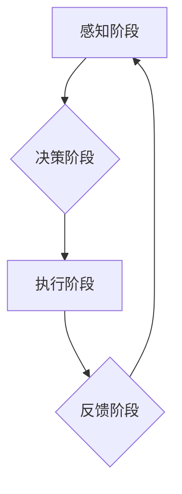

## AI人工智能代理工作流AI Agent WorkFlow：AI代理在视频游戏中的自适应机制

> 关键词：人工智能代理、视频游戏、自适应机制、工作流、强化学习、行为树、游戏AI

## 1. 背景介绍

视频游戏作为一种娱乐和交互式体验形式，近年来发展迅速，其人工智能（AI）技术的应用也日益广泛。传统的视频游戏AI通常采用预先设定的行为模式，缺乏灵活性，难以应对复杂的游戏环境和玩家策略。随着人工智能技术的进步，特别是深度学习和强化学习的突破，AI代理在视频游戏中扮演着越来越重要的角色。

AI代理是指能够自主学习和决策的虚拟角色，它可以根据游戏环境和玩家行为做出反应，并采取相应的行动。自适应机制是AI代理的核心，它使AI代理能够根据游戏情况动态调整策略，从而提供更具挑战性和沉浸感的玩家体验。

## 2. 核心概念与联系

### 2.1  AI代理

AI代理是视频游戏中模拟智能角色的软件程序，它能够感知游戏环境、理解游戏规则并做出决策，从而控制角色的行为。AI代理通常由以下几个模块组成：

* **感知模块:** 收集游戏环境信息，例如玩家位置、敌方位置、道具信息等。
* **决策模块:** 根据感知到的信息，分析游戏状态并做出决策，例如移动方向、攻击目标、使用道具等。
* **执行模块:** 将决策转化为实际操作，控制角色的行为。

### 2.2  自适应机制

自适应机制是指AI代理根据游戏环境和玩家行为动态调整策略的能力。它使AI代理能够应对不同的游戏情况，提供更具挑战性和沉浸感的玩家体验。常见的自适应机制包括：

* **行为树:** 一种树形结构的决策框架，可以表示AI代理的行为逻辑，并根据游戏状态选择不同的行为分支。
* **强化学习:** 一种机器学习算法，通过奖励和惩罚机制训练AI代理，使其学习最优的策略。
* **状态机:** 一种状态转换模型，可以表示AI代理的不同状态和状态转换规则。

### 2.3  工作流

AI代理的工作流是指AI代理在游戏中的行为流程，它通常由以下几个阶段组成：

* **感知阶段:** AI代理收集游戏环境信息。
* **决策阶段:** AI代理根据游戏状态做出决策。
* **执行阶段:** AI代理执行决策，控制角色的行为。
* **反馈阶段:** AI代理接收游戏反馈，例如玩家行动、游戏结果等，并根据反馈更新策略。

**Mermaid 流程图**



## 3. 核心算法原理 & 具体操作步骤

### 3.1  算法原理概述

在视频游戏中，AI代理通常采用强化学习算法来实现自适应机制。强化学习是一种基于奖励和惩罚的机器学习算法，它通过训练AI代理，使其学习最优的策略，以最大化累积奖励。

强化学习算法的核心概念包括：

* **状态:** 游戏环境的当前状态，例如玩家位置、敌方位置、道具信息等。
* **动作:** AI代理可以采取的行动，例如移动方向、攻击目标、使用道具等。
* **奖励:** AI代理采取行动后获得的反馈，可以是正向奖励（例如击杀敌人）或负向奖励（例如被玩家击杀）。
* **策略:** AI代理根据当前状态选择动作的规则。

强化学习算法的目标是找到一个策略，使得AI代理在游戏中获得最大的累积奖励。

### 3.2  算法步骤详解

强化学习算法的具体步骤如下：

1. **初始化:** 初始化AI代理的策略，例如随机策略。
2. **感知环境:** AI代理感知游戏环境，获取当前状态。
3. **选择动作:** 根据当前策略，AI代理选择一个动作。
4. **执行动作:** AI代理执行选择的动作，并观察游戏环境的变化。
5. **获得奖励:** AI代理根据游戏反馈获得奖励。
6. **更新策略:** 根据获得的奖励，更新AI代理的策略，使其在未来能够选择更优的动作。
7. **重复步骤2-6:** 重复以上步骤，直到AI代理的策略收敛，即不再显著变化。

### 3.3  算法优缺点

**优点:**

* **自适应性强:** 强化学习算法可以使AI代理根据游戏情况动态调整策略，提供更具挑战性和沉浸感的玩家体验。
* **学习能力强:** 强化学习算法可以使AI代理从游戏中学习，不断提高其策略和技能。

**缺点:**

* **训练时间长:** 强化学习算法的训练过程通常需要很长时间，尤其是在复杂的游戏环境中。
* **数据需求大:** 强化学习算法需要大量的游戏数据来训练，否则难以学习到有效的策略。

### 3.4  算法应用领域

强化学习算法在视频游戏中的应用领域非常广泛，例如：

* **游戏AI:** 训练AI代理，使其能够在游戏中与玩家进行对抗或合作。
* **游戏平衡:** 通过强化学习算法，可以调整游戏难度，使游戏更加平衡。
* **游戏生成:** 利用强化学习算法，可以生成新的游戏关卡或游戏内容。

## 4. 数学模型和公式 & 详细讲解 & 举例说明

### 4.1  数学模型构建

强化学习算法的核心数学模型是**价值函数**，它表示AI代理在特定状态下采取特定动作的长期奖励期望。

价值函数可以表示为：

$$V(s) = E[\sum_{t=0}^{\infty} \gamma^t r_{t+1}|s_t = s]$$

其中：

* $V(s)$ 是状态 $s$ 的价值函数。
* $E$ 表示期望值。
* $\gamma$ 是折扣因子，控制未来奖励的权重。
* $r_{t+1}$ 是时间步 $t+1$ 的奖励。
* $s_t$ 是时间步 $t$ 的状态。

### 4.2  公式推导过程

价值函数的推导过程基于**Bellman方程**，它描述了状态价值函数与动作价值函数之间的关系。

Bellman方程可以表示为：

$$V(s) = \max_a \left[ r(s, a) + \gamma \sum_{s'} P(s' | s, a) V(s') \right]$$

其中：

* $r(s, a)$ 是状态 $s$ 下采取动作 $a$ 的即时奖励。
* $P(s' | s, a)$ 是从状态 $s$ 采取动作 $a$ 到状态 $s'$ 的转移概率。

### 4.3  案例分析与讲解

假设一个简单的游戏环境，AI代理的目标是收集尽可能多的金币。

* 状态 $s$ 可以表示为AI代理当前位置。
* 动作 $a$ 可以是向上、向下、向左、向右四个方向移动。
* 奖励 $r(s, a)$ 可以是收集到金币的奖励，或者被障碍物阻挡的惩罚。

通过强化学习算法，AI代理可以学习到最优的移动策略，以最大化金币收集量。

## 5. 项目实践：代码实例和详细解释说明

### 5.1  开发环境搭建

本项目使用Python语言开发，需要安装以下软件包：

* **OpenAI Gym:** 用于构建和测试强化学习环境。
* **TensorFlow:** 用于构建和训练强化学习模型。
* **NumPy:** 用于数值计算。
* **Matplotlib:** 用于可视化数据。

### 5.2  源代码详细实现

```python
import gym
import tensorflow as tf
import numpy as np

# 定义环境
env = gym.make('CartPole-v1')

# 定义神经网络模型
model = tf.keras.models.Sequential([
    tf.keras.layers.Dense(128, activation='relu', input_shape=(4,)),
    tf.keras.layers.Dense(64, activation='relu'),
    tf.keras.layers.Dense(2, activation='softmax')
])

# 定义损失函数和优化器
loss_fn = tf.keras.losses.CategoricalCrossentropy()
optimizer = tf.keras.optimizers.Adam()

# 定义训练函数
def train_step(state, action, reward, next_state, done):
    with tf.GradientTape() as tape:
        prediction = model(state)
        loss = loss_fn(action, prediction)
    gradients = tape.gradient(loss, model.trainable_variables)
    optimizer.apply_gradients(zip(gradients, model.trainable_variables))

# 训练循环
for episode in range(1000):
    state = env.reset()
    done = False
    total_reward = 0
    while not done:
        env.render()
        action_probs = model(state)
        action = np.argmax(action_probs)
        next_state, reward, done, _ = env.step(action)
        train_step(state, action_probs, reward, next_state, done)
        state = next_state
        total_reward += reward
    print(f'Episode {episode+1}, Total Reward: {total_reward}')

env.close()
```

### 5.3  代码解读与分析

这段代码实现了基于深度学习的强化学习算法，用于训练一个AI代理在CartPole环境中保持平衡。

* 首先，定义了OpenAI Gym环境`CartPole-v1`。
* 然后，定义了一个简单的深度神经网络模型，用于预测AI代理在不同状态下采取的动作概率。
* 定义了损失函数和优化器，用于训练神经网络模型。
* 训练循环中，AI代理与环境交互，收集状态、动作、奖励和下一个状态的信息，并使用这些信息更新神经网络模型的参数。
* 训练结束后，AI代理能够在环境中保持平衡较长时间。

### 5.4  运行结果展示

运行这段代码后，会看到AI代理在环境中控制杆的运动，并尝试保持平衡。随着训练的进行，AI代理的平衡能力会逐渐提高。

## 6. 实际应用场景

### 6.1  游戏AI

AI代理在视频游戏中广泛应用于游戏AI的开发，例如：

* **敌人AI:** 训练AI代理扮演敌人角色，使其能够根据玩家行为做出反应，提供更具挑战性和沉浸感的战斗体验。
* **NPC AI:** 训练AI代理扮演非玩家角色，使其能够与玩家进行对话、完成任务、提供游戏剧情等。
* **游戏助手:** 训练AI代理扮演游戏助手，帮助玩家完成游戏任务、提供游戏攻略等。

### 6.2  游戏平衡

通过强化学习算法，可以训练AI代理扮演游戏角色，并根据其行为收集游戏数据。这些数据可以用于分析游戏平衡性，例如：

* **难度调整:** 根据AI代理的表现，调整游戏难度，使游戏更加平衡。
* **游戏机制优化:** 根据AI代理的行为模式，优化游戏机制，使其更加合理和有趣。

### 6.3  游戏生成

利用强化学习算法，可以训练AI代理生成新的游戏关卡或游戏内容。例如：

* **关卡设计:** 训练AI代理生成新的游戏关卡，并根据玩家反馈进行优化。
* **游戏剧情生成:** 训练AI代理生成新的游戏剧情，并根据玩家选择进行分支。

### 6.4  未来应用展望

随着人工智能技术的不断发展，AI代理在视频游戏中的应用场景将会更加广泛，例如：

* **个性化游戏体验:** 根据玩家的喜好和行为，训练AI代理提供个性化的游戏体验。
* **沉浸式游戏体验:** 利用AI代理模拟更逼真的游戏环境和角色，提供更沉浸式的游戏体验。
* **游戏辅助工具:** 利用AI代理开发游戏辅助工具，例如自动战斗、自动寻路等。

## 7. 工具和资源推荐

### 7.1  学习