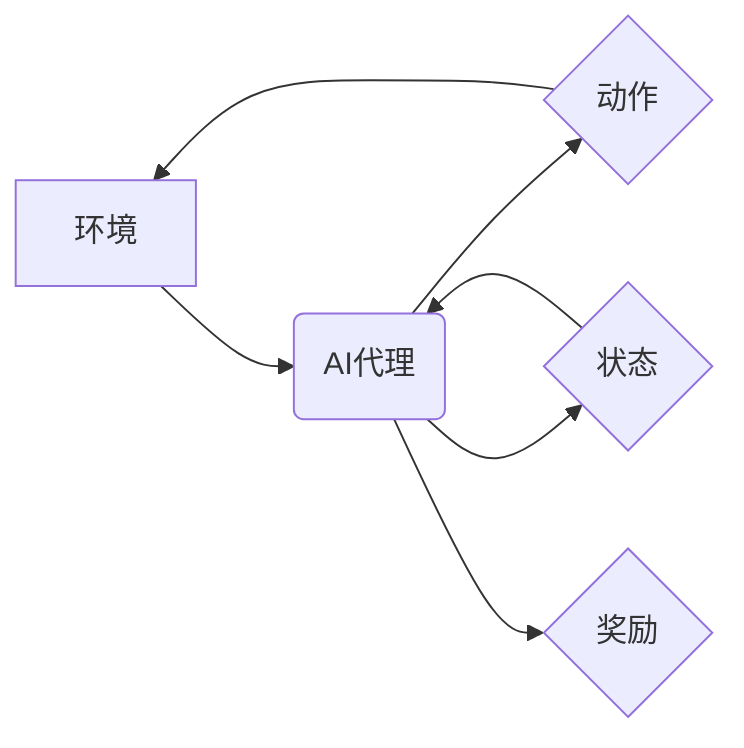

## AI人工智能代理工作流AI Agent WorkFlow：AI代理的深度强化学习策略

> 关键词：AI代理、深度强化学习、工作流自动化、智能决策、模型训练、环境模拟、奖励机制

## 1. 背景介绍

随着人工智能技术的飞速发展，AI代理在自动化工作流程、智能决策和复杂系统管理等领域展现出巨大的潜力。AI代理是一种能够自主学习、感知环境并做出决策的智能实体，它可以模拟人类的行为，执行任务并与环境交互。深度强化学习（Deep Reinforcement Learning，DRL）作为一种强大的机器学习算法，为训练高效、智能的AI代理提供了新的思路和方法。

传统的基于规则的自动化工作流程往往难以应对复杂、动态变化的环境。而DRL算法能够通过与环境的交互学习，不断优化策略，最终实现高效、灵活的自动化。

## 2. 核心概念与联系

### 2.1 AI代理

AI代理是一个能够感知环境、做出决策并执行动作的智能实体。它可以是软件程序、机器人或其他形式的智能系统。AI代理的目标是通过与环境的交互，最大化其累积奖励。

### 2.2 深度强化学习

深度强化学习（DRL）是一种机器学习算法，它结合了深度神经网络和强化学习的思想。DRL算法通过训练一个智能代理，使其能够在与环境交互的过程中学习最优策略。

**核心概念关系图:**



### 2.3 工作流自动化

工作流自动化是指通过自动化工具和技术，将一系列重复性、规则性的任务流程化，提高效率和降低成本。AI代理可以被用于自动化复杂的工作流程，例如：

* **业务流程自动化:** 自动化审批流程、订单处理流程等。
* **IT运维自动化:** 自动化服务器部署、监控报警等。
* **数据处理自动化:** 自动化数据清洗、转换、分析等。

## 3. 核心算法原理 & 具体操作步骤

### 3.1 算法原理概述

DRL算法的核心思想是通过强化学习的机制，训练一个智能代理，使其能够在与环境交互的过程中学习最优策略。

* **状态（State）:** 环境当前的状态。
* **动作（Action）:** 代理可以执行的动作。
* **奖励（Reward）:** 环境对代理动作的反馈。
* **策略（Policy）:** 代理根据当前状态选择动作的策略。

DRL算法的目标是找到一个策略，使得代理在与环境交互的过程中获得最大的累积奖励。

### 3.2 算法步骤详解

1. **环境建模:** 建立一个模拟真实世界的环境模型，该模型可以接收代理的动作，并返回相应的状态和奖励。
2. **代理设计:** 设计一个代理，它可以感知环境状态，选择动作并执行动作。代理通常由一个深度神经网络组成，该网络负责学习策略。
3. **策略训练:** 使用强化学习算法，例如Q学习或策略梯度方法，训练代理的策略。训练过程包括以下步骤：
    * 代理根据当前策略选择动作。
    * 代理执行动作，并观察环境状态和奖励。
    * 代理根据观察到的状态和奖励，更新策略参数。
4. **策略评估:** 在训练完成后，评估代理的策略性能，例如在模拟环境中执行任务的成功率或完成任务所需的时间。
5. **策略部署:** 将训练好的策略部署到真实世界环境中，让代理执行实际任务。

### 3.3 算法优缺点

**优点:**

* **能够学习复杂策略:** DRL算法能够学习解决复杂、动态变化的环境中的问题。
* **无需人工设计规则:** DRL算法可以自动学习策略，无需人工设计规则。
* **能够适应变化的环境:** DRL算法可以根据环境的变化不断更新策略，保持高效性。

**缺点:**

* **训练时间长:** DRL算法的训练过程通常需要很长时间。
* **数据需求大:** DRL算法需要大量的训练数据。
* **容易陷入局部最优:** DRL算法可能陷入局部最优解，无法找到全局最优策略。

### 3.4 算法应用领域

DRL算法在以下领域具有广泛的应用前景：

* **机器人控制:** 训练机器人执行复杂的任务，例如导航、抓取、组装等。
* **游戏人工智能:** 训练游戏中的AI对手，使其能够与人类玩家进行更具挑战性的对抗。
* **金融交易:** 训练智能交易系统，自动进行股票、期货等金融资产的交易。
* **医疗诊断:** 训练AI模型，辅助医生进行疾病诊断和治疗方案制定。

## 4. 数学模型和公式 & 详细讲解 & 举例说明

### 4.1 数学模型构建

DRL算法的核心是强化学习的数学模型，该模型描述了代理与环境之间的交互关系。

* **状态空间 (S):** 环境所有可能的状态集合。
* **动作空间 (A):** 代理可以执行的所有动作集合。
* **策略 (π):** 从状态空间到动作空间的映射函数，即代理根据当前状态选择动作的策略。
* **奖励函数 (R):** 描述环境对代理动作的反馈，奖励通常是一个标量值。

### 4.2 公式推导过程

DRL算法的目标是找到一个策略，使得代理在与环境交互的过程中获得最大的累积奖励。

**累积奖励 (R_t):**

$$R_t = \sum_{k=t}^{T} \gamma^k r_k$$

其中：

* $R_t$ 是从时间步 t 开始到时间步 T 的累积奖励。
* $r_k$ 是时间步 k 的奖励。
* $\gamma$ 是折扣因子，控制未来奖励的权重。

**价值函数 (V):**

$$V(s) = E[R_t | S_t = s]$$

其中：

* $V(s)$ 是状态 s 的价值函数，即从状态 s 开始执行最优策略的累积奖励期望。
* $E[]$ 表示期望值。

**策略梯度方法:**

策略梯度方法是一种常用的DRL算法，它通过梯度上升法更新策略参数。

$$\theta_{t+1} = \theta_t + \alpha \nabla_{\theta} J(\theta)$$

其中：

* $\theta$ 是策略参数。
* $\alpha$ 是学习率。
* $J(\theta)$ 是策略的效用函数，即累积奖励的期望值。

### 4.3 案例分析与讲解

**游戏AI训练:**

假设我们想训练一个AI代理玩游戏《贪吃蛇》。

* **状态空间:** 游戏中的蛇的位置、食物的位置、游戏地图等。
* **动作空间:** 蛇可以向上下左右移动。
* **奖励函数:** 当蛇吃到了食物时，奖励为正值；当蛇撞到墙壁或自身时，奖励为负值。

我们可以使用策略梯度方法训练一个AI代理，使其能够学习最优的移动策略，从而获得更高的分数。

## 5. 项目实践：代码实例和详细解释说明

### 5.1 开发环境搭建

* Python 3.x
* TensorFlow 或 PyTorch 深度学习框架
* OpenAI Gym 游戏环境库

### 5.2 源代码详细实现

```python
import gym
import tensorflow as tf

# 定义代理网络
class Agent(tf.keras.Model):
    def __init__(self):
        super(Agent, self).__init__()
        self.dense1 = tf.keras.layers.Dense(64, activation='relu')
        self.dense2 = tf.keras.layers.Dense(32, activation='relu')
        self.output = tf.keras.layers.Dense(4, activation='softmax')

    def call(self, state):
        x = self.dense1(state)
        x = self.dense2(x)
        return self.output(x)

# 创建代理实例
agent = Agent()

# 定义损失函数和优化器
optimizer = tf.keras.optimizers.Adam(learning_rate=0.001)
loss_fn = tf.keras.losses.CategoricalCrossentropy()

# 训练循环
for episode in range(1000):
    state = env.reset()
    done = False
    total_reward = 0

    while not done:
        # 选择动作
        action_probs = agent(state)
        action = tf.random.categorical(tf.math.log(action_probs), num_samples=1)[0, 0]

        # 执行动作
        next_state, reward, done, _ = env.step(action)

        # 更新代理网络
        with tf.GradientTape() as tape:
            # 计算损失
            target = tf.one_hot(action, depth=4)
            loss = loss_fn(target, action_probs)

        # 反向传播
        gradients = tape.gradient(loss, agent.trainable_variables)
        optimizer.apply_gradients(zip(gradients, agent.trainable_variables))

        # 更新状态
        state = next_state

        # 更新总奖励
        total_reward += reward

    print(f"Episode {episode+1}, Total Reward: {total_reward}")

```

### 5.3 代码解读与分析

* **代理网络:** 使用深度神经网络来表示代理的策略，输入状态，输出动作概率分布。
* **损失函数:** 使用交叉熵损失函数来衡量代理策略与目标策略之间的差异。
* **优化器:** 使用Adam优化器来更新代理网络的参数。
* **训练循环:** 训练代理网络的过程，包括环境重置、状态更新、动作选择、环境交互、损失计算和参数更新等步骤。

### 5.4 运行结果展示

训练完成后，可以将训练好的代理部署到游戏环境中，观察其执行任务的性能。

## 6. 实际应用场景

### 6.1 自动化客服

AI代理可以被用于自动化客服，例如回答常见问题、处理简单的订单请求等。

### 6.2 智能推荐系统

AI代理可以被用于智能推荐系统，例如推荐商品、电影、音乐等。

### 6.3 个性化教育

AI代理可以被用于个性化教育，例如根据学生的学习进度和能力提供个性化的学习内容和辅导。

### 6.4 未来应用展望

随着人工智能技术的不断发展，AI代理的应用场景将会更加广泛，例如：

* **自动驾驶:** 训练AI代理进行自动驾驶，实现无人驾驶汽车。
* **医疗辅助:** 训练AI代理辅助医生进行诊断、治疗方案制定等。
* **金融风险管理:** 训练AI代理进行金融风险评估和管理。

## 7. 工具和资源推荐

### 7.1 学习资源推荐

* **书籍:**
    * Reinforcement Learning: An Introduction by Richard S. Sutton and Andrew G. Barto
    * Deep Reinforcement Learning Hands-On by Maxim Lapan
* **在线课程:**
    * Deep Reinforcement Learning Specialization by DeepLearning.AI
    * Reinforcement Learning by David Silver (University of DeepMind)

### 7.2 开发工具推荐

* **TensorFlow:** https://www.tensorflow.org/
* **PyTorch:** https://pytorch.org/
* **OpenAI Gym:** https://gym.openai.com/

### 7.3 相关论文推荐

* **Deep Q-Network (DQN):** https://arxiv.org/abs/1312.5602
* **Proximal Policy Optimization (PPO):** https://arxiv.org/abs/1707.06347
* **Trust Region Policy Optimization (TRPO):** https://arxiv.org/abs/1502.05477

## 8. 总结：未来发展趋势与挑战

### 8.1 研究成果总结

DRL算法在解决复杂决策问题方面取得了显著的