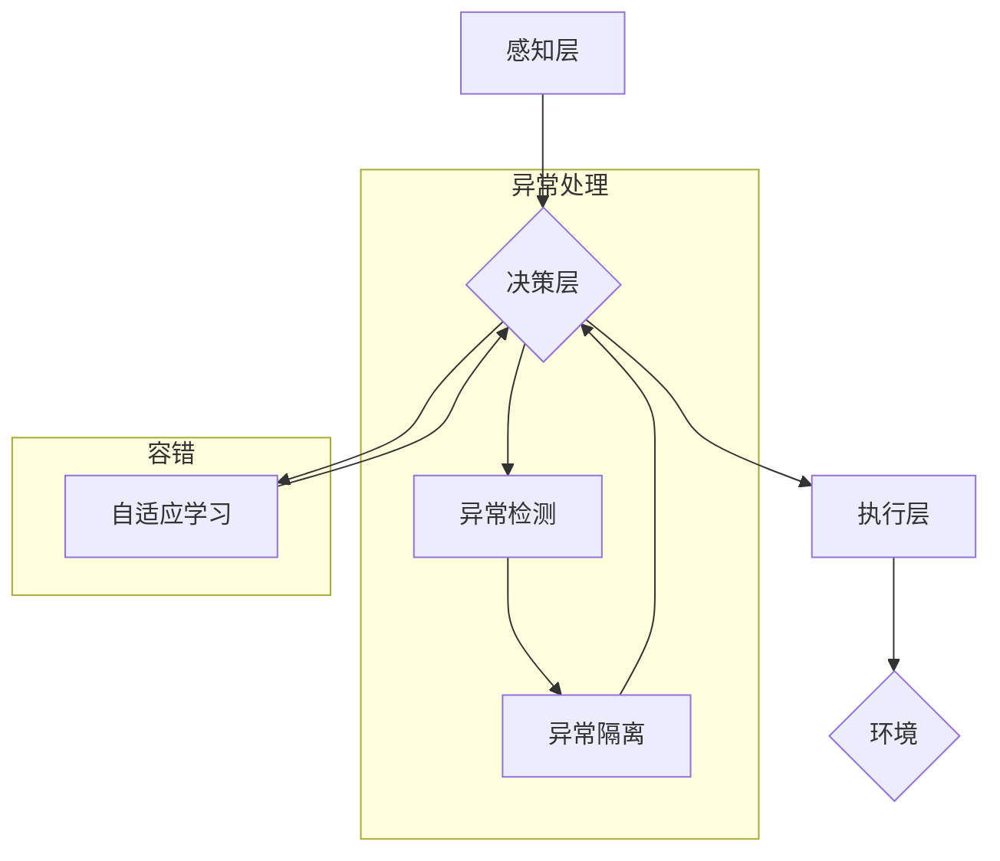

## AI人工智能深度学习算法：智能深度学习代理的异常处理与容错

> 关键词：深度学习、异常处理、容错、智能代理、机器学习、人工智能、神经网络、强化学习

## 1. 背景介绍

深度学习作为人工智能领域最前沿的技术之一，在图像识别、自然语言处理、语音识别等领域取得了突破性的进展。然而，深度学习模型也面临着一些挑战，其中异常处理和容错能力不足是比较突出的一点。

传统的深度学习模型通常在训练过程中假设输入数据是干净且符合分布的。一旦遇到异常数据或环境变化，模型的性能就会急剧下降，甚至可能导致系统崩溃。这在一些关键应用场景中，例如医疗诊断、金融交易、自动驾驶等，显得尤为危险。

智能深度学习代理的概念应运而生。智能代理是指能够感知环境、做出决策并与环境交互的智能体。智能深度学习代理将深度学习模型与强化学习算法相结合，使其能够学习处理异常情况和适应环境变化的能力。

## 2. 核心概念与联系

**2.1 智能深度学习代理**

智能深度学习代理由以下几个核心组件组成：

* **感知层:** 用于获取环境信息，例如传感器数据、网络流量等。
* **决策层:** 基于感知层获取的信息，利用深度学习模型和强化学习算法做出决策。
* **执行层:** 将决策转化为实际操作，例如控制机器人的运动、发送网络请求等。

**2.2 异常处理与容错**

异常处理是指系统在遇到异常情况时能够识别、隔离和恢复正常运行的能力。容错是指系统能够在部分组件故障的情况下仍然能够正常运行的能力。

智能深度学习代理通过以下方式实现异常处理和容错：

* **异常检测:** 利用深度学习模型识别异常数据或行为模式。
* **异常隔离:** 将异常数据或行为模式隔离，防止其影响正常运行。
* **自适应学习:** 利用强化学习算法不断学习和改进处理异常情况的能力。

**2.3 Mermaid 流程图**



## 3. 核心算法原理 & 具体操作步骤

**3.1 算法原理概述**

智能深度学习代理的异常处理与容错主要基于以下算法原理：

* **深度学习:** 用于识别异常数据或行为模式。常用的深度学习模型包括卷积神经网络 (CNN)、循环神经网络 (RNN) 和变分自编码器 (VAE)。
* **强化学习:** 用于训练代理在处理异常情况时做出最优决策。常用的强化学习算法包括 Q 学习、SARSA 和深度 Q 网络 (DQN)。

**3.2 算法步骤详解**

1. **数据收集和预处理:** 收集包含正常和异常数据的一组数据集，并对数据进行预处理，例如数据清洗、特征提取等。
2. **深度学习模型训练:** 利用深度学习模型对正常数据进行训练，学习识别正常数据特征。
3. **异常检测模型构建:** 利用训练好的深度学习模型对新数据进行检测，识别异常数据或行为模式。
4. **强化学习环境搭建:** 建立一个模拟真实环境的强化学习环境，其中代理可以与环境交互，并根据环境反馈获得奖励或惩罚。
5. **强化学习模型训练:** 利用强化学习算法训练代理，使其能够在处理异常情况时做出最优决策，并最大化奖励。
6. **异常处理策略部署:** 将训练好的强化学习模型部署到实际系统中，作为异常处理策略的一部分。

**3.3 算法优缺点**

**优点:**

* **高准确率:** 深度学习模型能够学习识别复杂异常模式，具有较高的准确率。
* **自适应性强:** 强化学习算法能够使代理不断学习和改进处理异常情况的能力，适应不断变化的环境。
* **可扩展性好:** 智能深度学习代理可以扩展到处理多种类型的异常情况。

**缺点:**

* **训练数据依赖:** 深度学习模型需要大量的训练数据才能达到较高的准确率。
* **计算资源消耗:** 训练深度学习模型和强化学习代理需要大量的计算资源。
* **解释性差:** 深度学习模型的决策过程难以解释，这可能导致信任问题。

**3.4 算法应用领域**

智能深度学习代理的异常处理与容错能力在以下领域具有广泛的应用前景:

* **医疗诊断:** 识别患者的异常症状，辅助医生进行诊断。
* **金融交易:** 检测金融交易中的欺诈行为，防止资金损失。
* **自动驾驶:** 识别道路上的异常情况，例如障碍物、交通信号灯故障等，确保车辆安全行驶。
* **工业控制:** 识别工业设备的异常运行状态，防止设备故障和生产中断。

## 4. 数学模型和公式 & 详细讲解 & 举例说明

**4.1 数学模型构建**

智能深度学习代理的异常处理与容错可以建模为一个马尔可夫决策过程 (MDP)。

* **状态空间:** 环境的状态，例如传感器数据、网络流量等。
* **动作空间:** 代理可以采取的动作，例如控制机器人的运动、发送网络请求等。
* **转移概率:** 从一个状态到另一个状态的概率。
* **奖励函数:** 代理在某个状态采取某个动作后获得的奖励。

**4.2 公式推导过程**

强化学习算法的目标是找到一个策略，使得代理在长期内获得最大的总奖励。常用的强化学习算法，例如 Q 学习和 DQN，都基于 Bellman 方程进行策略迭代。

Bellman 方程:

$$
V(s) = \max_a \left[ R(s, a) + \gamma \sum_{s'} P(s' | s, a) V(s') \right]
$$

其中:

* $V(s)$ 是状态 $s$ 的价值函数。
* $R(s, a)$ 是在状态 $s$ 采取动作 $a$ 后获得的奖励。
* $\gamma$ 是折扣因子，控制未来奖励的权重。
* $P(s' | s, a)$ 是从状态 $s$ 采取动作 $a$ 到状态 $s'$ 的转移概率。

**4.3 案例分析与讲解**

假设一个智能机器人需要在未知环境中导航。

* **状态空间:** 机器人的位置和周围环境信息。
* **动作空间:** 机器人可以向前、向后、向左、向右移动。
* **转移概率:** 根据机器人的动作和环境信息，计算机器人移动到不同位置的概率。
* **奖励函数:** 当机器人到达目标位置时获得奖励，遇到障碍物时惩罚。

利用强化学习算法，机器人可以学习一个策略，使得它能够在未知环境中高效地导航到目标位置。

## 5. 项目实践：代码实例和详细解释说明

**5.1 开发环境搭建**

* Python 3.x
* TensorFlow 或 PyTorch 深度学习框架
* OpenAI Gym 强化学习环境

**5.2 源代码详细实现**

```python
import tensorflow as tf
from tensorflow.keras.models import Sequential
from tensorflow.keras.layers import Dense, Dropout

# 定义深度学习模型
model = Sequential()
model.add(Dense(128, activation='relu', input_shape=(input_dim,)))
model.add(Dropout(0.2))
model.add(Dense(64, activation='relu'))
model.add(Dropout(0.2))
model.add(Dense(1, activation='sigmoid'))

# 编译模型
model.compile(optimizer='adam', loss='binary_crossentropy', metrics=['accuracy'])

# 训练模型
model.fit(X_train, y_train, epochs=10, batch_size=32)

#... (强化学习模型训练代码)
```

**5.3 代码解读与分析**

* 代码首先定义了一个简单的深度学习模型，用于识别异常数据。
* 模型使用两层全连接层和 Dropout 层进行正则化，以防止过拟合。
* 模型使用 Adam 优化器、二元交叉熵损失函数和准确率作为评估指标进行训练。
* 训练完成后，可以将模型部署到实际系统中，用于识别异常数据。

**5.4 运行结果展示**

* 训练结果可以展示在图表中，例如训练准确率和损失函数的变化趋势。
* 也可以使用测试数据评估模型的性能，例如计算准确率、召回率和 F1 分数。

## 6. 实际应用场景

**6.1 智能监控系统**

智能深度学习代理可以用于监控工业设备、交通流量、网络安全等，识别异常情况并及时报警。

**6.2 自动驾驶系统**

智能深度学习代理可以帮助自动驾驶汽车识别道路上的障碍物、交通信号灯故障等异常情况，确保车辆安全行驶。

**6.3 医疗诊断系统**

智能深度学习代理可以辅助医生识别患者的异常症状，例如癌症、心血管疾病等，提高诊断准确率。

**6.4 未来应用展望**

随着深度学习和强化学习技术的不断发展，智能深度学习代理的异常处理与容错能力将会得到进一步提升，在更多领域得到应用。例如，可以用于预测和预防自然灾害、应对突发事件、实现智能城市建设等。

## 7. 工具和资源推荐

**7.1 学习资源推荐**

* **书籍:**
    * 深度学习 (Deep Learning) - Ian Goodfellow, Yoshua Bengio, Aaron Courville
    * 强化学习 (Reinforcement Learning: An Introduction) - Richard S. Sutton, Andrew G. Barto
* **在线课程:**
    * Coursera: 深度学习 Specialization
    * Udacity: 强化学习 Nanodegree
* **博客和网站:**
    * TensorFlow Blog
    * PyTorch Blog
    * OpenAI Blog

**7.2 开发工具推荐**

* **深度学习框架:** TensorFlow, PyTorch, Keras
* **强化学习库:** OpenAI Gym, Stable Baselines3
* **编程语言:** Python

**7.3 相关论文推荐**

* **深度学习:**
    * AlexNet: ImageNet Classification with Deep Convolutional Neural Networks (Krizhevsky et al., 2012)
    * ResNet: Deep Residual Learning for Image Recognition (He et al., 2016)
* **强化学习:**
    * Deep Q-Network (DQN) (Mnih et al., 2015)
    * Proximal Policy Optimization (PPO) (Schulman et al., 2017)

## 8. 总结：未来发展趋势与挑战

**8.1 研究成果总结**

智能深度学习代理的异常处理与容错能力取得了显著进展，在多个领域展现出巨大的应用潜力。

**8.2 未来发展趋势**

* **模型效率提升:** 研究更轻量级、更高效的深度学习模型，降低计算资源消耗。
* **解释性增强:** 研究更易于解释的深度学习模型，提高模型的可信度。
* **场景适应性强:** 研究能够适应不同场景和环境变化的智能深度学习代理。

**8.3 面临的挑战**

* **数据获取和标注:** 训练智能深度学习代理需要大量的标注数据，数据获取和标注成本较高。
* **模型安全性和可靠性:** 深度学习模型容易受到攻击和操纵，需要提高模型的安全性和可靠性。
* **伦理问题:** 智能深度学习代理的决策可能会影响人类的利益，需要考虑伦理问题。

**8.4 研究展望**

未来，智能深度学习代理的异常处理与容错能力将会得到进一步提升，在更多领域发挥重要作用。需要加强基础理论研究，解决数据获取、模型安全性和伦理问题等挑战，推动智能深度学习代理技术向更安全、更可靠、更智能的方向发展。

## 