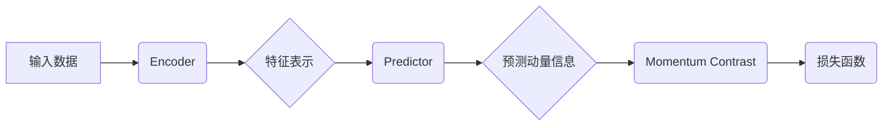

## BYOL原理与代码实例讲解

> 关键词：BYOL, Self-Supervised Learning, SimCLR, Momentum Contrast, Online Learning, Contrastive Learning

## 1. 背景介绍

近年来，深度学习在计算机视觉、自然语言处理等领域取得了显著成就，这得益于海量标注数据和强大的计算能力。然而，标注数据获取成本高昂且耗时，限制了深度学习模型的进一步发展。为了解决这一问题，自监督学习 (Self-Supervised Learning) 应运而生。

自监督学习通过设计巧妙的预训练任务，利用无标注数据训练模型，学习到丰富的特征表示。这些预训练模型可以迁移到下游任务中，显著提升模型性能。其中，BYOL (Bootstrap Your Own Latent) 是一种基于对比学习的自监督学习方法，它通过学习数据样本之间的相似性关系，有效地学习到数据潜在的语义表示。

## 2. 核心概念与联系

BYOL的核心思想是通过两个相同的网络，分别称为“encoder”和“predictor”，学习数据样本之间的相似性关系。

**核心概念:**

* **Encoder:** 负责提取数据样本的特征表示。
* **Predictor:** 负责预测数据样本的动量信息。
* **Momentum Contrast:** 通过对比预测的动量信息与真实动量信息之间的差异，学习数据样本之间的相似性关系。

**架构流程图:**



**核心概念联系:**

BYOL通过两个相同的网络，分别称为“encoder”和“predictor”，学习数据样本之间的相似性关系。encoder负责提取数据样本的特征表示，predictor负责预测数据样本的动量信息。通过对比预测的动量信息与真实动量信息之间的差异，学习数据样本之间的相似性关系。

## 3. 核心算法原理 & 具体操作步骤

### 3.1  算法原理概述

BYOL的核心算法原理是基于对比学习的。对比学习的目标是学习数据样本之间的相似性关系，即相似的样本应该有相似的特征表示，而不同的样本应该有不同的特征表示。BYOL通过设计一个特殊的损失函数，来鼓励模型学习到这种相似性关系。

### 3.2  算法步骤详解

1. **数据增强:** 对输入数据进行随机增强，例如随机裁剪、随机翻转、随机旋转等，生成多个增强后的数据样本。
2. **特征提取:** 使用encoder网络提取增强后的数据样本的特征表示。
3. **动量更新:** 使用一个小的学习率更新encoder网络的权重，并记录encoder网络权重的动量信息。
4. **动量预测:** 使用predictor网络预测增强后的数据样本的动量信息。
5. **损失函数计算:** 计算预测的动量信息与真实动量信息之间的差异，并使用交叉熵损失函数进行优化。

### 3.3  算法优缺点

**优点:**

* **无需标注数据:** BYOL是一种自监督学习方法，不需要人工标注数据，可以利用海量无标注数据进行预训练。
* **效果显著:** BYOL在多个下游任务中都取得了显著的性能提升。
* **训练简单:** BYOL的训练过程相对简单，易于实现。

**缺点:**

* **计算成本高:** BYOL需要训练两个相同的网络，计算成本较高。
* **参数量大:** BYOL的模型参数量较大，需要较大的存储空间和计算资源。

### 3.4  算法应用领域

BYOL在图像分类、目标检测、语义分割等计算机视觉任务中都有广泛的应用。

## 4. 数学模型和公式 & 详细讲解 & 举例说明

### 4.1  数学模型构建

BYOL的数学模型主要包括以下几个部分:

* **Encoder:** 使用一个多层卷积神经网络作为encoder，提取数据样本的特征表示。
* **Predictor:** 使用一个简单的全连接网络作为predictor，预测数据样本的动量信息。
* **Momentum Contrast:** 使用一个特殊的损失函数，来鼓励模型学习到数据样本之间的相似性关系。

### 4.2  公式推导过程

BYOL的损失函数可以表示为:

$$
L = -\frac{1}{N} \sum_{i=1}^{N} \log \frac{\exp(sim(z_i, z_i'))}{\sum_{j=1}^{N} \exp(sim(z_i, z_j'))},
$$

其中:

* $z_i$ 是第 $i$ 个数据样本的特征表示。
* $z_i'$ 是第 $i$ 个数据样本的动量信息。
* $sim(z_i, z_j)$ 是第 $i$ 个数据样本和第 $j$ 个数据样本之间的相似度。

### 4.3  案例分析与讲解

假设我们有一个图像数据集，包含1000张图片。我们使用BYOL预训练一个模型，并将其应用于图像分类任务。

在预训练阶段，BYOL会随机增强图片，并使用encoder网络提取图片的特征表示。然后，BYOL会使用predictor网络预测图片的动量信息。通过对比预测的动量信息与真实动量信息之间的差异，BYOL会更新encoder网络的权重。

在图像分类任务中，我们使用预训练好的BYOL模型作为特征提取器，并将提取到的特征表示输入到一个简单的全连接网络中进行分类。由于BYOL已经学习到丰富的特征表示，因此预训练好的模型在图像分类任务中可以取得较好的性能。

## 5. 项目实践：代码实例和详细解释说明

### 5.1  开发环境搭建

* Python 3.7+
* PyTorch 1.7+
* CUDA 10.2+

### 5.2  源代码详细实现

```python
import torch
import torch.nn as nn
import torch.optim as optim

class Encoder(nn.Module):
    def __init__(self):
        super(Encoder, self).__init__()
        # 定义encoder网络结构
        #...

    def forward(self, x):
        # 前向传播
        #...

class Predictor(nn.Module):
    def __init__(self):
        super(Predictor, self).__init__()
        # 定义predictor网络结构
        #...

    def forward(self, x):
        # 前向传播
        #...

class BYOL(nn.Module):
    def __init__(self):
        super(BYOL, self).__init__()
        self.encoder = Encoder()
        self.predictor = Predictor()
        self.optimizer = optim.Adam(self.parameters(), lr=0.001)

    def forward(self, x1, x2):
        # 前向传播
        #...

    def train(self, data):
        # 训练过程
        #...

# 实例化BYOL模型
model = BYOL()

# 训练模型
#...

```

### 5.3  代码解读与分析

* **Encoder:** 负责提取数据样本的特征表示。
* **Predictor:** 负责预测数据样本的动量信息。
* **BYOL:** 整个模型的类，包含encoder、predictor和优化器。
* **forward():** 模型的向前传播函数。
* **train():** 模型的训练函数。

### 5.4  运行结果展示

训练完成后，可以将预训练好的BYOL模型应用于下游任务中，例如图像分类、目标检测等。

## 6. 实际应用场景

BYOL在以下实际应用场景中具有广泛的应用前景:

* **图像分类:** BYOL可以用于训练图像分类模型，例如识别物体、场景、人物等。
* **目标检测:** BYOL可以用于训练目标检测模型，例如定位和识别图像中的物体。
* **语义分割:** BYOL可以用于训练语义分割模型，例如将图像中的每个像素都标记为特定的类别。
* **图像生成:** BYOL可以用于训练图像生成模型，例如生成新的图像。

### 6.4  未来应用展望

随着自监督学习技术的不断发展，BYOL在未来将有更广泛的应用场景。例如:

* **多模态学习:** BYOL可以应用于多模态学习，例如将图像、文本、音频等多种模态数据进行融合学习。
* **小样本学习:** BYOL可以用于小样本学习，例如在少量标注数据的情况下训练模型。
* **迁移学习:** BYOL可以用于迁移学习，例如将预训练好的模型迁移到新的任务中。

## 7. 工具和资源推荐

### 7.1  学习资源推荐

* **论文:**

    * Bootstrap Your Own Latent: A New Approach to Self-Supervised Learning
    * SimCLR: A Simple Framework for Contrastive Learning of Visual Representations

* **博客:**

    * https://blog.openai.com/self-supervised-learning/
    * https://towardsdatascience.com/self-supervised-learning-with-byol-a-comprehensive-guide-a4499199994a

### 7.2  开发工具推荐

* **PyTorch:** https://pytorch.org/
* **TensorFlow:** https://www.tensorflow.org/

### 7.3  相关论文推荐

* **SimCLR:** https://arxiv.org/abs/2002.05709
* **MoCo:** https://arxiv.org/abs/1912.03982
* **SwAV:** https://arxiv.org/abs/2006.11214

## 8. 总结：未来发展趋势与挑战

### 8.1  研究成果总结

BYOL是一种基于对比学习的自监督学习方法，它通过学习数据样本之间的相似性关系，有效地学习到数据潜在的语义表示。BYOL在多个下游任务中都取得了显著的性能提升，并展现出广阔的应用前景。

### 8.2  未来发展趋势

* **多模态学习:** 将BYOL应用于多模态学习，例如将图像、文本、音频等多种模态数据进行融合学习。
* **小样本学习:** 将BYOL应用于小样本学习，例如在少量标注数据的情况下训练模型。
* **迁移学习:** 将预训练好的BYOL模型迁移到新的任务中。

### 8.3  面临的挑战

* **计算成本:** BYOL需要训练两个相同的网络，计算成本较高。
* **参数量:** BYOL的模型参数量较大，需要较大的存储空间和计算资源。
* **数据效率:** BYOL的训练数据效率还有待提高。

### 8.4  研究展望

未来研究将集中在以下几个方面:

* **降低计算成本:** 研究更轻量级的BYOL模型架构，降低训练成本。
* **提高数据效率:** 研究更有效的训练策略，提高BYOL的训练数据效率。
* **拓展应用场景:** 将BYOL应用于更多新的领域，例如自然语言处理、语音识别等。

## 9. 附录：常见问题与解答

* **Q: BYOL与SimCLR有什么区别？**

    A: BYOL和SimCLR都是基于对比学习的自监督学习方法，但BYOL使用动量更新策略，而SimCLR使用队列存储策略。

* **Q: BYOL的训练数据需要多大？**

    A: BYOL可以利用海量无标注数据进行预训练，但训练效果会随着训练数据的增加而提升。

* **Q: BYOL的模型参数量很大，如何降低模型参数量？**

    A: 可以使用更轻量级的网络架构，例如使用MobileNet或EfficientNet作为encoder网络。

* **Q: BYOL的训练过程比较复杂，如何快速上手？**

    A: 可以参考开源的BYOL代码实现，例如PyTorch官方提供的BYOL实现。


作者：禅与计算机程序设计艺术 / Zen and the Art of Computer Programming 
